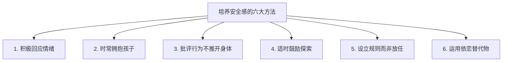

# 第24课：安全感——粘人行为与安全依恋培养

## Learning Objectives
- 理解孩子粘人行为的心理原因及其与安全感的关系
- 掌握安全依恋的四种类型及形成原因
- 学会培养孩子安全感的六大有效方法
- 理解依恋物的意义及应对策略

## 核心概念

### 粘人行为背后的安全感需求

大约从**6-7个月**开始，宝宝开始"认生"——只对熟悉的人感到自在，看到陌生面孔会焦虑哭闹。这种状态通常会持续到**2岁**左右。

> [!TIP] 关键认知转变
> 孩子粘人不是"懦弱""胆小""不懂事"，而是他正在发展安全感的表现。只有理解孩子，才能真正帮上孩子的忙。

### 安全感的三大来源

1. **被爱与关注**——宝宝觉得自己被爱、被关心
2. **生活的稳定性**——生活不会有太多难以预料的变化
3. **掌控感**——在自己的能力范围内，对生活有一定程度的掌控

### 安全依恋的四种类型

心理学家Mary Ainsworth的**陌生情景实验**（针对1岁左右的宝宝）发现了四种亲子依恋类型：

| 依恋类型 | 妈妈在时的表现 | 妈妈离开时的表现 | 妈妈回来时的表现 | 形成原因 |
|---------|--------------|-----------------|-----------------|---------|
| **安全型**（理想） | 自在地探索环境 | 哭泣、抗议、焦虑 | 立刻回到妈妈身边，迅速安静下来 | 敏感的、一致的回应 |
| **回避型** | 不与妈妈接近 | 不怎么哭 | 冷淡，像妈妈不在也没影响 | 长期不理睬孩子的哭闹，求助无效 |
| **矛盾型** | 想靠近又排斥 | 极度焦虑 | 一回来就想去身边，但又打又踢表示愤怒 | 忽冷忽热、不一致的回应 |
| **混乱型** | 行为不一致 | 行为混乱 | 可能向陌生人寻求安慰，行为混乱 | 恐吓、打骂、虐待 |

**安全型依恋的典型特征：**
- 与父母在一起时：开心、温暖、安全
- 离开父母时：有勇气探索世界
- 相信世界、相信他人
- 长大后人际关系更好、更自信

> [!WARNING] 为何安全感影响一生
> 缺乏安全感的孩子容易：不自信、独立性差、不容易信任别人、人际关系差、容易焦虑。很多成年人谈恋爱或组建家庭后惶惶不安、总觉得对方会抛弃自己——根源往往在于幼年安全感的缺失。

## 深入讲解

### 不利于安全依恋形成的做法

| 错误做法 | 具体表现 | 可能导致的依恋类型 |
|---------|---------|------------------|
| **哭时不回应** | "让他哭，哭够了就不哭了" | 回避型——孩子发现求助没用 |
| **忽冷忽热** | 心情好时热情回应，心情不好时懒得理 | 矛盾型——孩子迷茫"爸妈到底爱不爱我" |
| **恐吓** | "再闹就不要你了" | 混乱型 |
| **打骂虐待** | 口头或肢体伤害 | 混乱型 |

### 培养安全感的六大方法

#### 方法一：积极、一致、适度地回应情绪

**积极回应**——不等于满足所有的要求，而是回应情绪。

> "我理解你喜欢这个"、"我知道你不喜欢那个"——情绪需要回应，但要求未必都答应。

**一致性**——不要今天心情好就理，明天心情不好就不理。应该是：孩子有情绪，爸妈就及时关注，每次都用同样的温暖方式回应。

**适度**——不要用力过猛。如果宝宝一哭就"天塌下来了"式地奔过去，反而会让孩子觉得"这是天大的事"，跟着焦虑起来。

> [!TIP] 参考话术
> "怎么了亲爱的，我听到你的声音了，我一会儿过来。"——先用声音传达关注，让自己平静下来，再走过去。妈妈平静的声音本身就有疗愈的作用。

#### 方法二：时常拥抱孩子

充满温暖和爱的身体接触对年幼宝宝的大脑神经发展非常有益：**安抚情绪、降低压力荷尔蒙**。

不管有多忙，和孩子在一起时别忘了温暖的拥抱。孩子任何时候说"我要抱抱"，请立刻给孩子一个拥抱。

#### 方法三：批评行为，不推开身体

**错误做法：** 孩子做错事，把他推得远远的，让他站到一边去。

**正确做法：** 搂着宝宝的肩或抱着他，温和而坚定地指出错误。

> "宝宝，刚才不高兴的时候把东西丢到地上打碎了，这是不可以的，以后不能再这么做。"

批评行为，但不推开身体——身体语言传达的是"爸爸妈妈很爱你，只是告诉你哪个行为不合适"。

#### 方法四：适时鼓励探索

孩子好奇地到处探索时：

| 不要做 | 要做 |
|--------|------|
| 尖叫"不可以离开我！" | 走在身后确保安全 |
| 过度焦虑地阻止 | 微笑点头表示支持 |
| 限制一切探索行为 | 用眼神跟随，让他一转头就能看到你 |

**安全感的终极目标：** 和父母在一起时温暖安全 → 因为这份安全感，孩子有能力自信地探索世界。

#### 方法五：设立规则而非放任

> [!WARNING] "爱与自由"的常见误解
> 不给孩子任何限制、任何行为规则，这不是"爱与自由"，反而会让孩子缺乏安全感。研究发现，当孩子知道哪些事可以做、哪些事不可以做，有明确的规则和行为边界时，反而更有安全感。

**家庭规则示例：**
- 吃饭时专心吃饭，不可以看书或玩手机
- 厨房不可以去，只能在客厅玩耍
- 生气时可以告诉别人你生气了，但不可以动手打人

#### 方法六：运用依恋替代物

当必须与孩子分开（上幼儿园、爸妈出差等）时，可以用一个**依恋替代物**传递你的爱。

可以是一个玩偶、一个小枕头，告诉孩子："如果你想妈妈了，它代表妈妈的爱陪着你。"

### 答疑精华：关于依恋物

**问题：** 孩子超级依赖一个布娃娃/小毯子/小枕头，要不要戒断？

**回答要点：**
- **千万不要**强行扔掉或藏起来——有家长扔掉孩子的依恋物，对安全感是莫大的伤害
- 依恋物是宝宝自己找到的应对焦虑的方法，是**宝宝适应世界的努力**
- 应该为孩子鼓掌——这么小的宝宝就自己想出了让自己安心的办法
- 戒断依恋物不是目标，**帮助孩子建立更好的自信和更紧密的亲子关系**才是目标
- 依恋物是**阶段性**的——当孩子慢慢长大、越来越有安全感，自然会放下

> "就像一个人还不会走路时好不容易弄到了拐杖，你把拐杖抽掉，他摔得鼻青脸肿，就更害怕走路了。"

### 答疑精华：二宝出生后大宝安全感修复

**问题：** 二宝出生后，大宝出现退行行为（也要吃奶、不让弟弟玩玩具），怎么办？

**应对策略：**
1. **单独陪伴：** 每天安排固定时间单独陪大宝，建立专属的"我们俩的时光"（睡前的故事时间最佳）
2. **表达爱意：** 抱着大宝说"爸爸妈妈知道你有时会想'我们会不会花太多时间照顾弟弟就忘记你了'——绝对不是！我们永远爱你"
3. **赋予角色：** "你是个大孩子了，需要你和爸爸妈妈一起来照顾弟弟"——给他力所能及的任务（拿奶瓶、拿尿布）
4. **让大宝变成共同爱弟弟的人，而不是看着爸妈爱弟弟的人**

## 实用方法

### 回应孩子情绪的四步流程

当孩子哭闹、粘人时：

1. **先回应情绪：** "我知道你很舍不得爸爸妈妈，我知道你很想和我在一起"
2. **安抚陪伴：** 花时间陪一会儿，安抚情绪
3. **不要偷偷消失：** 偷偷离开会加深不安全感，下次粘得更紧
4. **建立信任：** 告诉孩子你会回来，并说到做到

### 面对分离焦虑的实操方案

| 年龄段 | 推荐做法 |
|--------|---------|
| **1岁以下** | 用声音回应→拥抱安抚→建立规律作息 |
| **1-2岁** | 提前预告分离→简短告别→坚定离开→准时回来 |
| **2-3岁** | 情绪命名→给依恋物→约定回来的时间（用孩子能理解的方式） |
| **3岁以上** | 情绪对话→预告流程→鼓励独立→正面强化 |

## 实践练习

> [!QUESTION] 思考题
> 你的孩子目前属于哪种依恋类型？你平时的回应模式偏向于积极一致、忽冷忽热、还是不理不睬？今天可以做出哪一个小改变，来帮助孩子建立更扎实的安全感？

改变行动指南

- **如果以前不理睬孩子的哭闹：** 今天开始，孩子一有情绪，先用温和的声音回应："怎么了亲爱的？"
- **如果以前忽冷忽热：** 给自己定一个"一致性目标"——不管心情如何，都用同样的温暖方式回应
- **如果以前恐吓或推开孩子：** 换一种方式——抱着他说行为哪里不对，但不推开身体
- **如果以前限制探索：** 今天带孩子出门，他探索时你在身后微笑陪伴，让他回头就能看到你

小改变累积起来，就是孩子安全感的基石。

## 总结

安全感是孩子一生心理健康的**基石**。3岁之前是培养安全感的关键期——即使孩子长大后不记得这个阶段发生的事情，但这些经历会影响他的隐形记忆，对其一生产生深远影响。培养安全感的核心在于：**情绪需要回应、探索需要鼓励、行为需要规则**。当孩子拥有安全型依恋的亲子关系，他就能带着温暖与勇气去探索整个世界。

## 延伸阅读

上一课：[[../lessons/0023-情绪认知力认识与表达情绪|第23课：情绪认知力（下）——帮助孩子认识与表达情绪]]
下一课：[[../lessons/0025-自信培养|第25课：自信——保护与培养扎实自信]]