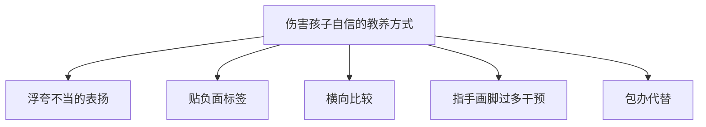

# 第25课：自信培养——保护与培养扎实自信

## Learning Objectives
- 识别并避免五种伤害孩子自信的常见教养方式
- 区分扎实自信与虚假自信，了解自信的三大核心来源
- 掌握表扬特质、表扬过程、批评行为、适度放手四大培养方法
- 学会应对二胎家庭中横向比较问题的策略

## 核心概念

### 什么是扎实自信？

自信，是指一个人对自己是否有**积极的自我认知与评价**。简单来说，就是能积极回答"我是谁"这个问题。

扎实自信的孩子会表现出以下特征：

| 表现维度 | 具体表现 |
|---------|---------|
| **自我认知** | 觉得自己是优秀而讨人喜欢的孩子 |
| **面对称赞** | 被称赞时感到开心，不过度依赖外界肯定 |
| **尝试新事物** | 愿意尝试没有做过的事情，不怕失败 |
| **社交互动** | 能愉快与他人相处，敢于表达感受和想法 |
| **面对困难** | 遇到困难不轻易放弃，不会"一失败就说不玩了" |
| **公开表现** | 当众说话或表演时落落大方 |
| **面对竞争** | 不害怕与同伴竞争 |
| **面对批评** | 被批评时不会过度沮丧或暴怒 |
| **自理能力** | 愿意自己完成力所能及的事情 |

> [!TIP] 核心洞察
> 自信不是"我觉得我最棒"，而是"我知道我是谁，我接纳自己的好与不好"。

### 自信的三大核心来源

心理学家发现，扎实自信建立在两大积极的自我认知上：

1. **我可爱**——我觉得自己讨人喜欢
2. **我能干**——我觉得自己很有能力，很多事情都会做

> [!IMPORTANT] 自我效能感
> 自信心的一个重要来源是**自我效能感**（Self-efficacy），即"我觉得我是能干的"。只有宝宝自己发现**我真的能够成功做成一些事情**，才会有扎实的自我效能感与自信。

## 深入讲解

### 伤害孩子自信的五种教养方式

#### 1. 浮夸不当的表扬

"宝宝真棒！""宝宝真聪明！"——这类空泛的表扬看似正向，实则有害。

斯坦福大学研究发现，被频繁而不当表扬的孩子容易出现：

- **不愿冒险**：害怕失败会破坏"聪明"形象
- **缺乏自主性**：不敢尝试新事物
- **经不起批评**：认知与外界反馈不匹配

> 正确的做法：**夸努力，不夸聪明**。努力是孩子自己能决定的，不是先天禀赋。

#### 2. 贴负面标签

"你怎么这么害羞啊！""这孩子就是胆小/调皮/不听话……"

**孩子透过父母的眼睛看到自己**。贴负面标签会让孩子认为"我就是这样的孩子"，进而做出符合标签的行为。这不仅无助于调整行为，更会深深伤害自信。

#### 3. 横向比较

"你看看别人家的孩子！""人家小班的都比你大方。"

> [!WARNING] 比较的伤害
> 爸爸妈妈说"你看看别人"，孩子听到的不是"你要加油"，而是**"爸爸妈妈比较喜欢别的宝宝，比较不喜欢我"**。

**正确做法：做纵向比较，不做横向比较**。让孩子和自己比——"宝宝，我记得你上次做得更好了，这次再试试好吗？"

#### 4. 指手画脚过多干预

孩子一没做好，立刻纠正："不对不对，你应该这样做！"甚至加上批评："你怎么这么笨！"

#### 5. 包办代替

出于"怕孩子失败"或"太爱孩子"的心态，凡事替孩子做。这会剥夺孩子体验成功的机会，无法形成**自我效能感**。

| 教养方式 | 误区 | 正确做法 |
|---------|------|---------|
| 表扬 | 夸聪明/空泛夸 | 夸努力+表扬特质 |
| 批评 | 贴负面标签 | 批评行为，不批评人格 |
| 比较 | 横向比较 | 纵向比较（和自己比） |
| 指导 | 急于纠正 | 给孩子尝试空间 |
| 代劳 | 包办代替 | 适度放手，鼓励自己做 |

### 扎实自信 vs 虚假自信

| 类型 | 表现 | 结果 |
|------|------|------|
| **虚假自信** | 自夸"我最棒"，但经不起批评，一被否定就暴怒或崩溃 | 抗挫力差，人际关系受损 |
| **扎实自信** | 有积极的自我认知，能接受批评，愿意尝试挑战 | 心理韧性高，持续成长 |

## 实用方法

### 方法一：表扬特质（做得对时）

表扬孩子的**具体行为** + 从中发现**内在人格特质**。

**格式**："我发现你做了……（行为），你真是一个……（特质）的人。"

**练习示例**：

| 场景 | 表扬方式 |
|------|---------|
| 孩子帮老师排椅子得到小红花 | "宝宝今天帮老师排椅子了，看得出来你是一个**乐于助人**的好孩子！" |
| 孩子把最大块的西瓜给了爸爸 | "你把最大的西瓜给了爸爸，你真是一个**大方、会照顾人**的宝宝！" |
| 孩子画了一个有门有窗的城堡 | "你画的城堡有门有窗，真漂亮！我发现你是一个**很细心**的人！" |

> [!TIP] "我发现"的力量
> 用"我发现"而不是"我觉得"，带有客观观察和探索的态度，对孩子了解自己有更好的效果。

**适合表扬的人格特质词汇**：努力、自信、认真、有礼貌、勇敢、好学、坚强、友善、有爱心、细心、开心、幽默、诚实、主动、能干、助人、大方、勤劳

### 方法二：表扬过程（做得好时）

不只关注结果，更关注**过程**。

**做法**："哇，我看到你完成了！请问你刚才是怎么做到的？你觉得在做的过程中，最喜欢自己哪方面的表现？"

这会培养孩子的**成长型思维**：即使没做好，也会思考"过程出了什么问题，我还能怎么改进"。

### 方法三：批评行为（做不对时）

只批评**行为**，绝不批评**人格特质**。

| 场景 | 错误批评（贴标签） | 正确批评（批评行为） |
|------|-------------------|-------------------|
| 打翻牛奶 | "你怎么这么粗心/毛手毛脚！" | "宝宝，你刚才玩手机又喝牛奶，所以没拿好杯子。下次喝牛奶时不要玩手机哦。" |
| 抢小朋友玩具 | "你怎么这么霸道！" | "宝宝，刚才你没问他拿了玩具，小朋友很伤心。下次请先问'我可以和你一起玩吗？'" |
| 对奶奶大吼大叫 | "你这个坏孩子！" | "你刚才对奶奶说话很大声，还动手了，奶奶很伤心。不高兴可以说出来，但不可以打人。" |

### 方法四：适度放手

对孩子能说的最好的话之一是：**"请你自己试试看"**。给孩子机会建立成功的经验，形成"我是能干的"自我认知。

> [!NOTE] 放手的边界
> 放手不等于不管，而是在孩子能力范围内给予尝试的机会。从简单到复杂，逐步增加挑战难度。

## 实践练习

### 练习一：表扬特质训练

请根据以下场景写出表扬特质的句式：

1. **场景**：孩子主动和邻居阿姨打招呼。
   **你的回应**：_______________________

2. **场景**：孩子摔倒了没有哭，自己爬起来。
   **你的回应**：_______________________

### 练习二：批评行为训练

请根据以下场景写出批评行为（不批评人格）的句式：

1. **场景**：孩子用画笔在墙上乱画。
   **你的回应**：_______________________

2. **场景**：孩子生气时把玩具扔在地上。
   **你的回应**：_______________________

### 练习三：日常实践任务

每天找一个孩子值得表扬的地方，**表扬他的特质**。万一孩子有做得不当的地方，**批评他的行为**。记录并坚持一周。

> [!QUESTION] 思考题
> 我告诉孩子"你可以的！你一定做得到的！"来鼓励他，但孩子依然不敢尝试，这是为什么？该怎么做？
> 
> 

> 
点击展开答案

> 
> 当孩子说"我不行"时，他当下的感受是焦虑和不确定。如果爸妈只说"你可以的"，实际上是否定了他的感受——"这有什么好担心的？"
> 
> **正确做法**：
> 1. **先接纳情绪**："是吗？宝宝现在还不太确定，是不是？我了解的。"
> 2. **再表扬过去的成功**：具体指出他曾经做得好的一件事。
> 3. **分解任务**：和孩子一起做，从简单部分开始。例如付钱时，妈妈先走到店员面前说"我和宝宝一起付钱"，降低孩子面对陌生场景的焦虑。
> 
> 孩子的自信建立在**成功的经验**上，而不是空泛的鼓励上。
> 

## 总结

培养孩子扎实自信的四大方法：

1. **表扬特质**——当孩子做对时，表扬行为 + 内在人格特质（用"我发现"开头）
2. **表扬过程**——当孩子做得好时，关注过程而非只表扬结果
3. **批评行为**——当孩子做错时，批评行为而非人格特质
4. **适度放手**——给孩子机会自己动手，建立成功的经验

## 延伸阅读

- [[0001-情绪管理训练五步骤]]——情绪管理是自信培养的基础
- [[0012-自信培养与应对嘲笑]]——第一季自信相关课程
- [[0018-通过游戏培养自信抗挫乐观]]——游戏力培养自信
- 相关课程：[[0026-自控力培养]]、[[0027-独立性培养]]

> [!TIP] 核心一句话
> 自信不是"我最棒"，而是"我知道我是谁，我能做什么，即使不完美我也接纳自己"。