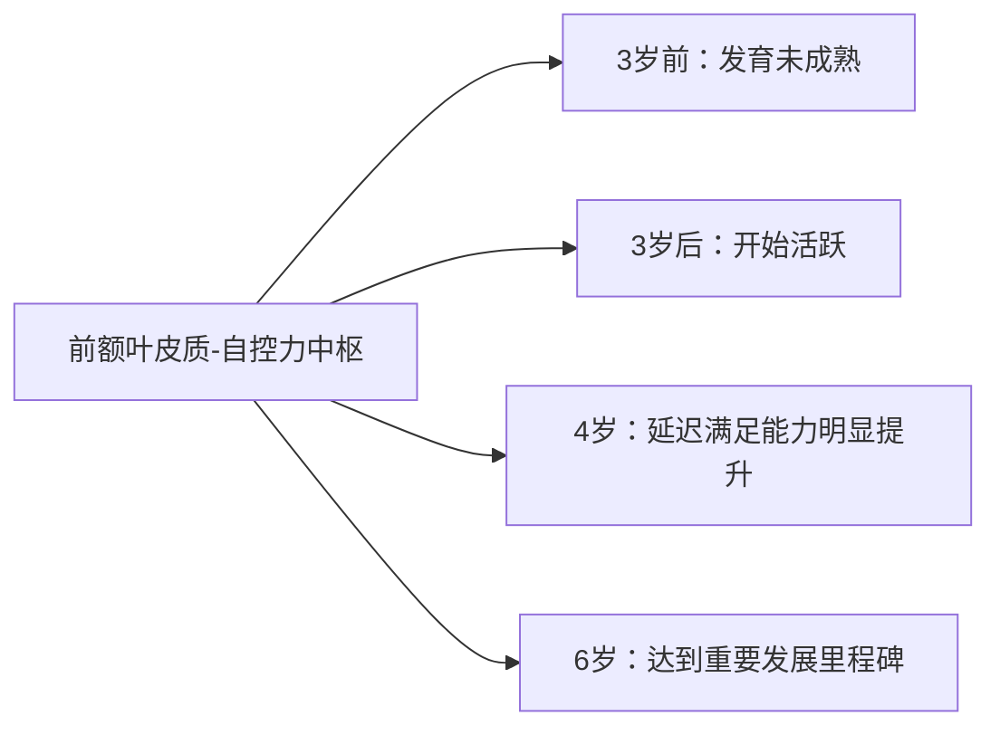
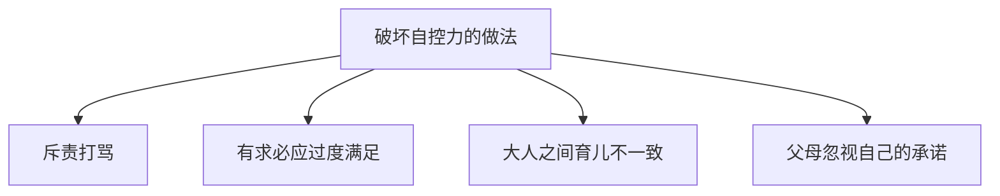

# 第26课：自控力培养——培养自我管理能力

## Learning Objectives
- 理解自控力的大脑基础及对孩子一生长远影响的研究证据
- 识别破坏孩子自控力的四种常见教养误区
- 掌握牧羊犬型情商教练的五大步骤
- 学会制定并温和坚定执行家庭规则

## 核心概念

### 什么是自控力？

自控力（自我管理能力/自律能力）是一个人**有意识地控制和调节自己心情及行为**的能力。它包含两大核心能力：

| 能力 | 定义 | 举例 |
|------|------|------|
| **抑制冲动/延迟满足** | 想要做某事但当下不合适时，能够抑制冲动、等待 | 很想打游戏，但现在不可以，就等一等 |
| **排除干扰完成目标** | 不被诱惑分心，继续做该做的事 | 正在搭积木，听到外面的声音，但继续专心完成 |

### 自控力的三大能力模块

```
自控力高手
├── 目标力：清楚自己的目标是什么（如"我要收拾玩具"）
├── 拒绝力：约束自己不做不该做的事情（如不去玩别的东西）
└── 行动力：产生行动去做到该做的事（如按时去吃饭洗澡）
```

### 自控力的重要性——长达30年的追踪研究

2011年《美国国家科学院院刊》刊登了一项长达30年的跟踪研究，对 **1037 名孩子**从3岁追踪到32岁。结果发现：

> 3-4岁自控力较好的孩子，长大后：
> - 身心更健康
> - 学习成绩更好
> - 青春期问题行为更少
> - 考入更好的学校、找到更好的工作、经济收入更高

> [!IMPORTANT] 关键结论
> 自控力影响一个人的一生，需要**从小开始抓起**。二到六岁是启蒙关键期，三岁以后大脑负责自控力的脑区开始变得活跃，四岁后能力明显提升。

## 深入讲解

### 自控力的大脑基础

前扣带回顶部——我们大脑中负责自控力的部分，**从三岁以后开始变得非常活络**。



**关键认知**：1-2岁宝宝缺乏自控力是正常的生理现象，不是"不听话"或"故意的"。这好比要求一个刚学走路的孩子跑马拉松。

### 破坏孩子自控力的四种育儿做法



#### 1. 斥责打骂

打骂让孩子因为**害怕**而停止行为，但并未产生**自我管理的能力**。一旦父母不在场（如换成爷爷奶奶带），孩子就完全变样。

**核心原则**：打孩子不是教育，是伤害。打孩子只代表爸爸妈妈没有能力与孩子做沟通。

> [!WARNING] 暴力循环
> 父母用打骂制止孩子的行为，孩子学到的是"生气时可以用暴力解决问题"，将来也以暴制暴。

#### 2. 有求必应、过度满足

孩子要什么就给什么，会让孩子认为"我只要有想法，别人就应该答应我"，完全没有锻炼出**延迟满足**和**自我管理**的能力。

玩具太多也会影响孩子的**专注力**和**珍惜物品**的能力。

> [!QUESTION] 独立思辩
> "只要我买得起，孩子要什么我就买什么"——这个逻辑有什么问题？
> 
> <details>
> <summary>点击展开答案</summary>
> 
> 这个逻辑缺少两个关键思考步骤：
> 1. **我真的需要吗？**
> 2. **我该有它吗？**
> 
> 缺少这两个步骤，就没有自控力。孩子会认为"全世界都应该满足我"，得不到就意味着"不爱我"。这种逻辑看似满足，实则**用快感（pleasure）替代了幸福感（gratification）**。真正的幸福感来自通过努力达成目标后的**满足感**，而非即时满足的快感。
> </details>

#### 3. 大人之间教育理念不一致

爸爸妈妈一套规则，祖辈另一套规则，孩子会发现"原来规则不一定要遵守"，这严重破坏自控力的培养。

**关键**：所有看护人形成一致的育儿理念，设立并遵守一样的规则。

#### 4. 父母忽视自己的承诺

"我们星期六去吧"——结果星期六到了，爸妈忘得干干净净。孩子学会的是："反正你说话不算话，我就要现在要！"

### 棉花糖实验的启示

斯坦福大学的经典"棉花糖实验"（Marshmallow Test）证明了延迟满足能力对一生成就的预测力。能够等待15分钟获得第二颗棉花糖的孩子，在后续追踪中表现出更好的学业成绩、社交能力和抗压能力。

> 自控力就像**肌肉**——每一次锻炼，就会强健一次。

## 实用方法

### 方法一：制定家庭规则

自控力需要**规则来帮助锻炼**。先有规则，才能因执行规则而培养自控力。

**家规定哪些方面**：

| 规则类别 | 建议内容 |
|---------|---------|
| 作息规则 | 固定起床、睡觉、吃饭时间 |
| 玩具购买规则 | 多久买一次、每次金额上限、什么情况不买 |
| 零食规则 | 什么时间可以吃、可以吃多少 |
| 电子产品规则 | 可以看多久电视/打多久游戏 |
| 家务规则 | 孩子负责收拾自己的玩具等 |

### 方法二：温和坚定执行规则——牧羊犬型情商教练

当孩子违反约定时（如打游戏15分钟到了不肯停），采用**牧羊犬型情商教练五大步骤**：


**实践范例**：

> 孩子："我还要继续玩！我还要！"
>
> **第一步 接纳情绪**："宝宝，我知道你现在真的很想继续玩，对吧？"
>
> **第二步 温和说明原因**："因为我们之前约好了，每次打游戏就是15分钟。"
>
> **第三步 坚定执行规则**："我决定和你一起遵守约定，所以请你把iPad收起来。"（关键句式：**"我决定和你一起遵守约定"**）
>
> **第四步 鼓励找解决方案**（二选一）："那我们来想想可以做点什么别的好不好？你是想一、我们去读个故事，还是二、吃点小点心？"
>
> **第五步 肯定能力**："太了！你说到做到把iPad收起来了，妈妈发现你是一个**特别有自我管理能力**的孩子！"

> [!TIP] "我决定和你一起遵守约定"
> 这句话让宝宝觉得这是一个公平的约定，而不是爸妈单方面强迫他执行，因此更容易接受、情绪反弹更少。

### 方法三：父母以身作则

孩子是父母的镜子。如果父母自己看剧刷微信停不下来，却要求孩子有自控力，孩子会学到："原来爸妈说的和做的不一样。"

### 不同年龄的自控力标准

| 年龄 | 自控力发展水平 |
|------|--------------|
| 1-2岁 | 几乎没有自控力，主要靠本能 |
| 3岁 | 启蒙关键期，开始具备初步自控能力 |
| 4岁 | 延迟满足能力明显提升，可以坚持不懈完成任务 |
| 5-6岁 | 可以较好控制冲动，能够在一定时间内遵守规则 > [!NOTE] 三岁以下的要求
> 对于2-3岁的宝宝，要求他们自我控制可能要求过高。用游戏的方式教孩子表达需求，如教孩子说"我也想玩，好不好？"而不是一味制止。

## 实践练习

### 练习一：牧羊犬型回应训练

场景：跟孩子说好今天出门不买玩具，结果到了商场孩子看到喜欢的东西开始哭闹"我就要！我就要！"

请用牧羊犬型情商教练的五大步骤写出你的回应：

1. **接纳情绪**：
2. **温和说明**：
3. **坚定执行**：
4. **给选择**：
5. **肯定能力**：

### 练习二：制定家庭规则

请写下来你的家庭中需要制定的规则清单：

| 规则类别 | 具体内容 |
|---------|---------|
| 玩具购买 | |
| 电子品使用 | |
| 作息时间 | |
| 家务分工 | |

### 练习三：奖励方式创新

不想用物质奖励时，可以尝试：

- **奖励选择权**：让他决定周末全家去哪里玩
- **奖励决策权**：让他决定今天中午吃什么
- **奖励体验**：一次特别的外出活动

## 总结

培养孩子自控力的三大方法：

1. **制定家庭规则**——让孩子知道什么该做、什么不该做
2. **牧羊犬型执行**——接纳情绪 + 温和坚定 + 给选择 + 肯定能力（关键句式："我决定和你一起遵守约定"）
3. **父母以身作则**——做说到做到的自控力榜样

## 延伸阅读

- [[0001-情绪管理训练五步骤]]——情绪管理是自控力的基础
- [[0015-理解孩子的语言]]——理解孩子行为背后的需求
- [[0025-自信培养]]——自信让孩子更愿意尝试自我管理
- 相关课程：[[0027-独立性培养]]

> [!TIP] 核心一句话
> 自控力像肌肉，每一次温和而坚定的执行规则，就是一次有效的锻炼。