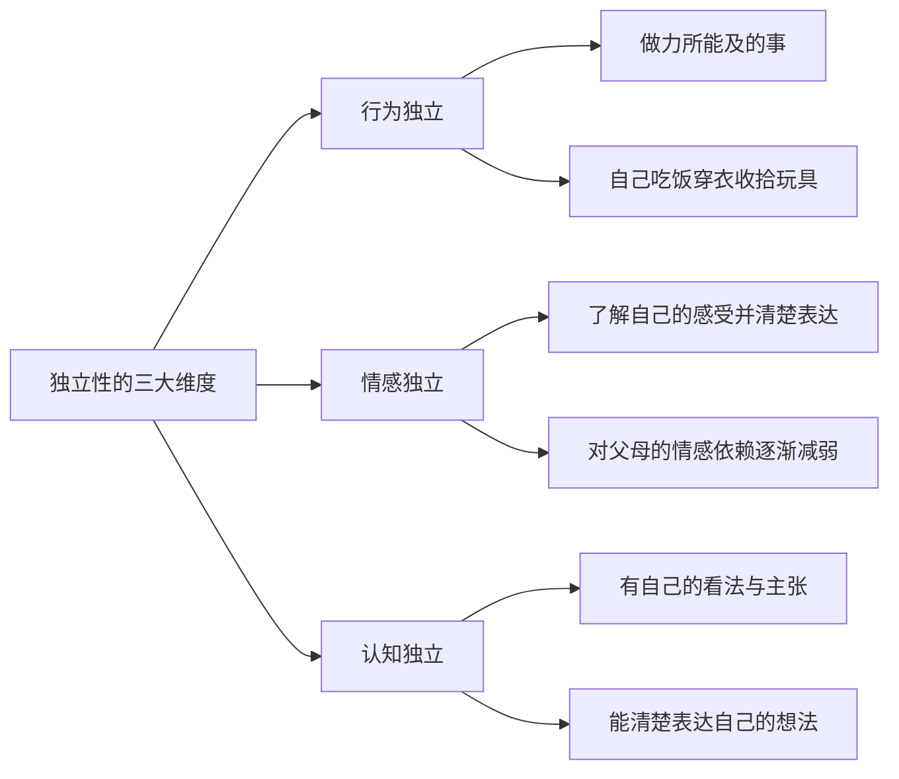
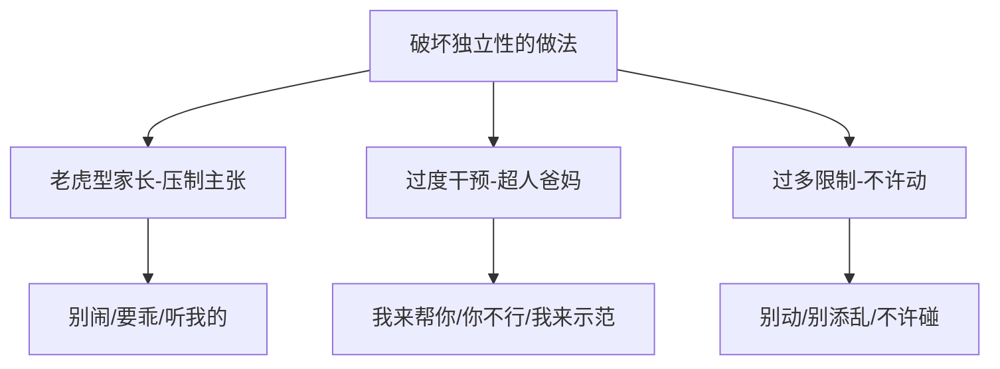

# 第27课：独立性培养——培养独立自主的孩子

## Learning Objectives
- 理解独立性的三大维度（行为独立、情感独立、认知独立）
- 识别破坏孩子独立性的常见育儿做法
- 掌握培养独立性的六大有效方法
- 学会应对隔代教养中独立性培养的冲突

## 核心概念

### 什么是独立性？

独立性不只是"自己能做事"。心理学家Guilford认为，**独立性是创造性人才的首要人格特征**。一个人的独立性高，表现在三大方面：

### 独立性高孩子的表现

| 方面 | 具体表现 |
|------|---------|
| **日常生活** | 能自己吃饭、喝水、上厕所；能根据自己的兴趣选择物品和活动 |
| **社交互动** | 能自发认识新朋友；能自己选择想一起玩的小伙伴 |
| **心理独立** | 会说出心里想法；能按照自己的想法做事 |
| **幼儿园适应** | 愿意独自去学校、和小伙伴相处 |

### 独立性对孩子未来发展的影响

| 维度 | 积极影响 |
|------|---------|
| **问题行为** | 独立性高的孩子问题行为更少 |
| **人际关系** | 独立性高的孩子人际关系更好 |
| **学业适应** | 独立性高的孩子学业适应性更好 |
| **工作成就** | 独立性高的孩子工作成就更高 |
| **创造力** | 独立性是创造性人才的首要人格特征 |

> [!IMPORTANT] 核心观点
> 决定一个人未来工作表现和事业成就的，已经不是大脑中储存了多少知识（因为可以随时搜索），而是**你有多大的创造力**。培养独立性，就是培养面向未来的竞争力。

## 深入讲解

###  独立性发展的时间线

独立性培养的**启蒙关键期**：**2-6岁**

为什么从两岁开始？

1. **自我意识萌芽**（约2岁）：宝宝开始区分"我是我，我跟别人不同"，开始有自我主张
2. **环境要求**（约3岁）：要上幼儿园，需要自己吃饭、自己待在幼儿园

> [!NOTE] 1.5岁以下宝宝
>  如果宝宝在1.5-2岁以下，培养独立性还太早。这个阶段的重点是建立稳定的**安全感**。

### 破坏孩子独立性的三种育儿做法

#### 1. 老虎型家长

常说"别闹""你要乖""你要听我的"——只要孩子有自己的想法或情绪，父母就生气。

**后果**：孩子逐渐丧失自己的主张，变得"什么都问妈妈"，没有自我主张的人很难有幸福感。

**转变方向**：从老虎型转变为[[#^ 牧羊犬型情商教练]]（参考[[0026-自控力培养]]）

#### 2. 过度干预（超人爸妈）

孩子一做事，爸妈立刻出手："你这样不对！来我示范给你看！"

**更好的做法**：耐心等待。让孩子有机会独立完成，哪怕做得不好，也是锻炼独立性的好机会。

#### 3. 过多限制

"别动！""不要添乱！"——当孩子好奇想尝试时，这些否定会让孩子对自己的能力产生怀疑。

**请把"不许动"换成"试试看"**。

> [!WARNING] 包办代替
> 长期被包办代替的孩子，很难从内心产生独立的力量。因为在成长过程中，他从未有机会思考自己想要什么、自己做决定。

## 实用方法

### 方法一：区分依赖的本质

孩子明明会做但不想做时，先判断是哪种依赖：

| 依赖类型 | 表现 | 应对方式 ||----------|------|---------|
| **事情的依赖** | 不想做这事，希望大人代劳 | 鼓励他自己完成 |
| **关系的依赖** | 撒娇、求关注，希望感受被爱 | 先接纳情绪，拥抱他，再鼓励他自己做 |

**实践**："我知道你今天累了，希望妈妈多陪陪你，对不对？"（先接纳）——"来，休息一下，待会你自己做完，因为你是个非常能干的宝宝！"（再鼓励）

### 方法二：接纳情绪，表扬能力

- **接纳情绪**："我知道你有点累了/不开心……"
- **表扬能力**："但是我知道你已经会做了，而且很愿意自己做。"
- **鼓励完成**："你是个非常能干的宝宝"

### 方法三：给孩子做选择题

从小提供**二选一**的机会，培养孩子的独立意识和决策能力。

| 场景 | 二选一 ||------|--------|
| 穿衣服 | "今天穿黄色鞋子还是蓝色鞋子？" |
| 吃点心 | "想吃苹果还是香蕉？" |
| 读故事 | "读这本书还是那本书好？" |

> [!TIP] 怎么处理"两个都不选" 
> 如果孩子说"我要选第三个"，可以问"你为什么喜欢第三个？"只要孩子能说出合理理由，请支持他。培养孩子了解自己、理性沟通的能力，比坚持父母自己的想法更重要。

### 方法四：让孩子做力所能及的家务

开家庭会议，分配家务：**每个人都有自己的工作**。

告诉孩子："这是你的任务，你自己的事情自己做。"

**关键转变**：让孩子觉得"这是我的事，我可以做，我乐意做"——而不是"我听话所以做"。

### 方法五：先让孩子自己试试

孩子遇到困难想放弃时说：**"请你先试试自己做，好不好？"**

在旁观察，必要时给口头提示，但不要第一时间插手。

### 方法六：玩"独立EQ游戏"

教会孩子一句口令：**"谢谢，我可以自己做"**。

用游戏的方式：把宝宝已经会做的事情的道具（碗、鞋子、牙刷等）放在桌上，拿起一个问"宝宝，要妈妈帮你吃饭吗？"宝宝回答"谢谢，我可以自己做"后自己"吃"道具。

> 这个口令的意义在于：
> 1. **行为上**：我有能力做
> 2. **意愿上**：我乐意做
> 3. **态度上**：谢谢别人的好意，但我可以自己来

## 实践练习

### 练习一：二选一训练

请想想在这一周中，你可以在哪些事情上给孩子"二选一"的机会：

| 时间 | 选择内容 |
|------|---------|
| 早晨 | 穿____还是____？ |
| 零食时间 | 吃____还是____？ |
| 亲子活动 | 玩____还是____？ |

### 练习二：区分依赖

记录一次宝宝撒娇不想自己做事的场景，判断是"事情的依赖"还是"关系的依赖"，并尝试用"接纳情绪+表扬能力"回应：

- **场景描述**：
- **依赖类型**：
- **你的回应**：

### 练习三：制定家庭责任分工

和全家人一起开个"家庭会议"：

| 家庭成员 | 负责事务 |
|----------|---------|
| 妈妈 | |
| 爸爸 | |
| 宝宝 | |

> [!QUESTION] 思考题
> 婆婆认为"孩子还小，帮他做没什么"，而我觉得应该培养独立性，怎么办？ 
> 
> 

> 
点击展开答案 

> 
> 两代人最容易在独立性培养上产生矛盾。推荐两种方法：
> 
> **1. 借口说教**：借专家的口来说教，"不是我听你的也不是你听我的，我们听科学育儿的专家怎么说"。邀请祖辈一起听情商课。
> 
> **2. 开家庭会议**：坐下来把"宝宝现在能自己做的事情"列出来（穿鞋、吃饭等），让全家包括宝宝都参与讨论。达成共识后，大家都按此执行。当宝宝有进步时，全家一起表扬。
> 
> 对于"不许动，再动打手"这样的做法，这属于**恐吓**，会严重伤害孩子的安全感和独立性，需要特别重视并沟通改善。
> 

## 总结

培养孩子独立性的六大方法：

1. **区分依赖**——判断是事情依赖还是关系依赖，分别应对
2. **接纳情绪、表扬能力**——先共情后鼓励
3. **给选择题**——二选一培养决策力
4. **分配家务**——让孩子有自己的责任
5. **先自己试试**——在旁给提示而非直接代劳
6. **独立EQ游戏**——教孩子说"谢谢，我可以自己做"

## 延伸阅读

- [[0026-自控力培养]]——自控力是独立性的基础能力
- [[0018-通过游戏培养自信抗挫乐观]]——游戏力培养独立性
- [[0025-自信培养]]——自信让孩子更愿意独立尝试
- 相关课程：[[0028-愤怒管理力]]

> [!TIP] 核心一句话
> 独立性不是"不依赖"，而是"我有能力自己做，也乐意自己做"。