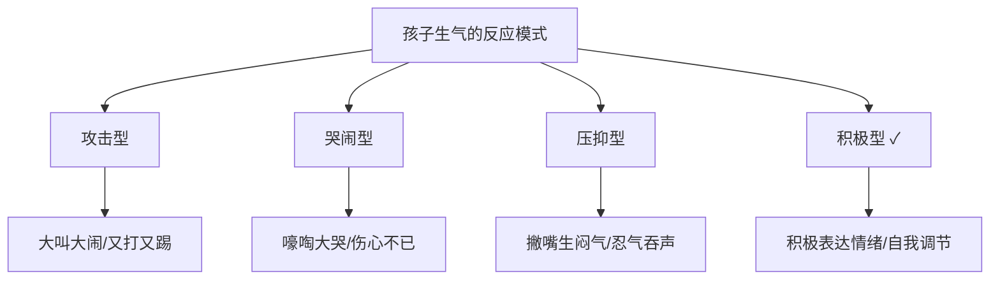
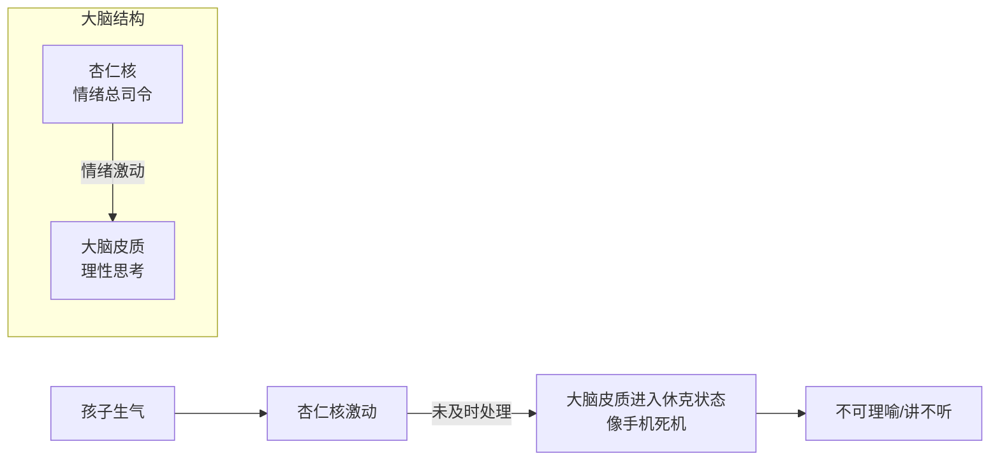

# 第28课：愤怒管理力——理解与疏导怒气

## Learning Objectives
- 理解孩子乱发脾气的大脑神经机制（杏仁核 vs 大脑皮质）
- 掌握愤怒管理四步法：情绪识别→冷静→表达→解决
- 学会公共场合发脾气的应对策略
- 了解不同气质类型孩子的愤怒管理差异

## 核心概念

### 愤怒是本能，愤怒管理是本领

> 核心区分：
> - **生气**是一种**感受**——不可以压抑，需要被接纳
> - **乱发脾气**是一种**行为**——需要被引导和调整

教孩子愤怒管理，绝不是"不可以生气"，而是帮助孩子在内心有生气感受时，**不乱发脾气**。

### 愤怒反应的四种模式

当孩子生气时，通常表现为以下几种模式：



| 类型 | 表现 | 评估 |
|------|------|------|
| **攻击型** | 大叫大闹、又打又踢 | 常见于低幼儿童（4岁以下）；需要引导 |
| **哭闹型** | 嚎啕大哭，但不伤害别人 | 需要教孩子用语言表达 |
| **压抑型** | 撇嘴生闷气，不说出来 | 长期压抑同样不利心理健康 |
| **积极型** | 用语言表达情绪，能自我调节 | **目标模式** |

### 愤怒管理对孩子的重要性

会管理愤怒的孩子：

- **问题行为更少**——不乱发脾气就不容易与别人冲突
- **伙伴关系更好**——社交能力强
- **学习表现更好**——不会因情绪影响学习
- **亲子关系更好**——爸妈更喜欢不乱发脾气的孩子

## 深入讲解

### 孩子为什么爱发脾气？（大脑神经机制）



**孩子易怒的三大原因**：

1. **意愿被阻碍**——"我想吃这个你不给我！"
2. **感到不公平**——"哥哥可以为什么我不行？"
3. **大脑发育不均衡**——杏仁核（情绪中枢）很活跃，但**前额叶皮质**（管理情绪的部分）刚开始萌芽

> [!IMPORTANT] 关键认知
> 孩子发脾气**不是故意捣蛋**，而是因为他**缺乏能力**：
> - **认知灵活度不足**：拿不到想要的东西，不会灵活转换目标
> - **语言处理能力不足**：无法用语言表达感受，只能用哭闹

### 启蒙关键期

愤怒管理的**启蒙关键期**：**3-5岁**

此时宝宝具备了和爸妈一起学习管理愤怒的能力。但请注意——启蒙关键期不是敏感期或窗口期，**情商是一辈子都可以培养和提升的能力**。

### 父母火上浇油的三种做法

| 不当做法 | 表现 | 为什么不好 ||----------|------|------------|
| **转换注意法** | "宝宝快看那个是什么！" | 不到1.5岁可能有效，2岁以上不再上当；错失培养能力的机会 |
| **恐吓威胁法** | "不许闹！再闹警察来抓你了！" | 情绪被压抑而非消化，孩子没学会应对愤怒 |
| **以暴制暴** | 打孩子、吼孩子 | 最糟糕的愤怒管理示范——教孩子"生气=打人" |

> [!WARNING] 打孩子的后果
> 研究发现，三岁左右常常被打骂的孩子，到了五岁攻击行为明显多于其他同伴。打孩子不是教育，是伤害。

## 实用方法

### 愤怒管理四步法

```mermaid
flowchart LR
    A[第一步：情绪识别<br/>接纳+共情] --> B[第二步：冷静<br/>客观解读+情绪降温]
    B --> C[第三步：表达<br/>教孩子"说情绪"]
    C --> D[第四步：解决<br/>设定行为界限+找替代方案]
```

#### 第一步：情绪识别——接纳孩子的情绪

**"我看到你生气了。"**——第一句话就告诉孩子，你理解他的感受。

**"我知道你生气了，因为你现在觉得不冷，不想多穿一件外套，对吗？"**——帮助孩子理解自己生气的原因。

> 接纳不等于同意，而是代表"我懂你的感受"。

#### 第二步：冷静——先做"没脾气父母"，再帮孩子降温

**客观解读法**：父母先管理自己的怒气。

当孩子闹情绪时，父母大脑里会有自己的解读——要练习**客观解读**：

| 场景 | 愤怒解读（陷阱） | 客观解读（正确） |
|------|----------------|-----------------|
| 孩子说不穿外套 | "这孩子怎么不听话！" | "原来孩子有自己的想法了" |
| 孩子等不及发脾气 | "这孩子真没耐心！" | "哦，我家宝贝在等待时容易有挫折感" |

**情绪降温技巧**：

1. **说悄悄话**：孩子在大喊大叫时，凑到他耳边小声说话，孩子会停下来专心听
2. **不断重复**："我知道，妈妈知道你不高兴了……"重复到情绪缓和
3. **做耐心比赛**：孩子越生气，你越冷静

> [!TIP] 不生气口令
> 教孩子对自己说 **"不生气，不生气"**——在杏仁核启动后、情绪爆发前的几秒钟，用口令帮助自己按住"暂停键"。这句简单的口令背后有**大脑神经科学**做基础。

#### 第三步：表达——教孩子"说情绪，不做情绪"

**"说情绪"**：用语言表达内心感受——"妈妈我生气了，因为……"

**"做情绪"**：打人、摔东西、哭闹——用行为表达情绪

**关键**：当孩子学会用语言表达情绪（说情绪），他就不需要用行为表达（做情绪）了。

| 孩子说… | 爸妈回应 ||---|---|
|----------|----------|
| "我生气了！" | "谢谢你告诉我，我听懂了！原来你是这个感觉。" |

#### 第四步：设界限 + 找解决方案

**设定行为界限**：

"生气的时候，请不要打人/摔东西/大喊大叫，因为这样会让别人不高兴。"

**教孩子找到替代方案**：生气时除了打人摔东西，还可以怎么做？

### 不同气质类型孩子的愤怒管理

| 气质类型 | 愤怒特点 | 养育策略 |
|---------|---------|---------|
| **敏感型** | 容易情绪激动，反应强 | 表扬：批评比例 > 5:1；多用故事代替直接批评 |
| **逃避型** | 生气就跑开、锁门 | 先处理亲子关系，让孩子感到"留下来沟通是安全的" |
| **固执型** | 认准一个目标不放 | 提前设约定，用游戏化的方式转换注意 |

## 实践练习

### 练习一：客观解读训练

面对以下情境，写下你的"客观解读"：

1. **场景**：宝宝看到喜欢的零食，你不让他吃，他大哭。
   - **怒火解读**（不对的）：________________
   - **客观解读**（正确的）：________________

2. **场景**：宝宝非要自己搭积木，但搭不好就发脾气。
   - **怒火解读**（不对的）：________________
   - **客观解读**（正确的）：________________

### 练习二："说情绪"练习

教孩子用语言表达愤怒：

| 情境 | 教孩子这样说 ||------|--------------|
| 想玩但被叫去吃饭 | "我生气了，我还想再玩一会儿！" |
| 不想穿外套 | "我不高兴，我不冷！" |
| 弟弟玩了他的玩具 | "我很生气，那是我的玩具！" |

### 练习三：不生气口令游戏

和孩子约定"不生气"口令。每次孩子快要生气时，和孩子一起说：
- **"不生气，不生气，我要好好说话。"**

### 练习四：家庭观察任务

观察孩子一周内的发脾气模式：攻击型/哭闹型/压抑型？记录下来，并尝试用四步法回应。

> [!QUESTION] 思考题
> 孩子生气时喜欢一个人跑开或锁门，怎么办？
>
> <details>
> <summary>点击展开答案</summary>
>
>
> 孩子选择逃避而不是面对冲突，很可能是因为他感觉"留下来沟通是无效的"，甚至"会被骂"。
>
> **应对策略**：
>2. **确保安全**：换掉可以内锁的门锁
> 3. **沟通重建**：从一句关键话开始——"宝宝，爸妈好爱你，我知道你现在不高兴了，你能告诉我为什么吗？"
> 4. **正向强化**：只要孩子愿意停下来沟通，就大大表扬——"谢谢你告诉我，我好高兴你愿意和我说！"
> 5. **出门约法三章**：如果跑开就立刻回家，说到做到，不发脾气。
> 
> 核心是让孩子体会到：**留下来沟通比跑开更有收获**。
> </details>

## 总结

愤怒管理四步法：

1. **情绪识别**——"我看到你生气了，因为……"
2. **冷静**——父母先客观解读、孩子可用"不生气"口令/悄悄话
3. **表达**——教孩子"说情绪，不做情绪"
4. **解决**——设定行为界限 + 找到替代方案

**没脾气，才能做教育。**

## 延伸阅读

- [[0003-理解暴脾气孩子的根本原因]]——第一季关于暴脾气小孩
- [[0016-帮助孩子克服胆小害怕的8个步骤]]——处理其他负面情绪
- [[0025-自信培养]]——自信孩子的愤怒管理能力更强
- [[0026-自控力培养]]——自控力是愤怒管理的基础

> [!TIP] 核心一句话
> 愤怒是本能，愤怒管理是本领。孩子不是故意捣蛋，而是需要父母帮他培养能力。