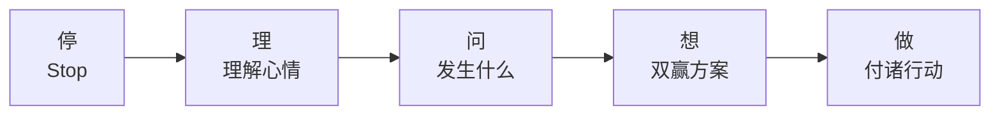

# 第31课：冲突解决能力——化解矛盾的技巧

## 学习目标
- 理解冲突解决能力为何是高级情商力的组合
- 掌握ICPS训练法（I Can Problem Solve）的核心思想
- 学会冲突解决"停→理→问→想→做"五步法
- 掌握亲子冲突和同伴冲突的不同处理策略
- 了解手足冲突的善意解读法

## 核心概念

### 冲突解决是高级情商力的组合

冲突管理能力被称为人际关系中最重要的能力。要解决冲突，孩子需要同时调动多个情商力：

````mermaid
flowchart TD
    A[冲突解决能力] --> B[情绪认知能力<br/>"我生气了"]
    A --> C[愤怒管理能力<br/>"我能控制不打人"]
    A --> D[共情能力<br/>"他也想玩"]
    A --> E[问题解决能力<br/>"有什么办法让我们都开心？"]
```

这就是为什么很多大人到现在还不会解决冲突——它需要的情商力太多了。

### 冲突不是坏事

> [!TIP] 关键洞察>
> 冲突的意思是"我的意见和你的意见不一样"。这不是坏事，**不会处理矛盾才是糟糕的事**。每一次冲突都是培养孩子情商的绝佳机会。

### ICPS训练法

ICPS = **I Can Problem Solve**（我能解决问题），由儿童心理学家Myrna B. Shure提出。核心思想不是告诉孩子怎么做，而是**引导孩子自己想出双赢的解决方案**。

## 深入讲解

### 冲突解决能力发展关键期

| 年龄 | 发展状态 | 家长策略 |
|------|---------|---------|
| 2-3岁 | 难以搞定同伴冲突 | 理解为主，不做高要求 |
| 4岁 | **启蒙关键期** | 开始有意识地教孩子解决冲突 |
| 5-6岁 | 人际关注期 | 重点培养，助力幼小衔接 |

### 不当的冲突处理方式

| 做法 | 表现 | 后果 |
|------|------|------|
| **否定冲突** | "不准吵！不准抢！" | 孩子认为冲突是坏事，变逃避型人格 |
| **以暴制暴** | 孩子打人，父母打回去"教训" | 孩子学会"用暴力解决问题" |
| **贴标签** | "你怎么这么胆小懦弱！" | 伤害自信，孩子更没有能力面对冲突 |

### 冲突解决五步法（停→理→问→想→做）



#### 第一步：停

把两个孩子迅速拉开，停止可能的相互伤害。

#### 第二步：理（理解心情）

先处理心情，再处理事情：

> "我知道你们两个人都不开心了。"

如果对方家长在场，先表达共同感受，避免将孩子之间的矛盾升级为大人之间的矛盾。

#### 第三步：问（发生了什么）

> [!WARNING] 重要区别
> **问"发生了什么"**——客观描述事件经过（孩子愿意说）
> **问"为什么"**——追问动机（孩子感到被责备，拒绝沟通）

好的问法：

> "我注意到你们两人都不高兴了，能告诉我发生了什么吗？"

#### 第四步：想（双赢方案）

引导孩子自己想办法：

> "你们来想一想，有什么好方法可以让彼此都开心？"

如果孩子想不出，可以提供选项：

- **顺序冲突**（我也想第一，你也想第一）："你要我也要，石头剪刀布"
- **资源冲突**（两人都想玩一个东西）："你要我也要，我们都得到"——轮流、交换、一起玩

#### 第五步：做（付诸行动）

> "太好了，你想到的这个方法真好！现在就请你回去告诉小朋友，你们可以继续一起玩，继续做好朋友了。"

## 实用方法

### 亲子冲突处理四步法

当孩子说"我不要"时：

1. **保持冷静**——把"他又不听话"翻译为"宝宝有话想说"
2. **接纳情绪**——"你的意思是说不想穿这件衣服，是吗？"
3. **问找原因**——别"编剧"（"他故意反抗"），去问真正原因（"这件衣服有点扎"）
4. **双赢方案**——"我担心你着凉，你穿得不舒服，那怎么办？"

### 同伴冲突处理策略

| 场景 | 策略 |
|------|------|
| **轻微推打**（非恶意） | 先观察，做"翻译官"："他是想和你一起玩" |
| **两个孩子打起来** | 停→理→问→想→做五步法 |
| **孩子被打了** | 教孩子："保护自己（用手挡），大声说'你不可以打我'，跑开，告诉大人" |
| **对方家长在场** | 先和对方家长建立共识："两个孩子刚才玩得很开心的，真遗憾发生这个事" |

### 手足冲突的善意解读法

当大宝和二宝发生矛盾时，父母最重要的角色是**正面积极的"行为翻译官"**：

> **"你看，弟弟/妹妹好爱你，他是想摸摸你的脸，说'我好喜欢你'。因为他还不会说话，所以用手碰碰你。"**

这样做既化解矛盾，又在示范如何善意解读他人的行为——这是让孩子一生受用的情商力。

## 实践练习

### 场景：抢玩具

> [!QUESTION] 思考题
> 两个孩子都想玩同一个玩具汽车，一个开始推对方，另一个大哭。请用冲突解决五步法演练。

<details>
<summary>参考答案</summary>

1. **停**：把两个孩子拉开，分开站。
2. **理**："我知道你们俩现在都不高兴。"
3. **问**："能告诉我刚才发生了什么吗？"（避免问"为什么打架"）
4. **想**："原来是两个人都想玩这个小汽车。那来想一想，有什么方法可以让你们俩都开心？"
   - 孩子可能想出的方案：轮流玩、一人玩5分钟、一起玩、先玩别的再交换
5. **做**："这个轮流玩的方法真好！你们谁先来？"
</details>

### 场景：孩子不肯出门

> [!QUESTION] 思考题
> 急着出门，但孩子就是不肯穿外套，哭着说"我不要穿！"传统的做法可能是骂一顿强行穿上。用亲子冲突四步法应该怎么做？

<details>
<summary>参考答案</summary>

1. **保持冷静**：告诉自己"孩子有话想说"，而不是"他不听话"。
2. **接纳情绪**："你不想穿这件外套，是吗？"
3. **问原因**："能告诉妈妈为什么不想穿吗？"
   - 原因可能是："这件衣服有点扎"或"我不冷"
4. **双赢方案**：
   - 扎的话→换一件舒服的外套（既不着凉，又舒适）
   - 不冷的话→"那这样，我们带着外套出门，如果你觉得冷了再穿，好吗？"
</details>

## 总结

冲突解决是人际关系中最重要的能力——相爱容易相处难，关键就在于会不会吵架。好的情商教练不会包办解决孩子的冲突，而是做"翻译官"和"引导者"：帮孩子表达意图、引导孩子自己想到双赢方案。冲突不是坏事，不会处理冲突才是坏事。

## 延伸阅读
- 上一课：[[../lessons/0030-共情力理解他人感受|第30课：共情力——理解他人感受]]
- 下一课：[[../lessons/0032-专注力电子产品使用与专注力培养|第32课：专注力——电子产品使用与专注力培养]]
- 术语参考：[[../reference/glossary|术语表]]