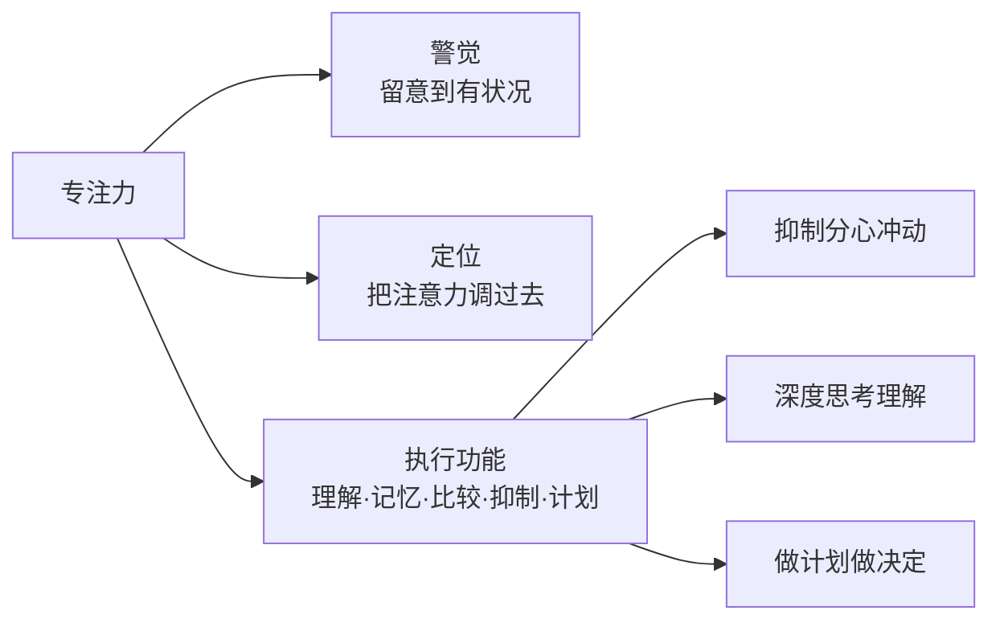

# 第32课：专注力——电子产品使用与专注力培养

## 学习目标
- 理解专注力的三大脑功能：警觉、定位、执行功能
- 掌握电子产品使用的三原则：时间限制、内容选择、共同使用
- 学会培养孩子专注力的十大方法
- 了解不同年龄专注力时长标准，区分分心与多动症

## 核心概念

### 什么是专注力

专注力是**能够对自己的注意力进行控制管理，并达成最佳状态的能力**，包括：

1. **集中注意力的能力**
2. **较长时间全神贯注的能力**
3. **忽略排除干扰的能力**

### 专注力的三大脑功能

### 为什么电子产品不利于专注力发展

电子游戏画面变化多端，让宝宝的大脑一直反复处于"警觉→定位"的循环，**跳过了最重要的"执行功能"**阶段：

> 有状况→去看看→又有状况→再去看看→......
> 孩子无法进行深度思考和理解，也就无法培养深度专注力。

对比之下，**阅读**需要理解、想象、比较、判断，能够帮助孩子不断练习大脑的执行功能。

## 深入讲解

### 电子产品使用三原则

#### 原则一：时间限制

根据美国儿科医学会（2016年更新版）建议：

| 年龄 | 建议 |
|------|------|
| 0-18个月 | 仅在大人监督下进行视频聊天 |
| 18-24个月 | 可接触教育性内容，需大人解说 |
| 2-5岁 | 每天不超过**1小时**，内容要高质量 |
| 5岁以上 | 根据家庭规则，确保不影响睡眠和运动 |

> [!TIP] 关键洞察
> 全新的美国儿科医学会2016年指南增加了18个月以下可视频聊天的内容——研究发现婴幼儿能够通过视频与远方亲人建立情感联系。

#### 原则二：内容选择

筛选标准：
- **教育意义**：警惕含有暴力的动画片
- **手动画面不动**：优选画面缓慢、需要孩子手指互动推进的游戏，而非快速闪变的刺激
- **远离快速移动的电子刺激**：避免宝宝习惯了快节奏刺激后觉得"书好无聊——画面都不动"

#### 原则三：共同使用

爸妈陪孩子一起看，在旁边解说，帮助孩子理解和消化内容。

### 建立电子产品使用规则

| 规则要素 | 具体做法 |
|---------|---------|
| **规则谁定** | 爸妈自己拍板（学龄前孩子没有能力参与讨论） |
| **定时间** | 如每次15分钟，一天累计不超过30分钟 |
| **定场景** | 吃饭时不玩、有客人时不玩 |
| **定权限** | 电子产品不是孩子的权利，**需要开口问爸妈** |
| **定内容** | 明确哪些动画片/游戏可以看，哪些不可以 |

### 不同年龄专注力时长标准

| 年龄 | 专注时长 |
|------|---------|
| 2-3岁 | 3-5分钟 |
| 3-4岁 | 5-10分钟 |
| 4-5岁 | 10-15分钟 |
| 5-6岁 | 15-30分钟 |

> [!WARNING] 常见误区
> 要求5岁孩子"好端端坐着看书一小时"是不符合身心发展规律的。请根据年龄段来理解孩子的专注时长。

### 分心与多动症的区别

孩子有些事专心（如拼积木、看书）、有些事不专心（如上课），很可能是兴趣差异或听觉专注力待训练，未必是多动症。多动症（ADHD）需要专业医生诊断，核心特征是在**所有场合**都难以自控。

## 实用方法

### 培养专注力的十大方法

#### 1. 管理电子产品使用

按照三原则（时间、内容、共同使用）执行，是培养专注力的第一前提。

#### 2. 创造安静环境

孩子玩耍或阅读时关掉电视和背景音乐，减少视觉和听觉干扰。

#### 3. 不打扰不催促

> [!WARNING] 重要提醒
> 当孩子正在专心玩耍时，父母不断说"你怎么不专心"，会导致孩子压力大增、肾上腺激增，反而更难恢复专注状态。

#### 4. 玩单一感官专注力游戏

| 游戏类型 | 示例 |
|---------|------|
| 视觉专注 | "我们一起找找房间里红色的东西有多少个" |
| 听觉专注 | "等一下我讲个故事，如果你听到'小'字，请举右手；听到'大'字，请举左脚" |

#### 5. 玩需要专注力的游戏

| 游戏 | 培养的能力 | 推荐年龄 |
|------|-----------|---------|
| 拼图 | 观察力、毅力 | 3岁+ |
| 搭积木 | 空间力、坚持 | 2岁+ |
| 下棋 | 思考力、专注 | 4岁+ |
| 扑克牌配对 | 记忆力、专注力 | 3岁+ |
| 舒尔特训练法 | 注意力集中 | 4岁+ |

**舒尔特训练法**：
1. 在纸上画九宫格，任意填入1-9的数字
2. 宝宝从1开始，按顺序连到9
3. 熟练后升级到4×4（1-16）、5×5（1-25）
4. 亲子可换手——宝宝填数字，爸妈来连

#### 6. 培养固定阅读习惯

每天固定的亲子共读时间（20-30分钟）。**少看屏幕，多看绘本**——有固定阅读习惯的孩子专注力明显更好。

#### 7. 朗读训练（适用于小学生）

挑选故事书亲子轮流朗读，既培养专注力，又增强文字理解力。

#### 8. 不多买玩具

玩具不是越多越好。过多的视觉刺激让孩子心浮气躁，无法深入玩一个玩具。建议：**收一部分、摆一部分**，定期轮换。

#### 9. 保持书桌整洁

写作业时桌上只放和作业相关的东西——把糖果、玩具等可能分心的物品收走。

#### 10. 保证充足睡眠和运动

- **睡眠不足**：注意力大打折扣
- **运动**：给大脑输送氧气，促进大脑皮质发展（掌管自控力和专注力的区域）

## 实践练习

### 场景：孩子迷上iPAD

> [!QUESTION] 思考题
> 孩子睡前只想玩iPad游戏，把妈妈拿来的绘本扔到一边，甚至让妈妈"走开"。你会如何应对？

参考答案

1. **接纳情绪+坚持规则**："妈妈知道你很想继续打游戏，现在停下来会很失望。但是我们的约定是每次15分钟，现在时间到了，妈妈决定和你一起遵守约定。"
2. **内容筛选**：检查孩子玩的游戏是否符合"手动画面不动"的标准
3. **替代活动**：用有趣的绘本故事吸引孩子——讲得生动有趣，让阅读比游戏更有吸引力
4. **建立新规则**：明确"电子产品不是你的权利，需要问爸妈，爸妈答应了才能玩">/details>

### 场景：上课不专心，玩积木很专心

> [!QUESTION] 思考题
> 6岁男孩，老师反映上课容易分神，但他拼积木可以一个人玩一上午。这算专注力有问题吗？该怎么办？

参考答案

**不算专注力有问题**——能专心拼积木说明孩子的专注力基本能力是好的。不专心有两种可能原因：
1. **兴趣差异**：对自己感兴趣的事当然容易投入
2. **认知转换**：从动手操作（积木）到听觉接收（听课）需要不同的认知模式

**建议行动**：
1. 训练听觉专注力——讲完故事后提问，或玩听到关键字举手的游戏
2. 从兴趣入手——将学习内容和他感兴趣的主题（如恐龙）连接
3. 耐心陪伴小学初期的适应期——写字慢可能是精细动作问题，需要练习而非责骂

## 总结

培养专注力的核心不是"管住孩子"，而是**创造有利于专注的环境**。电子产品管理是第一步，父母不打扰是第二步，用阅读和专注游戏训练是第三步。每个年龄段有合理的专注时长标准，请对照参考而非焦虑。睡眠和运动是专注力的生理基础，缺一不可。

最后记住：**您才是最好的育儿神器**——一个好的情商教练，完全不需要iPad就能成为宝宝最喜欢的情商教练。

## 延伸阅读
- 上一课：[[../lessons/0031-冲突解决能力化解矛盾的技巧|第31课：冲突解决能力——化解矛盾的技巧]]
- 下一课：[[../lessons/0033-黄金法则（一）——先处理心情说情绪纵向比较|第33课：黄金法则（一）——先处理心情、说情绪、纵向比较]]
- 术语参考：[[../reference/glossary|术语表]]