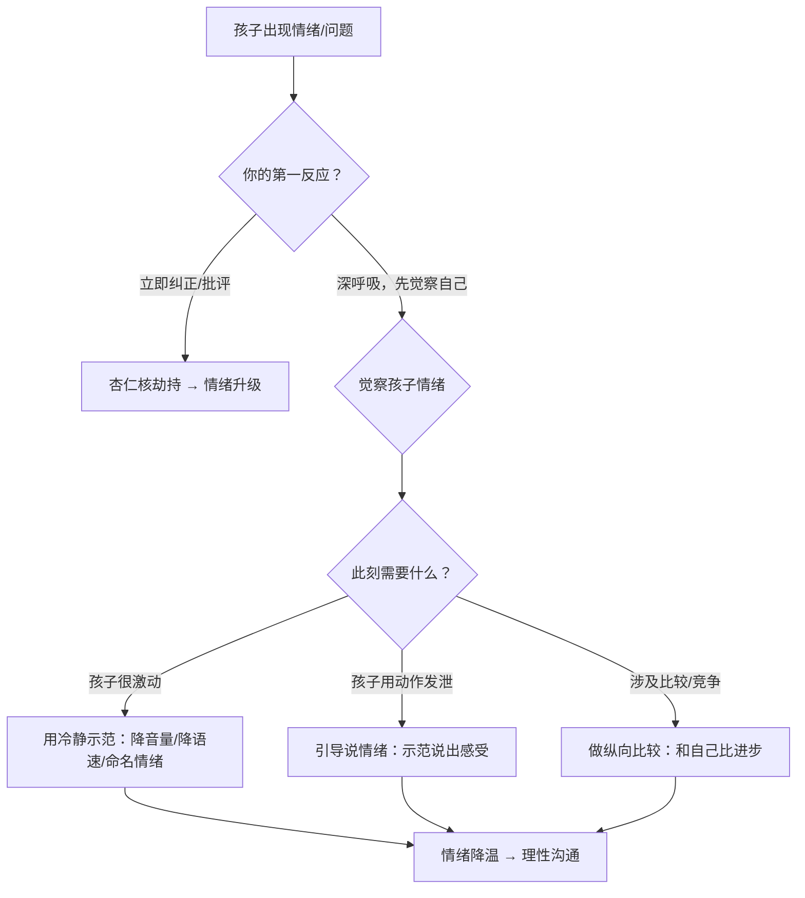

# 第33课：黄金法则（一）——先处理心情、说情绪、纵向比较

## Learning Objectives

- 理解大脑情绪中枢（杏仁核）的反应机制，学会"先处理心情再处理事情"
- 掌握"孩子越激动、爸妈越冷静"的情绪降温技术
- 学会帮助孩子从"做情绪"升级为"说情绪"
- 区分横向比较与纵向比较，掌握"和自己比"的鼓励方法

## 核心概念

### 黄金法则总览


### 法则速查表

| 法则 | 核心理念 | 话术示例 |
|------|----------|----------|
| **前言：情商人设** | 父母是孩子最重要的情商教练，18条黄金法则帮助父母从母亲节走向儿童节，成为孩子最爱的情商教练 | 无特定话术，为系列奠定基调 |
| **法则1：先处理心情，再处理事情** | 大脑杏仁核先于理性皮质反应，必须先让情绪脑安静下来，理性脑才能恢复功能 | "我知道你现在很生气/很难过，妈妈理解。"（先共情）再讨论解决方案 |
| **法则2：孩子越激动，爸妈越冷静** | 情绪传染效应——你越激动孩子越激动；平静示范能帮助孩子情绪降温 | 压低声音、放慢语速："我知道你特别想做这件事，今天不能做，你觉得很失望，对吗？" |
| **法则4：说情绪，不做情绪** | 用语言表达感受（说情绪）比用动作发泄（做情绪）更健康、更有效 | "你刚刚说话那么大声还动了手，妈妈很惊讶也有些难过。如果你能告诉我为什么不高兴，我就能懂你了。" |
| **法则5：纵向而非横向比较** | 不拿孩子和别人比（横向），而是让孩子和自己比（纵向）——今天比昨天进步 |"哇，你这一次做得比上次进步很多，真棒，看得出来你非常努力！" |

### 大脑情绪机制

> [!TIP] 关键洞察
> 大脑中通往杏仁核的通道"简单而狭窄"，传送信息少但**速度极快**；而通往理性中枢的通道较慢。因此人在遇到问题时，杏仁核往往在极短时间内就对不完整信息作出情绪反应——这就是为什么家长容易"跟着感觉走"。

#### 大脑双通道模型

```mermaid
flowchart TD
    subgraph 问题输入
    A[孩子说"我不想读书"） -- 快速通道 --> B[杏仁核：情绪中枢]
    A -- 慢速通道 --> C[大脑皮质：理性中枢]
    C --> B
    end

    subgraph 家长反应
    B -->|未经理性思考| D[情绪爆发：当即发火/批评]
    C -->|理性恢复| E[先处理心情：自我冷静/共情孩子]
    E --> F[理性沟通：了解原因/共同解决]
    end
```

### 为什么"先处理心情"有效

当情绪起来时，首要任务是让杏仁核安静下来。唯有如此，掌管理性思考的大脑皮质才能恢复功能，然后思考：接下来该怎么做，才能真正达成目标？

- **一般家长**：带着情绪去处理事情 → 越处理越糟
- **情商教练**：先处理自己的心情，再处理孩子的心情 → 双方理性恢复 → 一起想办法

## 深入讲解

### 法则1：先处理心情，再处理事情

这是情商教练的**第一根本法则**。当孩子出现问题时，父母的本能反应是立刻"纠正问题"——但此时杏仁核已经启动了情绪反应，大脑皮质处于"被劫持"状态，理性思考基本关闭。

**步骤拆解**：

1. **觉察自己的情绪**：意识到"我现在很生气/很焦虑"
2. **暂停行动**：不急于说话或行动，深呼吸3-5秒
3. **处理心情**：对自己说"先冷静下来"，或者对孩子说"妈妈理解你现在很难过/很生气"
4. **恢复理性**：待双方情绪平稳后，再一起讨论解决方案

### 法则2：孩子越激动，爸妈越冷静

这是对法则1的具体操作延伸。许多父母陷入了一个误区：用更大的声音、更强的情绪去"压制"孩子的情绪——结果适得其反。

> [!WARNING] 常见误区
> 父母常有一种错觉："如果我声音更大，就能把孩子压下来。"但事实上，当你激动的时候，只会让孩子更激动。孩子会感到"我连生气的权利都没有"，结果不是不生气了，而是**更有情绪了**。

**平静示范四步法**：

1. **降音量**：孩子越大声，你越小声
2. **降高度**：半蹲身体，与孩子的目光保持在同一水平线
3. **降语速**：故意放慢语速，轻声说话
4. **命名情绪**："我知道你特别想做这件事，今天不能做，你觉得很失望/很生气，对吧？"

当你用轻柔、平静的语气说话时，你自己不容易失控，同时孩子也能感受到被理解，开始慢慢情绪降温。

### 法则4：和孩子一起"说情绪"，而不"做情绪"

> [!TIP] 核心区分
> - **做情绪**：用动作表达情绪——又哭又闹、又打又踢、摔东西、摔门
> - **说情绪**：用语言表达情绪——"我很生气，因为你不让我看电视""我好难过，因为我的玩具坏了"

**为什么"说情绪"更高级**：

1. 觉察：孩子需要先意识到"我的心情出状况了"
2. 整理：梳理思绪，理解自己为什么会有这样的感受
3. 表达：用语言沟通出来

当一个人从"做情绪"转换为"说情绪"，他的情商管理能力就上了一个台阶。父母要做的是"说情绪"的示范者——先说出自己的感受，孩子就会学着模仿。

### 法则5：做纵向而非横向的比较

**横向比较** = 拿自己的孩子和别人家的孩子比
**纵向比较** = 让孩子自己和自己比——今天和昨天比，这一次和上一次比

> [!WARNING] 横向比较的危害
> - 伤害孩子的自尊心和上进心
> - 让孩子认为"爸妈更喜欢别人家的孩子"
> - 失去参与游戏的乐趣，盲目追求"赢过别人"
> - 不利于建立扎实的自信——第一名只有一个，每次都要求第一是不合理的

**纵向比较的好处**：

- 帮助孩子不焦虑地成长
- 让孩子看到自己的进步，积累自信
- "这一次你做得比上次进步很多，真棒，看得出来你非常努力！"

从现在开始，让"别人家的孩子"退休吧！

## 实用方法

### 情绪处理决策树



### 说情绪示范卡

| 场景 | 错误做法（做情绪/批评）| 正确做法（说情绪/引导）|
|------|-----------------------|----------------------|
| 孩子打人 | "你怎么这么暴力！" | "刚才你不高兴时动手打人，这个动作不对，会伤到别人。你能告诉我为什么不高兴吗？" |
| 孩子摔东西 | "你再摔一个试试！" | "我看到你摔东西了，你好像非常生气。如果你愿意说出来，妈妈就能帮到你。" |
| 孩子哭闹要买玩具 | "哭什么哭，不许哭！" | "我知道你现在不能买，很失望很难过，对吧？但我们之前说好了，今天不买东西。" |

## 实践练习

> [!QUESTION] 情境思考
> 孩子放学回家后，气冲冲地把书包扔在地上，大喊"我最讨厌数学了！我再也不要上学了！"——请用黄金法则1、2、4来设计你的回应步骤。

<details>
<summary>参考答案</summary>

**第一步：先处理自己的心情**（法则1）
深呼吸，告诉自己"这是一个教孩子处理情绪的机会，不是我需要解决的问题"。

**第二步：孩子越激动，我越冷静**（法则2）
蹲下来，放低声音，放慢语速："你看起来真的好生气，对不对？"

**第三步：引导说情绪**（法则4）
"妈妈想知道发生了什么事，让你这么生气。是因为数学课上的事情吗？你能说出来让我知道吗？"

**第四步：不横向比较**（法则5）
不要说"你看XX同学数学多好"——而是说"每个人学习都会遇到困难，重要的是我们看看怎么进步。"
</details>

## 总结

黄金法则（一）围绕一个核心理念展开：**情绪是先于理性被处理的**。当情绪脑（杏仁核）被激活时，理性脑无法正常工作。因此，情商教练的第一要务不是解决问题，而是先处理情绪——无论是自己的还是孩子的。

- **法则1**奠定了根本立场：先处理心情，再处理事情
- **法则2**提供了实操技巧：用冷静示范帮助孩子情绪降温
- **法则4**给出了表达方向：引导孩子从动作发泄升级为语言表达
- **法则5**划定了比较边界：和自己比，不和别人比

这四条法则构成了情商教练的"情绪优先处理"工具箱。

## 延伸阅读

- 上一课：[[../lessons/0032-专注力电子产品使用与专注力培养|第32课：专注力——电子产品使用与专注力培养]]
- 下一课：[[../lessons/0034-黄金法则（二）——情绪质量接纳情绪批评行为关注积极|第34课：黄金法则（二）——情绪质量、接纳情绪、批评行为、关注积极]]
- 术语参考：[[../reference/glossary|术语表]]