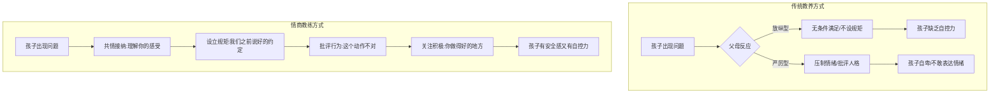

# 第34课：黄金法则（二）——情绪质量、接纳情绪、批评行为、关注积极

## Learning Objectives

- 理解"陪伴时长不如情绪质量重要"的核心观点，学会提升亲子时光的情绪温度
- 掌握"接纳情绪、设立规矩"的温柔而坚定的教养方式
- 学会批评行为而非给孩子贴负面标签的具体话术
- 理解关注积极情绪对孩子乐观品质培养的重要性

## 核心概念

### 法则速查表

| 法则 | 核心理念 | 话术示例 |
|------|----------|----------|
| **法则6：重视亲子时光的情绪质量** | 陪伴的时长不如陪伴的情绪质量重要；相处需要"高情绪质量"而非仅物理距离缩短 | "亲爱的，我注意到你今天主动帮忙做家务了，真好，我看到的时候心里特别感动。" |
| **法则7：接纳情绪、设立规矩** | 先接纳孩子的感受（共情），再帮助孩子遵守约定（设限）——温柔而坚定 | "我理解，现在不能买给你，你好像很失望很不开心。但我们之前说好了，今天不买东西，我要和你一起遵守约定。" |
| **法则10：批评行为，不贴负面标签** | 批评具体的不当行为，而非攻击孩子的人格特质 | "刚才我发现你不高兴的时候动手打了对方，这个动作是不对的，因为会伤到别人。"（而非"你怎么这么暴力"） |
| **法则11：关注孩子的积极情绪** | 积极情绪体验是培养乐观品质的重要基础，孩子开心时需要同样给予积极关注 | "哇，看起来你真的好高兴啊！来跟我说说发生了什么？" |

### 两种教养风格的对比



## 深入讲解

### 法则6：重视亲子时光的情绪质量

许多父母知道陪伴的重要性，但陪伴不等于"缩短物理距离"。

> [!WARNING] 低质量陪伴的典型表现
> - 坐在孩子身边一直刷手机，和孩子没什么话说
> - 孩子有问题时，父母表现出不耐烦："我都已经回来陪你了，你还啰嗦什么"
> - 孩子不开心时，父母的第一反应是："你怎么会这样想？""你有什么好不高兴的？"
> - 结果：亲子关系"大幅降温"

**高质量陪伴的核心动作**：

1. **聊自己的心情状态**：跟孩子分享今天发生了什么事，你有什么感受
2. **聊孩子的优秀行为**：指出孩子做得好的地方，以及这件事带给你什么积极情绪
3. **关心孩子的心情**：少问"今天有没有听老师的话""考得怎么样"，多问"今天开心吗""有什幺事情让你很高兴"

> [!TIP] 关键转化
> 开口就问"今天在学校怎么样"是家长的习惯，而情商教练会把问题换成：**"今天在学校开心吗？有什么事情让你高兴？如果有事情让你不高兴，爸爸妈妈也很想知道。"** ——这就是在做情绪的交流。

当父母和孩子进行有温度的"情绪交流"时，相处时光就转化为了甜蜜而幸福的亲子关系。

### 法则7：接纳情绪、设立规矩

这是情商教育的**核心教养方式**，也是"温柔而坚定"的具体操作指南。

**常见的两种极端**：

| 类型 | 做法 | 结果 |
|------|------|------|
| 放纵型（放养模式） | 孩子要什么就给什么 | 孩子缺乏自控力，不懂规则 |
| 严厉型（虎妈模式） | 压制情绪，不接纳感受 | 孩子不敢表达，亲子关系疏远 |

**情商教练的第三种路径**：

1. **接纳情绪**（表达爱）：
   - "我理解，现在不能买给你，你好像很失望很不开心，对吧？"
   - 接纳孩子的感受和想法，是对孩子表达爱的最好方式

2. **设立规矩**（帮助自控）：
   - "今天我们不买了，因为我们之前说好了，今天是不买东西的。"
   - "我决定和你一起遵守约定。"
   - 强调这是**两个人共同遵守的约定**，是公平而非单方面打压

> [!TIP] "会爱又会教"
> 接纳情绪 + 设立规矩 = **又会爱又会教的好父母**。接纳情绪让孩子感受到被爱，设立规矩帮孩子培养自我管理能力——两者缺一不可。

### 法则10：批评行为，不给孩子贴负面标签

这是情商教练在"纠正错误"时必须遵守的原则。

**错误做法（贴标签）**：
- "你怎么这么笨？""你怎么这么粗心？""你怎么这么不懂事？"
- "我怎么生了你这样的坏孩子？"
- 这一类话**重创孩子的自信心**，让孩子认为自己"真的是个很差劲的孩子"

**正确做法（批评行为）**：
- "刚才我发现你不高兴的时候动手打了对方，这个动作是不对的，因为会伤到别人，也会让你们的关系变糟。"
- "刚才我问你这个问题，我发现你没有把全部状况告诉我，我有点失望。能不能请你再说一次，刚才到底发生了什么事？"

**对照表**：

| 场景 | 贴标签（错误）| 批评行为（正确）|
|------|--------------|----------------|
| 孩子撒谎 | "你真是个坏孩子，存心要撒谎！" | "刚才我发现你没有把全部状况告诉我，我有点失望。能请你再说一次吗？" |
| 孩子打人 | "你怎么这么暴力！" | "不高兴的时候动手打人，这个动作是不对的，因为你会伤到别人。" |
| 孩子粗心 | "你怎么这么粗心大意！" | "这道题做错了，我们来一起看看是什么地方漏掉了。" |

### 法则11：关注孩子的积极情绪

大多数父母只关注孩子的负面情绪——生气、伤心、难过、耍脾气——却忽略了当孩子心情好时同样需要积极关注。

> [!WARNING] 被忽视的积极情绪
> 当孩子开心时，如果父母的反应是冷漠或打压：
> - "考这样你就得意了？"（打压）
> - "不要蹦了，烦不烦！"（忽视）
> - 后果：孩子不敢在父母面前表现开心，父母只记得"这个孩子讨人厌，老是不开心"

**积极关注的力量**：

积极情绪体验是培养孩子**乐观品质的重要基础**。当孩子的积极情绪受到爸妈的鼓励时，这些开心的感受和表情就会经常出现。

**操作方法**：

1. **情绪投屏**：当孩子开心时，说出他的情绪——"哇，看起来你真的好高兴啊！"
2. **全然地开心**：让孩子知道爸爸妈妈喜欢看到他们有正面积极的情绪表达，也和孩子一起开心
3. **巩固积极体验**："发生什么事了？快跟妈妈说说！"——通过让孩子回顾开心经历，延长和深化积极体验

## 实用方法

### 高质量亲子陪伴检查清单

| 时间 | 做什么 | 避免什么 |
|------|--------|----------|
| 晚饭时间 | 聊心情：今天有什么开心的事 | 刷手机、审问成绩 |
| 游戏时间 | 全身心投入，观察孩子的情绪变化 | 心不在焉、想着工作 |
| 睡前时间 | 回顾一天的积极经历 | 翻旧账、批评缺点 |
| 周末时光 | 一起做一件事，关注过程中的交流 | 只是待在一起各忙各的 |

### 温柔而坚定的沟通公式

```
接纳情绪 + 陈述规矩 + 共同执行
```

**公式拆解**：

1. **接纳情绪**："我理解你感到……（失望/生气/难过）"
2. **陈述规矩**："但是我们之前说好了……（约定内容）"
3. **共同执行**："我决定和你一起遵守这个约定。"

**案例应用**：

- 孩子想多看一集动画片：
  - "我知道这一集真的很好看，你还想看，关掉电视很难过，对不对？（接纳情绪）但是我们已经约好了每天只看一集。（陈述规矩）来，我们一起关掉，明天再看下一集。（共同执行）"

## 实践练习

> [!QUESTION] 情境思考
> 孩子在客厅用积木搭了一个很漂亮的城堡，兴奋地跑过来拉你去看。你正在用手机处理工作信息。请运用法则6（重视情绪质量）和法则11（关注积极情绪）设计你的回应。

<details>
<summary>参考答案</summary>

**正确做法**：
放下手机（哪怕只是30秒），蹲下来看着孩子："哇！你真的好开心啊！走，快带妈妈去看看你的城堡！"

在城堡前，继续积极关注：
"你用了这么多颜色的积木！这里的设计好特别！你是怎么想到这样搭的？你一定花了很多心思吧？"

**关键要点**：
- 放下手机这一动作本身就传递了"你比工作重要"的信号
- 用"说情绪"的方式回应孩子的积极情绪（"你真的好开心"）
- 通过提问让孩子回顾过程，延长和深化积极体验
- 这次互动虽然只有几分钟，但情绪质量远高于"敷衍陪着"半小时
</details>

> [!QUESTION] 思考题
> 孩子在学校和同学发生了冲突，老师打电话来反映了情况。回家后，你该如何运用法则10（批评行为而非人格）和孩子沟通？

<details>
<summary>参考答案</summary>

**避免说**：
"你怎么又跟同学打架了？你就是个坏孩子/就是脾气不好！"

**可以这样说**：
"妈妈今天接到老师的电话了，听说你和同学之间发生了一些不愉快。我想先听听你的说法——刚才到底发生了什么事？"

待孩子说完后：
"我理解你当时很生气。但是生气的时候动手打人，这个行为是不对的，因为会伤到别人，也会让问题变得更复杂。我们能一起想想，下次遇到同样的情况，除了动手之外，还有什么别的办法吗？"

**关键要点**：
- 先给孩子表达的机会，而非先入为主地批评
- 把行为和人分开——行为不对，但孩子不是坏孩子
- 引导思考替代方案，而不是停留在惩罚上
</details>

## 总结

黄金法则（二）聚焦于**关系质量与行为边界**：

- **法则6**颠覆了"陪伴时长"的迷思，指出情绪质量才是亲子关系的真正基础——每天的"聊心情"比"问成绩"更能建立亲密感
- **法则7**提供了"爱+教"的平衡公式——接纳情绪让孩子感受到被爱，设立规矩帮孩子培养自控力
- **法则10**划清了"批评行为"和"贬低人格"的界限——对事不对人，批评具体行为的同时依然让孩子感到被尊重
- **法则11**提醒父母关注积极情绪的重要性——孩子的笑容需要被看见、被回应，这是培养乐观品质的土壤

这四条法则共同构成了情商教练的"关系建设与边界维护"工具箱。

## 延伸阅读

- 上一课：[[../lessons/0033-黄金法则（一）——先处理心情说情绪纵向比较|第33课：黄金法则（一）——先处理心情、说情绪、纵向比较]]
- 下一课：[[../lessons/0035-黄金法则常问感受高质量陪伴不数落顾问式沟通|第35课：黄金法则（三）——常问感受、高质量陪伴、不数落、顾问式沟通]]
- 术语参考：[[../reference/glossary|术语表]]