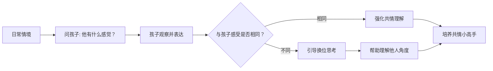
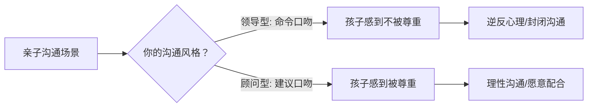

# 第35课：黄金法则（三）——常问感受、高质量陪伴、不数落、顾问式沟通

## 学习目标
- 掌握用提问培养孩子共情力的日常技巧
- 理解高质量陪伴的六大准则并应用于日常
- 认识在他人面前数落孩子对自尊的伤害
- 学会从"领导型"向"顾问型"亲子沟通转变

## 核心概念

### 黄金法则概览

| 法则 | 核心理念 | 关键动作 |
|------|----------|----------|
| **法则8**：常问感受 | 培养共情力需要反复练习换位思考 | 多问"你觉得他有什么感觉？" |
| **法则9**：高质量陪伴 | 陪伴重在情绪质量而非时长 | 六大准则：温暖、情感、言语反应、接纳、鼓励、爸爸参与 |
| **法则12**：不数落孩子 | 当众批评伤害自尊，易引发逆反 | 批评留在单独相处时做 |
| **法则14**：做顾问非领导 | 建议式沟通比命令式更有效 | "我建议你……"而非"你必须……" |

> [!TIP] 核心洞察
> 这四条法则的共同主题是**尊重**——尊重孩子的感受（法则8）、尊重陪伴的时间质量（法则9）、尊重孩子的面子（法则12）、尊重孩子的独立人格（法则14）。尊重是一切情商教育的基础。

## 深入讲解

### 法则8：常问孩子"你觉得他有什么感觉？"

培养共情力（同理心）是情商教育的核心目标之一。共情能力包括三个层次：

1. **体会情绪**：知道对方当下的感受（如"他难过了"）
2. **理解想法**：理解情绪背后的原因（如"他难过了，因为别的小朋友不跟他玩"）
3. **共情行为**：采取友善行动（如"跑过去安慰他"）

父母可以通过一个简单的问题来反复训练孩子的共情力——**"你觉得他有什么感觉？"**

**特别适用的场景**：当旁观者的感受与当事人的感受截然不同时。例如有人摔倒了，旁观者觉得好笑，而当事人其实很疼很难过。这时候问孩子"你觉得他有什么感觉？"，能帮助孩子认识到自己作为旁观者的感受与当事人的感受可能完全不同。

> [!WARNING] 常见误区
> 很多父母以为共情力是孩子天生就有的。事实上，共情力需要**刻意练习**——就像学语言需要反复对话一样。如果不常常提问引导，孩子很难自然学会换位思考。

### 法则9：高质量陪伴的6大准则

2016年发表在《Neuro Image》上的脑科学研究揭示了父母陪伴与孩子大脑神经发育的关系，总结出高质量陪伴的六大准则：

| 准则 | 具体做法 | 为什么重要 |
|------|----------|-----------|
| **1. 温暖** | 拥抱孩子或有亲密身体接触5分钟，保持柔和热情的态度 | 身体接触促进催产素分泌，建立安全感 |
| **2. 情感** | 陪伴时表达爱意，常说"妈妈/爸爸爱你" | 让孩子明确感受到被爱和被欣赏 |
| **3. 言语反应** | 至少欢乐交谈两次，并积极回应 | 语言互动促进大脑语言中枢发育 |
| **4. 接纳** | 不管孩子怎么做都不责骂，更不打孩子 | 无条件的接纳是安全型依恋的基础 |
| **5. 鼓励** | 鼓励孩子独立尝试任务，不批评代办 | 鼓励培养自主性，代办削弱自信心 |
| **6. 爸爸参与** | 爸爸花时间陪伴，发挥独特贡献 | 父亲参与对智力、自信、人际关系有独特影响 |

> [!WARNING] 陪伴的误区
> 很多父母以为"陪在身边"就是陪伴。但如果各自抱着iPad和手机，这样的"陪而不伴"对孩子的成长几乎没有帮助。高质量的陪伴是**情绪在场**，而不仅是**物理在场**。

### 法则12：请别在他人面前数落孩子

许多父母有一个无意识的习惯——见到人就"吐苦水"，当着孩子的面数落孩子的各种问题。这样做带来的后果非常严重：

1. **伤害自尊**：孩子感到尴尬、难过、没有自信
2. **产生逆反**：孩子心想"既然爸妈不喜欢我，那我就偏不配合"
3. **自暴自弃**：孩子觉得"全世界都知道我是个差劲的人了，我再怎么改也没用"

> [!TIP] 关键洞察
> 孩子偶尔出现错误，**不代表这个孩子就是一个糟糕的孩子**。优秀的情商教练会把批评留在两个人单独相处的时候做。当众批评只会让孩子记住"我很差"的标签，而不会记住"我应该怎么改"。

### 法则14：做孩子的顾问，而非领导

尤其对于青春期的孩子来说，命令式的沟通方式（"你必须……""你给我……"）会让孩子感到不被尊重，从而引起逆反心理。

| 类型 | 沟通方式 | 孩子感受 | 效果 |
|------|----------|----------|------|
| **领导型** | "你必须……""你给我……" | 命令服从，不被尊重 | 逆反、抗拒 |
| **顾问型** | "我建议你可以考虑……""我提醒你……" | 被尊重、被信任 | 愿意配合、理性沟通 |

**顾问式沟通示例**：
- "我建议你找个时间收拾一下房间。"
- "我提醒你一下，剪那个发型老师可能会有些意见。"
- "我的经验是……你可以参考看看。"

## 实用方法

### 共情力培养三问

在日常生活中的任何情境（读绘本、逛街、看动画片）都可以向孩子提问：

1. **"你觉得他有什么感觉？"** —— 帮助孩子识别他人情绪
2. **"他为什么会有这种感觉？"** —— 帮助孩子理解情绪原因
3. **"如果你是（当事人），你会怎么想？"** —— 帮助孩子进行深度换位思考

### 高质量陪伴自查清单

| 准则 | 自检问题 | 评分(1-5) |
|------|----------|-----------|
| 温暖 | 今天有没有拥抱或亲密接触孩子？ | |
| 情感 | 今天有没有对孩子说"我爱你"？ | |
| 言语反应 | 今天有没有和孩子欢乐交谈？ | |
| 接纳 | 今天有没有责骂孩子？ | |
| 鼓励 | 今天有没有鼓励孩子独立尝试？ | |
| 爸爸参与 | 爸爸今天有没有陪伴孩子？ | |

### 顾问式沟通话术转换

| 领导式表达 | 顾问式表达 |
|-----------|-----------|
| "你必须去写作业！" | "我建议你先完成作业再玩，这样会更轻松。" |
| "马上把房间收拾好！" | "如果你能找个时间收拾房间，住起来会更舒服。" |
| "不准剪那个发型！" | "我提醒你一下，那个发型老师可能会有意见哦。" |
| "你怎么又做错了！" | "我们一起看看怎么做会更好？" |

## 实践练习

> [!QUESTION] 思考题
> 你的孩子今年9岁，周末亲戚来家里做客。孩子在客人面前表现得不太礼貌，没有主动打招呼。客人走后，你会怎么做？

参考答案

**错误做法**（当众数落）：当着客人的面说"这孩子就是不懂礼貌，见人都不打招呼，真让我丢脸。"

**正确做法**（两个步骤）：

**步骤一：不当场批评。** 当客人在时，只做提醒而不批评："宝贝，来跟叔叔阿姨打个招呼好吗？"如果孩子仍然不愿意，不做强迫，避免当众给孩子难堪。

**步骤二：事后单独沟通。** 客人走后，单独和孩子坐下来说：
1. **说事件**："刚才叔叔阿姨来的时候，你没有跟他们打招呼。"
2. **问感受**（法则8——常问感受）："你当时是什么感觉？是紧张？还是不太愿意？"
3. **表达期望**："下次如果有客人来，我希望你能主动打招呼，哪怕只是说一声'你好'。"
4. **给出选择**（顾问式沟通——法则14）："你觉得怎么样做会让你感觉舒服一点？如果需要，我可以陪你一起说。"

## 总结

黄金法则（三）的四个法则围绕着一个共同的核心——**尊重**。尊重孩子的感受、尊重陪伴的质量、尊重孩子的面子、尊重孩子的选择权。当父母能够从"领导"转变为"顾问"，从"当众批评"转变为"私下沟通"，从"低质量陪伴"转变为"高质量互动"，从"只关注行为"转变为"培养共情力"，亲子关系就会发生质的改变。

## 延伸阅读
- 下一课：[[../lessons/0036-黄金法则建设性批评表扬特质夫妻关系倾听|第36课：黄金法则（四）——建设性批评、表扬特质、夫妻关系、真诚倾听]]
- 上一课：[[../lessons/0034-黄金法则（二）——情绪质量接纳情绪批评行为关注积极|第34课：黄金法则（二）——情绪质量、接纳情绪、批评行为、关注积极]]
- 相关课程：[[../lessons/0007-沟通的艺术|沟通的艺术]]