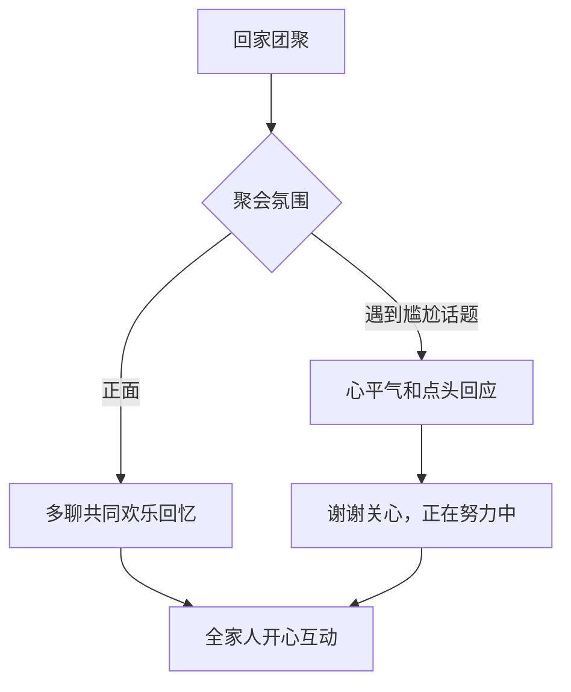

# 第36课：黄金法则（四）——建设性批评、表扬特质、夫妻关系、真诚倾听

## 学习目标
- 掌握SBI反馈模型，学会不伤害自尊的建设性批评
- 理解"表扬特质"优于"表扬结果"的心理学原理
- 认识夫妻在孩子面前吵架对孩子的负面影响
- 学会用"如果"替代"但是"的正面沟通技巧
- 掌握真诚倾听的五个层次，不做价值判断
- 了解母亲节、父亲节的节日情商教育方法

## 核心概念

### 黄金法则概览

| 法则 | 核心理念 | 关键行动 |
|------|----------|----------|
| **法则13**：避免在孩子面前吵架 | 夫妻冲突暴露对孩子发展有长期影响 | 背着孩子讨论分歧 |
| **法则15**：不说"但是"说"如果" | "但是"否定前面所有，"如果"正向引导 | "如果能……就好了" |
| **法则16**：真诚倾听，不做价值判断 | 倾听是最重要的沟通基础 | 复述确认，不加评判 |
| **法则17**：做建设性批评 | 批评行为而非人格，保护自尊 | 说事件→说感觉→说期望→说好处 |
| **法则18**：表扬特质 | 表扬内在人格特质而非结果 | "你是一个乐于助人的人" |

> [!TIP] 核心洞察
> 这五条法则本质上都是关于**如何用正确的方式爱孩子**。批评要保护自尊（法则17），表扬要塑造特质（法则18），冲突要保护孩子的心灵安全（法则13），沟通要用正向语言（法则15），倾听要创造安全氛围（法则16）。

## 深入讲解

### 法则13：夫妻避免在孩子面前吵架

研究表明，父母在孩子面前吵架对孩子有严重的负面影响：

| 年龄段 | 影响表现 | 科学依据 |
|--------|----------|----------|
| **学龄前（0-6岁）** | 压力荷尔蒙上升，影响大脑神经发展 | 对压力和焦虑更敏感 |
| **6岁+** | 不安全感，内疚羞愧，影响自信 | 孩子误以为"是我做错了" |
| **青春期** | 更易出现情绪性饮食问题（厌食、暴食） | 2014年研究追踪235名6岁儿童多年 |
| **成人后** | 影响对婚姻的态度和经营爱情的能力 | 认为家庭是不愉快的地方 |

> [!WARNING] 重要提醒
> 孩子会以父母面对冲突的方式为学习榜样。如果父母用争吵、吼叫来解决分歧，孩子也会学会这种方式。优秀的情商教练会意识到：**自己面对婚姻冲突的方式，就是孩子未来的情商教材。**

**正确的做法**：
- 如果讨论可能引发争执，请孩子先回房间，或两个人找别的地方私下讨论
- 学会"暂停技巧"——情绪激动时先暂停，约定稍后冷静时再谈

### 法则15：不说"但是"，说"如果"

"但是"这两个字会否定前面所有的正面表达。当孩子听到"但是"之后，大脑会自动过滤掉之前的话，只关注"但是"后面的内容。

**为什么"但是"有害**：
- 孩子经验："但是"之前的都是客套话
- "但是"之后的才是"真心话"
- 例如："你很聪明，但是你就是懒"——孩子只听到"你很懒"

**用"如果"来替代**：

| 情境 | 错误表达（用"但是"） | 正确表达（用"如果"） |
|------|---------------------|---------------------|
| 孩子想出去玩 | "我知道你想出去玩，**但是**这周你得在家学习" | "我知道你想出去玩，**如果**你能先复习好功课，我们就出去玩" |
| 孩子成绩进步但还未达标 | "你进步了，**但是**离第一名还差得远" | "你进步了，**如果**继续保持这个状态，会越来越好的" |
| 孩子想买玩具 | "我理解你很喜欢，**但是**太贵了不能买" | "我理解你很喜欢，**如果**你存够零花钱了，可以考虑买" |

```mermaid
flowchart LR
    A[想给孩子建议时] --> B{用"但是"还是"如果"}
    B -->|"但是"| C[孩子只听到后半段]
    C --> D[负面感受，拒绝配合]
    B -->|"如果"| E[连接前后意思]
    E --> F[正向引导，愿意考虑]
```

### 法则16：真诚倾听，不做价值判断

不带价值判断的倾听是亲子沟通最重要的基础。当孩子说"我不想上学了"，如果父母带着价值判断回应："你怎么可以这么懒（评判）""你身在福中不知福（指责）"——孩子会觉得爸妈不理解自己，沟通大门就此关闭。

**不带价值判断的倾听方法**：

1. **复述确认**："你的意思是说，你最近上学不太开心，不太感兴趣，是吗？"
2. **建立信任**：让孩子知道你听到了他说的，不评判，不着急给建议
3. **深入询问**：当孩子确认后，再问"能告诉我发生了什么事情吗？"

> [!TIP] 关键洞察
> 父母亲的接纳会营造一个安全的谈话氛围，让孩子愿意敞开心扉。先建立关系（倾听理解），再发挥影响力（引导解决）——**关系先于目的**。

### 法则17：建设性批评——四步SBI模型

传统的伤害性批评（如"你每天都这样，你就是懒"）伤害自尊、激起逆反。建设性批评的SBI反馈模型（Situation-Behavior-Impact变化版）包括四个步骤：

| 步骤 | 内容 | 示例 |
|------|------|------|
| **1. 说事件** | 明确指出具体哪件事 | "今天早上你起床晚了，出门没吃早饭" |
| **2. 说感觉** | 表达自己的情绪状态 | "你答应过要吃完早饭再走的，却没有做到，我有点失望" |
| **3. 说期望** | 说出希望孩子做到的行为 | "从明天开始，我希望你准时起床，吃完早饭再出门" |
| **4. 说好处** | 告诉孩子这样做对他有什么好处 | "吃了早饭出门，上课更有精神，也不用听我唠叨了" |


### 法则18：表扬特质，培养自信孩子

许多父母常用"你真棒""你真聪明"来表扬孩子，但这种模糊的表扬对自信帮助有限，甚至可能适得其反。

**表扬"聪明"的副作用**：被表扬聪明的孩子为了维持"聪明"形象，不愿意尝试复杂和困难的任务——因为万一做不好，就证明自己不聪明了。

**正确做法——表扬内在人格特质**：

| 情境 | 错误表扬 | 正确表扬（表扬特质） |
|------|----------|-------------------|
| 孩子帮助同学 | "你真棒！" | "你帮助了同学，你是一个**乐于助人**的孩子，爸妈真为你高兴！" |
| 孩子坚持练琴 | "你真聪明，一学就会" | "你每天都坚持练习，你是一个**很有毅力**的孩子！" |
| 孩子考试进步 | "你考了90分，太厉害了" | "你为了考试认真复习，你是一个**很努力**的孩子！" |
| 孩子主动收拾玩具 | "好孩子" | "你把玩具都收拾好了，你是一个**有责任心**的孩子！" |

> [!TIP] 表扬特质的心理学依据
> 表扬内在特质（如"乐于助人""有毅力""努力""有责任心"）能帮助孩子建立**稳定的自我认知**。孩子会把这些特质内化为自我概念的一部分，从而产生持续的内在动力。

### 节日主题：母亲节/父亲节的情商教育与节日沟通EQ

**父亲节情商教育核心——爸爸对孩子的独特贡献**：

父亲参与育儿对孩子有以下不可替代的影响：

| 方面 | 具体影响 |
|------|----------|
| **智力发展** | 父亲参与越多，孩子智力发展和学业成绩越好 |
| **人际关系** | 父亲带孩子冒险、运动、社交，孩子人际交往能力更强 |
| **自信心** | 父亲鼓励独立探索，孩子更自信 |
| **青春期** | 与父亲关系好的孩子，青春期问题行为更少 |
| **父亲自身** | 参与育儿的父亲幸福感更高、婚姻满意度更高、职场影响力更大 |

**高效陪伴的关键策略**：做一个"聪明爸爸"（Smart Dad）——在孩子成长的关键时间点（如入园、幼小衔接）提供关键支持，而不是事事都做。

**节日沟通EQ秘笈**（快乐签——张怡筠教你过节沟通）：

| 场景 | 情商技巧 | 具体做法 |
|------|----------|----------|
| 回家团聚 | 兴高采烈开口，心平气和点头 | 打招呼要开心，面对尴尬话题微笑点头 |
| 尬聊话题 | 不聊未来，聊过去 | 家人价值观不同时，聊共同欢乐回忆 |
| 七大姑八大姨提问 | 友善回应不纠缠 | "谢谢关心，正在努力当中" |
| 想倾诉心事 | 一对一沟通 | 私下找懂你的家人聊，不在大家庭中抛话题 |

**母亲节情商教育**（摘自母亲节直播）：

情商培养的核心信念：
- **情商是可以培养的**——大脑神经在6岁前快速发展，环境塑造大脑
- **情商是终身可提升的**——大脑神经系统终身可塑
- **父母是孩子最重要的情商教练**——培养新三好宝宝：情商好、习惯好、身体好
- **祝福孩子快乐不如帮助孩子有能力快乐**——快乐是一种能力，需要从小培养

## 实用方法

### 建设性批评SBI四步练习卡

| 步骤 | 句式模板 | 您的表达 |
|------|----------|----------|
| 说事件 | "今天（具体时间/情境），你（具体行为）" | |
| 说感觉 | "你这样做，（具体后果），爸爸妈妈（你的感受）" | |
| 说期望 | "我希望从明天开始，你能（具体目标行为）" | |
| 说好处 | "如果你做到了，（对他/对关系的好处）" | |

### 表扬特质语言库

| 情境 | 可表扬的特质词汇 |
|------|------------------|
| 学习努力 | 有毅力、专注、认真、勤奋、有进取心 |
| 帮助他人 | 乐于助人、有爱心、体贴、善良、慷慨 |
| 面对困难 | 勇敢、坚强、有韧性、不放弃、乐观 |
| 承担责任 | 有责任心、可靠、有担当、值得信任 |
| 自我管理 | 自律、有条理、有计划、独立、成熟 |

### 夫妻冲突管理三步法

1. **察觉预警**：当发现情绪开始升温时，给自己一个暂停信号
2. **叫停约定**：和孩子说"宝贝，爸爸/妈妈需要和妈妈/爸爸谈点事情，你先回房间好吗？"
3. **私下解决**：换到卧室或书房等不被打扰的地方继续沟通

### 节日家庭高情商沟通指南



## 实践练习

> [!QUESTION] 思考题1
> 你的孩子考试成绩不理想（65分，上次70分），你怎么批评才不会伤害他的自尊？

<details>
<summary>参考答案</summary>

**建设性批评四步法**：

1. **说事件**："这次数学考试你考了65分，比上次退步了一些。"
2. **说感觉**："爸爸妈妈有点担心，因为之前我们一起定过复习计划，好像没有完全按计划执行。"
3. **说期望**："我希望接下来我们能一起看看错在哪里，下次考试前做好充分准备。"
4. **说好处**："如果你找到适合自己的学习方法，以后学习就会越来越轻松，成绩也会越来越好。"
</details>

> [!QUESTION] 思考题2
> 孩子从学校回家，兴高采烈地说："妈妈，我今天帮同桌捡起了掉在地上的书！"你会怎么表扬？

<details>
<summary>参考答案</summary>

**表扬特质**："哇，你帮助了同桌捡书，你是一个**特别热心、乐于助人**的孩子！妈妈真为你感到骄傲！"（不只说"你真棒"，而是说清楚是哪个特质好，孩子因此知道自己的何种品质值得肯定。）
</details>

## 总结

黄金法则（四）涵盖了亲子沟通的核心技能：**建设性批评保护自尊**（法则17）、**表扬特质培养自信**（法则18）、**避免吵架保护心灵安全**（法则13）、**用"如果"替代"但是"实现正向沟通**（法则15）、**不带价值判断的真诚倾听建立信任**（法则16）。加上节日情商教育的视角，我们看到情商教育不仅发生在日常的点滴中，也贯穿在孩子成长的关键时刻和家庭仪式中。

## 延伸阅读
- 第一季课程总结：[[../lessons/0020-青春期孩子学习压力应对|第20课：青春期孩子学习压力应对——第一季总结]]
- 上一课：[[../lessons/0035-黄金法则常问感受高质量陪伴不数落顾问式沟通|第35课：黄金法则（三）——常问感受、高质量陪伴、不数落、顾问式沟通]]
- 相关课程：[[../lessons/0001-情绪管理训练五步骤|情绪管理训练五步骤]]、[[../lessons/0014-乐观教养ABC法则|乐观教养ABC法则]]