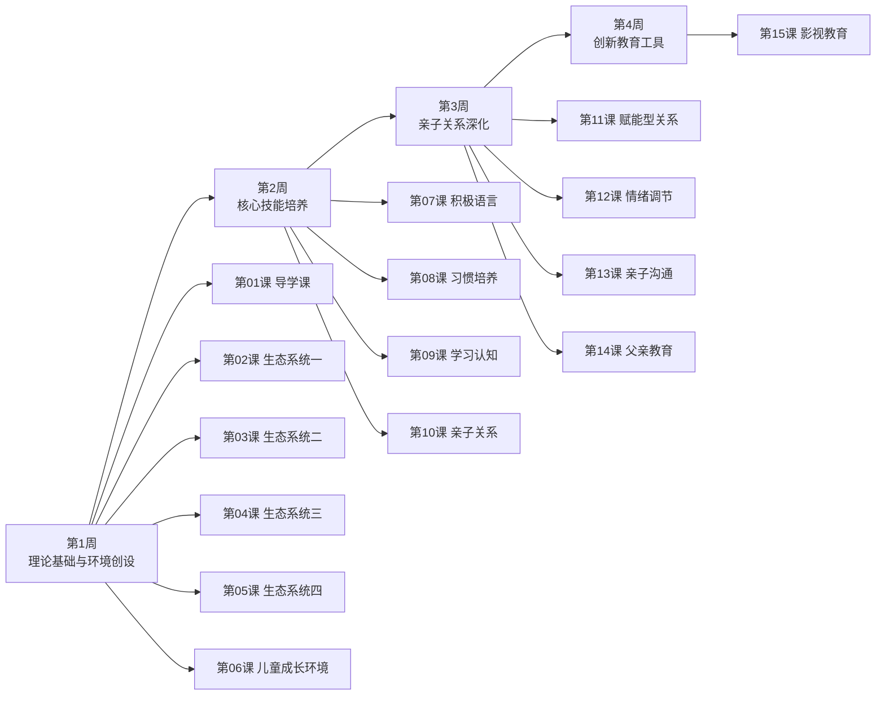

# 课程地图

### 第1周：理论基础与环境创设

| # | 课程 | 核心内容 |
|:-:|------|----------|
| [第01课](lessons/0001-dao-xue-ke.md) | 导学课——站在家庭教育新时代的端口 | 两颗种子理论、权威民主型教养、家庭教育指导师定位 |
| [第02课](lessons/0002-sheng-tai-xi-tong-yi.md) | 儿童发展的生态系统（一） | 布朗芬布伦纳理论、勒温场论、心理场 |
| [第03课](lessons/0003-sheng-tai-xi-tong-er.md) | 儿童发展的生态系统（二） | 微观系统三要素、三种配对关系、陈诚案例 |
| [第04课](lessons/0004-sheng-tai-xi-tong-san.md) | 儿童发展的生态系统（三） | 中间系统、外部系统、宏观系统 |
| [第05课](lessons/0005-sheng-tai-xi-tong-si.md) | 儿童发展的生态系统（四） | 生态发展观四大原则、PPCT模型、营造健康生态的五方法 |
| [第06课](lessons/0006-huan-jing-chuang-she.md) | 构建适宜儿童成长的环境 | 影响发展的四因素、家庭心理环境"三有"、父母"三高" |

### 第2周：核心技能培养

| # | 课程 | 核心内容 |
|:-:|------|----------|
| [第07课](lessons/0007-ji-ji-yu-yan.md) | 用积极的语言促进孩子发展 | 3000万词汇差距、认知升级词汇、积极消极比例3:1 |
| [第08课](lessons/0008-xi-guan-pei-yang.md) | 儿童习惯培养指导及应用 | 秩序敏感期、自我服务能力分月龄、卫生六习惯 |
| [第09课](lessons/0009-xue-xi-ren-zhi.md) | 促进孩子的学习与认知能力 | 优生优育、早期智力刺激、执行功能、睡眠影响 |
| [第10课](lessons/0010-qin-zi-guan-xi.md) | 积极亲子关系，减少人际问题 | 青春期叛逆脑科学、七种社会技能、四种回应方式 |

### 第3周：亲子关系深化

| # | 课程 | 核心内容 |
|:-:|------|---------|
| [第11课](lessons/0011-fu-neng-guan-xi.md) | 赋能型亲子关系的建设与发展 | 赋能概念、四要素三内容、有效沟通四工具 |
| [第12课](lessons/0012-qing-xu-tiao-jie.md) | 情绪调节与亲子沟通 | 七大情绪系统、三脑模型、情绪"疏不堵"、关系重建五步 |
| [第13课](lessons/0013-gou-tong-ying-xiang.md) | 亲子沟通对孩子的影响 | 沟通影响三方面、三原则五技巧、分龄沟通要点 |
| [第14课](lessons/0014-fu-qin-jiao-yu.md) | 父亲的教育为什么特别重要 | 亲密性vs独立、父教缺失四指标、母亲的关键作用 |

### 第4周：创新教育工具

| # | 课程 | 核心内容 |
|:-:|------|----------|
| [第15课](lessons/0015-dian-ying-jiao-yu.md) | 用优质影视做素材对孩子进行素质教育 | 电影素质教育四方法、阿甘正传五遍法、生命教育三要素 |

## 参考资源

- [术语表](reference/glossary.md)
- [核心框架速查](reference/frameworks-cheatsheet.md)
- [推荐绘本清单](reference/picture-books.md)
