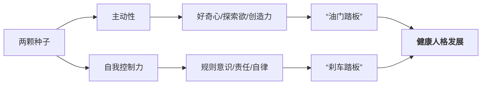
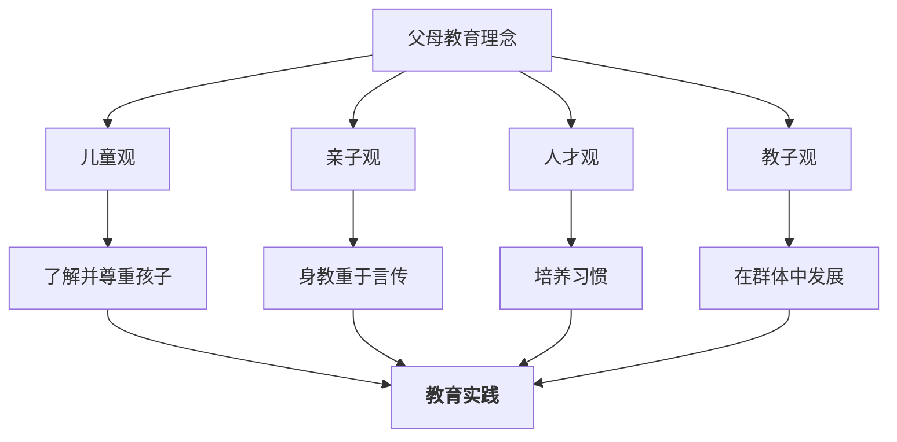

# 第01课：导学课——站在家庭教育新时代的端口

## 课程引入：一本绘本的启示

本课程从一个简单却深刻的问题出发——**“什么是最有利于孩子成长的家庭教育模式？”**

课程主讲人以绘本《爸爸和我》作为开篇。故事中，一只小熊觉得无聊，请求爸爸"陪陪我"。爸爸放下报纸，牵起熊的手走进夜色。他们没有特定的目的地，只是在月光下散步、看星星、踩影子——恰恰是这种"什么也没做"的陪伴，让熊宝宝感受到最深的满足和安全感。

> [!TIP] 绘本的家庭教育隐喻
> “陪孩子做什么”远不如“陪伴本身”重要。亲子关系的质量不取决于活动的复杂度或教育目的性，而取决于成人在那一刻是否真正在场。

由此引出课程的核心追问：我们到底要培养什么样的孩子？什么样的家庭环境才能真正支持孩子的健康成长？

---

## “两颗种子”理论：主动性 × 自我控制力

北京师范大学陈慧昌教授团队历经20年跟踪研究，提出了极具影响力的**“两颗种子”理论**。

| “种子” | 内涵 | 比喻 | 发展关键 |
|---------|------|------|----------|
| 主动性 | 做自己高兴的事、自我驱动的内在动机 | 油门踏板 | 培养好奇心和探索欲 |
| 自我控制力 | 接受并完成他人或社会要求的能力 | 刹车踏板 | 培养规则意识和延迟满足 |

> [!WARNING] 失衡的危险
> 只强调主动性而缺乏自控力，孩子的行为会失去边界，如同有油门无刹车的车辆。反过来，只强调服从与自控而压制主动性，孩子会失去内驱力与创造力。**两颗种子必须同时培育。**

---

## 权威民主型教养方式

研究发现，教养方式可以划分为四种类型。**权威民主型**被证明是最有利于儿童发展的模式。

| 教养类型 | 要求性 | 回应性 | 儿童发展结果 |
|----------|--------|--------|-------------|
| 权威民主型 | 高 | 高 | 社会责任感强、成就倾向高 |
| 专制型 | 高 | 低 | 顺从但缺乏自信、容易焦虑 |
| 溺爱型 | 低 | 高 | 自我中心、缺乏自律 |
| 忽视型 | 低 | 低 | 发展迟滞、行为问题多 |

**权威民主型的核心：** 高要求（clear expectations）与高回应（warm responsiveness）并存。父母对孩子有明确的规则和期待，同时充分尊重孩子的观点和需求。

> [!EXAMPLE] 权威民主型的日常对话
> - 专制型：“我说了算，你按我说的做。”
> - 溺爱型：“你想怎样都行。”
> - 权威民主型：“我们家有一条规则是九点前完成作业。你觉得今晚怎么安排能做到？需要我帮你什么？”

---

## 家庭教育指导师的职业定位

### 工作三原则

1. **儿童为本**——所有指导的出发点和落脚点都是儿童的发展利益。
2. **父母主体**——父母是孩子教育的第一责任人，指导师不替代、不越位。
3. **多项互动**——在儿童、父母、环境之间建立积极的互动链条。

### 核心理念转变：从"父母权利"到"教育能力"

传统观念中，家庭教育的焦点往往是"父母说了算"的权利之争。现代家庭教育指导则强调：**指导师不是替家长“灭火”给方法，而是帮助家长提升自身的教育能力。**

> [!QUESTION] 反思时刻
> 你作为指导师，家长来找你时最常说的是“我管不了他了，你给我想想办法”还是“我想了解一下我这个阶段可以做什么”？——前者是"灭火"心态，后者是"能力成长"心态。

---

## 父母教育理念的四方面

指导师需要帮助父母审视并更新自己的教育理念：

1. **儿童观**——你怎么看待孩子？是"一张白纸"、"一棵树苗"，还是"一个独立的人"？
2. **亲子观**——你怎么看待亲子关系？是控制与被控制，还是共同成长？
3. **人才观**——你认为什么是人才？高分就是人才，还是全面发展的个体？
4. **教子观**——你认为教育孩子最有效的方式是什么？是讲道理、惩罚，还是榜样示范？

---

## 教育方法四入手

在理念更新的基础上，指导师可以从四个维度帮助家长入手：

1. **了解并尊重孩子**——每个孩子有其独特的气质、兴趣和发展节奏。
2. **培养习惯**——良好的生活习惯和学习习惯是人格的根基。
3. **身教重于言传**——孩子更多模仿父母的行为而非听从指令。
4. **在群体中发展**——同伴关系和集体活动是儿童社会化的重要途径。

---

## “依法带娃”时代

2022年1月1日，《中华人民共和国家庭教育促进法》正式实施。这标志着中国家庭教育进入了**“依法带娃”**的新阶段。

法律明确指出：
- 家庭教育以**立德树人**为根本任务
- 父母是**第一任老师**，承担主体责任
- 国家和社会提供指导、支持和服务

这意味着家庭教育指导师不仅是“讲师”或“咨询师”，更是连接法律要求与家庭实践的重要桥梁。

> [!TIP] 指导师的法律意识
> 了解《家庭教育促进法》的核心条款，是指导师专业素养的重要组成部分。建议阅读全文并关注[当地家庭教育指导服务中心](家庭教育服务资源.md)的相关政策。

## 推荐绘本清单

本课程中，绘本不仅是教学素材，更是家庭教育理念的载体。以下绘本与课程主题相关，推荐阅读：

- 《爸爸和我》——陪伴的本质
- 《陪爸爸上班》——亲子角色的观察
- 《和爸爸一起散步》——亲子时光的节奏感
- 《你把水桶加满了吗》——积极心理暗示

---

## 学习任务

### 应用练习

选择一个身边的家庭案例（可以是自己家庭的片段），分析其中的"两颗种子"表现——孩子的主动性体现在哪里？自控力体现在哪里？成人使用的是哪种教养方式？

### 自我检测

> [!QUESTION] 自查问题
> 1. “两颗种子”理论中，主动性和自我控制力分别比喻为什么？
> 2. 权威民主型教养方式的特点是什么？
> 3. 家庭教育指导师的三项工作原则是什么？
> 4. 父母教育理念包括哪四个方面？

### 下一课预告

下一课将进入[[0002-sheng-tai-xi-tong-yi|第02课：儿童发展的生态系统（一）]]，学习布朗芬布伦纳的生态系统理论——理解儿童发展所处的多层次环境系统。

---

*本课完*