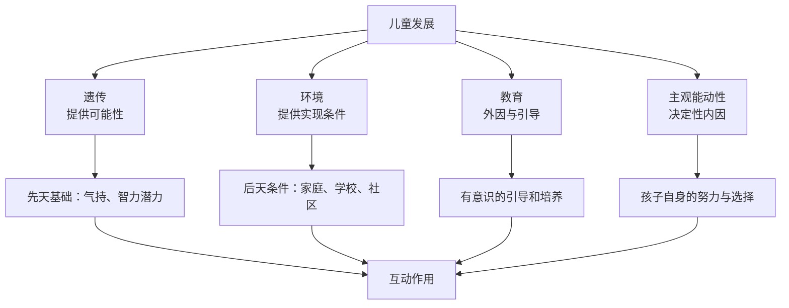

# 第06课：构建适宜儿童成长的环境

## 从“看懂系统”到“建设环境”

前五课我们完成了生态系统理论的全景学习——从布朗芬布伦纳的四层次模型，到微观系统的三要素，再到中间、外部、宏观系统，最后以PPCT模型收束。现在，我们从理论走向应用：**如何在实际中构建一个适宜儿童成长的家庭环境？**

本课将围绕“发展的四因素”展开，然后引入家庭环境分析的实用框架，最后聚焦于**家庭阅读环境**——这一最易实施、成本最低、效果最好的家庭教育切入点。

---

## 影响儿童发展的四因素

儿童的发展是多种力量共同作用的结果。教育心理学中有一个经典的归因框架，将影响因素分为四类：



| 因素 | 角色 | 通俗理解 | 父母可控程度 |
|------|------|----------|-------------|
| 遗传（Heredity） | 提供可能性 | “上天发的牌” | 不可控 |
| 环境（Environment） | 提供实现条件 | “牌怎么打”的背景 | 高度可控 |
| 教育（Education） | 外因与引导 | “怎么教他出牌” | 高度可控 |
| 主观能动性（Subjective Initiative） | 决定性内因 | “他想不想打好” | 间接影响 |

> [!WARNING] 不要陷入“遗传决定论”
> 有些家长听到“遗传”两个字就会说：“我们家孩子就是遗传了他爸的暴脾气，改不了的。”但遗传只是提供了**可能性**，而不是**必然性**。环境与教育是否到位，决定了这种可能性是否被实现、以什么方向被实现。

### 年龄越小，环境影响越深刻

**早期经验对大脑发展的影响具有不可逆性。** 0-6岁是神经系统发育的敏感期，家庭环境中的语言输入、情感互动、感官刺激等，直接影响大脑神经回路的建构。

| 年龄阶段 | 环境敏感领域 | 发展关键 |
|----------|-------------|----------|
| 0-3岁 | 安全感、依恋关系 | 稳定的照料者、积极的情感回应 |
| 3-6岁 | 语言发展、社会性 | 丰富的语言环境、同伴交往机会 |
| 6-12岁 | 习惯养成、认知能力 | 学习环境、阅读氛围 |
| 12-18岁 | 价值观、自我认同 | 开放的讨论空间、尊重的家庭文化 |

---

## 家庭环境分析四象限

为了更好地指导家庭进行环境建设，我们可以使用一个实用工具——**家庭环境四象限分析模型**：

```mermaid
graph TD
    subgraph “家庭环境四象限”
        A[硬环境<br>物理空间·物质条件] --> A1[内部<br>家居布置·学习空间]
        A --> A2[外部<br>社区·学校·设施]
        B[软环境<br>心理氛围·关系质量] --> B1[内部<br>家庭气氛·亲子关系]
        B --> B2[外部<br>社会支持·文化环境]
    end
    A1 --> C[孩子的书桌、阅读角]
    A2 --> D[社区图书馆、公园]
    B1 --> E[家庭情绪温度、沟通方式]
    B2 --> F[邻里关系、社区文化]
```

| 象限 | 定义 | 具体内容 | 评估问题 |
|------|------|----------|----------|
| 内部硬环境 | 家庭物理空间 | 房间布置、书桌、藏书、玩具 | 孩子有独立的学习空间吗？有阅读角吗？|
| 外部硬环境 | 社区物理资源 | 学校质量、公园、图书馆、培训机构 | 社区活动空间充足吗？通勤压力大吗？|
| 内部软环境 | 家庭心理氛围 | 关系质量、情绪表达、沟通模式 | 家庭氛围是紧张还是轻松？孩子敢表达吗？|
| 外部软环境 | 社会文化支持 | 育儿观念、社区互助、政策环境 | 周围人的育儿观念如何？有支持网络吗？|

> [!TIP] 指导师的四象限诊断方法
> 当家长来咨询时，快速用四象限定位问题：
> - 如果孩子没有写作业的地方 → 内部硬环境问题
> - 如果写作业时家里气氛紧张 → 内部软环境问题
> - 如果社区没有活动空间 → 外部硬环境问题
> - 如果周围人都在“鸡娃” → 外部软环境压力
> 
> **不同象限的问题需要不同的解决方法。**

---

## 家庭心理环境“三有”

在所有环境因素中，**心理环境**是最核心、最本质的。它比物质条件更深刻地影响儿童的人格发展。

### 三有标准

#### 1. 有利于健全人格

家庭心理环境应当帮助儿童建立**安全感和自我价值感**。表现为：
- 孩子在家里可以放松地做自己
- 犯错时被接纳而非被否定
- 有自己的隐私和界限被尊重

#### 2. 有利于探索求知

家庭应当是一个**允许提问、鼓励试错**的地方。表现为：
- 孩子的“十万个为什么”得到认真对待
- 失败不被嘲笑而是被当作学习机会
- 有丰富的材料和资源供孩子探索

#### 3. 有利于社会性发展

家庭应当帮助孩子**学习与人相处的基本能力**。表现为：
- 有家庭成员间的合作和协商
- 孩子有承担家庭责任的机会
- 家庭鼓励孩子与同伴交往

---

## 父母“三高”

如果说“三有”是对**环境**的要求，那么“三高”就是父母需要具备的**行为特质**。

### 1. 高接纳性

父母对孩子作为**独立个体**的接纳——接纳孩子的性格、兴趣、情绪和节奏，而不是“只有你符合我期待时才接纳你”。

> [!EXAMPLE] 高接纳 vs 有条件接纳
> **有条件接纳**：“你考了95分，妈妈真高兴！”（暗示：考不好就不高兴）
> **高接纳**：“这次你努力了，虽然结果不如预期，但我看到你的进步。我们一起来看看下一步怎么调整。”

### 2. 高反馈性

父母对孩子的信号——无论是语言的还是非语言的——能够**敏感、及时地回应**。

高反馈性不等于“有求必应”。它指的是：
- 孩子有情绪时，父母能识别并回应
- 孩子有需要时，父母能提供适当支持
- 孩子发出互动信号时，父母能放下手头的事给予关注

### 3. 高预测性

家庭环境中的规则、期望和反应是**稳定、可预期的**。孩子知道“如果我这样做，会发生什么”，从而建立**心理安全感和对世界的信任感**。

高预测性的家庭，孩子不需要猜测父母今天心情好不好来决定行为。规则对所有人一致、前后一致。

| “三高”维度 | 低的表现 | 高的表现 |
|------------|---------|---------|
| 接纳性 | 批评多、挑剔多、标准苛刻 | 允许差异、接纳情绪、尊重节奏 |
| 反馈性 | 忽视、敷衍、延迟回应 | 敏感捕捉、及时回应、质量互动 |
| 预测性 | 规则随意、情绪化执行、前后不一 | 明确规则、稳定执行、可预期 |

---

## 实操抓手：家庭阅读环境建设

在所有家庭教育环境建设的方法中，**阅读环境**是成本最低、操作最简单、效果最综合的切入点。一次亲子阅读同时覆盖了：

| 环境维度 | 阅读的作用 |
|----------|-----------|
| 内部硬环境 | 家庭藏书、阅读角建设 |
| 内部软环境 | 亲子共读时的情感连接（基本双人关系） |
| 活动要素 | 具有连续性和动量的高质量活动 |
| 中间系统 | 绘本内容连接家庭与更广阔的世界 |

### 家庭阅读环境建设三步法

#### 第一步：物理空间——打造阅读角

不需要很大的空间。一个角落、一个书架、一盏台灯、一块地垫即可。关键原则：
- **孩子伸手可及**——书在孩子可以自己拿到的高度
- **舒适安静**——没有电视和电子设备的干扰
- **定期更换**——每月更新一部分图书，保持新鲜感

#### 第二步：时间节奏——建立阅读常规

阅读的“连续性”比“单次时长”更重要。每天固定15分钟，比周末读两小时效果更好。

#### 第三步：互动质量——从“读”到“对话”

高互动质量的亲子阅读应该包括：
- 预测：“你觉得接下来会发生什么？”
- 联想：“这让你想起什么？”
- 提问：“为什么这个角色这么做？”
- 情感连接：“你也有过这样的感觉吗？”

> [!TIP] 亲子阅读不是“教阅读”
> 不要把亲子阅读变成“识字课”或“思想教育课”。亲子阅读首先**是关系，然后才是教育。** 当一个孩子把阅读和妈妈温暖的声音、爸爸有趣的语调、共享的秘密时刻联系在一起时，阅读本身的惯性就建立了。

### 推荐绘本：《和爸爸一起读书》

这本绘本描绘了一个女孩从幼年到成年与父亲一起读书的温馨历程。它不仅是一个故事，更是一个**家庭阅读传统的范本**——它展示了一个阅读习惯如何在时间的积累中成为连接亲子两代人的精神纽带。

---

## 本课小结

- 发展的四因素：遗传提供可能性，环境提供条件，教育提供引导，主观能动性起决定作用。
- 年龄越小，环境影响越深刻。
- 家庭环境四象限诊断工具：内部/外部 × 硬环境/软环境，帮助快速定位问题领域。
- 家庭心理环境“三有”：有利于健全人格、探索求知、社会性发展。
- 父母“三高”：高接纳性、高反馈性、高预测性。
- 家庭阅读环境建设是最易操作的切入点，同时覆盖多个环境维度。

---

## 学习任务

### 应用练习

使用四象限模型评估你（或你支持的某个家庭）的家庭环境：

| 象限 | 优势 | 可改进之处 | 第一步行动计划 |
|------|------|-------------|---------------|
| 内部硬环境 |
| 外部硬环境 |
| 内部软环境 |
| 外部软环境 |

同时评估父母“三高”水平：你在哪个维度做得比较好？哪个维度最需要提升？

### 自我检测

> [!QUESTION] 自查问题
> 1. 影响儿童发展的四因素分别是什么？每个因素扮演什么角色？
> 2. 家庭环境四象限是哪四个象限？举出每个象限的一个例子。
> 3. 家庭心理环境的“三有”是哪三个有利于？
> 4. 父母“三高”是哪三高？请用一句话描述每一个。
> 5. 为什么说家庭阅读环境建设是最易实施的切入点？

---

## 下一课

学完本课，我们完成了生态系统理论的第一个完整板块——**从理论到实践，从宏观到微观，从环境要素到具体建设方法**。

接下来的课程将进入家庭教育核心能力的专题学习。下一课：[[0007-ji-ji-yu-yan|第07课：积极语言的力量]]——语言如何塑造孩子的自我认知和行为模式。

---

*本课完*