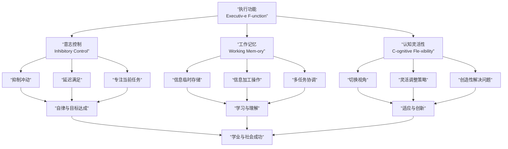

# 第09课：促进孩子的学习与认知能力

> 讲师：安妮 | 第2周

## Learning Objectives

- 理解遗传与环境对智力发展的作用（50/50模型）
- 识别常见学习障碍（阅读障碍、ADHD）的核心特征
- 掌握执行功能的三种成分及其训练方法
- 认识到睡眠对学习能力的决定性影响

## 一、优生优育：遗传与环境各占一半

### 智力的50/50法则

人类智力差异中，**大约50%受遗传影响，50%取决于环境**。安妮老师强调：“这意味着‘天注定’和‘后天没用’都不对——遗传决定了下限，环境决定了你能离下限有多远。”

### 孕期关键预防

| 风险因素 | 影响机制 | 预防措施 |
|---------|---------|---------|
| **甲状腺病** | 母体甲状腺素不足直接影响胎儿大脑皮层发育 | 孕期检查甲状腺功能；TSH异常及时干预 |
| **弓形虫感染** | 可通过胎盘感染胎儿，导致脑积水、脑钙化 | 不吃生肉、处理生肉戴手套、猫砂由他人清理 |
| **苯丙酮尿症（PKU)** | 母体PKU控制不良→胎儿智力不可逆损伤 | PKU女性计划怀孕前严格控制饮食 |

### 父亲因素常被忽视

客厅里常被忽略的一个事实：父亲对胎儿智力发育的影响**同样重要**。

| 父亲因素 | 影响 | 机制 |
|---------|------|------|
| **烟酒** | 精子DNA损伤→影响后代认知功能 | 酒精和尼古丁改变精子表观遗传标记 |
| **年龄（40+）** | 后代患自闭症、精神分裂症风险显著增加 | 精子突变率随年龄指数增长 |
| **环境污染物暴露** | 重金属、农药等影响精子质量 | 职业暴露（油漆工、化工厂等）尤其需要防护 |

## 二、早期智力刺激：大脑发育的“机会窗口”

### 两个令人警醒的实证

**罗马尼亚孤儿院案例：**
1989年罗马尼亚政权垮台后，国际社会发现大量孤儿院中的孩子被长期安置在床上，几乎没有人类互动。这些孩子虽然在出生后获得了基本生存照料，但普遍出现了严重的认知发育迟滞——有些6岁的孩子无法走路或说话。**缺乏人际互动直接导致大脑发育停滞。**

**猫的视觉实验（Hubel & Wiesel）：**
将新生小猫的一只眼睛缝合，数月后拆线，那只眼睛永久性失明了——不是因为眼睛坏了，而是因为大脑中处理那只眼睛信号的视觉皮层区域被其他功能“抢占”了。两位科学家因此获得诺贝尔奖。

> [!WARNING] 电子产品不能替代人脸
> 安妮老师一针见血：“把平板电脑塞给孩子，屏幕上闪烁的动画看似‘吸引注意’，但孩子大脑真正需要的是**面对面的、有回应的人类互动**。屏幕不会根据孩子的表情调整自己的节奏，而妈妈会——当孩子‘哦’一声，妈妈就会笑；当孩子指一个东西，妈妈就会说那个东西的名字。这种**来回互动**才是刺激大脑发育的关键。”

### 有效的早期刺激

| 有效做法 | 无效/有害做法 |
|---------|-------------|
| 面对面说话、眼神交流 | 长时间看动画片/短视频 |
| 唱儿歌、做手指游戏 | 早教机/闪卡替代真人互动 |
| 回应性的“咿呀对话” | 单方面灌输知识 |
| 安全环境中的自由探索 | 过度保护限制活动 |

## 三、学习障碍的识别

### 阅读障碍（Dysl-exia）：占比最高

阅读障碍占所有学习障碍的**约80%**。它的本质不是“不努力”或“笨”，而是大脑处理文字符号的方式不同。

**早期信号（学龄前-小学低年级）：**

- 学字母/数字时特别困难
- 很难区分发音相似的音（b/p、d/t）
- 阅读时跳行、跳字
- 朗读速度明显慢于同龄人
- 能口头回答的问题，写下来就答不出来

### ADHD（注意力缺陷多动障碍）

**三大核心症状：**

1. **注意力不集中**——很难持续做一件事，容易分心
2. **冲动控制差**——不等别人说完就插嘴，不思考后果
3. **活动量过高**——坐不住，小动作不断

> [!TIP] 区分“调皮”和ADHD
> - 调皮的孩子在感兴趣的事情上能专注很久；ADHD的孩子对所有事情都难以专注
> - 调皮的孩子在大人严肃时能控制自己；ADHD的孩子控制困难是生理层面的
> - 确诊需要专业医生评估，不能凭主观判断贴标签

### 最重要的一句话

> **听课碍≠智力低下**

安妮老师强调：“很多有学习障碍的孩子智商完全正常甚至超常，只是大脑用了一种不同的方式处理信息。爱因斯坦、达芬奇、汤姆·克鲁斯都有阅读障碍。关键不是‘矫正’他们，而是找到适合他们的学习通道。”

## 四、执行功能三成分

执行功能（E-xecutive Functi-on）是大脑的“CEO”——负责目标设定、计划执行和自我监控的能力。它由三个核心成分组成：



### 执行功能的日常训练

| 执行功能成分 | 家庭训练方法 | 适合年龄 |
|------------|-------------|---------|
| **意志控制** | 玩“红灯绿灯”游戏、按指令做动作的反向游戏（说“举右手”举左手）| 3-7岁 |
| **工作记忆** | 记忆翻牌游戏、复述指令“宝宝帮妈妈做三件事：拿杯子、关灯、关门” | 3-8岁 |
| **认知灵活性** | 用替代方案解决问题：“如果没有勺子，你还能用什么喝汤？” | 4-10岁 |

## 五、睡眠对学习的关键影响

这是课程中最让人“意外”但也是最关键的内容之一。

### 震撼数据

| 数据 | 含义 |
|------|------|
| **少睡1小时=失去2年认知成熟** | 一项大规模研究发现，睡眠不足对孩子认知的影响，相当于大脑成熟度倒退了两年 |
| **连续3天缺觉，智商降7分** | 短期睡眠剥夺对认知功能的损害即可量化 |
| **A等生比B等生每天多睡15分钟** | 这15分钟是累积差异——不是天赋，不是补习班 |

> [!WARNING] 中国家庭的睡眠误区
> “孩子多睡一小时，就少学一小时”——这个观念恰好是**反科学的**。睡眠不是学习的“暂停”，而是记忆巩固的“开工时间”。白天学的内容，是在深度睡眠中被整理、筛选、存进长期记忆的。**不让孩子睡够，等于白天往大脑里装东西、晚上却不让大脑收拾整理——装了也白装。**

### 各年龄段推荐睡眠时长

| 年龄 | 推荐睡眠时间（含午睡）|
|------|--------------------|
| 0-3个月 | 14-17小时 |
| 4-11个月 | 12-15小时 |
| 1-2岁 | 11-14小时 |
| 3-5岁 | 10-13小时 |
| 6-13岁 | 9-11小时 |
| 14-17岁 | 8-10小时 |

## 六、行为辅导的四大方法

对于在学习和行为上需要额外支持的孩子，安妮老师介绍了四种行为辅导方法：

| 方法 | 含义 | 家庭应用举例 |
|------|------|-------------|
| **环境控制** | 改变环境减少干扰和诱惑 | 写作业时收掉手机、关上电视、桌面只留书本 |
| **详细指导** | 把任务拆细，给清晰的步骤指令 | “先把数学作业的5道题的题目读一遍”而不是“去做作业”|
| **任务分担** | 将大目标分解为可完成的小步骤 | “先写3行字，休息一下，再写3行” |
| **结构化环境** | 建立固定的流程和程序 | 每天放学后固定：换衣→洗手→吃点心→开始作业|

> [!EXAMPLE] 结构化环境案例
> 一个ADHD倾向的一年级孩子，妈妈每天放学后固定流程：
> ```
> 16:00 到家→换家居服→洗手
> 16:10 吃点心+聊天（10分钟亲子时间）
> 16:20 开始语文作业（15分钟）
> 16:35 休息5分钟（定时器响）
> 16:40 数学作业（15分钟）
> 16:55 自由活动
> ```
> 两周后，孩子作业效率提升2倍。核心不是逼他“专注”，而是用**环境支撑**他完成专注。

> [!QUESTION] 自测与家庭应用任务
> 
> **自测题**：
> 1. 你的孩子每天睡眠时间是否达到该年龄段的推荐值？差多少？
> 2. 请列出3个你可以在家中降低干扰、提升孩子专注力的环境改变
> 
> **家庭任务**（三选一）：
> 
> 1. **睡眠挑战**：连续一周帮助孩子提前15分钟入睡（总量），记录起床情绪和白天注意力的变化
> 2. **执行功能游戏**：本周和孩子玩3次“逆指令游戏”（你说“摸头”孩子要“摸脚”之类的反义词游戏），观察孩子多久能掌握规则
> 3. **环境优化**：选择一个学习/活动区域，做一次“极简改造”——移除所有与当前活动无关的物品，拍照记录前后对比

<details>
<summary>关于学习障碍的补充说明</summary>

如果你怀疑孩子有学习障碍：
1. **不要自行下诊断**——找专业的儿童心理科或发育科医生
2. **不要告诉孩子“你有病”**——可以说“你学这个的方式和别人不太一样，我们一起找最适合你的方法”
3. **尽早干预效果越好**——阅读障碍在一年级开始干预，成功率远高于三年级才开始
4. 中国的资源：各大儿童医院发育行为科、学习困难门诊；特殊教育资源中心
</details>

## 关联内容

- [[0007-ji-ji-yu-yan|第07课：用积极的语言促进孩子发展]]——语言是认知的载体
- [[0008-xi-guan-pei-yang|第08课：儿童习惯培养指导及应用]]——睡眠习惯是学习的基础
- [[0010-qin-zi-guan-xi|第10课：积极亲子关系，减少人际问题]]——亲子关系影响学习动机
- [[0012-qing-xu-tiao-jie|第12课：情绪调节与亲子沟通]]——情绪是学习的前提

## Next Step

完成自测与家庭任务后，进入下一课：[[0010-qin-zi-guan-xi|第10课：积极亲子关系，减少人际问题]]。