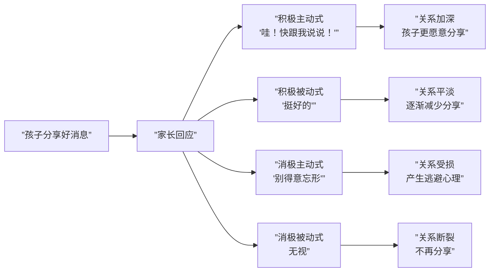

# 第10课：积极亲子关系，减少人际问题

> 讲师：安妮 | 第2周

## Learning Objectives

- 理解青春期“叛逆”背后的脑科学机制
- 掌握七种必备社会技能及其培养方法
- 能够区分并运用四种回应方式，强化积极主动式回应
- 理解“喜鹊不做乌鸦”原则，改善亲子沟通质量

## 一、青春期叛逆：不是态度问题，是大脑问题

### 前额叶尚未成熟

很多家长将青春期的冲动、情绪化、顶撞理解为“学坏了”或“故意作对”。但脑科学给出了一个完全不同解释：**青春期不是孩子在“变坏”，而是他的大脑正在经历一场“结构重组”，但重组尚未完成。**

**三个关键脑区的发育阶段：**

| 脑区 | 功能 | 青春期发育状态 | 对行为的影响 |
|------|------|--------------|-------------|
| **前额叶**（Prefrontal Cortex） | 理性决策、冲动控制、长远规划 | **直到25岁才完全成熟** | 青春期孩子“明知不该做还做了”——不是不知道，是控制不住 |
| **杏仁核**（Amygdala） | 情绪反应、尤其是恐惧和愤怒 | **青春期超速发育** | 情绪反应强度是成人的2-3倍 |
| **海马回**（Hippocampus） | 记忆、情绪记忆的编码 | 发育中 | 情绪化的记忆往往更深刻 |

> [!WARNING] 家长最常犯的错误
> 安妮老师指出：“很多家长和青春期的孩子硬碰硬，相当于一个前额叶成熟的成年人和一个前额叶尚未发育完成的孩子吵架——**你赢了也不光彩，输了更惨**。更好的做法是：**给他空间，等他冷静，再用他那颗还没长好的前额叶帮他分析**。”

简单来说：**青春期孩子更多靠杏仁核和海马回（情绪中心）做决策，成人更多靠前额叶（理性中心）做决策。** 这不是态度问题，是硬件还没装完。

## 二、七种必备社会技能

安妮老师提出孩子需要掌握的七种社会技能，这是人际交往的“底层操作系统”：

| 序号 | 技能 | 含义 | 家庭培养方法 |
|------|------|------|-------------|
| 1 | **积极投入**（Active Engagement） | 主动参与社交互动的意愿 | 鼓励孩子主动和人打招呼、加入游戏 |
| 2 | **人际游戏**（Interpersonal Play） | 能与他人一起游戏和合作 | 多玩需要轮流、协作的桌游 |
| 3 | **自我规范**（Self-regulation) | 调节自己情绪和行为以适应环境 | 在日常中练习“等一等”、“轮流来” |
| 4 | **社会情感**（Social Affect) | 理解并回应对的情感和表情 | 读书时问“你觉得这个角色现在怎么想？” |
| 5 | **社会语言**（Social Language） | 用语言进行有效的社交沟通 | 教问候语、邀请语、“我可以……吗？”句式 |
| 6 | **集体行为**（Group Behavior） | 在集体中遵守规则、承担角色 | 参加小组活动、体育团队 |
| 7 | **非语言技能**（Non-verbal Skills） | 理解并运用身体语言、语调、距离 | 玩“表情猜猜看”游戏 |

> [!EXAMPLE] “表情猜猜看”游戏
> - 一个人做一个表情（开心、难过、惊讶、生气、害怕）
> - 另一个人猜是什么情绪
> - 进阶版：猜“在这种情境下这个人会有什么表情？”——比如“如果你把最喜欢的杯子打碎了，妈妈会是什么表情？”

## 三、社交情景在线：在游戏中学习社交

**社交情景在线**是一种通过重现冲突场景来训练社交技能的方法。它让孩儿在“安全”的情境下（游戏），面对真实的社交冲突，练习更好的应对方式。

### 情景示例

| 冲突场景 | 常见反应（待改进）| 在线训练的目标反应 |
|---------|-----------------|------------------|
| 有人在排队时插队 | 大哭/打人/退缩 | 说“请排队，现在轮到我了” |
| 别的小朋友想玩你正在玩的玩具 | 抢回来/放弃走开 | “等我玩完就给你”或者“我们一起玩” |
| 被别的小朋友取笑 | 哭泣/回骂/打人 | 说“我不喜欢你这样说话”然后走开 |

> [!TIP] 怎样做社交情景在线
> 1. 选一个孩子最近遇到的社交冲突
> 2. 用玩具或角色扮演“再演一遍”
> 3. 停在冲突点，问孩子“除了刚才的做法，还有什么办法？”
> 4. 多演几遍不同版本的结局
> 5. 不评判“对错”，只比较“不同做法带来的不同结果”

## 四、做“喜鹊”不做“乌鸦”：分享愉悦信息

### “祥林嫂效应”

安妮老师引用鲁迅笔下祥林嫂的经典形象——一个反复诉说不幸的人，最终被所有人疏远。这个文学形象在心理学中有现实基础：**总是分享负面信息的人，会逐渐被社交圈边缘化。**

纳尼？关系最紧密的伴侣和家人之间，好事与坏事的分享比例也**至少需要3:1**。

> [!TIP] “喜鹊”家庭沟通实践
> 孩子放学回家，问的第一句话不要是“考了多少分？”，而是：
> - “今天学校有什么好事吗？”
> - “今天有什么开心的时刻？”
> - “今天有没有谁帮你做了什么事？”
> 
> 这不是回避现实问题，而是训练大脑的**注意力偏向**——大脑关注什么，就会放大什么。

### 家庭中的“好事时间”

设置一个家庭仪式：**晚餐时的“好事分享”**。

每个人说一件今天的好事（再多说一个也可以）。规定：听的人只需点头、微笑、说“真好”，**不需要给建议、不用评价好坏**。

最简单的练习，却是增进关系最有效的方法。

## 五、四种回应方式的对比

当孩子向你分享一件好事时——不管是他考了第一名，还是他今天在校门口看到了一只蝴蝶——你的回应方式，决定了关系的**走向**。

| 回应类型 | 态度 | 语言示例 | 对关系的影响 |
|---------|------|---------|-------------|
| **积极主动式** | **热情+具体** | “哇！太棒了！你是怎么做到的？快跟我说说！” | **最佳/强关系** |
| **积极被动式** | 热情但**不具体** | “挺好的啊。” | 中性/浅关系 |
| **消极主动式** | 负面+具体 | “考这么好？那下次肯定要退步了。” | 削弱关系 |
| **消极被动式** | 冷漠+回避 |（头也不抬）“嗯。” | 最差/破坏关系 |

> [!QUESTION] 快速自测
> 想象孩子兴冲冲跑来告诉你：“妈妈！我今天跳绳跳了100个！”
> 
> 上面四种回应方式中，你通常使用的是哪一种？
> 
> 如果你是积极被动式——“不错不错”（然后继续看手机）——你其实在一点一点消耗孩子的分享欲。

### 为什么积极主动式最有效？

因为这种回应同时满足了孩子的两个核心需求：

1. **被看见**——你看到了他的成就，并表达了认可
2. **被重视**——你愿意花时间了解细节，说明他在你心中重要



## 六、从理论到行动：本周的“亲子关系升级”计划

安妮老师总结了第10课的实践框架：

```
本周每天做3件事：
1. 一次积极主动式回应——孩子分享任何事时，放下手机，给热情+具体回应
2. 一个“喜鹊问题”——问一件今天的好事
3. 一次社交情景在线——用5分钟角色扮演一个白天遇到的社交情境
```

> [!QUESTION] 自测与家庭应用任务
> 
> **自测题**：
> 1. 回想你上一次对孩子的好消息的回应——是四类中的哪一类？
> 2. 你家餐桌上说“好事”和说“坏事”的比例大概是几比几？
> 3. “祥林嫂效应”在你家的亲子沟通中是否存在？
> 
> **家庭任务**（亲子关系一周升级计划）：
> 
> | 天数 | 任务 | 完成标记 |
> |------|------|---------|
> | 第1天 | 听孩子分享时，做一次“积极主动式回应” | |
> | 第2天 | 晚饭时只聊好事，不聊成绩和批评 | |
> | 第3天 | 玩一次“表情猜猜看”游戏 | |
> | 第4天 | 和孩子角色扮演一个他最近的社交冲突 | |
> | 第5天 | 记录今天你和孩子的对话中，积极和消极回应的比例 | |
> | 第6天 | 全家“好事分享会”，每人至少说3件好事 | |
> | 第7天 | 回顾：亲子关系有什么变化？写50字简短复盘 | |

<details>
<summary>关于“叛逆期”的补充理解</summary>

很多家长担心青春期一定会“鸡飞狗跳”。实际上，脑科学研究也告诉我们另一面：

- 青春期的大脑**可塑性极高**——比成人更容易学习和改变
- 青春期的情绪强烈——意味着快乐的感受也特别强烈
- 青春期前额叶未发育完——**这正是父母“代额叶”功能的意义所在**

安妮老师总结：“青春期不是要‘熬过去’，而是要‘走过去’。你现在的陪伴质量，决定了孩子未来与你的关系——以及他未来处理关系的模式。”
</details>

## 关联内容

- [[0007-ji-ji-yu-yan|第07课：用积极的语言促进孩子发展]]——回应本身就是语言的一部分
- [[0009-xue-xi-ren-zhi|第09课：促进孩子的学习与认知能力]]——执行功能与社会技能的关系
- [[0011-fu-neng-guan-xi|第11课：赋能型亲子关系的建设与发展]]——赋能关系需要积极的回应
- [[0012-qing-xu-tiao-jie|第12课：情绪调节与亲子沟通]]——有效回应离不开情绪调节

## Next Step

完成一周升级计划后，进入下一课：[[0011-fu-neng-guan-xi|第11课：赋能型亲子关系的建设与发展]]。