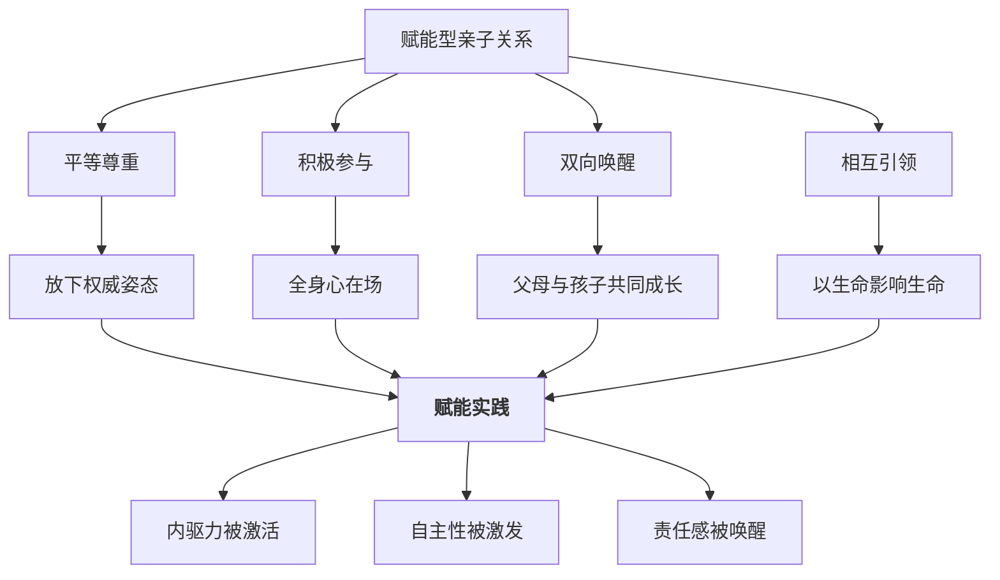
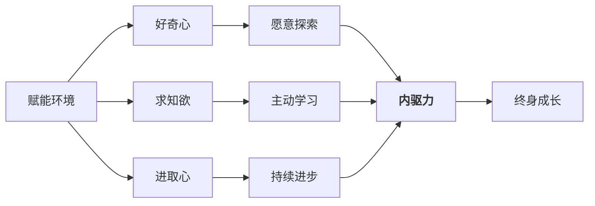
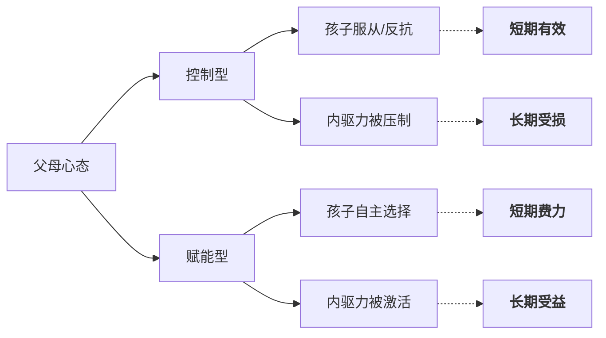

# 第11课：赋能型亲子关系的建设与发展

## 课程引入：两种回应，两种人生

**场景一**：初一学生竞选班干部失败，回家闷闷不乐。妈妈得知后说：“早告诉你了别去争这些，踏踏实实学习多好！你看，失败了吧？”孩子低下头，从此再没参加过任何竞选。

**场景二**：同样是初一竞选受挫。妈妈听完后说：“哇，你愿意去挑战自己，这本身就很有勇气！这次没选上，咱们一起看看哪些地方可以改进，下次再来。”孩子重拾信心，认真复盘后再次站上了讲台。

**场景三**：五岁半的孩子早晨磨蹭，眼看要迟到。妈妈A不停催促：“快点！你怎么每次都这么慢！再不出发我就走了！”孩子开始哭闹，整个早晨鸡飞狗跳。

**场景四**：同样的磨蹭，妈妈B蹲下来看着孩子的眼睛说：“小侦探，现在是7点40分，我们要在8点前出门。你觉得自己需要几分钟穿好鞋？我来给你计时好不好？”孩子立刻来了精神，跑着去穿鞋。

> [!WARNING] 教育者的根本区分
> 以上两对妈妈的差异，不在于“爱不爱孩子”，而在于 **“是否在赋能”** 。前者在消耗孩子的力量（能量剥夺），后者在激发孩子的力量（能量赋予）。这就是 **赋能（Empowerment）** 的核心区别。

---

## 一、赋能概念溯源

**赋能（Empowerment）** 一词最早源于心理学领域，指的是通过提供资源、信心和支持，使个体获得掌控自身生活的能力。2018年前后，这一概念被引入企业管理界，成为现象级词汇——谷歌的“20%自由时间”、阿里巴巴的“让听得见炮火的人做决策”，本质上都是赋能管理。

在[[0010-qin-zi-guan-xi|第10课]]中，我们探讨了积极亲子关系对减少人际问题的作用。本课在此基础上更进一步：**亲子关系不仅要“积极”，更要“赋能”**。

### 案例延伸：绘本《有麻烦了》

有一个广为流传的绘本故事：《有麻烦了》。小主人公不小心把妈妈心爱的桌布烫出了一个洞，内心充满恐惧，等着挨骂。然而妈妈看到后，没有责骂，而是拿起针线，在洞的位置绣出了一条精美的鱼。**她将一个“事故”变成了“艺术品”。**

> [!TIP] 教育的隐喻
> “有麻烦了”这三个字本身不是问题，问题在于**我们如何定义“麻烦”**。赋能型父母看到的是“机会窗口”，而非“麻烦现场”。

---

## 二、核心理念：为任何事做好准备

> “教育不是让孩子为某件事做好准备，而是帮助他们为任何事做好准备。”
> —— 课程主讲人

这句话点出了赋能型教育与应试教育、技能教育的本质区别：

| 教育模式 | 核心目标 | 关注点 | 风险 |
|----------|----------|--------|------|
| 应试教育 | 为考试做准备 | 分数、排名 | 考完即忘，缺乏持续动力 |
| 技能教育 | 为某项技能做准备 | 技能掌握度 | 技能过时即失效 |
| **赋能教育** | **为任何事做准备** | 核心素养、内驱力 | 无——适应性最强的模式 |

---

## 三、赋能型亲子关系四要素

### 1. 平等尊重

孩子不是成人的“缩小版”，而是独立的人。赋能始于承认孩子有自己的感受、想法和选择权。

> [!EXAMPLE] 平等尊重的日常表达
> - 非赋能版：“你必须穿这件外套，我说冷就是冷。”
> - 赋能版：“今天外面降温了，妈妈觉得有点冷。你摸摸自己的手臂，你觉得需要加件外套吗？”

### 2. 积极参与

不是“在旁边”，而是“在现场”。积极参与意味着父母的注意力、情感和思考全部投注于当下的互动中。

### 3. 双向唤醒

很多父母把教育理解为“我对孩子单向输出”。赋能型关系强调**双向**——孩子在成长，父母也在被唤醒。

### 4. 相互引领

孩子在某些方面（新科技、新观念、好奇心）同样可以引领父母。承认这一点，不是削弱权威，而是**让关系更真实**。

---

## 四、内驱力三要素

赋能的核心目标是激活孩子的**内驱力（Intrinsic Motivation）**。内驱力由三部分组成：

| 要素 | 定义 | 表现形式 | 如何培养 |
|------|------|----------|----------|
| **好奇心（Curiosity）** | 对新事物的探究欲望 | 问“为什么”、拆东西、探索未知 | 不打断提问、提供探索环境 |
| **求知欲（Desire for Knowledge）** | 主动获取知识的渴望 | 阅读、研究、追问 | 提供优质书籍和内容 |
| **进取心（Ambition）** | 超越自我、追求进步的意愿 | 设定目标、克服困难 | 建立成长型思维（Growth Mindset） |

---

## 五、赋能三内容

赋能不是一个空洞的概念，它需要在三个具体层面落地：

### 1. 情感赋能——温情待人，内心强大

情感赋能是最基础、最核心的赋能。**没有安全的情感连接，一切教育手段都无效。**

- 接纳孩子的所有情绪（包括愤怒、悲伤、恐惧）
- 帮助孩子识别和命名情绪
- 用“共情（Empathy）”回应而非评判

### 2. 行为赋能——行动引领

行为赋能是让孩子从“知道”到“做到”的桥梁。

- 提供选择而非指令
- 允许试错，将失败重新定义为“反馈"
- 鼓励自主决策，哪怕结果不完美

### 3. 思想赋能——通过阅读构建认知

阅读是人类思想构建最重要的途径之一。

- 亲子共读不仅仅是“讲故事”，更是“搭脚手架”
- 通过绘本和书籍拓展孩子的认知边界
- 鼓励孩子表达自己的理解和观点

> [!TIP] 阅读的赋能作用
> 参考[[0009-xue-xi-ren-zhi|第09课：学习认知规律与智力发展]]中的内容，阅读不仅能增长知识，更重要的是**训练思维结构**——让孩子学会如何思考，而非思考什么。

---

## 六、有效沟通四工具

赋能需要通过沟通来传递。以下是四个经过验证的沟通工具：

### 工具一：语言柔顺剂

同一句话用不同方式说，效果天差地别。

| 硬表达 | 柔顺版 |
|--------|--------|
| “你怎么又把玩具扔一地！” | “玩具们想回家了，你愿意送它们回去吗？” |
| “不许哭！” | “妈妈看到你很伤心，想跟我聊聊吗？” |
| “你必须现在做作业！” | “今晚的时间你怎么安排？作业大概需要多长时间？” |

### 工具二：回放精致艺术

**回放（Reflective Listening）** 是指把孩子的话用自己的语言重复一遍，让孩子感到“被听见”。

> - 孩子：“我再也不想上学了！”
> - 赋能回应：“听起来今天在学校发生了让你很不开心的事。愿意跟我说说吗？”

### 工具三：提前说明目的

在孩子做事之前，就明确告知原因和预期，避免“突然袭击”。

> - 非赋能版：“把玩具收好。”（命令式）
> - 赋能版：“五分钟后我们要吃饭了，所以现在咱们把玩具收好，这样吃完饭还能继续玩，好吗？”

### 工具四：放弃控制念头

**赋能最大的敌人是“控制欲”。** 当父母执念于“你必须要听我的”时，沟通封闭了。

> [!WARNING] 放弃控制不等于放弃管教
> 赋能的本质不是“不管”，而是“换一种方式管”。**从“我来替你做决定”变成“我帮你学会做决定”。** 两者的区别在于，你是希望孩子永远听话，还是希望孩子有一天能独立思考。

---

## 七、对比总结：赋能型 vs 非赋能型回应

| 维度 | 非赋能型 | 赋能型 |
|------|----------|--------|
| 面对失败 | “早就知道会这样” | “你愿意尝试就很棒，我们一起看看学到了什么” |
| 面对磨蹭 | “快点！你怎么这么慢” | “我们需要在X点前出门，你还需要几分钟？” |
| 面对情绪 | “不许哭/别生气了” | “我看到你很难过，想跟我聊聊吗？” |
| 面对问题 | “我来帮你做” | “你觉得有哪些办法？你需要我提供什么帮助？” |
| 面对选择 | “你必须听我的” | “你来决定，我尊重你的选择” |

---

## 学习任务

### 应用练习

在接下来的一周里，尝试在以下情境中使用赋能型沟通工具：

1. 孩子遇到挫折时——先共情，再赋能（使用“语言柔顺剂”+“回放”）
2. 孩子需要做选择时——提供有限选项，让他做主
3. 每天找一个时刻，看着孩子的眼睛认真说一句认可的话

记录下你的实践和孩子的反应，带到课堂上分享。

### 自我检测

> [!QUESTION] 自查问题
> 1. 赋能（Empowerment）这一概念最早起源于哪个领域？
> 2. 赋能型亲子关系的四要素是什么？
> 3. 内驱力的三要素分别是什么？请用一个比喻描述它们的关系。
> 4. 赋能三内容包括哪三个方面？
> 5. 有效沟通四工具中，你认为自己最需要练习的是哪一个？为什么？

参考答案

1. 心理学领域。
2. 平等尊重、积极参与、双向唤醒、相互引领。
3. 好奇心、求知欲、进取心。比喻：好奇心是点火装置，求知欲是持续燃烧的燃料，进取心是推动向前的引擎。
4. 情感赋能、行为赋能、思想赋能。
5. （开放答案）建议重点练习“放弃控制念头”——这是最难但最关键的一步。

---

## 下一课预告

下一课将进入[[0012-qing-xu-tiao-jie|第12课：情绪调节与亲子沟通]]，学习潘克塞浦七大情绪系统与三脑模型，理解情绪的本质——情绪不需要"管理"，而是需要"调节"和"允许"。

---

*本课完*