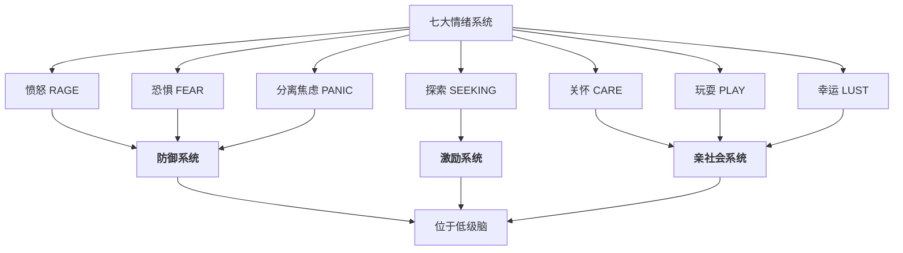
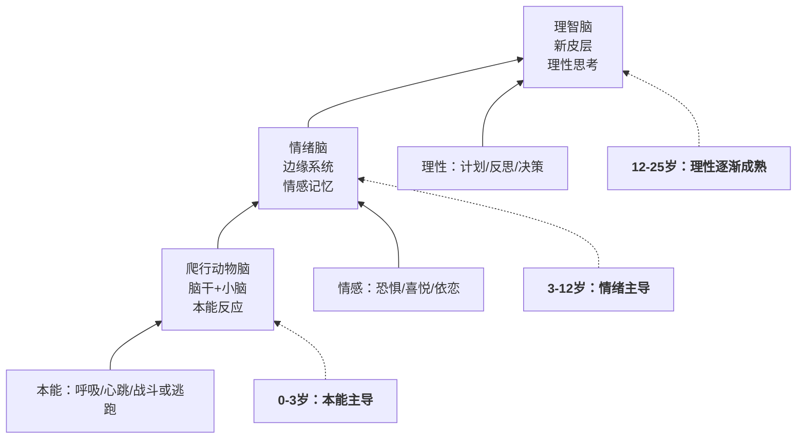
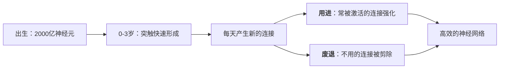

# 第12课：情绪调节与亲子沟通

## 课程引入：一个常见的家庭场景

晚上七点，五岁的孩子因为积木倒塌而崩溃大哭。妈妈试图安抚："别哭了，不就倒了吗？重新搭一个就好了嘛！"孩子哭得更大声了。妈妈开始不耐烦："我都说了没关系，你怎么还哭？不许哭了！"

这个场景几乎每个家庭都经历过。妈妈的初衷是好的——她希望孩子快点好起来。但问题在于：**她试图"堵"住孩子的情绪，而不是"疏导"情绪。**

> [!WARNING] 情绪的误区
> 大多数家长对情绪存在一个根本性的误解：**认为负面情绪是坏的、需要被消除的。** 事实上，情绪没有好坏之分——愤怒、悲伤、恐惧都是人类进化过程中形成的生存信号系统。情绪不需要"管理"或"压抑"，而是需要"调节"和"允许"。

---

## 一、潘克塞浦（Panksepp）七大情绪系统

情感神经科学家杰克·潘克塞浦（Jaak Panksepp）通过大量动物和人类研究，发现人类大脑中存在**七大先天情绪系统**。这些系统位于低级脑（Subcortical Regions），由基因决定，不受意识控制。



| 情绪系统 | 英文原名 | 功能 | 日常表现 |
|----------|----------|------|----------|
| 愤怒 | RAGE | 应对阻碍和侵犯 | 当需求被忽视时爆发 |
| 恐惧 | FEAR | 应对危险和威胁 | 面对陌生环境时退缩 |
| 分离焦虑 | PANIC | 对分离的应激反应 | 与父母分开时哭闹 |
| 探索 | SEEKING | 驱动好奇心和学习 | 对新事物充满兴趣 |
| 关怀 | CARE | 照顾和养育行为 | 帮助同伴、关心他人 |
| 玩耍 | PLAY | 社交学习和技能训练 | 打闹游戏、角色扮演 |
| 幸运 | LUST | 生存繁衍的驱力 | 青春期后显现 |

> [!TIP] 情绪系统的教育启示
> 这七个系统在婴儿出生时就已具备，是生命进化的馈赠。孩子情绪"失控"时，不是"故意捣乱"，而是**他的低级脑正在对某个刺激做出天然反应**。真正的问题不是"如何消除孩子的情绪"，而是"如何帮助孩子与这些情绪共处"。

---

## 二、三脑模型（Triune Brain）

美国神经科学家保罗·麦克莱恩（Paul MacLean）在20世纪60年代提出了**三脑模型（Triune Brain）**，将人类大脑按照进化顺序分为三个层级：



### 为什么孩子的情绪容易"失控"？

关键原因在于**理智脑（新皮层）的发育速度**：

- **爬行动物脑**：出生时即基本成熟
- **情绪脑（边缘系统）**：婴幼儿期快速发展
- **理智脑（新皮层）**：直到25岁左右才完全成熟

这意味着，当孩子被愤怒或恐惧淹没时，他的理智脑**没有能力**像成年人一样调节情绪。这不是"不听话"，而是**生理发育的局限**。

> [!EAMPLE] 三脑模型的日常场景
> 孩子积木倒塌了：
> 1. **爬行动物脑**的反应："危险！有东西突然垮了！"（心跳加速、身体紧绷）
> 2. **情绪脑**的反应："好难过！我花了那么久搭的！"（大哭崩溃）
> 3. **理智脑**的状态："……"（尚未激活，因为前两个脑已经"劫持"了大脑资源）
>
> 此时如果你说"别哭了，重搭一个"——是在和孩子的理智脑对话，而实际上"在线"的是动物脑和情绪脑。**所以无效。**

---

## 三、婴儿大脑发育与早期养育

婴儿出生时，大脑拥有约**2000亿个脑细胞（神经元）**，但这些神经元之间的连接（突触）非常稀疏。出生后的头几年，大脑经历了一个**"用进废退"**的过程：



### 关怀系统的神经化学基础

潘克塞浦的研究发现，**关怀系统CARE）** 的激活依赖于多种神经递质和激素：

| 物质 | 来源 | 作用 |
|------|------|------|
| 阿片物质Opioids） | 大脑自身产生 | 带来安全和愉悦感 |
| 多巴胺Dopamine） | 奖赏系统 | 带来满足感和成就感 |
| 催产素（Oxytoin） | 下丘脑分泌 | 促进依恋和信任 |

当父母用温柔的声音、拥抱和抚摸与孩子互动时，孩子的大脑中这些物质被释放，形成"被爱 = 安全 = 愉快"的神经回路。

这意味着**早期养育方式直接影响孩子大脑神经连接的形成**。温暖的亲子互动不仅让孩子情绪上感受安全，更在生理层面构建了一个具备情绪调节能力的大脑。

---

## 四、核心观点："疏"不是"堵"

结合上一课的内容，我们需要建立一个根本认知：

| 错误认知 | 正确认知 |
|---------|---------|
| 情绪是坏的，要尽快消除 | 情绪是信号，需要倾听 |
| 压抑情绪是成熟的表现 | 表达情绪是健康的表现 |
| 不哭=不难受 | 允许哭+陪伴=真正的安全感 |
| 讲道理是解决情绪的办法 | 共情是通往理性的桥梁 |

> [!TIP] 情绪调节的黄金法则
> **先"疏"后"导"**——先接通情绪通道（共情），再传递理性的信息。这个顺序不可颠倒。颠倒的结果就是孩子觉得"你不理解我"，进而封闭或更激烈地反抗。

### 情绪调节的四个步骤

1. **允许Allow）**——承认并允许一切情绪的存在。"我看到你很难过。"
2. **命名（Name）**——帮助孩子为情绪命名。"你现在是生气、难过，还是有点害怕？"
3. **共情（Empathy）**——让孩子感到被理解。"如果是我，我也会很难过。"
4. **解决方案（Sotion）**——等情绪平复后再一起寻找解决方案。

---

## 五、关系重建五步

当亲子关系已经出现裂痕（比如刚发完火、误解了孩子），需要及时修复。**在[[0010-qin-zi-guan-xi|第10课]]中我们谈到积极亲子关系的重要性，修复本身同样是一种赋能。** 课程提出**关系重建五步**：

```mermaid
graph LR
    A[1、真诚表达] --> B[2、恰当反馈]
    B --> C[3、深入交谈]
    C --> D[4、使此约定]
    D --> E[5、和解拥抱]
    
    A -.-> F[”妈妈刚才太激动了，对不起”]
    B -.-> G[”你当时觉得很委屈，对吗？”]
    C -..-> H[”你希望妈妈下次怎么做？”]
    D -.-> I[”下次我们约定一个暗号好不好？”]
    E -.-> J[肢体接触传递无条件的爱]]
```

### 第一步：真诚表达

父母首先放下防御，真诚地表达自己的感受和歉意。不是辩解，而是负责。

> - 错误表达："刚才我发火是因为你太不听话了！"（推卸责任）
> - 正确表达："刚才妈妈太累了，没有控制好自己的情绪，对不起。那不是你的错。"（承担责任）

### 第二步：恰当反馈

邀请孩子表达他当时的感受，认真倾听，不打断、不评判。

### 第三步：深入交谈

在双方都平静的前提下，聊一聊事情发生的深层原因——不只是"发生了什么"，更是"为什么会这样"。

### 第四步：彼此约定

基于讨论，共同制定一个未来遇到类似情况的约定。约定必须是**双方的**，而非单方面对孩子的要求。

### 第五步：和解拥抱

> [!WARNING] 拥抱不是"和解的结束"
> 拥抱是和解的一部分，但不应该是逼迫的结果。孩子不愿意拥抱时，尊重他。**真正的和解是心与心的靠近，而不是身体的靠近。**

---

## 推荐绘本

以下是三本帮助孩子（和父母）理解情绪的经典绘本：

- 《我的大喊大叫的一天》——让孩子知道，大喊大叫并不可怕，情绪可以自然流动
- 《让我安静五分钟》——让父母看到，适当独处是情绪调节的重要能力
- 《小哈，你要把妈妈气疯了》——让孩子看到成人也会有情绪，真实比完美更重要

---

## 学习任务

### 应用练习

这一周的实践任务是**"情绪日记"**：

1. 每天记录一次你和孩子之间的情绪互动（包括正面和负面）
2. 运用三脑模型分析：当时谁的"动物脑"在线？谁的"理智脑"在线？你的回应是否匹配了真正"在线"的那个脑？
3. 尝试在情绪爆发时，先做三次深呼吸（给自己和孩子一个停顿），再使用"允许——命名——共情——方案"的四个步骤

### 自我检测

> [!QUESTION] 自查问题
> 1. 潘克塞浦七大情绪系统中有哪些属于"防御系统"？它们的功能是什么？
> 2. 三脑模型中的三个"脑"分别对应哪些功能？为什么孩子容易情绪失控？
> 3. 婴儿大脑有多少个脑细胞？早期养育如何影响神经连接的形成？
> 4. 为什么说"情绪不需要管理，需要调节"？"疏"和"堵"的区别是什么？
> 5. 关系重建五步是什么？请用自己的语言描述一遍。

<details>
<summary>参考答案</summary>

1. 愤怒RAGE）、恐惧（FEAR）、分离焦虑（PANIC）。它们在面对侵犯、危险和分离时自动启动，属于生存本能。
2. 爬行动物脑（本能反应）、情绪脑（情感记忆）、理智脑（理性思考）。孩子理智脑发育不成熟，容易被低层脑"劫持"。
3. 约2000亿个。温暖的互动释放阿片物质、多巴胺和催产素，帮助建立安全的神经回路。
4. 情绪是信号不是敌人，压抑会积累并爆发，"疏"是允许表达后引导处理，"堵"是否定压制。
5. 真诚表达→恰当反馈→深入交谈→彼此约定→和解拥抱。

</details>

---

## 下一课预告

下一课将进入[[0013-gou-tong-ying-xiang|第13课：亲子沟通对孩子的影响]]，从认知能力、社会发展、人格发展三个维度深入理解亲子沟通对孩子一生的影响。

---

*本课完*