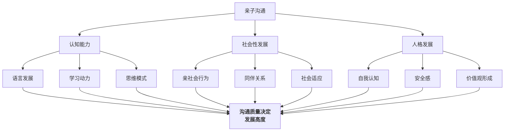
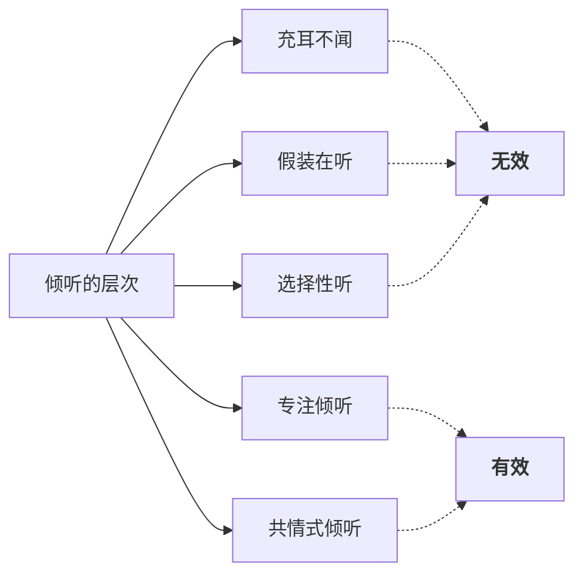

# 第13课：亲子沟通对孩子的影响

## 课程引入：从绘本《你还爱我吗》说起

小熊一次又一次地把家里搞得一团糟——打翻了牛奶、撕破了书本、弄脏了地板。每闯一次祸，它就惴惴不安地跑到妈妈面前问："你还爱我吗？"

妈妈的回答每一次都不同，但核心始终不变：

> "我会生气，我会失望，我也会难过——但我还是爱你。"

这本绘本之所以打动人心，是因为它触及了亲子沟通中最本质的问题：**孩子从我们的沟通中接收到的，究竟是"你做错了"还是"你依然被爱着"？**

> [!WARNING] 沟通的真正内容
> 父母说出的每一个字，孩子听进去的不仅是字面意思，更是潜台词——"我是好的还是坏的"、"我是安全的还是危险的"、"我是被接纳的还是被否定的"。**沟通的表面是信息传递，底层是关系定义。**

---

## 一、亲子沟通影响的三个方面

在[[0012-qing-xu-tiao-jie|第12课]]中，我们学习了情绪调节对亲子关系的重要性。本课将视角进一步放大，审视亲子沟通如何从三个维度塑造孩子的一生。

### 1. 认知能力的影响

**语言环境的"三十万词汇鸿沟"**

美国学者哈特与里斯利（Hart & Risley, 1995）的经典研究发现：到三岁时，来自不同社会经济背景的儿童听到的词汇量差距高达3000万。但更重要的不是词汇数量，而是**沟通的质量**。

| 沟类型 | 特点 | 对认知的影响 |
|-------|------|-------------|
| 指令型沟通 | "做这个"、"别碰那个" | 词汇量有限，思维受约束 |
| 对话型沟通 | "你觉得呢？"、"为什么？" | 词汇量大，思维方式开放 |
| 鼓励型沟通 | "你试试看"、"没关系" | 激发探索欲和学习动力 |
| 批评型沟通 | "你怎么这么笨" | 抑制学习动力，引发习得性无助 |

**鼓励和支持的语言促进学习动力，批评和否定则抑制好奇心。** 这与[[0009-xue-xi-ren-zhi|第09课：学习认知规律]]中提到的"成长型思维（Growth Mindset）"高度一致——沟通方式直接影响孩子如何看待自己的学习能力。

### 2. 社会性发展的影响

和谐亲密的亲子关系是孩子**亲社会行为（Prosocial Behavior）** 的重要基础。当孩子在家庭中体验到尊重的沟通模式，他会自然地将这种模式迁移到与同伴、老师和他人的交往中。

> [!EXAMPLE] 从家庭到社会的迁移
> 孩子在家里听到的是：
> - "我们需要互相帮助"
> - "你的感受很重要"
> - "我们一起想办法"
>
> 到幼儿园后，他会自然地：
> - 主动帮助摔倒的同学
> - 表达自己的情绪而非攻击
> - 与同伴合作解决问题

### 3. 人格发展的影响

早期亲子互动是人格形成的**核心模具**。弗洛伊德、埃里克森等发展心理学家的研究无不强调：**0-6岁的亲子沟通方式，奠定了人格的底色。**

| 沟通模式 | 孩子形成的自我认知 | 潜在人格倾向 |
|----------|-------------------|-------------|
| 温暖接纳 | "我是被爱的、有价值的" | 自信、安全感强 |
| 冷漠忽视 | "我不重要" | 回避型、疏离 |
| 批评否定 | "我是不够好的" | 自卑、焦虑型 |
| 过度保护 | "我无能" | 依赖型、缺乏主动性 |

---

## 二、沟通三原则

基于以上三个方面的影响，课程提炼出亲子沟通的**三个核心原则**：

### 原则一：会说——接纳

"会说"不是口才，而是**传递接纳的能力**。

> - 不接纳的说法："你怎么又做错了！"
> - 接纳的表达："这次没做好，没关系，我们一起看看哪里可以改进。"

接纳的关键在于：**区分"行为"和"人"**。否定行为可以，否定人格不行。

### 原则二：会听——倾听

倾听不仅仅是"不说话"，而是**真正接收并理解对方传递的信息**。

**共情式倾听（Empathetic Listening）** 是最高层次的倾听——不仅听到话语，还能听到话语背后的情绪和需求。

### 原则三：会讲——引领

"会讲"不是灌输道理，而是**用语言为孩子搭建通往更高认知的脚手架**。

> [!TIP] 引领式沟通的句式
> - "你注意到了什么？"（引导观察）
> - "你觉得为什么会这样？"（引导思考）
> - "如果是你，你会怎么做？"（引导决策）
> - "从这个事情里你学到了什么？"（引导反思）

---

## 三、鼓励合作五技巧

在实际沟通中，如何让孩子愿意合作，而不是对抗？课程提供了**五个实用技巧**：

| 技巧 | 含义 | 非合作版 | 合作版 |
|------|------|----------|--------|
| 1. 描述问题 | 客观陈述事实，不加评判 | "你把房间弄得一团糟！" | "我看到地上有积木和绘本" |
| 2. 提示 | 给出简洁的信息提示 | "你又不关灯！" | "宝贝，灯还亮着" |
| 3. 简单词语 | 用最少的词语表达 | "我说了多少遍要洗手再吃饭！" | "洗手" |
| 4. 说出感受 | 表达真实感受而非指责 | "你怎么这么讨厌！" | "妈妈看到饭菜凉了，有点难过" |
| 5. 写便条 | 用书面形式替代口头唠叨 | 口头催促三遍 | 在冰箱贴上留便条 |

> [!WARNING] 技巧不等于套路
> 这五个技巧不是"操控孩子"的话术，而是**尊重孩子的沟通方式**。其核心是：把注意力从"纠正孩子"转移到"解决问题"上。只有当出发点是对孩子的尊重时，技巧才真正有效。

---

## 四、亲子关系六阶段

了解亲子关系在不同阶段的演变，有助于我们在每个阶段采用恰当的沟通方式：

| 阶段 | 年龄范围 | 主要特征 | 沟通重点 |
|------|---------|---------|---------|
| 想象期 | 孕期 | 父母对未来孩子的想象 | 建立期待，但不过度理想化 |
| 养育期 | 0-3岁 | 完全依赖成人照料 | 非语言沟通、肢体接触、情感回应 |
| 权威期 | 3-12岁 | 父母拥有绝对话语权 | 寓教于乐、规则建立、尊重表达 |
| 综合期 | 12-18岁 | 孩子在依赖与独立间摇摆 | 尊重隐私、承认矛盾、保持连接 |
| 独立期 | 18-22岁 | 孩子走向独立 | 转为朋友式沟通、退后支持 |
| 分离期 | 22岁+ | 建立自己的家庭 | 放手祝福、保持适当联系 |

---

## 五、分龄沟通要点

### 依恋期（1-12岁）：寓教于乐

这个阶段的核心任务是**建立安全依恋（Secure Attachment）**。沟通方式宜：

- 大量肢体接触和目光交流
- 用游戏和故事传递规则
- 避免长篇大论的说教
- 绘本阅读是最好的沟通媒介

### 青春期（12-18岁）：尊重隐私

青春期是亲子沟通最敏感的时期。孩子开始形成独立的自我意识，对父母的"侵入"极度敏感。

> [!TIP] 青春期沟通的铁律
> - **敲门再进**——物理空间的尊重是沟通的前提
> - **不翻看日记和手机**——信任一旦崩塌就很难重建
> - **不问"今天学了什么"**——换成"今天有什么有意思的事？"
> - **在吃饭时聊轻松话题**——餐桌是最后的沟通阵地

### 成年期（18岁+）：像朋友一样

当孩子成年后，父母需要完成从"管理者"到"顾问"的转型——只有在被邀请时，才给出建议。

---

## 绘本推荐

- 《你还爱我吗》——无条件接纳的典范
- 《市场街最后一站》——沟通的本质是赋能成长，而非传输道理
- 《各种各样的感觉》——帮助孩子识别并命名情绪的绘本
- 《超级感觉大书》——情绪认知的百科全书式绘本

> [!EXAMPLE] 《市场街最后一站》的沟通启示
> 故事中，奶奶带着孙子坐公交车去"最后一站"——一个贫困社区。一路上，孙子抱怨没有车、没有随身听、没有零食。奶奶的每一次回应都不是说教，而是**帮他用另一种眼光看待世界**。没有车——我们可以看见城市；没有随身听——我们可以听见路人唱歌。**沟通的最高境界不是"告诉孩子答案"，而是"帮孩子打开另一种视角"。**

---

## 学习任务

### 应用练习

**本周实践：沟通模式自察**

1. 选择一天，用手机录音你和孩子之间的互动（征得孩子同意或采用不录音记录的方式）
2. 回看你的沟通方式，统计以下数据：
   - 指令型语言 vs 对话型语言的比例
   - 鼓励型语言 vs 批评型语言的比例
   - 你真正"在听"的时间比例
3. 尝试连续三天使用"鼓励合作五技巧"中的至少三个技巧

### 自我检测

> [!QUESTION] 自查问题
> 1. 亲子沟通对孩子的三个主要影响方面是什么？
> 2. "三十万词汇鸿沟"研究的主要发现是什么？单纯增加词汇量就够了吗？
> 3. 沟通三原则分别是什么？请用自己的话解释。
> 4. 鼓励合作五技巧包括哪些？请举例说明每一个。
> 5. 亲子关系六阶段中，你认为哪一阶段的沟通挑战最大？为什么？

参考答案

1. 认知能力（语言发展、学习动力、思维模式）、社会性发展（亲社会行为、同伴关系、社会适应）、人格发展（自我认知、安全感、价值观形成）。
2. 不同家庭儿童的词汇量差距可达3000万。但更重要的是沟通质量——对话型、鼓励型沟通比单纯增加词汇量更关键。
3. 会说（接纳）、会听（倾听）、会讲（引领）。接纳是区分行为和人格，倾听是真正接收对方的信息，引领是用语言搭建认知脚手架。
4. 描述问题、提示、简单词语、说出感受、写便条。参见上表示例。
5. （开放答案）多数人认为青春期挑战最大，因为孩子在依赖与独立间反复摇摆，沟通需要极高的技巧和耐心。

---

## 下一课预告

下一课将进入[[0014-fu-qin-jiao-yu|第14课：父亲的教育为什么特别重要]]，由著名家庭教育专家孙云小主讲，探讨父亲在家庭教育中的独特角色与不可替代的价值。

---

*本课完*