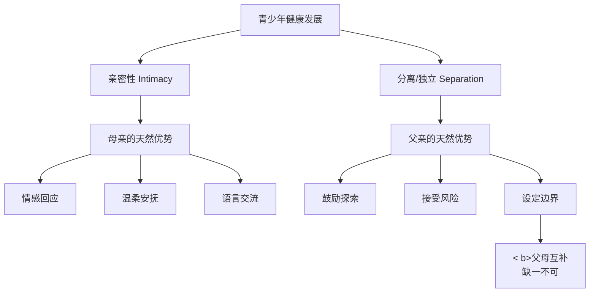
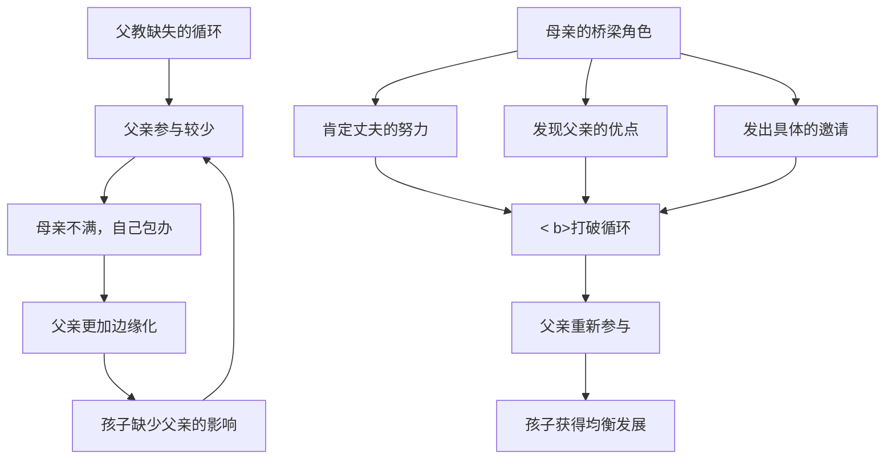

# 第14课：父亲的教育为什么特别重要

## 课程引入：乔布斯的悲剧

史蒂夫·乔布斯（Steve Jobs）——一个改变了世界的人，却经历了一个令人心碎的人生开局。

乔布斯出生后即被亲生父母遗弃。尽管养父母给了他温暖的家庭，但被遗弃的创伤在他内心深处始终没有愈合。多年后，乔布斯成为父亲，却同样遗弃了自己的大女儿丽萨。

> "他不知道怎样做一个父亲，因为他从来没有过父亲。"
> —— 乔布斯传记作者 沃尔特·艾萨克森

这个案例揭示了家庭教育中一个沉默而深远的命题：**父亲的角色不能被替代，父亲的缺位会在代际之间无声传播。**

> [!WARNING] 代际传播的残酷法则
> 父亲如何对待孩子，孩子长大后就会如何对待自己的下一代——不是通过说教，而是通过**无意识的模仿**。这种代际传播（Intergenerational Transmission）可以在几代人中重复上演，直有人饱醒而打破它。

---

## 一、哈佛大学《父亲的角色》研究

哈佛大学一项名为**《父亲的角色》（The Role of the Father）** 的长期跟踪研究发现，青少年发展有两个核心目标，而父母在其中扮演着不同但互补的角色：

| 发展目标 | 定 | 天然优势方 | 对教育意义 |
|---------|---------|-----------|-----------|
| **亲密性**（Intimacy） | 建立深层次情感连接的力 | 母亲 | 情感回应、温柔安抚、育 |
| **分离/独立（Separation/Independence）** | 成为独立个体的能力 | 父亲 | 鼓励探索、接受风险、接受挑战 |

### 具补性而非对性

重要是的：这并意味着"母亲管情感，父亲管规矩"那样的刻板分工。而是说，**母亲的天然倾向是让孩子感受到"连接"，父亲的天然倾向是让孩子体验到"独立"**。两者都是健康人格发展不可或缺的。

> [!TIP] 补的关键
> 如果父亲缺席，孩子可能在某方面发展失衡——要么过于依恋母亲难以独立，要么缺情感连接的基础能力。**最好的教育不是"谁更重要"，而是"双都在场"。**

---

## 二、父亲的独特角色

在家庭教育中，父亲承担着其他家庭成员无法替代的"符号性的角色"：

### 1. 代表法律和权威

在孩子的世界中，母亲往往代表着"温软的港湾"，而父亲代表着"外面的世界"——那里有规则、有秩序、有后果。孩子从父亲身上第一次体验到"权威是什样的"。

这并意味着父亲应该是一个严苛的角色。**健康的权威是"坚定而温软"的——

> - 不健康的权威："因为我是爸爸，所以你得听我的。"（专制）
> - 健康的权威："我们家有一条规则——每个人都要对自己的行为负责。爸爸也遵循这个规则"（榜样示）

### 2. 孩子从父亲认识"什么男人"

对儿子来说，父亲是他认识"男性身份"的第一模版。他通过观察父亲如何说话、如何对待母亲、如何面对困难，来构建自己的"男性形象"。

对女儿来说，父亲是她认识"异性"的第一模版。她通过父亲如何对待她，来形成对自己"作为女性值不值得被爱"的认知。**父亲对待女儿的方式，直接影她未来的择偶标准。**

| 父亲的表 | 对儿子的影 | 对女儿的影响 |
|---------|-----------|-------------|
| 尊重母亲 | 学会尊重女性 | 形成对异性尊重的期待 |
| 情接纳 | 敢于表达情感 | 感受"被爱"的安全感 |
| 鼓励独立 | 建立自信 | 敢于探索世界 |
| 缺或冷漠 | 角色混淆或过度补偿 | 长大易被"渣男"吸引 |

### 3. 孩子从父母关系理解"什么是爱情、婚姻"

家庭是孩子理解亲密关系的第一实验室。父母如何互动——如何争吵、如何和解、如何表达爱——都被孩子默默记录，成为他未来婚姻观的蓝本。

> [!EXAMPLE] 父母关系的影响
> 一个在家庭中看到父亲每月给母亲准备小惊喜的女孩，长大后自然会期待平等、温软的亲密关系。
> 个看到父亲对母亲冷暴力或用暴力的男孩，长大后很可能重复同样的模式——除非有意识地醒并打破。

---

## 三、父教缺失的判断四指标

如何判断一个家庭是否存在父教缺失？课程提出了**四个核心指标**：

| 指标 | 核心问题 | 良好状 | 缺失信号 |
|------|---------|--------|---------|
| 1. 育参与 | 是否关心妻子如何养育孩子 | 经常商讨教育方案 | "你管就行了" |
| 2. 了解程度 | 是否了解孩子的兴趣爱好 | 知道孩子的朋友、喜 | "天天忙工作，哪知道这些" |
| 3. 关键支持 | 关键时候能否给支持 | 孩子比赛/演出时在场 | "下次一定去"（但从未去过）|
| 4. 孩子认可 | 孩子是否认可父亲的角色 | 孩子主动找爸爸分享 | 孩子有什么事都找妈妈 |

> [!QUESTION] 自测
> 请用这四个指标对自己（或身边的父亲）进行一次诚实评估。如果至少两项出现问题，可能需要认真反思：**你是在"在场"还是真正"在参与？"**

---

## 四、中国庭的父教缺失现状

据多项调查显示，**中国约半数家庭教育存在不同程度的父教缺失**。其背后有复杂的社会原因：

- **传观念："男主外女主内"**——父亲认为"挣钱就是负责"
- **工作压力**——加班文化侵占家庭时间
- **教育焦虑转移**——母过度卷入孩子教育，无意识地边缘化了父亲

### 最隐蔽的原因：母亲的态度

一个常被忽视但至关重要的事实是：**父亲的缺位，有一部分是"被请出局"的。**

> "他做得不好，还不如我自己来。"

这句话在很多家庭中频繁出现。当父亲尝试参与育儿时——

- 换尿布穿的姿势不对——母亲说"算了，我来"
- 陪孩子读讲错——母亲说"你讲得不对，还是我来"  
- 孩子衣服搭配不当——母亲说"怎么穿成这样就出门了"

每一次"纠正"都在传递一个隐的信息：**"你不行，你别添乱了。"**

久而久之父亲真正地退出了。

> [!WARNING] 微排斥的累积效应
> 表面的原因"父亲不参与"——深层的原因可能是"母亲不让父亲按自己的方式参与"。**完美的参与不等于有效的参与。** 父亲需要用自己——哪怕是笨拙的——方式与孩子互动。

---

## 五、母亲的关键作用

打破父教缺失的链，母亲扮演着关键的"桥梁角色"：

### 1. 肯定丈夫的努力

即使丈夫只做了"60分"的事情，也要给出"80分"的认可。不是因为标准低，而是因为**正向反馈是最好的行为强化**。

> - 否定："孩子都被你弄哭了" 
> - 肯定："你愿意陪孩子玩，他其实很开心，只是还需要适应你的方式"

### 2. 发现父亲的优点

| 领域 | 父亲可能的独特方式 | 价值 |
|------|-------------------|------|
| 玩耍 | 更激烈、更大胆的身体游戏 | 培养勇气和冒险精神 |
| 规则 | 更直接、更简洁 | 培养清晰的界线意识 |
| 解决问题 | 更注重结果而非过程 | 培养目标导向思维 |

### 3. 邀请他参与

不是抱怨"你为什么不参与"，而是**发出具体的邀请**：

> - 无效沟通："你能不能管管孩子？"（太笼统，听起来像指责）
> - 有效沟通："这周六孩子有个足球比赛，他特别希望爸爸来看。你能把时间空出来吗？"（具体、积极、可执行）

---

## 六、给父亲的建议

如果你是一位父亲，以下是三个可以立即开始的方向：

1. **从"小事"开始**——不必等到"有大块时间"才陪伴。每晚15分钟的专注陪伴，胜过周末一整天的身在心不在。
2. **用自己的方式参与**——你不一定要像母亲那样细腻。你可以在外面疯跑、拆旧电器、看球赛——只要你在场，孩子就在学习。
3. **当着孩子的面称赞妻子**——这是你能给孩子的最好的婚姻教育。孩子从你对待妻子的方式中，学会如何爱与尊重。

---

## 学习任务

### 应用练习

**实践一（针对父亲）：** 在本周内，完成以下五项中的至少三项：
1. 单独陪孩子做一件"妈妈不在场"的事
2. 了解孩子最近最喜欢的一个朋友或一项爱好
3. 在孩子面前称赞妻子的一个优点
4. 给孩子讲一个自己小时候的故事
5. 在孩子遇到困难时说"没关系，爸爸陪你一起想办法"

**实践二（针对母亲）：** 在本周内，完成以下三项：
1. 真诚地肯定一次丈夫在育儿中的努力
2. 邀请丈夫用"他自己的方式"参与一项育儿活动
3. 当丈夫做得不够好时，忍住不插手（除非涉及安全问题）

### 自我检测

> [!QUESTION] 自查问题
> 1. 乔布斯的案例说明了家庭教育中的什么现象？
> 2. 哈佛大学研究中，青少年发展的两大目标是什么？父母各自有什么天然优势？
> 3. 父亲在家庭教育中的独特角色体现在哪几个方面？
> 4. 父教缺失的判断四指标是什么？
> 5. 为什么说母亲的"微排斥"可能是父教缺失的隐性原因？母亲可以如何在其中发挥桥梁作用？

参考答案

1. 代际传播——被遗弃的创伤在无意识中传递给下一代。父亲的角色缺失会形成代际循环。
2. 亲密性（母亲的天然优势是情感回应和安抚）和分离/独立（父亲的天然优势是鼓励探索和接受风险）。两者互补，缺一不可。
3. 代表法律和权威、让孩子认识"什么是男人"、让孩子从父母关系中理解爱情和婚姻。
4. 是否关心妻子如何养育、是否了解孩子兴趣爱好、关键时候能否支持、孩子是否认可父亲。
5. 当母亲因父亲做得不够好就包办代替时，父亲被"请出局"。母亲可以：肯定丈夫的努力（即使不完美）、发现父亲独特的育儿优势、发出具体而非笼统的参与邀请。

---

## 下一课预告

下一课将进入[[0015-dian-ying-jiao-yu|第15课：电影中的教育智慧]]，通过经典电影片段来学习家庭教育的深层智慧——让光影成为我们理解亲子的第三只眼睛。

---

本课完*