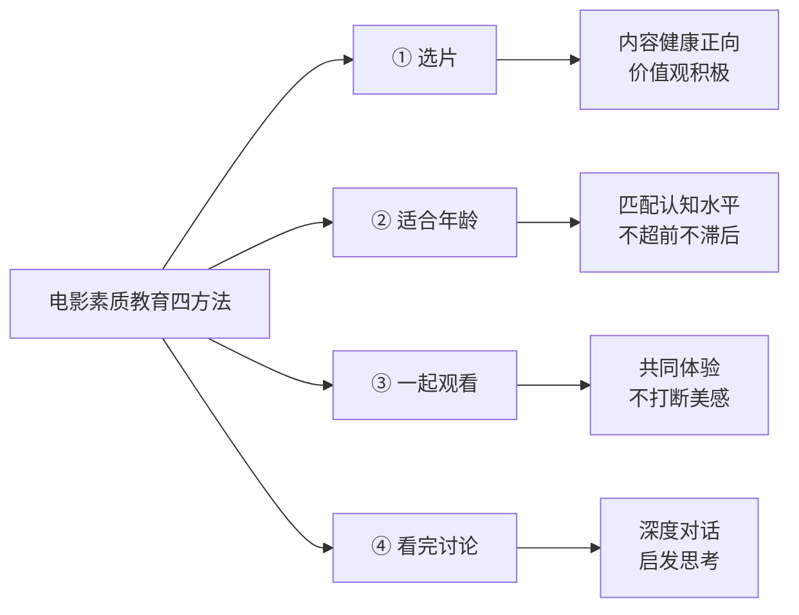
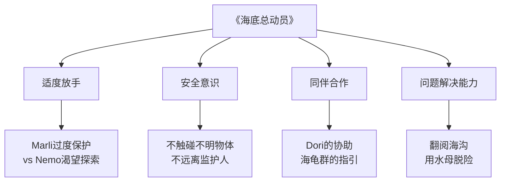

# 第15课：用优质影视做工具对孩子进行素质教育

## 引言：电影——一本"立体的书"

本课程从绘本开始，以电影收官，有着深刻的寓意。如果说绘本是孩子认识世界的第一扇窗，那么电影就是一扇**立体的窗**——它融合了文学、美术、音乐、表演、摄影等多种艺术形式，给孩子带来全方位的感官体验和思想启发。

> [!TIP] 核心认知
> **电影是"立体的书"**。它不只是娱乐工具，更可以成为品格教育、人生观塑造、心理素质培养、知识拓展的丰富素材。善用优质影视，是家庭素质教育中成本最低、效果最好的方法之一。

---

## 电影提升素质教育四方法

用电影做教育不是简单地让孩子"看电影"，而是有一套完整的流程和方法。



### 第一法：选片（选什么）

选片是电影教育的第一步，也是最关键的一步。优质电影应符合以下标准：

- **价值观正向**——传递勇气、善良、责任、坚持等核心品格
- **内容有层次**——不同年龄能读出不同深度，适合反复观看
- **艺术水准高**——画面、音乐、叙事均有审美价值
- **与生活相关**——能引发孩子联系自身经验进行思考

### 第二法：适合年龄（什么时候看）

不同年龄段的孩子认知能力不同，选片需匹配其发展阶段：

| 年龄段 | 推荐类型 | 时长建议 | 示例 |
|--------|---------|---------|------|
| 3-6岁 | 动画短片、温情故事 | 20-40分钟 | 《海底总动员》系列 |
| 7-10岁 | 成长冒险、科普纪录片 | 60-90分钟 | 《荒岛余生》节选 |
| 11-14岁 | 历史剧情、人物传记 | 90-120分钟 | 《阿甘正传》《庞贝城》 |
| 15岁以上 | 社会议题、哲学思考 | 常规长度 | 经典改编、纪录电影 |

### 第三法：一起观看（怎么看）

> [!WARNING] 常见误区
> 很多家长把电影当成"电子保姆"——孩子看电视/手机，家长做自己的事。这种做法失去了电影教育的核心价值。

**一起观看**是电影教育的灵魂。家长与孩子共同沉浸在同一个故事中，这份**共同体验**是后续讨论和教育的基石。

**关键原则：第一遍完整观看，不打断**。要保留电影的艺术完整性——就像读一本好书不能每读一页就停下来讲解一样，第一遍观看应让孩子完整地感受故事、画面和情感冲击。

### 第四法：看完讨论（然后呢）

电影结束，教育才刚刚开始。讨论不是"考试"（"你从这个电影学到了什么？"），而是**自然的对话**：

- "你最喜欢哪个角色？为什么？"
- "如果换作是你，你会怎么做？"
- "哪个画面让你印象最深？"
- "你觉得这个故事想告诉我们什么？"

---

## 《阿甘正传》五遍法深度学习

《阿甘正传》（Forrest Gump）是一部极具教育价值的电影，安妮老师提出**"五遍学习法"**，每一遍聚焦一个维度，层层深入。

```mermaid
graph TD
    subgraph ”《阿甘正传》五遍深度学习法”
        A[第一遍：故事] -->|整体感知| B[第二遍：历史]
        B -->|背景理解| C[第三遍：人物]
        C -->|角色分析| D[第四遍：细节]
        D -->|微观洞察| E[第五遍：艺术表达]
    end

    A1[跟着情节走<br>感受情感起伏] --> A
    B1[梳理美国历史脉络<br>越战/民权运动/水门事件] --> B
    C1[分析每个人物<br>阿甘/珍妮/巴布/丹中尉] --> C
    D1[发现伏笔与呼应<br>羽毛/跑步/巧克力] --> D
    E1[镜头语言/配乐<br>叙事结构/象征意义] --> E

    style A fill:#e1f5fe
    style B fill:#fff3e0
    style C fill:#e8f5e9
    style D fill:#fce4ec
    style E fill:#f3e5f5
```

### 第一遍：故事（Story）

纯粹地感受故事。阿甘从一个小镇智障男孩成长为越战英雄、乒乓球冠军、亿万富翁——他的"傻人有傻福"背后，是**坚持、诚实、善良**的力量。这一遍不分析、不讲解，让孩子完整沉浸在故事中。

> [!TIP] 讨论引导
> "你觉得阿甘笨吗？"——这个问题会引发孩子对"聪明"定义的思考。

### 第二遍：历史（History）

《阿甘正传》被称为"一部美国当代史的微缩画卷"。这一遍关注电影中的历史事件：

- **猫王与摇滚乐**：阿甘家中寄宿的猫王
- **种族隔离与民权运动**：阿拉巴马大学门口
- **越战**：阿甘参军、巴布之死
- **乒乓外交**：中美建交
- **水门事件**：阿甘住的旅馆
- **苹果公司**：阿甘投资了"一家卖水果的公司"

这一遍可以极大激发孩子对历史和地理的兴趣。正如《庞贝城》可以引发对古罗马的好奇。

> [!QUESTION] 延伸学习
> 观看《阿甘正传》第二遍后，可以和孩子一起查阅越战历史地图、查找阿拉巴马在地图上的位置——电影由此成为历史地理学习的入口。

### 第三遍：人物（Characters）

深入分析每个人物的命运与选择：

| 人物 | 性格特质 | 教育启示 |
|------|---------|---------|
| **福雷斯特·甘** | 诚实、坚韧、专注、不自卑 | 智商不是决定因素，品格才是 |
| **珍妮·库伦** | 叛逆、迷茫、自我追寻 | 自由与安全感的平衡 |
| **巴布** | 忠诚、梦想、悲剧 | 友谊的价值与战争的残酷 |
| **丹中尉** | 傲慢、沉沦、自我救赎 | 面对命运的态度决定人生高度 |

### 第四遍：细节（Details）

这一遍培养**观察力和敏感度**——那些容易被忽略的细节往往蕴含深意：

- 开场和结尾的那片**羽毛**——象征命运的偶然与必然
- 阿甘不停地**跑步**——从逃避到追寻再到释然
- **巧克力盒子**的比喻——"人生就像一盒巧克力，你永远不知道下一颗是什么味道"
- 阿甘对珍妮**始终如一**的爱——对比珍妮的反复离开

### 第五遍：艺术表达（Artistic Expression）

从电影艺术的角度欣赏：

- **叙事结构**：插叙、倒叙、首尾呼应
- **镜头语言**：长镜头、特写、远景的运用
- **配乐**：每首歌曲与时代背景的呼映
- **服化道**：人物造型随时代变迁的变化

---

## 《海底总动员》多角度教育

《海底总动员》（Finding Nemo）是一部适合亲子共同观影的佳作，可以从多个角度切入教育讨论：



### 角度一：适度放手

Marli（小丑鱼爸爸)在经历了丧妻之痛后，对独子Nemo过度保护，反而导致Nemo叛逆冒险被抓。这恰恰是家庭教育中的经典困境——**越控制，越失控**。这与[[0011-fu-neng-guan-xi|赋能型亲子关系]]的理念一脉相承：真正的爱是learn to let go。

### 角度二：安全意识

Nemo被抓的直接原因是"碰了不该碰的船"——这与[[#生命教育三要素|生命教育三要素]]中的**安全意识**直接相关。观影时可以和孩子讨论"在探索世界时，如何区分安全与危险的边界"。

### 角度三：同伴合作

从Dory的帮助到海龟群的指引，Nemo的归家之路离不开同伴的合作。这可以引申到[[0010-qin-zi-guan-xi|七种必备社会技能]]中的合作能力培养。

### 角度四：问题解决能力

无论是穿跃海沟还是用水母逃生，电影展示了多种问题解决的策略——**冷静观察、寻找资源、团队协作、创造性思维**。这些正是执行功能培养的重要内容（参见[[0009-xue-xi-ren-zhi|学习与认知能力]]）。

---

## 《荒岛余生》与五大野外生存技能

《荒岛余生》（Cast Away）是一部绝佳的**生存教育**素材。电影主人工Chuck在荒岛上展现了五大野外生存技能：

| 生存技能 | 电影中的体现 | 家庭教育应用 |
|---------|-------------|-------------|
| ① 饮用水寻找与净化 | 收集雨水、寻找水源 | 培养科学探索精神 |
| ② 钻木取火 | 反复尝试生火 | 培养耐心与抗挫折能力 |
| ③ 狩猎捕鱼 | 制作简易工具捕鱼 | 培养动手能力 |
| ④ 建造住所 | 利用洞穴和漂流木 | 培养空间思维 |
| ⑤ 资源回收利用 | 利用快递包裹的物品 | 培养环保意识与创造力 |

> [!TIP] 不仅仅是生存技能
> 这部电影更深层的教育价值在于**意志力**——Chuck在极端条件下的坚持和永不放弃，是对孩子进行品格教育的绝佳素材。

---

## 生命教育三要素

纵观本课涉及的电影素材，可以提炼出**生命教育的三个核心要素**：

```mermaid
graph TB
    subgraph ”生命教育三要素”
        A[安全意识] --> D[<b>生命教育</b>]
        B[生存意志] --> D
        C[生存技能] --> D
    end

    A1[认知危险<br>保护自己] --> A
    B1[面对困难<br>不轻易放弃] --> B
    C1[掌握方法<br>解决问题] --> C

style A fill:#ffebee
style B fill:#e8f5e9
style C fill:#e3f2fd
style D fill:#fff176,stroke:#f57f17,stroke-width:3px
```

这三个要素缺一不可：
- **安全意识**（来自《海底总动员》中的"不碰未知物"）
- **生存意志**（来自《荒岛余生》中Chuck的坚持）
- **生存技能**（来自《荒岛余生》的五种技能）

与此相关的内容可参见[[reference/glossary|术语表]]中的生命教育条目。

---

## 家庭电影之夜

> [!TIP] 家庭文化建设的标志
> **有规律的家庭电影之夜**是良好亲子关系的标志之一。它代表着一个家庭有共同的休闲方式、有足够的交流话题、有相互陪伴的意愿。

### 如何开展家庭电影之夜

1. **固定时间**——每周或每两周一次，形成家庭传统
2. **轮流选片**——家庭成员轮流推荐电影，尊重彼此的选择
3. **仪式感**——准备零食、调暗灯光、关掉手机，像去电影院一样认真
4. **观后分享**——每人分享一个印象最深的点，不强求"教育的深度"

---

## 课后实践

### 应用练习

选择一部适合孩子年龄的电影，用四方法完整实践一轮：
1. 选片：根据孩子年龄和兴趣选择
2. 一起观看：第一遍不打断不打析
3. 讨论：用开放性问题引导对话
4. 复盘：记录孩子的反应和讨论亮点

### 自我检测

> [!QUESTION] 自查问题
> 1. 电影提升素质教育的四方法是什么？
> 2. 《阿甘正传》五遍法各聚焦什么维度？
> 3. 《海底总动员》可以开展哪些角度的教育？
> 4. 生命教育有哪三个要素？
> 5. 家庭电影之夜有什么意义？

<details>
<summary>参考答案</summary>

1. 选片、适合年龄、一起观看、看完讨论
2. 一遍故事、二遍历史、三遍人物、四遍细节、五遍艺术表达
3. 适度放手、安全意识、同伴合作、问题解决能力
4. 安全意识、生存意志、生存技能
5. 是良好亲子关系的标志，提供共同的体验和交流话题

</details>

---

## 下一课预告

恭喜你完成了全部15节课的学习！现在可以回顾[[0001-dao-xue-ke|第01课导学课]]以及整个[[reference/glossary|术语表]]，体系化的复所有知识点。

---

*本课完*