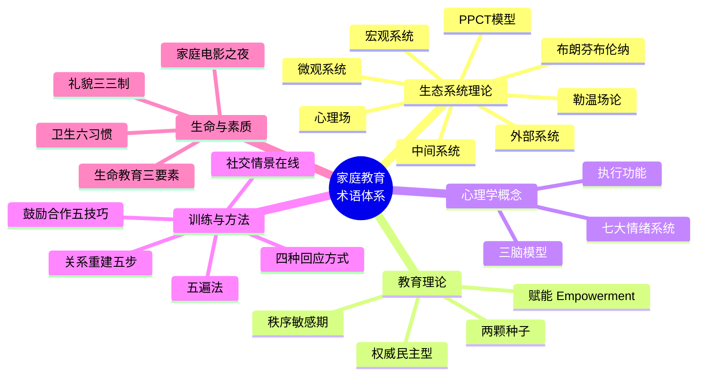

# 术语表 (Glossary)

## 概览

---

## 详细术语表

| 术语（中文） | 术语（英文） | 定义 | 课程来源 |
|-------------|-------------|------|---------|
| 布朗芬布伦纳生态系统理论 | Bronfenbrenner's Ecological Systems Theory | 由美国心理学家Urie Bronfenbrenner提出的儿童发展理论，认为个体发展受嵌套式多层环境系统影响 | 第02-05课 |
| 微观系统 | Microsystem | 儿童直接接触和参与的环境，如家庭、学校、同伴群体，是影响最直接、最强大的层次 | 第03课 |
| 中间系统 | Mesosystem | 微观系统之间的连接和互动关系，如家校沟通、社区与家庭的联系 | 第04课 |
| 外部系统 | Exosystem | 儿童未直接参与但对其发展产生影响的环境，如父母工作单位、社区资源 | 第04课 |
| 宏观系统 | Macrosystem | 最外层的文化、价值观、法律、意识形态等大环境背景 | 第04课 |
| PPCT模型 | Person-Process-Context-Time Model | Bronfenbrenner对其理论的精炼，强调发展是个人特征、过程、情境和时间四个要素交互作用的产物 | 第05课 |
| 勒温场论 | Lewin's Field Theory | 德国心理学家Kurt Lewin提出的理论，认为行为是人与环境交互作用的函数，公式为 B=f(P,E) | 第02课 |
| 心理场 | Psychological Field | 个体在某一时刻所经验到的全部心理现实的总和，包括主观感知和客观环境 | 第02课 |
| 三种配对关系 | Three Dyadic Relationships | 微观系统中的三种人际互动形式：观察性学习、共同活动、基本双人关系 | 第03课|
| 生态发展观四大原则 | Four Principles of Ecological Development | 1) 发展在情境中发生；2) 发展的方向由近及远；3) 发展受多种交互作用驱动；4) 发展需考虑时间维度 | 第05课 |
| 两颗种子理论 | Two Seeds Theory | 陈慧昌教授团队提出的理论，认为儿童发展需要培育"主动性"和"自我控制力"两颗种子，缺一不可 | 第01课 |
| 主动性 | Initiative/Agency | "做自己高兴的事"的内在驱动力，比喻为"油门踏板" | 第01课 |
| 自我控制力 | Self-Control | "接受并完成他人或社会要求"的能力，比喻为"刹��踏板" | 第01课 |
| 权威民主型教养 | Authoritative Parenting | 高要求性与高回应性并存的教养方式，被研究证实最有利于儿童发展 | 第01课 |
| 专制型教养 | Authoritarian Parenting | 高要求性低回应性，强调服从而缺乏温暖 | 第01课 |
| 溺爱型教养 | Permissive Parenting | 低要求性高回应性，缺���边界和规则 | 第01课 |
| 忽视型教养 | Neglectful Parenting | 低要求性低回应性，缺少参与和关注 | 第01课 |
| 家庭心理环境"三有" | Three "Haves" of Family Environment | 有安全、有温度、有规则——健康家庭心理环境的三个要素 | 第06课 |
| 父母"三高" | Three "Highs" of Parents | 高情感表达、高回应性、高榜样示范——赋能型父母的三个特征 | 第06课 |
| 启智计划 | Head Start Project | 美国联邦政府的早期儿童教育项目，旨在缩小低收入家庭儿童的"准备差距" | 第07课 |
| 3000万词汇差距 | 30 Million Word Gap | Hart & Risley的研究发现，低收入家庭儿童到3岁时比高收入家庭儿童少听到约3000万个词汇 | 第07课 |
| 认知升级词汇 | Cognitive Upgrading Vocabulary | 帮助孩子从具象思维向抽象思维过渡的语言工具，如因果词、比较词、假设词等 | 第07课 |
| 情绪词汇 | Emotion Vocabulary | 用于命名和表达情绪的词语，帮助孩子认识和调节情绪 | 第07课 |
| 秩序敏感期 | Sensitive Period for Order | 儿童在特定年龄阶段（约2-4岁）对秩序、规律和一致性表现出强烈敏感性的发展期 | 第08课 |
| 自我服务能力 | Self-Service Ability | 儿童独立完成日常生活基本事务的能力，包括进食、睡眠、如厕、穿衣四大领域 | 第08课 | 卫生六习惯 | Six Hygiene Habits | 六项基本卫生习惯：刷牙洗脸、洗手、洗澡、剪指甲、护眼、护牙 | 第08课
| 学习障碍 | Learning Disability | 影响信息获取、组织、存储、理解和使用的神经发育性障碍，包括阅读障碍、书写障碍、计算障碍等 | 第09课 |
| 执行功能 | Executive Function | 大脑前额叶负责的高级认知功能，包括抑制控制、工作记忆、认知灵活性三大核心 | 第09课 |
| 社交情景在线 | Social Scenario Reenactment | 通过回放或再现社交情景，帮助孩子分析社交行为、理解他人感受、学习恰当回应的训练方法 | 第10课 |
| 四种回应方式 | Four Types of Responses | 家长对孩子需求的四种回应模式：忽视型、专制型、纵容型、权威回应型 | 第10课 |
| 赋能 | Empowerment | 通过信任、支持和资源提供，使个体获得掌控自己生活的能力和信心 | 第11课 |
| 赋能型亲子关系 | Empowerment-Based Parent-Child Relationship | 以信任、尊重、支持为核心的亲子关系模式，目标是培养孩子独立面对生活的能力 | 第11课 |
| 赋能四要素 | Four Elements of Empowerment | 认知赋能、情感赋能、行为赋能、关系赋能 | 第11课 |
| 赋能三内容 | Three Contents of Empowerment | 自我认知、问题解决、社会参与三个维度 | 第11课 |
| 有效沟通四工具 | Four Tools for Effective Communication | 积极倾听、我讯息表达、选择权给予、鼓励性反馈 | 第11课 |
| 三脑模型 | Triune Brain Model | Paul MacLean提出的脑演化模型，将人脑分为爬行脑（本能）、边缘系统（情绪）、新皮层（理性）三层 | 第12课 |
| 七大情绪系统 | Seven Emotional Systems | Panksepp提出的七种原始情绪系统：SEEKING、FEAR、RAGE、LUST、ARE、ANIC/GRIEF、PLAY | 第12课 |
| 疏不堵 | Dredging vs Blocking | 情绪调节的核心原则——疏导而非堵截，帮助孩子识别、接纳、表达情绪 | 第12课 |
| 关系重建五步 | Five Steps to Relationship Repair | 修复亲子冲突的框架：暂停-反思-连接-修复-预防 | 第12课 |
| 沟通三原则 | Three Principles of Communication | 尊重、真诚、共情——亲子沟通的三大基石 | 第13课 |
| 鼓励合作五技巧 | Five Skills to Encurage Cooperation | 描述问题、提示信息、简单词语、表达感受、书面沟通 | 第13课 |
| 父教缺失 | Father Absence | 父亲在子女教育过程中长期或严重缺位的现象，对儿童社会性发展和性别认同产生重大影响 | 第14课 |
| 五遍法 | Five-Pass Method/Deep Learning Method | 从五个维度反复观看一部电影以达成深度学习的方法：故事、历史、人物、细节、艺术表达 | 第15课 |
| 生命教育三要素 | Three Elements of Life Education | 安全意识、生存意志、生存技能——培养孩子珍爱生命、保护生命、发展生命的能力 | 第15课 |
| 家庭电影之夜 | Family Movie Night | 家庭成员固定时间一起观影并讨论的家文化活动，是健康亲子关系的标志 | 第15课 |

---

> [!TIP] 使用建议
> 本术语表与[[frameworks-cheatsheet|核心框架速查]]配合使用效果更佳——术语表解决"是什么"，框架速查解决"怎么用"。