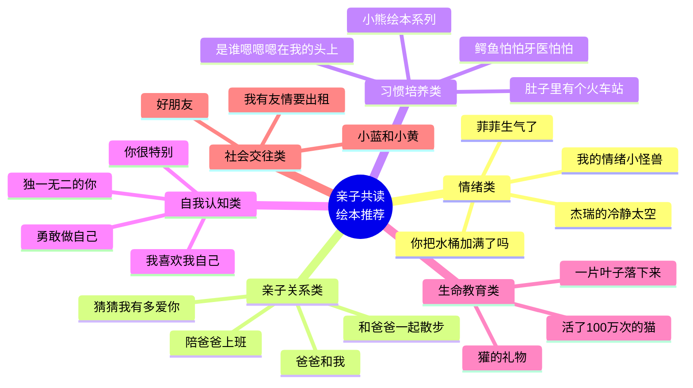

# 推荐绘本清单

---

## 情绪类（ Emotional Development）

| 书名 | 适用场景 | 教育价值 | 来源课程 |
|------|---------|---------|---------|
| 《我的情绪小怪兽》 | 幼儿认识基本情绪（3-6岁） | 用颜色具象化不同情绪，帮助孩子识别和命名情绪 | 第12课：情绪调节 |
| 《菲菲生气了》 | 孩子情绪爆发时（3-8岁） | 展示愤怒的产生到平复的全过程，学习自我调节 | 第12课：情绪调节 |
| 《杰瑞的冷静太空》 | 亲子冲突后情绪修复（4-10岁） | 建立"冷静角"的概念，学习暂停-反思-修复的流程 | 第12课：关系重建 |
| 《你把水桶加满了 > | 积极心理建设（3-8岁） | 用"水桶"比喻心理能量，培养积极的情绪表达 | 第01课：导学课 |

---

## 亲子关系类（Parent-Child Relationship）

| 书名 | 适用场景 | 教育价值 | 来源课程 |
|------|---------|---------|---------|
| 《爸爸和我》 | 亲子陪伴质量反思（全年龄段） | "什么也不做"的陪伴反而最有力量，回归陪伴的本质 | 第01课/第14课|
| 《和爸爸一起散步》 | 父亲陪伴时间不足时（3-10岁） | 散步是最简单的亲子联结方式，强调过程而非目的 | 第01课/第14课|
| 《陪爸爸上班》 | 了解父母工作（3-8岁） | 帮助孩子理解父母的工作角色，培养观察和社会认知 | 第14课|
| 《猜猜我有多爱你》 | 亲子情感表达（2-7岁） | 学习如何用语言和动作表达爱，建立安全依恋 | 第11课：赋能型亲子关系 |

---

## 习惯培养类（Habit Formation）

| 书名 | 适用场景 | 教育价值 | 来源课程 |
|------|---------|---------|---------|
| 《小熊绘本系列》 | 生活习惯养成（1-4岁） | 涵盖刷牙、洗澡、吃饭、睡觉等日常生活场景，利用秩序敏感期培养规律 | 第08课：习惯培养 |
| 《鳄鱼怕怕牙医怕怕》 | 抗拒刷牙时（2-6岁） | 以幽默的方式讲述补牙的过程，帮孩子克服对牙医的恐惧 | 第08课：卫生习惯 |
| 《肚子里有个火车站》 | 挑食偏食时（3-8岁） | 用消化系统的拟人化故事，让孩子理解健康饮食的重要性 | 第08课：饮食习惯 |
| 《是谁嗯嗯在我的头上》 | 如厕训练时（2-4岁） | 以侦探故事的形式认识不同动物的便便，降低如厕训练的羞耻感 | 第08课：如厕训练 |

---

## 自我认知类（Self-Awareness）

| 书名 | 适用情景 | 教育价值 | 来源课程 |
|------|---------|---------|---------|
| 《我喜欢我自己》 | 建立自信自尊（3-8岁） | 帮助孩子接纳自己的优点和缺点，建立积极的自我形象 | 第09课：学习认知|
| 《你很特别》 | 面对同伴比较（4-10岁） | 每个人都是独一无二的，不必活在别人的评价中 | 第11课：赋能|
| 《独一无二的你》 | 社会性发展初期（3-8岁） | 在群体中保持个性，同时接纳他人的差异 | 第10课：社会技能|
| 《勇敢做自己》 | 自我表达（3-8岁） | 鼓励孩子做真实的自己，勇敢面对外界眼光 | 第10课：社会技能|

---

## ���命教育类（Life Education）

| 书名 | 适用场景 | 教育价值 | 来源课程 |
|------|---------|---------|---------|
| 《一片叶子落下来》 | 面对死亡或失去时（4-10岁） | 用叶子的四季变化解释生命的自然循环，帮助理解死亡 | 第15课：生命教育|
| 《獾的礼物》 | 面对亲友去世（4-10岁） | 獾虽然离开了，但留给朋友们的"礼物"（技能/记忆）让它永远活着 | 第15课：生命教育|
| 《活了100万次的猫》 | 理解生命的真谛（5-12岁） | 一只猫活了100万次，直到它学会了爱，才真正"活了一次" | 第15课：生命教育 |

---

## 社会交往类（Social Skills）

| 书名 | 适用场景 | 教育价值 | 来源课程 |
|------|---------|---------|---------|
| 《小蓝和小黄》 | 理解友谊与融合（2-6岁） | 用蓝色和黄色两个色块讲述友谊与融合，是社交概念的入门 | 第10课：社会技能 |
| 《我有友情要出租》 | 社交犹豫或退缩时（3-10岁） | 讲述"出租友情"的故事，帮孩子理解主动交友的价值 | 第10课：同伴关系 |
| 《好朋友》 | 社交规则学习（3-8岁） | 通过三个好朋友的日常，展示分享、轮流、合作的基本社交规则 | 第10课：合作能力 |

---

## 分龄阅读速查

| 年龄段 | 推荐书目 | 阅读重点 |
|--------|---------|---------|
| 1-3岁 | 《小熊绘本》《猜猜我有多爱你》 | 语言节奏、情绪命名、日常习惯 |
| 3-6岁 | 《情绪小怪兽》《菲菲生气了》《小蓝和小黄》| 情绪认知、社交基础、自我意识 |
| 6-10岁 | 《你很特别》《獾的礼物》《活了100万次的猫》| 深层思考、生命教育、品格养成 |
| 10岁以上 | 《一片叶子落下来》| 哲学思辨、价值观讨论 |

---

> [!TIP] 绘本使用建议
> 绘本不在多，在于**反复阅读和深度对话**。同一本绘本在不同年龄读会有不同的理解，建议：
> 1. 第1遍：完整阅读，不打断
> 2. 第2遍：边读边提问
> 3. 第3遍: 角色扮演或延伸活动

---

参见[[glossary|术语表]]获取课程关键概念的详细解释，以及[[frameworks-cheatsheet|核心框架速查]]获取教学框架的总结。