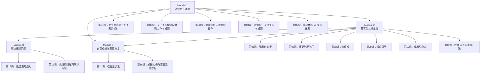
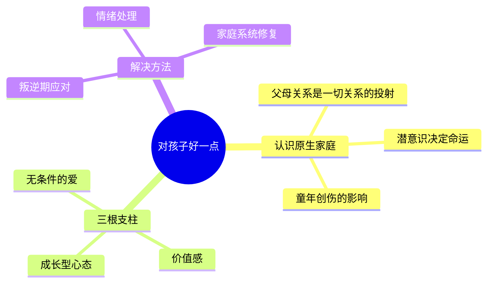

# 课程地图

## 学习路径

本课程分为四个模块，建议按顺序学习：

## 模块依赖关系

- **Module 1** 是所有模块的基础，必须先学
- **Module 2** 可以在 Module 1 之后学，是育儿的核心理念
- **Module 3** 需要 Module 2 的理解作为基础
- **Module 4** 可以从 Module 1 直接进入，也可以学完所有模块后再看

## 核心概念关系

## 参考资源

- [[reference/glossary|核心术语表]]