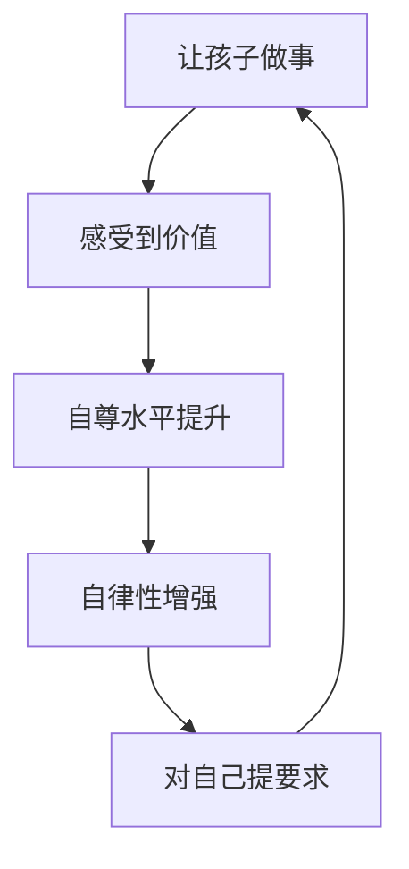

# 第08课：价值感——培养自律的第二根支柱

## 阿德勒：归属感和价值感

阿德勒在《自卑与超越》中提出，一个孩子终其一生都在寻找两样东西：

| 需求 | 对应支柱 | 解释 |
|------|---------|------|
| **归属感** | 无条件的爱 | "我属于这个家"——被无条件包容和接纳 |
| **价值感** | 觉得自己有用 | "我是一个有价值的人"——有动力去成为厉害的人 |

[[0006-wu-tiao-jian-de-ai|第06课的无条件的爱]]解决了归属感问题。但如果一个人有归属感却没有价值感，会怎样？

> 啃老族就是典型——他知道父母会给他钱，他属于这个家，但他没有动力出去做事、成为一个有用的人。

## 价值感的定义

**价值感**就是——**你觉得自己的生命有价值。**

> 初中的时候，我和同学骑自行车回家，讨论要不要也拿把刀去打架。同学说："不值得。"我问为什么。他说："**我们的命比他们的命值钱。**"
>
> 那一刻我突然明白——不去跟人拼命、不为了面子打架，不是因为害怕，而是因为**我的生命更值钱**。

### 没有价值感的人会怎样？

重庆坠江事件中，司机和乘客争吵后，司机一把方向把车开进江里。为什么？

他没有价值感。他觉得"大不了同归于尽"——**自己的命不值钱**。

> [!WARNING]
> 没有价值感的人，不敢在公众面前做领导，不敢承担责任，不敢努力学习改变自己——因为他已经被打击到相信自己"只配过这样的生活"。

## 自尊水平 = 自律性

> **一个人的自律来自他的自尊水平。自尊水平越高，自律性越强。**

### 反例：小偷为什么没有愧疚感？

车站的小偷偷了钱包被人发现，他会不好意思吗？不会。他说"别过来，走掉了"——他不觉得偷东西丢人，因为他的**自尊水平太低**。

> 当一个人的自尊水平很低的时候，偷东西被抓到叫做"运气不好"，不叫"丢人"——混口饭吃，有什么丢人的？

而如果你让在座的任何一个人去楼下偷个东西回来——不是技术问题，是心理上过不去这个坎。你会有**内疚感**。这就是自尊水平的作用。

## 低自尊状态

### 低价值感的孩子会表现出什么？

- 不敢承担领导角色
- 不敢在公众面前表达
- 不敢为改变付出努力
- 沉迷游戏停不下来
- 在诱惑面前没有自制力

### 低自尊是怎么造成的？

父母天天说：

- "你看你不如谁"
- "你看你多糟糕"
- "你要有别人一半就好了"
- "你为这个家做什么贡献了？"

> [!WARNING]
> 很多家庭的结构是这样的：妈妈把所有专注放在孩子身上，通过"挑毛病"来帮助孩子——"只要我挑出足够多的毛病，我的孩子可能就没毛病了吧？"
>
> 实际上，**你挑的毛病越多，他的毛病就越严重。**

## 让孩子做事提升价值感

### 方法一：给孩子做事的机会

> "你为这个家做什么贡献了？"——这句话是价值感的杀手。

事实上，一个孩子对家庭的贡献是全方位的：

- 打扫卫生
- 给家人带来欢笑
- 调动家庭气氛
- 照顾周围人的情绪

> [!TIP]
> 让孩子参与家务，并明确告诉他：**你做这件事有价值，你通过自己的努力改变了自己和周围人的生活。**

樊登的儿子嘟嘟在家里擦楼梯、洗碗、包饺子——不是为了交换（包饺子可以少做题），而是全家一块参与、欢乐很多。

### 方法二：发现亮点并提出表扬

> 你不嫩只盯着孩子的缺点。当你不断地让亮点变得越来越多，阴暗的地方就会变得越来越少。

## 反例：负能量的妈妈

有一次，一个妈妈带孩子来见樊登。樊登正在和孩子聊高中学习的事——

妈妈在旁边一直插嘴："你看樊老师说的，他说得多好，**你看他做不到，我跟你说过，你就是做不到。**"

结果孩子的表情越来越生气，谈不下去了。后来樊登把妈妈请出房间。

> [!WARNING]
> 这位妈妈把所有的人生理想、梦想、未实现的东西，全部寄托在这个孩子身上。孩子变成了她的"私有财产"。
>
> 结果就是孩子的自尊水平极低，将来成为不能改变自己、不能约束自己的人。

## 高自尊水平的示范：手机管理

樊登的手机和iPad随便放在桌上，嘟嘟有自己的手机和iPad。但嘟嘟**自己给自己定要求**：

> 他自己写在墙上：**每周二四六不看手机，一三五看不超过半小时。如果违规，自罚不打游戏了。**

没有任何人提示他——他自己写的。

> [!TIP]
> 自尊水平高的人，会自己向自己提出要求。
>
> 而自尊水平低的人，只要一玩就停不下来——因为父母藏手机、收手机，恰恰说明**你根本没法自律**。

## 价值感与自律的循环

```
给孩子做事的机会 → 让他感受"我有能力改变周围"
→ 自我评价提高（自尊水平上升）
→ 自律性增强 → 对自己提要求
→ 更愿意做事 → 正向循环
```



## 行动清单

1. **让孩子做家务**：不为了交换，而是明确告诉孩子"你对家庭有贡献"。
2. **记录你的语言**：一周内，记录你说的每一句"你不行""你不如别人""你怎么又..."——然后停止用这些语言。
3. **发现亮点**：每天找出孩子做对的三件事，明确表扬并说出意义。
4. **给自主权**：把手机/平板的管理权逐步还给孩子，相信他能自律。
5. **停止比较**：不再说"你看人家……"——每个孩子有自己成长的节奏。

<details>
<summary>自测题（点击展开）</summary>

**Q1：阿德勒认为孩子终生寻找的两样东西是什么？**
A. 金钱和权力
B. 归属感和价值感
C. 自由和快乐
D. 朋友和玩具

<details>
<summary>查看答案</summary>
**B**。归属感来自无条件的爱，价值感来自觉得自己有用。
</details>

**Q2：自尊水平和自律性是什么关系？**
A. 没有关系
B. 自尊水平越低，自律性越高
C. **自尊水平越高，自律性越高**
D. 自尊水平和自律性成反比

<details>
<summary>查看答案</summary>
**C**。一个人的自律来自他的自尊水平。自尊水平越高，越能自我约束。
</details>

**Q3：以下哪种做法最能提升孩子的价值感？**
A. 每天表扬孩子聪明
B. 给孩子做事的机会，并告诉他"你对家庭做出了贡献"
C. 不让孩子做任何家务，专心学习
D. 拿孩子和别人比较

<details>
<summary>查看答案</summary>
**B**。让孩子做事并赋予意义，让他感受到"我有能力改变自己和生活"。
</details>
</details>
