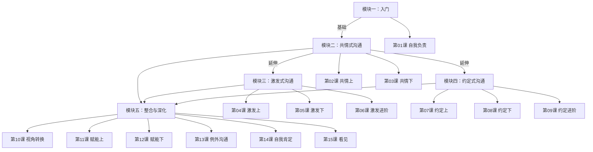

# 课程地图

## 学习建议

### 路径一：顺次学习（推荐）
课程按"从基础到整合"的顺序设计，建议从第01课开始依次学习。

### 路径二：按需学习
如果时间有限，可以按模块选择：

| 你的需求 | 建议的课 |
|---|---|
| 孩子爱发脾气、不听话 | 模块二（第02-03课） |
| 孩子拖拉、没有动力 | 模块三（第04-06课） |
| 想给孩子立规矩 | 模块四（第07-09课） |
| 亲子关系冲突多 | 第10课 + 模块五 |
| 自己容易焦虑失控 | 第14课 |

## 课程总览

| 课号 | 标题 | 核心工具 | 难度 |
|---|---|---|---|
| 01 | 如何让孩子学会自我负责 | 系统思维框架 | ★☆☆ |
| 02 | 共情式沟通（上） | 倾听与反映感受 | ★★☆ |
| 03 | 共情式沟通（下） | 情绪管理4步法 | ★★☆ |
| 04 | 激发式沟通（上） | 例外提问 | ★★☆ |
| 05 | 激发式沟通（下） | 内在动力激活 | ★★☆ |
| 06 | 激发式沟通（进阶） | 减少干预 | ★★★ |
| 07 | 约定式沟通（上） | 规则共定 | ★★☆ |
| 08 | 约定式沟通（下） | 规则执行 | ★★☆ |
| 09 | 约定式沟通（进阶） | 边界判断 | ★★★ |
| 10 | 视角转换式沟通 | 双视角对话 | ★★★ |
| 11 | 赋能式沟通（上） | 优势发现 | ★★☆ |
| 12 | 赋能式沟通（下） | 挫折中成长 | ★★☆ |
| 13 | 例外沟通 | 例外思维 | ★★★ |
| 14 | 自我肯定式沟通 | 情绪觉察 | ★★☆ |
| 15 | 看见孩子，也看见自己 | 整合回顾 | ★☆☆ |

## 学习记录建议

- 每学一课，记录一个你当天实际应用该沟通模式的尝试
- 不必追求完美——重点是觉察和练习
- 学完所有课后，回顾你的学习记录，你会看到自己的变化

---

> [!TIP] 学习节奏
> 课程原设为21天，建议至少留出 15 天完成，每天一课，预留时间练习和反思。这不是一次"读完"的课程，而是"练会"的课程。