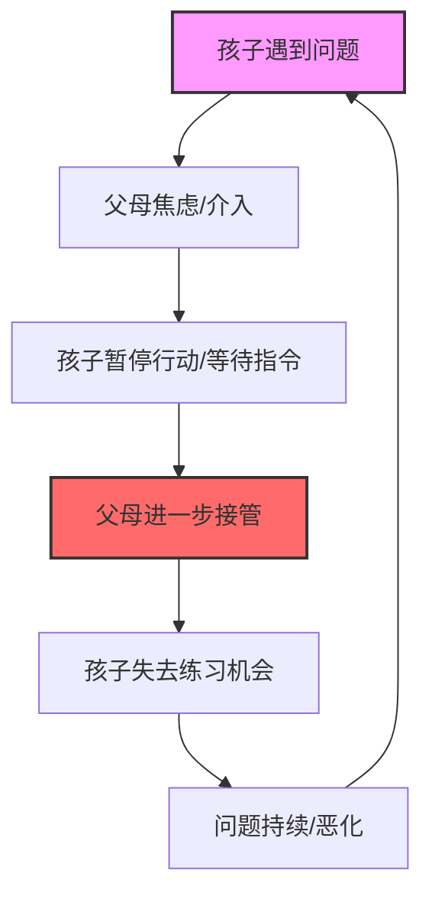

# 第01课：如何让孩子学会自我负责？

> [!TIP] 核心观点
> 自我负责不是一个需要施加在孩子身上的要求，而是一段需要父母退后一步才能腾出的空间。孩子不是"缺少自我负责"，而是"没有机会自我负责"。

---

## 什么是"自我负责"？

李松蔚老师在课程开篇提出了一个反直觉的观点：**自我负责不是孩子的个人属性，而是亲子之间的互动模式。**

日常生活中，我们很容易把"自我负责"理解成一个静态的品质——有的孩子天生自觉，有的孩子天生拖拉。但系统养育的角度不同：**你看到的每一个"孩子的问题"，都在某种程度上被你的反应所维持。**

这个循环的关键在于：**父母的介入越是及时、越是全面，孩子发展自我负责能力的空间就越小。**

---

## 抗生素滥用隐喻

李松蔚用了一个非常精辟的比喻——**抗生素滥用**。

> [!NOTE] 隐喻：抗生素与"过度养育"
> 当一个孩子感冒发烧，家长立刻用最顶级的抗生素，症状当然会快速消失。但问题是：孩子自身的免疫系统没有经过实战锻炼，下一次感冒会更严重，需要更强的抗生素。最终，孩子的免疫系统彻底依赖外部药物，失去了自愈能力。
>
> "过度养育"也一样。你替孩子解决了今天的问题，却剥夺了他解决明天问题的能力。

这个隐喻揭示了一个残酷的真相：**父母越是"负责"，孩子越是"不负责"。** 不是孩子天生如此，而是互动的结果。

---

## 从"孩子的问题"到"我们的互动模式"

系统养育最核心的思维转换是：

| 旧思维 | 新思维 |
|---------|---------|
| 孩子不自律 | 我们之间的互动让孩子不需要自律 |
| 孩子太拖拉 | 我的催促在替代他的时间感 |
| 孩子不主动学习 | 我一督促，他就停止主动 |
| 怎么让孩子改变 | 我能否先改变自己的反应？ |

> [!WARNING] 警惕"隐性获益"
> 有时候，父母"接管"孩子的某个问题，其实在潜意识中解决了父母自身的焦虑。孩子的问题是"显性的"，但父母的焦虑是"隐性的"。你催促孩子写作业，看似在帮他，实质是在缓解自己的不安。

这种视角转换不是要指责父母，而是**邀请父母看到自己的力量**——你一直在影响这个系统，因此你也有能力改变它。

---

## 练习：识别你的互动模式

请拿出纸笔，做一个简单的练习：

1. **写下孩子一个让你头疼的具体问题**（例如："每天早上不肯起床"）
2. **写下你惯常的回应**（例如："我叫他五遍，最后掀被子，他哭着起床"）
3. **把两者连起来**——这就是你们的互动模式

示例

- **孩子的问题**：写作业拖到最后一刻
- **父母的反应**：每天提醒、催促、最后忍不住帮忙
- **模式识别**：孩子在等父母的"最后通牒"才开始行动。父母的存在替代了他的内在时间表。
- **破局思路**：能否在某一天停止提醒，让他自己承担一次后果？

---

## 改变的第一步：不做

系统养育的起点，往往不是"做什么"，而是**"不做什么"**。

当你想说"快去写作业"时，停顿三秒。当你想要替他收拾书包时，把手放回去。当你想提醒他明天有考试时，先问问自己：这个提醒是在帮他，还是在维持他的依赖？

> [!QUESTION] 自检清单
> 在你介入孩子的问题之前，先问自己三个问题：
> 1. 这个问题真的需要我现在出面吗？
> 2. 我的介入是帮孩子学会自己处理，还是替他把问题解决掉？
> 3. 如果我今天不做这件事，最坏的结果是什么？孩子能承受吗？

---

## 本课小结

| 关键概念 | 要点 |
|---------|------|
| 自我负责 | 不是个人特质，而是互动模式的结果 |
| 父母接管-孩子退缩循环 | 父母越负责，孩子越不负责 |
| 抗生素隐喻 | 过度干预削弱孩子的"心理免疫力" |
| 视角转换 | 从"改变孩子"到"改变互动" |
| 第一步 | 先学会"不做"，让出空间 |

---

## 延伸阅读

- [[0002-gong-qing-shang|下一课：第02课 共情式沟通（上）——如何发现孩子真实的感受和想法？]]

**课后作业**：本周选择一件你平时会替孩子做的事，刻意不做，观察孩子的反应和你的感受。记录下来，这将为后续课程提供宝贵的材料。