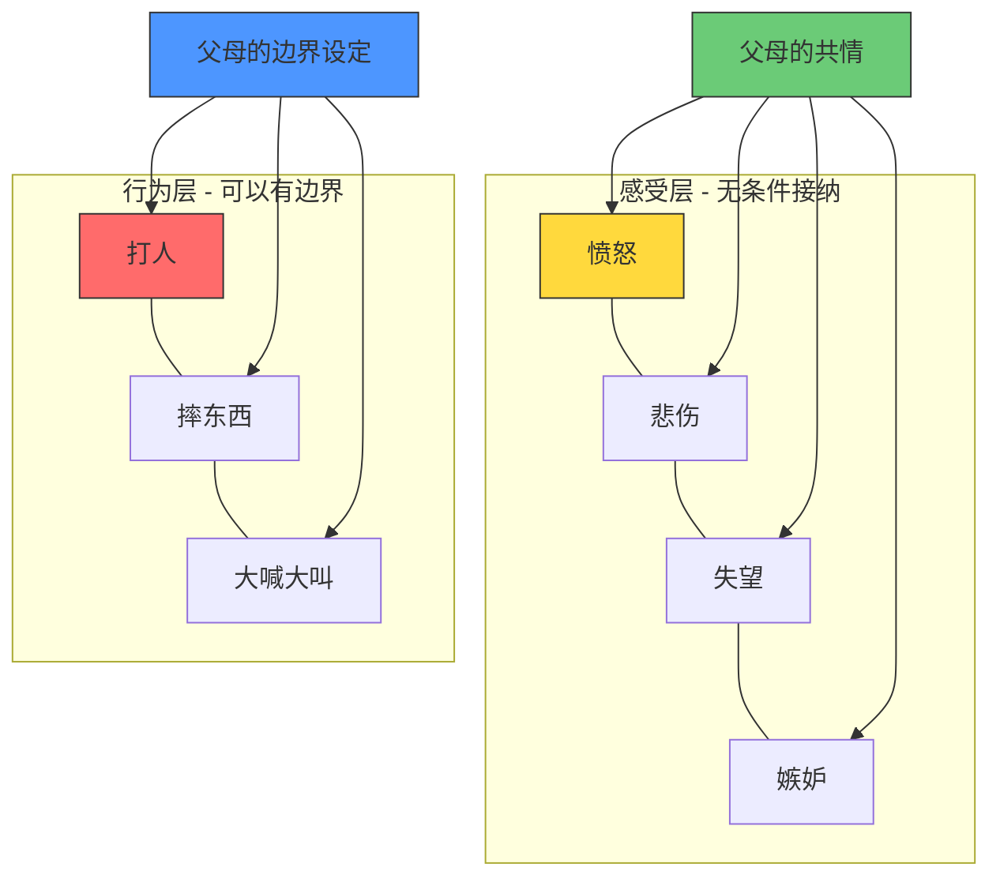

# 第03课：共情式沟通（下）——4步帮孩子学会管理负面情绪

> [!TIP] 核心观点
> 孩子不是需要一个"灭火"的父母，而是需要一个教会他们"如何使用灭火器"的父母。

---

## 一个关键区分：感受 vs 应对感受的方式

在上一课中，我们学习了共情——看见并承认孩子的感受。但很多家长会问：难道孩子发脾气、打人、摔东西，我们也要"共情"吗？

这节课的第一个核心区分就是：**感受本身 ≠ 应对感受的方式。**

- **感受层面**：无条件的共情和接纳——所有的感受都是允许的
- **行为层面**：明确的边界和引导——不是所有的行为都是允许的

这个区分给了父母一个非常清晰的操作指南：**在感受上靠近，在行为上引导。**

---

## "救火队员"心态：为什么你总在崩溃边缘？

李松蔚老师指出，大多数父母在面对孩子的负面情绪时，陷入了一种"救火队员"心态。

> [!WARNING] 救火队员陷阱
> 孩子的每一次情绪爆发，在父母眼中就是一场"火灾"。父母冲过去"灭火"——制止、说教、转移注意力、满足要求。
>
> 问题在于：真正的火灾需要消防员，而孩子的负面情绪不是火灾。它更像是一个**警报系统**——提醒你"这里有需要被关注的事"。
>
> 当你总是扮演救火队员，你会：
> 1. 越来越累——火灾永远扑不完
> 2. 越来越焦虑——每次报警都让你紧张
> 3. 剥夺孩子——孩子永远学不会"自己还没到着火的程度"

---

## 情绪的生理基础：情绪脑 vs 理性脑

为了更好地理解为什么孩子会"失控"，我们需要了解大脑的工作机制。

| 大脑系统 | 功能 | 激活时机 |
|---------|------|---------|
| **情绪脑**（杏仁核系统） | 快速反应、生存本能、情绪反应 | 遇到威胁或挫折时优先激活 |
| **理性脑**（前额叶皮层） | 逻辑思考、冲动控制、决策判断 | 情绪平稳时才能工作 |

> [!NOTE] 重要认知
> 当孩子情绪爆发时，他的"理性脑"基本上处于离线状态。你试图跟他讲道理——就像试图给一台死机的电脑输入指令。
>
> 这不是孩子"不听话"，而是他的生理状态决定了此刻他**无法**理性思考。共情的作用不是跳过情绪直接讲道理，而是先帮助情绪脑"降温"，让理性脑重新上线。

---

## 情绪自我管理四步法

李松蔚老师提出了孩子在情绪爆发时可以遵循的四步流程。注意：**这些步骤不是父母替孩子做的，而是父母引导孩子自己做的。**

### 第一步：标记——"这是什么情绪？"

帮助孩子给情绪命名。当孩子能够说出"我很生气""我很失望""我很委屈"，情绪强度就已经开始下降。

> **言语化的力量**：神经科学研究表明，当一个人用语言表达情绪时，杏仁核的活跃度会显著降低。这就是"说出来就好了"的生理基础。

父母可以问："你现在这种感觉叫什么？是生气，还是委屈，还是觉得不公平？"

### 第二步：确认——"这种情绪是正常的"

告诉孩子：这种感受是正常的，每个人都会遇到。

> "遇到这种事，生气是很正常的。""换了任何人都会难过的。"

这句话传递的信息是：你没有问题，你的感受没有问题。

### 第三步：调节——"怎么让身体舒服一点？"

引导孩子找到**不伤害自己也不伤害他人**的调节方式：

- 深呼吸（"像吹气球一样慢慢吹气"）
- 喝一杯水
- 去自己的房间待一会儿
- 用力抱一个枕头
- 画一幅表达情绪的图画

> [!TIP] 重要的是孩子的选择
> 不要替孩子决定"你应该怎么做"。提供几个选项，让孩子自己选择。**选择权本身就有疗愈作用。**

### 第四步：复盘——"下次可以怎么做？"

等到情绪完全平复后（可以是半小时后，甚至第二天），再和孩子一起回顾：

- "刚才发生了什么？"
- "你的感受是怎么变化的？"
- "下次再遇到这种事，你有什么新的想法？"

> [!WARNING] 复盘时机很重要
> 不要在情绪刚平复的时候立刻复盘。情绪脑需要时间完全冷却。过早复盘可能再次触发情绪。

---

## 案例：超市里的大哭大闹

想象一个典型场景：孩子在超市里因为想要一个玩具被拒绝而大哭大闹。

### 常见错误应对：

- **妥协型**："好好好，买给你，别哭了。"（孩子学到：大哭可以得到想要的）
- **压制型**："再哭我就把你留在这里！"（孩子学到：表达情绪是危险的）
- **说教型**："家里已经有那么多玩具了，你怎么这么不懂事？"（孩子学到：我的需求不被理解）

使用四步法：

| 步骤 | 父母可以说什么 |
|------|---------------|
| ①标记 | "你真的很想要那个玩具，现在得不到，感到很失望，对不对？" |
| ②确认 | "得不到想要的东西，当然会失望，这很正常。" |
| ③调节 | "我们能不能先深呼吸一下？来，像吹气球一样慢慢吹……" |
| ④复盘 | （回家后）"今天在超市，我们下次遇到这种情况可以怎么做？" |

> [!NOTE] 情绪调节是技能，不是天赋
> 就像学骑车一样，情绪调节是一个需要反复练习的技能。孩子第一次、第十次都可能做得不好，这完全正常。父母需要的是**耐心和一致性**——每次都用同样的框架来引导。

---

## 情绪树练习

李松蔚老师推荐了一个长期练习：

> [!QUESTION] 家庭"情绪树"活动
> 准备一棵树形图（可以画在纸上，也可以是磁贴板），每天晚饭后，全家人各自用一个词描述自己今天的主要情绪，挂到树上。
>
> 这样做的好处：
> 1. 让情绪表达成为日常习惯
> 2. 孩子看到父母也有各种情绪——情绪正常的
> 3. 创造一个安全的空间来讨论感受
> 4. 积累情绪词汇量

---

## 本课小结

| 关键概念 | 要点 |
|---------|------|
| 感受 vs 行为 | 感受无条件接纳，行为有条件引导 |
| 救火队员陷阱 | 情绪不是火灾，不需要"灭火" |
| 情绪脑 vs 理性脑 | 先降温，再讲道理 |
| 四步法 | 标记→确认→调节→复盘 |
| 言语化 | 说出情绪名称即可降低强度 |
| 复盘时机 | 情绪完全平复后再回顾 |

---

## 延伸阅读

- 下一课：[[0004-ji-fa-shang|第04课 激发式沟通（上）——动机区分：发现孩子真正的动力]]
- 前一课：[[0002-gong-qing-shang|第02课 共情式沟通（上）——如何发现孩子真实的感受和想法？]]

**课后作业**：本周选择一个场景（最好是孩子情绪中等强度时），刻意练习四步法。特别留意第一步"标记"——尝试用一个更精准的情绪词汇来描述孩子的感受。记录你的使用过程和孩子的反应。