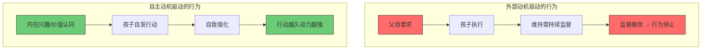

# 第04课：激发式沟通（上）——动机区分：发现孩子真正的动力

> [!TIP] 核心观点
> 孩子不做一件事，通常不是"没动力"，而是"没有你的动力"。问题不在于动力的大小，而在于动力的来源。

---

## 系统养育视角下的"动机"

在传统思维中，"没动力"是一个贬义的评价——孩子懒、不上进、没有自驱力。但在系统养育中，李松蔚老师提出了一个颠覆性的定义：

> **动机不是孩子的内在属性，而是孩子与任务之间的关系的质量。**

这意味着：同一个孩子，面对不同任务、不同环境、不同关系时，"动机"可以完全不同。一个被老师说"不爱学习"的孩子，可能在拼乐高时专注四个小时。他不是"没动力"，而是他的动力没有被正确地接入。

---

## 两种动机：自主动机 vs 外部动机

| 维度 | 外部动机 | 自主动机 |
|------|---------|---------|
| 来源 | 父母要求、奖励、惩罚、比较 | 兴趣、好奇心、价值认同、胜任感 |
| 典型语言 | "妈妈让我做""不做会挨骂" | "我想做""我觉得有意思" |
| 持续性 | 需要外部监督维持 | 可以自我维持 |
| 情感体验 | 压力、焦虑、被动 | 满足、投入、自由 |
| 遇到挫折时 | 容易放弃 | 更容易坚持 |

> [!WARNING] 奖励的陷阱
> 很多家长习惯用奖励来激发动机："考了100分带你去游乐场。"这在短期内有效，但长期可能反而削弱内在动机。
>
> 心理学研究（德西效应）表明：当一项活动原本具有内在乐趣时，外部奖励会降低人的内在兴趣。因为大脑会把"我为什么做这件事"的归因从"我感兴趣"悄悄变成"为了得到奖励"。

---

## 动机区分三步法

这是一个可以随时使用的评估工具。当孩子不愿意做某件事时，按照这三个步骤来诊断：

### 第一步：暂停——别急着"推动"

当孩子说"我不想写作业""我不想练琴"时，多数父母的第一反应是施加压力。三步法的第一步恰恰是**不做反应**。

暂停的好处：
- 不陷入"你推我挡"的循环
- 给自己时间思考：这到底是孩子的动力问题，还是我的焦虑问题？
- 给孩子一个表达真实想法的空间

### 第二步：换位——从孩子的视角看这个任务

问自己几个问题：

- **这个任务对孩子来说意味着什么？**（是挑战还是负担？是游戏还是苦役？）
- **如果我是孩子，我为什么不想做？**（太难？太无聊？太重复？还是有其他情绪障碍？）
- **孩子完成这个任务时，体验到的更多是满足感还是被控制感？**

> [!NOTE] 关键洞察
> 很多时候，孩子抗拒的不是任务本身，而是**被安排的感觉**。同样的"写作业"，如果来自自己的计划，和来自父母的命令，对孩子来说是两件完全不同的事。

### 第三步：区分——找出动力类型

做一张简单的评估表：

| 检查项 | 是/否 |
|--------|-------|
| 孩子在没有监督时也会自发做这件事吗？ | |
| 孩子做这件事时会表现出投入和专注吗？ | |
| 孩子会主动谈论或展示这件事的成果吗？ | |
| 如果没有任何外部奖励，孩子还愿意做吗？ | |
| 孩子会自己设定目标和标准吗？ | |

如果大部分回答是"否"，说明当前行为主要由外部动机驱动，需要逐步向内转化。

---

## 关键问题转换：从"我怎么让他做"到"他为什么需要做"

李松蔚老师提出了一个核心的提问转换：

| 旧问题（控制导向） | 新问题（激发导向） |
|-------------------|------------------|
| 怎么让他听话？ | 他为什么需要做这件事？ |
| 怎么让他主动学习？ | 学习这件事和他的生活有什么连接？ |
| 怎么让他放下iPad？ | iPad满足了他的什么需求？还能用什么替代？ |
| 怎么让他不拖拉？ | 他的节奏和我有什么不同？ |

> [!TIP] 问题转换练习
> 下一次当你想要"让孩子做某事"时，先把问题从"我怎么让他做"改成"如果他做了，对他自己有什么好处"。
>
> 如果你发现"对他其实没什么好处——只是对我有好处"，你就找到了动力的真正卡点。

---

## 案例应用

### 案例1：理发

孩子拒绝理发，每次都是连哄带骗甚至强行按住。

- **旧思路**：怎么让他乖乖坐着理发？
- **系统养育思路**：理发对孩子来说意味着什么？

通过换位思考发现：理发器在耳边嗡嗡响的感觉让3岁孩子恐惧，碎发掉到脖子里很不舒服，而且孩子不理解"为什么要改变我的发型"——他对自己现在的样子很满意。

**转化策略**：不是"解决理发问题"，而是"让理发变成孩子可以接受的经验"。可以先在家玩理发店游戏（自主感），让他先用理发器玩具在娃娃头上练习（掌控感），告诉他"剪完头发可以变得很精神"（价值感）。

### 案例2：收拾房间

- **旧思路**：怎么让房间保持整洁？（父母的需求）
- **系统养育思路**：孩子对整洁有什么需求？

很多孩子并不觉得"乱"是一个问题——乱是一种舒适的秩序，他清楚地知道每样东西在"乱堆"里的位置。

**转化策略**：重新定义"收拾"的目标——不是"为整洁而收拾"，而是"为找到想找的东西而收拾"。让孩子设计他想要的收纳方案，而不是执行父母的标准。

### 案例3：写作业

- **旧思路**：怎么让他主动写作业？
- **系统养育思路**：完成作业对他自己有什么具体的好处？

不是灌输"学习是为了未来"这种空洞的话，而是帮助孩子找到具体的、当下的连接点：做完作业后可以有自由时间、掌握一个知识点时那种"我懂了"的满足感、可以和同学讨论的资格感。

> [!QUESTION] 反思练习
> 回想你和孩子最近的一次"动力冲突"——他不想做，你想让他做。
>
> 1. 你当时的第一反应是什么？（威胁？奖励？说教？）
> 2. 如果换用三步法（暂停→换位→区分），你会看到什么不同的东西？
> 3. 这件事有没有可能从"外部动机"往"自主动机"方向移动一点点？

---

## 本课小结

| 关键概念 | 要点 |
|---------|------|
| 自主动机 vs 外部动机 | 动力来源比动力大小更重要 |
| 动机区分三步法 | 暂停→换位→区分 |
| 德西效应 | 过度奖励可能削弱内在动机 |
| 问题转换 | 从"怎么让他做"到"他为什么需要做" |
| 系统养育动机观 | 动机是人与任务的关系质量 |

---

## 延伸阅读

- 下一课：[[0005-ji-fa-xia|第05课 激发式沟通（下）——如何培养孩子的自主动机？]]
- 前一课：[[0003-gong-qing-xia|第03课 共情式沟通（下）——4步帮孩子学会管理负面情绪]]
- 关联课程：[[0001-zi-wo-fu-ze|第01课 如何让孩子学会自我负责？]]

**课后作业**：本周选择一个孩子"没有动力"的任务，使用三步法进行分析。然后尝试调整你的沟通方式——至少一次，问孩子："你觉得做这件事对你有什么好处？"而不是告诉他有什么好处。记录孩子的回答和你的观察。