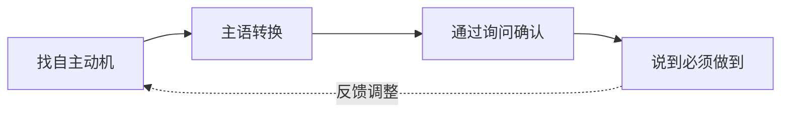

# 第05课：激发式沟通（下）——把你想让孩子做的，变成TA主动要做的

## 学习目标

- 掌握"责任转换四步法"，将父母的要求转化为孩子的自主行动
- 学会"主语转换"这一核心技巧：从"你要做"到"我要做"
- 理解"说到必须做到"在责任转换中的关键作用

## 核心概念：责任转换

上节课我们学习了用"例外提问"帮孩子发现自己的成功经验。这节课要解决一个更根本的问题——**如何让孩子从"被要求做"变成"主动要做"**。

很多父母有这样的困惑：我知道不能总催促，可我不催孩子就不动啊！怎么办？

答案就在**责任转换**——把行动的责任从父母身上转移到孩子身上，而父母要做的，是创造一个让孩子**主动选择行动**的情境。

### 责任转换的核心原理

当父母说"你要......"时，孩子感受到的是外部压力。大脑对压力的自然反应是**抵抗或逃避**。即使孩子照做了，TA也没有真正内化这个行为——TA只是在服从，不是在做自己的选择。

而当我们把责任还给孩子，让TA感受到"这是我自己的决定"，孩子的内在动力才会被激活。

## 责任转换四步法

### 第一步：找自主动机

在和孩子沟通之前，先问自己一个问题：**"这件事，孩子自己有可能在意什么？"**

每个行为背后都有一个正向意图。孩子可能不在意"必须9点睡觉"，但TA可能在意"明天有精神玩"；可能不在意"收拾玩具"，但TA可能在意"下次还能找到乐高小人"。

找到孩子的自主动机，是让TA愿意行动的前提。

### 第二步：主语转换——核心技巧

这是本课最重要的工具。

> [!IMPORTANT] 主语转换公式
> **变"你句式"为"我句式"**
>
> - "你要……" → "我想……"
> - "你应该……" → "我需要……"
> - "你必须……" → "我打算……"

**为什么有效？**

当父母说"我想回家了"而不是"你该回家了"，孩子听到的不是命令，而是**一个真实的人的真实需求**。孩子不再需要对抗"被控制"的感觉，而可以主动选择配合——这给了孩子尊严和主动性。

**经典例子：回家场景**

- ❌ "我们该回家了！现在就走！"（命令，引发抵抗）
- ✅ "我有点累了，我想回家了。"（表达自我，留出空间）

第一种说法，孩子要么闹情绪，要么被动服从。第二种说法，孩子可能会说"我还想再玩一会儿"，但TA不觉得自己在被控制——这就打开了商讨的空间。

**睡觉场景**

- ❌ "你该睡觉了！快去刷牙！"
- ✅ "我困了，我想去睡了。你呢？"

把"你该睡了"换成"我想去睡了"，孩子反而会觉得自己需要跟上。

### 第三步：通过询问确认

主语转换后，需要通过提问来确认孩子是否愿意配合。这不是形式上的问句，而是真的给孩子选择权。

> "我想回家了。你是想再玩3分钟，还是现在就走？"

这个提问包含了两个关键元素：
1. 承认孩子的需求（还想玩）
2. 给出有限选择（3分钟或现在走）

选择权在"怎么执行"，而不在"要不要执行"——既尊重了孩子，也守护了边界。

### 第四步：说到必须做到

这是责任转换中最容易被忽视的一步。

如果父母说"我想回家了"，孩子说"再玩5分钟"，5分钟后孩子还是不走，父母就妥协了——那这个模式就失效了。

> [!WARNING] 说到不做到，等于教孩子"说话可以不算数"
> 当父母轻易放弃自己设定的边界时，孩子学到的不是灵活，而是"规则可以讨价还价""不用当真"。

说到做到不是惩罚孩子，而是尊重约定。如果约定的是3分钟，3分钟后温和坚定地执行。孩子可能会哭闹，但TA会慢慢学会：**父母的"我要"是认真的，我的选择也有后果**。

## 案例分析

### 案例一：回家时间

**场景**：周末在游乐场，孩子玩得不亦乐乎，天快黑了。

**传统反应**：
> "都几点了！赶紧回家！每次叫你走都这么费劲！"

**孩子反应**：不高兴、磨蹭、哭闹或沉默对抗。

**责任转换**：
> "我有点累了，也饿了，我想回家了。你是再玩3分钟还是5分钟？"

**孩子反应**："5分钟！"
**5分钟后**："时间到了哦，我们说好的。走吧。"

### 案例二：睡觉时间

**场景**：晚上10点，孩子还在看电视。

**传统反应**：
> "你看看都几点了！还不去睡觉！明天又起不来！"

**责任转换**：
> "我今天好累啊，我想去睡了。你呢，是再看完这一集，还是现在就关？"

## 常见误区

1. **主语转换变成变相命令**：语气很重要。"我想回家了"如果是咬牙切齿地说，孩子感受到的还是控制。
2. **只转换主语不给选择**：转换后必须跟上选择和尊重，否则只是换汤不换药。
3. **说到做不到**：这是最大的问题。没有执行力的约定比没有约定更糟。

## 自我检测

> [!QUESTION] 练习：主语转换
> 请把下面的"你句式"转换成"我句式"：
> 1. "你该写作业了！"
> 2. "你必须把玩具收好！"
> 3. "你不要再玩手机了！"

参考答案

1. ✅ "我在想，作业是不是该写了我有点担心你写不完。"
2. ✅ "我希望玩具不要散在地上，我怕踩到摔倒。"
3. ✅ "我注意到你玩手机很久了，我有点担心你的眼睛。"

关键不是书面语是否完美，而是你是否真的在表达**自己的感受和需求**，而不是在控制孩子。

## 课后实践

**本周练习任务**：
每天至少一次，用"我句式"代替"你句式"和孩子沟通。记录你的尝试和孩子的反应。

| 日期 | 场景 | 你说的话 | 孩子反应 | 反思 |
|---|---|---|---|---|---|
| 第1天 | | | | |
| 第2天 | | | | |
| 第3天 | | | | |

## 回顾清单

- [ ] 我理解了"责任转换"为什么比"要求服从"更有效
- [ ] 我掌握了主语转换的技巧：从"你要做"到"我要做"
- [ ] 我知道为什么要给选择权，而不是只做形式上的主语转换
- [ ] 我理解了"说到做到"是责任转换成功的关键
- [ ] 我完成了至少一次的"我句式"练习

## 下一课

[[0006-ji-fa-jin-jie|第06课：激发式沟通（进阶）——如何避免做得越多错得越多]]