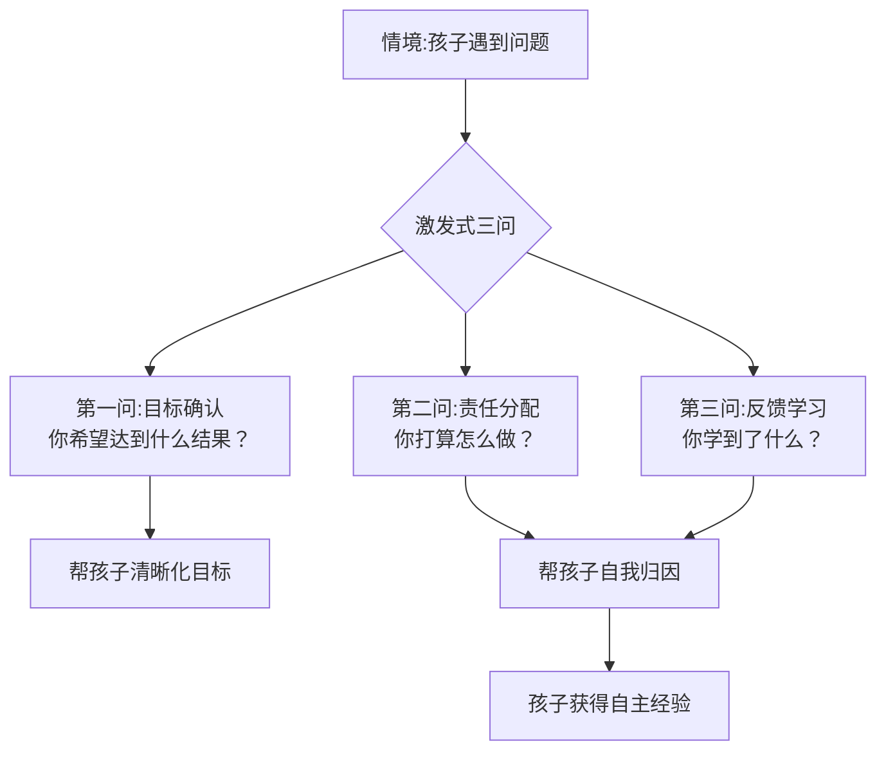

# 第06课：激发式沟通（进阶）——如何避免做得越多错得越多

## 学习目标

- 理解"助人自助"的核心原则：不替孩子解决问题
- 掌握"激发式三问"：目标确认 → 责任分配 → 反馈
- 学会用提问代替告知，从"答案提供者"转型为"提问者"

## 核心原则：助人自助

进入进阶篇，我们先直面一个扎心的事实：

> 在孩子的问题上，**你做得越多，反而错得越多**。

听起来反直觉，但仔细想想：

- 你越盯着孩子写作业，TA越拖拉——因为TA觉得"反正妈会提醒我"
- 你越帮TA处理社交冲突，TA越不会自己解决问题
- 你越替TA做决定，TA越没有主见

**这不是孩子的问题，而是系统的问题**。在这个亲子系统中，父母承担了过多的责任，孩子自然就退到了被动的位置上。

### 养花人隐喻

> [!TIP] 养花人
> 想象你是一位养花人。如果你每天把花拔出来看看根有没有长好，这朵花反而长不好。最好的方式是：浇好水、给足阳光，然后——**让花自己长**。
>
> 父母要做的事是**创造环境**，而不是**替花生长**。

## 核心方法：激发式三问

李松蔚老师提出了"激发式三问"，这是避免过度干预的核心框架。

### 第一问：目标确认

**"你希望达到什么结果？"**

当孩子遇到问题时，父母的第一反应往往是给解决方案："你应该......"

取而代之的是——先帮孩子澄清目标。很多时候孩子自己都不知道自己想要什么，TA只是沉浸在情绪中。

**示例**：
> 孩子："小明今天不和我说了！"
>
> ❌ 父母："那你去跟他道歉啊。"
> ✅ 父母："嗯，你希望和小明的关系变成什么样？"

**效果**：孩子从"情绪抱怨"转向"目标思考"。

### 第二问：责任分配

**"你打算怎么做？"**

当目标明确后，把球传给孩子。这个问题隐含了一个信念：**这是你自己的问题，你有能力找到答案。**

孩子可能会说"我不知道"——没关系，父母可以继续追问：
- "如果知道的话，你觉得会是什么？"
- "你见过别人怎么处理类似的情况吗？"
- "你觉得第一步可以做什么？"

> [!WARNING] 不急于给答案
> 当父母太早给出答案，孩子就失去了思考的机会。宁可让孩子想一个"不太完美"的办法，也比直接告诉他标准答案好。

### 第三问：反馈学习

**"你学到了什么？"**

这是闭环的关键。无论孩子的行动结果是成功还是失败，都要引导TA复盘。

**示例**：
> 孩子和同学约了周末一起玩，但两个人忘了确认时间，结果没见到。
>
> ❌ 父母："我早说了让你提前确认！"
> ✅ 父母："这件事让你想到了什么？下次怎么可以避免？"

## 案例分析

### 案例一：孩子社交冲突

**场景**：8岁的女儿回家哭着说好朋友不和她玩了。

**传统反应**：
> "别哭了。你明天去跟她说对不起，你们就和好了。"

**问题**：父母替孩子解决了问题，孩子没有学到任何社交技能。

**激发式三问**：
1. **目标确认**："嗯，你很难过。你希望和她变成什么样子？"
   - 女儿："我想还和她做好朋友。"
2. **责任分配**："那你觉得可以怎么做呢？"
   - 女儿："我不知道......"
   - 父母："如果知道的话，你觉得会是什么？"
   - 女儿："也许我可以给她写个小纸条？"
3. **反馈**："这个主意不错。不管结果怎么样，你都可以跟我说说学到了什么。"

### 案例二：学骑自行车

**场景**：孩子学骑车，摔了几次后想放弃。

**传统反应**：
> "别放弃！妈扶着你就不会摔了。"

**问题**：父母用"我来帮你"代替了孩子的自我突破。

**激发式三问**：
1. **目标确认**："你是想完全放弃，还是只是现在不想练了？"
   - 孩子："我只是不想摔了。"
2. **责任分配**："那你觉得怎么做可以不摔？"
   - 孩子："也许我可以先练平衡，不踩踏板？"
3. **反馈**："是个办法。你试完告诉我结果。"

## 为什么提问比告知更有效？

从神经科学的角度看：当一个人**自己得出结论**时，大脑会释放更多的多巴胺，记忆更深刻，行动动力更强。

而从心理学角度看：**当孩子自己想到解决方案时，TA把成功归因于自己**——"是我自己想到的办法"，这种自我效能感是外在给予无法替代的。

| 对比维度 | 告知式沟通 | 提问式沟通 |
|---|---|---|
| 责任归属 | 父母负责 | 孩子负责 |
| 情绪体验 | 被动、抗拒 | 自主、积极 |
| 学习深度 | 表面服从 | 深度内化 |
| 长期效果 | 依赖外部推动 | 形成内在动力 |
| 亲子关系 | 控制与被控制 | 陪伴与支持 |

## 常见误区

1. **假装提问**：明明已经有答案，还假装问孩子"你觉得呢？"——孩子能感觉到你不是真心的。
2. **提问后否定**：孩子给出答案后，父母说"不对，应该是......"——一次就摧毁了孩子的信心。
3. **忽略情绪**：在孩子情绪激动时直接提问——先共情，再提问。
4. **太急着问**：孩子说"不知道"时立刻给答案——给孩子时间思考，或换一种问法。

## 自我检测

> [!QUESTION] 练习：转变思维方式
> 请将以下"告知式回应"转化为"提问式回应"：
> 1. 孩子："我不想上学了"→ 你通常会说"不行，必须去"
> 2. 孩子把水杯打翻了 → 你通常会说"怎么这么不小心"
> 3. 孩子说"我数学好难"→ 你通常会说"那你多做题"

参考答案

1. ✅ "嗯，是什么让你不想去了？你希望在学校有什么不一样？"
2. ✅ "水洒了。你需要什么？抹布在哪？"
3. ✅ "数学哪个部分让你觉得难？你打算从哪开始解决？"

核心变化：从**判断和指令**转向**好奇和探索**。

## 课后实践

**本周练习任务**：
选择一个场景（吃饭、作业、玩手机、起床），在和孩子沟通时：

1. 先问自己：**我是不是又在替孩子承担责任了？**
2. 把"你应该"换成"**你希望是什么结果？**"
3. 记录孩子的反应

> [!NOTE] 小提醒
> 一开始会很不习惯，孩子也可能不配合。这很正常——因为你在改变你们之间的互动模式。坚持一周，你会看到变化。

## 回顾清单

- [ ] 我理解了"做得越多错得越多"背后的系统逻辑
- [ ] 我记住了激发式三问：目标确认 → 责任分配 → 反馈
- [ ] 我尝试至少一次用提问代替告知
- [ ] 我没有在孩子说"不知道"时立刻给答案
- [ ] 我把养花人隐喻记在了心里——创造环境，让花自己长

## 下一课

[[0007-yue-ding-shang|第07课：约定式沟通（上）——给孩子立规矩时记住这1条黄金定律]]