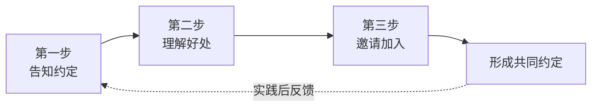

# 第07课：约定式沟通（上）——给孩子立规矩时记住这1条黄金定律

## 学习目标

- 理解"权威投射"的危害——为什么用警察/老师吓唬孩子会适得其反
- 掌握"变规则为约定"三步法：告知约定 → 理解好处 → 邀请加入
- 理解约定式规则的三大好处：自主动机、不盲目服从、灵活性

## 黄金定律：规则不是"命令"，而是"约定"

立规矩是每个父母的必修课。但为什么有的规矩孩子愿意遵守，有的规矩却天天对抗？

答案藏在这条黄金定律里：

> [!IMPORTANT] 黄金定律
> **把"规则"变成"约定"——让孩子从"被规矩管"变成"我参与了规矩的制定"**

一字之差，逻辑完全不同：

- **规则**：是父母单方面制定、强制执行的东西。孩子感受到的是控制。
- **约定**：是双方共同确认、彼此承诺的东西。孩子感受到的是尊重。

## 错误方式：权威投射

在讲正确方法之前，先看看最常见的错误——**权威投射**。

### 什么是权威投射？

当父母说以下这些话时，就是在做权威投射：

- "你再不听话，警察叔叔就来抓你了！"
- "你再不好好学习，老师会批评你的！"
- "你再哭，我就叫医生来给你打针！"
- "你这样做，别人会笑话你的！"

> [!WARNING] 权威投射的代价
> 用第三方权威吓唬孩子，表面上有效，但代价巨大：
> - **破坏信任**：孩子学着把父母之外的人都看作"敌人"
> - **外驱力依赖**：没人监督就不守规矩
> - **恐惧代替理解**：孩子守规矩是因为怕，而不是因为懂

### 权威投射的根源

父母为什么会用权威投射？因为——**省事**。

吓唬一下马上见效，比耐心解释要快得多。但最省事的方法，往往是最不长远的。

## 正确方法：变规则为约定三步法

### 第一步：告知约定

用"我"开头，清晰、诚实地告诉孩子规矩的内容。不编造吓人的理由，不夸大后果。

> "我们家的约定是：周一到周五不看电视。"

就这么简单直接。不含糊、不吓唬。

### 第二步：理解好处

解释为什么有这个约定。关键是**把好处和孩子自己的利益联系起来**，而不是说"这是为你好"。

**电影院案例**：

> ❌ "你不许在电影院说话，否则管理员会把你赶出去！"（权威投射）
>
> ✅ "我们在电影院不说话，是因为电影院是大家看电影的地方。如果说话，别人就听不清电影在说什么了，那多扫兴啊？"

关键在于——孩子需要**从内心理解规矩的逻辑**，而不是因为害怕某个权威。

**红绿灯案例**：

> "红灯停，绿灯行，为什么？不是因为警察会抓你，而是因为如果不这么做，大家都会撞在一起，谁也走不了。这是大家为了保护自己，约定好的。"

### 第三步：邀请加入

把规矩从"父母的规定"变成"我们共同的选择"。

> "我们一家人一起来遵守这个约定，好不好？"
>
> "你觉得这个约定公平吗？有没有什么需要调整的？"

这一步让孩子感受到：**我不是被规矩管着，我是规矩的参与者。**

## 约定式规则的三大好处

### 1. 自主动机

当孩子理解了规矩的**逻辑和好处**，TA会内化为自己的行为准则。不需要监督，不需要惩罚，TA自己会遵守——因为TA懂了。

### 2. 不盲目服从

约定式沟通培养的不是听话的孩子，而是**有判断力的孩子**。

当孩子面对"所有人都这么做但不对"的情况时，TA能独立思考——而不是"因为别人让我这么做我就做"。

### 3. 有调整空间

约定是可以商讨的。父母不是规则的"统治者"，而是规则的"共同维护者"。

> 孩子："我觉得这个约定不太合理......"
> 父母："说说看，你觉得怎么调整更好？"

这才是约定式沟通的开放态度。

| 维度 | 规则思维 | 约定思维 |
|---|---|---|
| 制定者 | 父母单方面 | 共同参与 |
| 动力来源 | 外部惩罚/奖励 | 内在理解 |
| 执行方式 | 监督与约束 | 自律与承诺 |
| 调整机制 | 父母说了算 | 共同商讨 |
| 亲子关系 | 管与被管 | 合作伙伴 |

## 案例分析

### 案例一：电影院

**场景**：第一次带孩子去电影院。

**错误做法**：
> "到电影院不许说话，不许乱跑，听到没有？不然保安叔叔会把你带走的！"

**约定式沟通**：
> 出门前："宝贝，我们要去电影院看电影。电影院里有个约定——大家都不说话，这样才能好好看电影。你觉得这个约定好不好？"
>
> 孩子点点头。
> "如果有人在里面说话，别人就听不清电影在说什么了，是不是很可惜？"
> "那我们说好了，我们都遵守这个约定，好不好？"

### 案例二：放学回家先写作业

**错误做法**：
> "回家必须先写作业！老师说了，作业不写完明天会被批评！"

**约定式沟通**：
> "我们聊聊每天回家后的时间安排吧。你觉得放学后是先休息一会儿再写作业，还是先写完作业再玩？"
> "如果先玩再写，有时候会忘了时间，作业写到很晚。你觉得哪种安排对你更好？"

## 常见误区

1. **假约定真命令**：形式上问孩子"好不好"，但孩子一说不马上就否定。——这不是约定，是套路。
2. **只讲规则不讲原因**：孩子不理解规矩的合理性，就不会内化。
3. **父母自己违规**：父母自己玩手机却要求孩子不玩——约定是双方的。
4. **一步到位求完美**：约定可以调整，不需要第一次就完美。

## 自我检测

> [!QUESTION] 练习：识别沟通模式
> 判断以下说法是"规则思维"还是"约定思维"：
> 1. "你再不睡觉，明天老师会批评你的！"
> 2. "我们家约定好了，吃饭的时候不看手机。"
> 3. "我说不行就是不行！"
> 4. "你觉得这个安排怎么样？有什么需要调整的吗？"

参考答案

1. ❌ **规则思维（权威投射）**——用老师吓唬孩子
2. ✅ **约定思维**——用"约定"表达家庭规范
3. ❌ **规则思维**——单方面强制命令
4. ✅ **约定思维**——邀请孩子参与修订

## 课后实践

**本周练习任务**：
选择一个你想给孩子立的规矩，用三步法重新设计：

1. **告知约定**：清晰、诚实地说明规矩是什么
2. **理解好处**：把规矩的好处和孩子自己的利益挂钩
3. **邀请加入**：请孩子加入这个约定

> 把整个过程写下来，贴在冰箱上——这是你们的"家庭约定书"。

## 回顾清单

- [ ] 我理解了权威投射的危害——不再用警察/老师/别人吓唬孩子
- [ ] 我掌握了变规则为约定三步法
- [ ] 我能向孩子解释规矩背后的"为什么"
- [ ] 我给孩子参与制定约定的空间
- [ ] 我知道约定式规则的三大好处

## 下一课

[[0008-yue-ding-xia|第08课：约定式沟通（下）——孩子破坏规则，比吼叫更好的方式是什么？]]