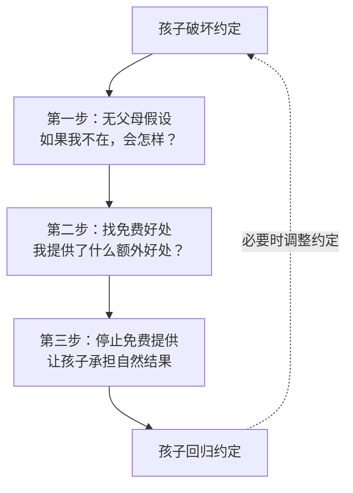
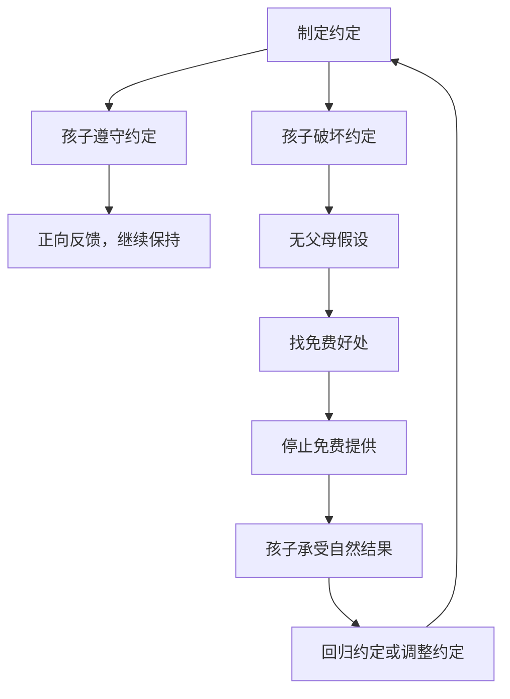

# 第08课：约定式沟通（下）——孩子破坏规则，比吼叫更好的方式是什么？

## 学习目标

- 理解"免费的好处"这一核心概念
- 掌握"无父母假设 → 找免费好处 → 停止免费提供"三步法
- 学会在不吼叫、不惩罚的前提下，让孩子遵守约定

## 核心概念：免费的好处

想象一下：

你和孩子约定好"每天只能看30分钟平板"。第一天TA看完了但自觉关掉了。第二天也还好。第三天，TA开始拖——说"再看一集""还有两分钟"——然后你妥协了。

从那天起，这个约定就名存实亡了。

为什么？

> [!IMPORTANT] 免费的好处
> **"免费的好处"（Free Benefits）** 是指：当孩子违反约定时，父母因为没有严格执行约定而**免费提供**的额外利益。
>
> 孩子破坏规则的成本 = 0，甚至还能获得额外的好处（多看10分钟平板、多吃一颗糖、不用收玩具）。
>
> 那TA为什么要遵守规则？

### 一个核心洞见

孩子破坏规则，不是因为TA坏或不听话，而是因为**从TA的角度看，破坏规则比遵守规则更划算**。

- 遵守规则：少看10分钟平板，什么也没得到
- 破坏规则：多看10分钟平板，代价不过是妈妈念叨两句

这笔账，任何一个孩子都会算。

## 三步法：停止免费提供

### 第一步：无父母假设

当孩子破坏约定时，先问自己一个问题：

> **"如果我不在场——没有任何人管这件事——孩子会怎么做？**

这个假设的作用是把"父母的作用"从等式中剔除，让你看清**系统原本的逻辑**。

**示例——收拾玩具**：
> 约定的规矩：玩完玩具要收好。
> 实际发生：孩子玩完就跑去看电视了。
>
> ❌ 父母介入："你给我回来！不收好不许看电视！"（吼叫+威胁）
>
> ✅ **无父母假设**：如果我不在，玩具会散在地上，没人收。孩子明天想玩的时候找不到——这是自然结果。

### 第二步：找免费好处

问自己第二个问题：

> **"因为我在场，孩子获得了什么本不该获得的好处？"**

**收拾玩具案例**：
- 免费好处：妈妈会帮我收——反正有人收，我不用动手

**吃饭慢案例**：
- 免费好处：妈妈会等我、喂我、催我——我磨蹭也没关系

**起床困难案例**：
- 免费好处：妈妈会叫我一遍又一遍——迟到的后果由妈妈承担

> [!TIP] 洞见
> 当你发现你为孩子做的事，比规则本身还"多"的时候——你就找到了"免费的好处"。

### 第三步：停止免费提供

当你找到了免费的好处，就停止提供它。

**这不等同于惩罚**。惩罚是"我额外给你一个你不想要的后果"，而停止免费提供是"我不再给你你不应得的利益"。

**关键区别**：
- 惩罚：你破坏了规矩，罚你面壁10分钟（额外施加痛苦）
- 停止免费：你破坏了规矩，我不再帮你收玩具（回归自然状态）

## 案例分析

### 案例一：收拾玩具

**场景**：约定了玩完玩具要收好，但孩子总是不收。以前每次都靠妈妈跟在后面收。

**第一步：无父母假设**
如果妈妈不收，玩具一直在地上。孩子下次想玩时，找不到拼图块，乐高踩到脚会痛。

**第二步：找免费好处**
妈妈提供了"免费收纳服务"——孩子不收玩具没有任何不便，反正妈妈会收。

**第三步：停止免费提供**
> 妈妈："从今天开始，玩具你自己的，你收。如果你不收，它们就在地上。下次你想玩找不到零件，妈妈也不会帮你找。"

**执行**：
孩子第一天没收，第二天想玩拼图发现少了三块，急得哭。妈妈说："我可以理解你很难过。晚上我们一起找找看？但下一次，记得收好。"

> [!WARNING] 执行的关键
> 不生气、不指责、不威胁。只说事实——"你没收，所以零件丢了。"这是自然结果，不是惩罚。

### 案例二：吃饭慢

**场景**：3岁孩子吃饭慢，一顿饭吃40分钟到1小时，外婆追着喂。

**第一步：无父母假设**
如果没人管，孩子饿了自己会找东西吃。慢是因为TA不饿，或者有别的诱惑。

**第二步：找免费好处**
外婆提供了"追着喂"的服务——孩子不用担心饿肚子，反正有人会喂到嘴里。

**第三步：停止免费提供**
> 和家人商量好：不追着喂、不超过30分钟收碗。中间不给零食。

**执行**：
第一天孩子哭，没吃几口就收碗了。晚上饿了自己主动要吃饭。三天后，吃饭时间缩短到20分钟。

### 案例三：起床困难

**场景**：小学二年级，每天早上叫不醒，催了又催还是迟到。

**第一步：无父母假设**
如果没人叫，孩子会睡过头，迟到。

**第二步：找免费好处**
妈妈提供了"人工闹钟+反复催促"——孩子不用自己负责起床，反正妈妈会一遍遍叫。

**第三步：停止免费提供**
> 妈妈："宝贝，妈妈从明天开始不叫你起床了。我给你买了一个闹钟，你自己定时间。如果你迟到了，去学校跟老师解释。"

**执行**：
第一天，孩子果然迟到了。被老师批评了。第二天，闹钟一响自己就起来了。

> [!WARNING] 敢不敢做？
> 这是最考验父母的一步。很多父母做不到，因为心疼孩子被批评。但请想一想："被老师批评一次"和"养成长达数年的起床拉锯战"，哪个成本更高？

## 约定式沟通的完整闭环

## 常见误区

1. **把"停止免费"等同于"惩罚"**：不是的。停止免费是收回你不该给的东西，惩罚是额外给予痛苦。
2. **心疼孩子，坚持不下来**：这是最大的障碍。心疼孩子被批评，结果就是永远无法建立真正的规则。
3. **只说不做**：警告了但不执行，孩子学会了"妈妈只是说说而已"。
4. **一次性解决所有问题**：先选一个最重要的问题来练习，不要同时改变所有规矩。

## 自我检测

> [!QUESTION] 练习：找出免费的好处
> 以下场景中，父母提供了什么"免费的好处"？应该怎么停止？
> 1. 每天晚上的约定是9:00上床，但孩子总找各种理由拖到9:30。妈妈每次都妥协。
> 2. 孩子约好了自己背书包，但每天出门前都"忘"了，妈妈只好帮忙拎。
> 3. 约定每天只能吃一颗糖，但孩子哭闹，老人就多给一颗。

参考答案

1. 免费好处：妈妈提供了"额外30分钟的清醒时间"，哭闹就能多玩。停止：到点收走电子产品、关灯，温和坚定。
2. 免费好处：妈妈提供了"代背书包服务"。孩子没有不便。停止：书包放门口，妈妈不帮忙。迟到了没带书？那是自然结果。
3. 免费好处：老人提供了"额外糖"，哭闹就能多得。停止：全家统一，说一颗就是一颗。孩子哭可以陪TA，但不给第二颗。

> 关键：**全家统一、温和坚定、不吼不叫。**

## 课后实践

**本周练习任务**：
1. 选择一个孩子经常破坏的约定
2. 做"无父母假设"——如果我不在，会发生什么
3. 找到你提供的"免费的好处"
4. 制定"停止免费提供"的计划
5. 和家人商量好，统一执行

记录表：
> 约定：\_
> 免费好处：\_
> 停止方案：\_
> 执行结果：\_
> 孩子反应：\_
> 我的感受：\_

## 回顾清单

- [ ] 我理解了"免费的好处"的含义
- [ ] 我能在孩子破坏约定时，先问"如果我不在会怎样？"
- [ ] 我能识别出自己免费提供了什么
- [ ] 我敢于停止免费提供，让孩子承担自然结果
- [ ] 我区分清楚了"停止免费"和"惩罚"的不同
- [ ] ️我完成了本周的实践练习

## 本模块索引

- [[0007-yue-ding-shang|第07课：约定式沟通（上）——立规矩的黄金定律
- [[0008-yue-ding-xia|第08课：约定式沟通（下）——免费的好处
- [0009-yue-ding-jin-jie|第09课：约定式沟通（进阶）——边界判断