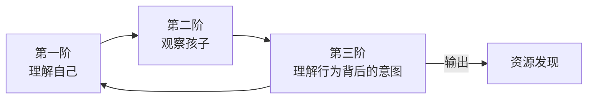

# 第11课：赋能式沟通（上）——看到你和孩子的潜在优势

## 学习目标

- 建立"孩子这么做一定有他的道理"的核心信念
- 掌握三阶思维训练：理解自己 → 观察孩子 → 理解行为背后的正向意图
- 学会从"问题视角"转向"资源视角"，发现行为背后的积极功能

## 核心观点

### 一个改变亲子关系的信念

在赋能式沟通之前，我们学了很多技巧——共情、激发、约定、视角转换。这些技巧都非常有用，但有一个前提：**你得先相信这些技巧值得用。**

如果从心底里你认定"这孩子就是故意气我""他就是懒""他就是不懂事"，那任何沟通技巧都会变成"更高级的控制手段"——不是为了理解他，而是为了让他听话。

李松蔚老师在前面的课程中反复强调一个信念，现在我们要把这个信念放到聚光灯下：

> **孩子这么做，一定有他的道理。**

这不是一句鸡汤，而是一个**方法论的前提**。当你真正相信这句话，你的表情、语气、姿态都会不同——孩子能感觉到。

> [!TIP] 核心信念的力量
> "孩子这么做一定有他的道理"不是要你赞同孩子的所有行为。而是说：在任何一个看起来有问题的行为背后，都有一个对这个孩子来说"合理"的理由。**我们的任务不是纠正行为，而是先找到这个"合理"的理由。** 一旦找到了，解决问题的路径往往自然浮现。

### 三阶思维训练

要把这个信念从"知道"变成"做到"，需要经过三个阶段的思维训练：

#### 第一阶：理解自己

在分析孩子的行为之前，先分析你自己的状态。

问自己：

- **我现在的情绪是什么？**（愤怒？焦虑？疲惫？羞耻？）
- **我为什么会有这个情绪？**（是因为孩子的行为本身，还是因为我觉得"这样下去他以后怎么办"？是因为旁边有人看着我？）
- **我现在的状态适合和孩子沟通吗？**（如果情绪太强，先处理自己的情绪）

> 这不是让你自责，而是让你觉察。觉察到"我现在很疲惫，所以对孩子不耐烦"不是你的错——但如果你没有觉察到，你就会把"不耐烦"归因于"这孩子太不听话了"。

#### 第二阶：观察孩子

放下评判，只观察事实。

| 评判性描述 | 观察性描述 |
|------------|------------|
| "他太懒了" | "他今天回到家先在沙发上躺了30分钟，然后才开始写作业" |
| "他一点都不专心" | "他写作业的时候，每10分钟就会起来喝水/上厕所/拿东西" |
| "他故意和我作对" | "我让他收拾书包，他继续玩手机，没有回应我" |

观察不改变事实，但改变你对事实的解读。一个"懒"的孩子和一个"需要先休息再学习"的孩子，前者需要被修理，后者需要被理解。

#### 第三阶：理解行为背后的正向意图

这是三阶思维的核心。问自己：**孩子的这个行为，对他来说有什么"好处"？**

每个行为都有其功能，即使是那些看起来"不好"的行为。常见的"正面功能"包括：

- **获得关注**（哪怕是负面的关注）
- **获得控制感**（当他觉得生活里没有其他事能控制时）
- **逃避不适**（包括生理上的不适和情绪上的不适）
- **表达需求**（当他不善于用语言表达时）
- **保护自己**（避免失败、避免批评）

> [!NOTE] 关键转变
> 从"这不对"转向"孩子从这件事里得到了什么"。这个转变是赋能式沟通的起点。一旦你找到了行为背后的"正面功能"，你就不再用压制的方式去处理它——你会找到更好的替代方案。

## 实战案例

### 案例一：玩具被抢了——孩子打人

**场景：** 在游乐场，一个小朋友抢了孩子的玩具车。孩子打了那个小朋友。家长赶紧冲过去制止。

**第一阶：理解自己**
> 家长觉察：我很尴尬——周围有别的家长看着。我怕别人觉得我孩子暴力，也觉得我教育失败。

**第二阶：观察孩子**
> 放下"打人是不对的"这个评判。观察事实：孩子2秒前还在开心地玩车，玩具被抢走，他没有语言能力表达不满，他选择了最直接的方式——动手。

**第三阶：理解行为背后的意图**
> 孩子的行为背后有什么正面功能？
> - **保护自己的所有物**：这是一种本能的自我捍卫
> - **表达愤怒**：他不会说"我很生气，请你把玩具还给我"
> - **解决问题的尝试**：虽然方式不对，但他在试图解决"玩具被抢"的问题

**赋能式沟通的回应：**

> 家长先抱起孩子到旁边（不是作为惩罚，而是离开冲突场景），然后说：
>
> "你很生气，因为小朋友抢了你的车，是吗？"（共情 + 认可感受）
>
> 孩子点头。
>
> "你不喜欢玩具被拿走。你打他是想让他还回来，对吗？"（理解行为的意图）
>
> 孩子又点头。
>
> "嗯，妈妈知道你不想让她拿走你的玩具。不过打人会让她受伤，也解决不了问题。下次她再抢你的，你可以大声说'还给我'，或者过来找妈妈帮忙。我们一起来想办法，好吗？"（提供替代方案）

这个回应中，家长做了三件事：**认可意图（"你想让他还回来"）、指出问题（打人解决不了）、提供替代方案**。孩子的感受是"妈妈理解我"，而不是"我做错了，妈妈不爱我了"。

### 案例二：沉迷王者荣耀

**场景：** 孩子一放学就玩王者荣耀，怎么说都不听。作业拖到很晚才写。

**第一阶：理解自己**
> 家长觉察：我的焦虑点是"他以后怎么办"——现在就不学习，以后考不上好学校，找不到好工作……我怕的是未来的失控，不是当下的游戏。另外，看到他玩游戏不理我，我有一种被忽视的感觉。

**第二阶：观察孩子**
> 观察事实：他每天放学后玩1.5-2小时游戏，然后吃晚饭，7点半以后开始写作业。作业基本能在9点半前完成。成绩中等，没有明显下滑。

**第三阶：理解行为背后的意图**
> 游戏的正面功能是什么？
> - **社交需求**：王者荣耀是同学们都在玩的话题，他需要通过这个融入同伴圈子
> - **成就感**：在学习上可能找不到的成就感，游戏里可以快速获得
> - **放松**：在学校的规训环境待了一整天，回家需要一段"自己的时间"
> - **控制感**：学习是被安排的，游戏是他自己选择的

**赋能式沟通：**

> 家长选择了一个平静的时间（不是他正玩游戏的时候），说：
>
> "妈妈发现你很喜欢玩王者荣耀。这个游戏到底哪里好玩？你能不能教教我？"
>
> （用好奇代替评判——这是赋能式沟通的经典开场。）
>
> 孩子很惊讶，然后开始兴奋地介绍游戏。
>
> "哦，所以你和同学一起玩的时候，你们会讨论战术？"
>
> "对了，我注意到你每次都能在9点半前写完作业。你是怎么做到的？"
>
> 孩子可能会说："我玩的时候心里有个闹钟，差不多到点我就停下来了。"
>
> "哇，你这个时间管理能力很强啊。那有没有哪些时候，你计划得挺好但最后没控制住？那时候怎么办？"

这个对话中，家长做了两件关键的事情：
1. **对孩子的资源表示了兴趣和欣赏**（"你能在9点半前写完"、"你的时间管理能力强"）
2. **把"游戏问题"变成了"自我管理问题"**——不是"我要管你玩游戏"，而是"你如何管理自己玩游戏"

> [!WARNING] 重要提醒
> 如果你在第三阶发现孩子玩游戏确实影响到了学习（成绩大幅下滑、作业无法完成），那你需要的不是"让他不玩"，而是和他一起找"平衡"的方案。这个时候可以回到[[0008-yue-ding-xia|约定式沟通（下）]]中的规则执行策略。赋能式沟通不是放任，而是**在理解的基础上找到共同解决方案**。

## 资源发现：从"问题视角"到"资源视角"

赋能式沟通的上半部分说到底是：**训练自己看到资源的能力。**

很多家长在看到孩子"有问题"时，第一反应是焦虑。焦虑让你只能看到"问题"，看不到"问题背后正在生长的能力"。

资源发现的练习：

| 孩子的"问题" | 背后的潜在资源 |
|--------------|----------------|
| 太固执 | 有主见、坚持自己的立场 |
| 太敏感 | 感知力强、有同理心 |
| 太好动 | 精力充沛、好奇心强 |
| 太内向 | 善于观察、内心丰富 |
| 太爱顶嘴 | 有批判性思维、敢于表达 |

> 请注意：这不是让你用"正面词汇"替换"负面词汇"来自欺欺人。而是说：**每一个特征都是一体两面的。** 当你只看到负面的时候，你就只能压制它；当你看到正面的时候，你就可以善用它。

## 实践练习

### 本周练习：三次"资源发现"

选择三件你通常认为"孩子有问题"的事情，用下面的框架分析：

1. **发生了什么？**（只写观察，不写评判）
2. **孩子从这件事中得到了什么？**（行为的正向功能）
3. **这个行为背后藏着什么资源？**（从"问题"中发现可能的优势）
4. **我能做什么来善用这个资源？**

> [!QUESTION] 练习记录
> 试一次"教教我"式的对话——当孩子做了一件你不太理解的事，不要急着评判，而是说："这个我不太懂，你能不能教教我？"记录孩子的反应和你的感受。

练习示例

**场景：** 孩子把早餐吃的煎饼折成了各种形状，不肯好好吃。

1. **观察：** 孩子把煎饼撕成小块，叠成了一个小人形状，然后兴奋地展示给我看。
2. **正向功能：** 他在发挥创造力、在探索材料、在寻求认可。
3. **潜在资源：** 动手能力强、有空间想象力、有表现欲。
4. **善用方式：** "哇，你用小饼做了一个小人！那要不要再做一个，然后我们编一个故事？"——在游戏中顺便吃掉。

## 常见误区

### 误区一：理解行为就是为坏行为开脱
理解不等于纵容。理解是说"我明白你为什么这样做"，不是"你就这样做吧"。你的底线仍然在——打人不对、作业要完成——但你在执行底线之前，先用理解打开了沟通的大门。

### 误区二：只分析孩子，不分析自己
三阶思维从"理解自己"开始是有原因的。如果你自己的情绪没有被觉察和处理，你对孩子的所有"理解"都会带着评判的味道。孩子能感觉到你的语气里有没有真正的接纳。

### 误区三：资源发现就是强行正能量
如果你内心觉得"这孩子就是故意气我"，但嘴上说"你好有主见哦"，孩子会觉得你在讽刺他。资源发现的前提是你真的在找——**不是为了让自己好受，而是为了看见完整的他。**

## 本课回顾

- **核心信念**：孩子这么做一定有他的道理，这是赋能式沟通的前提
- **三阶思维训练**：理解自己 → 观察孩子 → 理解行为的正向意图
- **从评判到观察**：放下"他就是这样的人"的标签，只看事实
- **资源视角**：每个"问题"后面都藏着一个资源，你的任务是发现它
- **"教教我"的力量**：用好奇心替代评判，给孩子表达的空间

## 自我测验

> [!QUESTION] 自测题
> 将下列"问题描述"改写为包含"资源视角"的描述：
> 1. "他太磨蹭了，写个作业拖两个小时"
> 2. "她太爱顶嘴了，我说一句她顶十句"
> 3. "他太黏人了，我走哪他跟哪"

参考答案

1. **资源视角**："他写作业有自己的节奏，虽然时间长，但他对每个题目都很认真，需要时间思考。他的"慢"可能是一种专注和深度思考的表现。"
2. **资源视角**："她敢于表达自己的观点，即使和权威（父母）不一致也不害怕。这种勇气和批判性思维在成长中非常宝贵。"
3. **资源视角**："他对和我的关系有很强的安全感需求，这是我们亲子关系的基础。他对我的信任让他敢于表达依赖——这是很多孩子长大后就不再有的一种亲近感。"

## 下一步

进入第12课[[0012-fu-neng-xia|赋能式沟通（下）]]，学习如何通过三类赋能式提问，帮助孩子在挫折中发现自己的能力和资源。