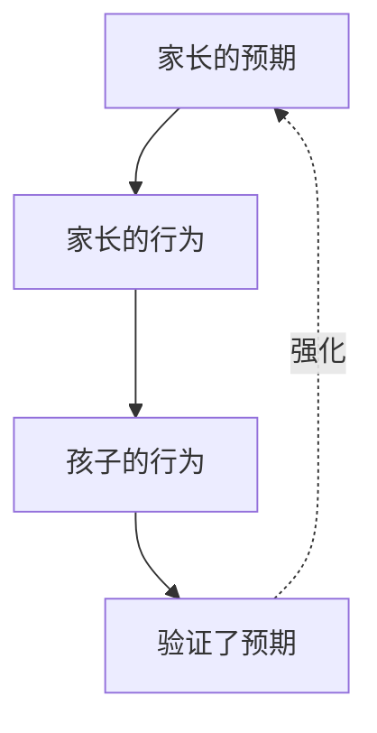

# 第12课：赋能式沟通（下）——引导孩子在挫折中自我成长

## 学习目标

- 理解"预期自证效应"在亲子关系中的运作机制
- 掌握三类赋能式提问：可控感提问、收获提问、应用提问
- 学会在信任尚未被"证实"之前先付出信任，打破负面循环

## 核心观点

### 预期自证效应：你相信什么，就会看到什么

在上节课中，我们学习了从"问题视角"转向"资源视角"。但这里有一个微妙的问题：**当你真的相信孩子有资源时，会发生什么？**

心理学上有一个著名的概念叫**预期自证效应**（self-fulfilling prophecy）。简单说就是：**你对一个人的预期，会微妙地影响你对他的行为，而这个行为又会促使他朝着你的预期发展。**

这个效应在亲子关系中表现得特别明显：

举两个例子对比：

**负面循环：**
1. 家长预期："这孩子一点自控力都没有"
2. 家长行为：不断提醒、催促、检查（因为"我不盯着他他肯定又偷懒"）
3. 孩子行为：被盯着烦躁→对抗→或者真的不盯着就偷懒
4. 验证预期："看吧，我说了他没有自控力"

**正面循环：**
1. 家长预期："这孩子其实有能力管好自己"
2. 家长行为：给他空间、信任他、让他自己负责
3. 孩子行为：感受到信任→愿意承担更多责任→尝试自我管理
4. 验证预期："他真的可以做到"

> [!WARNING] 残酷的真相
> 预期自证效应的核心问题是：**你需要先在"没看到证据"的时候相信，才能看到证据。** 如果你坚持"等他做到了我再相信他"，你永远等不到那一天——因为你的不相信本身就在阻碍他做到。

这就是赋能式沟通最难的地方：**信任必须在证据之前。** 这不是盲目的信任，而是一种选择——你选择相信他有这个能力，然后你用这个相信来引导他，最终他真的发展出这个能力。

### 三类赋能式提问

当你选择了信任，下一步就是用提问来引导他发现自己的能力。赋能式提问不是给他答案，而是让他**在回答问题的过程中自己发现答案**。

李松蔚老师将赋能式提问分为三类：

#### 第一类：可控感提问

当孩子面对挫折，感到无助时，帮他找到**还能控制的部分**。

**适用场景：** 孩子说"我不行""太难了""我做不到"

**问法示例：**
- "这件事里，有哪些部分是你可以控制的？"
- "如果现在让你做一件小事，让情况好一点点，你会做什么？"
- "你觉得什么情况下，这个问题会稍微容易一点？"
- "你以前遇到过类似的情况吗？那时候你是怎么做的？"

**核心逻辑：** 无助感来自"失去控制"。当孩子发现即使在这种困境里，他仍然有选择权，那种"我什么都做不了"的无力感就会被打破。

#### 第二类：收获提问

帮孩子从挫折中看到**学到了什么**——把失败变成一次学习经验。

**适用场景：** 孩子经历失败、错误、被拒绝后

**问法示例：**
- "你觉得这件事让你学到了什么？"
- "如果下次再遇到同样的情况，你会怎么做？"
- "这次经历有没有让你发现自己以前不知道的东西？"
- "你觉得这件事里，做得好的部分是什么？"

**核心逻辑：** 失败是固定的，但对失败的解读是可变的。收获提问帮孩子完成一个关键的认知转换：从"我失败了"到"我从这次失败中学到了……"。

#### 第三类：应用提问

帮孩子把**已经有的能力和资源，迁移到新的场景**。

**适用场景：** 孩子面对一个新挑战，怀疑自己能否做到

**问法示例：**
- "你上次是怎么克服那个困难的？那个经验能用在现在这件事上吗？"
- "你觉得自己有什么优点可以帮助你解决这个问题？"
- "如果XXX（孩子信任的人）遇到这个问题，你觉得他会怎么做？"
- "你在这件事上已经做得好的地方是什么？怎么把那个经验用到别的地方？"

**核心逻辑：** 孩子不是一张白纸。他已经在生活的其他方面积累了大量的资源和能力。应用提问就是帮他把这些"隐藏的武器库"调取出来。

> [!TIP] 三类提问的关系
> 三类提问可以单独使用，也可以串联起来形成一个完整的对话：
>
> 1. **可控感提问** → 帮他找到立足点（"我还能做什么"）
> 2. **收获提问** → 帮他找到意义（"我能学到什么"）
> 3. **应用提问** → 帮他找到方向（"我怎么用已有的资源"）
>
> 不需要每次都走完三步。有时候一个有效的问题就够了。

## 实战案例

### 案例一：孩子想独自出门

**场景：** 10岁的孩子说"我想自己坐地铁去外婆家"。家长很紧张——孩子从来没有独自坐过地铁。

**家长的常见反应（负面预期）：**
> "不行，你一个人坐地铁太危险了，迷路了怎么办？遇到坏人怎么办？"

效果：孩子感受到的是"妈妈觉得我没能力"。

**赋能式沟通：**

**第一步：先选择信任**
这不是说直接答应"你去吧"。信任不是放任，而是**相信他可以通过准备完成这个挑战**。

**第二步：可控感提问**

> "你觉得自己一个人坐地铁，需要哪些准备才能安全到达？"
>
> 孩子：我知道坐几号线，在哪里换乘。
>
> "好的，那如果万一坐过站了怎么办？"
>
> 孩子：可以坐回去。
>
> "如果手机没电了联系不上妈妈呢？"
>
> 孩子：我可以找地铁工作人员借电话。

通过这些问题，孩子自己列出了一系列安全预案。这些预案不是妈妈教给他的——是他自己想出来的。

**第三步：收获提问**

> "如果今天真的让你自己去，你觉得这个经历会带给你什么？"
>
> 孩子：我会感觉很自豪！我可以自己做到！
>
> "嗯，还有呢？"
>
> 孩子：下次我就知道怎么一个人坐地铁了。

**第四步：应用提问**

> "你之前有没有一个人做过类似的事情？比如自己从学校走回家？"
>
> 孩子：我走过！那条路我走了很多次了，很熟悉。
>
> "那你觉得那次的经验对坐地铁有什么帮助？"
>
> 孩子：我知道要注意看路牌……地铁里也要看指示牌。

**结果：** 家长最终决定——这次让爸爸陪着他坐，但全程不指导，只作为安全观察员。下一次再让他一个人尝试。这个折中方案既控制了风险，又给了孩子展示能力的机会。

> [!NOTE] 家长的真实恐惧
> 孩子独自出门这件事，本质上不是"孩子有没有能力"，而是**"家长能不能承受这个风险"**。这是一个需要家长自己面对的问题。在可控感提问中，孩子想出了所有安全预案后，如果你还是不放心——那可能是你自己的焦虑，不是他能力的不足。

### 案例二：游戏自管理

**场景：** 周末，孩子说"我这次一定能控制好游戏时间，不用你管"。之前试过很多次，都是说好1小时结果玩了3小时。

**赋予信任的风险：**
你明知道他之前"做不到"，这次还要相信他吗？

**赋能式沟通：**

**可控感提问：**

> "你说这次要自己管，我相信你。那你准备怎么确保自己能做到？"
>
> 孩子：我设个闹钟。
>
> "如果闹钟响了，你正玩到一半没停下来怎么办？"
>
> 孩子：那我再设一个闹钟，给自己5分钟缓冲。
>
> "好的。那如果两个闹钟都没管用呢？"
>
> 孩子：那……我把手机给你保管。但我可以先试一次自己管吗？

**赋能式回应：**

> "好，我们先相信你自己管的方案。如果闹钟响了，你5分钟内能停下来，那就证明你确实可以。如果做不到，到时候我们再一起想别的办法。你愿意试一次吗？"

**结果：** 这次孩子仍然超时了。但家长没有批评，而是平静地说：
>
> "看起来自己管确实有难度。没关系，我们找到了一条'暂时不管用'的方法。那你觉得我们的备用方案是什么来着？——哦对，你说可以把手机交给妈妈保管。那下次我们就用这个方案？"

**这里的关键是：** 家长没有因为"果然又没做到"而说"我早就知道你不行的"。她说的是"这个方法暂时不管用"——这不是孩子的问题，是方法的问题。孩子的尊严没有被损伤，下次他愿意继续尝试。

> [!TIP] "失败"也是信息
> 当孩子失败时，不要急着说"我早就告诉过你"。你说的每一句"我早就告诉过你"，都在告诉孩子：**下次别告诉我——撒谎更安全。** 相反，说"这次的方法不管用，我们一起看看有什么新方法"——孩子会学会：失败不是终点，是迭代的起点。

## 实践练习

### 本周练习：一次完整的赋能式对话

选一个孩子目前面临的小挑战（不要选太大的——考试失败那种级别的先缓一缓），用下面的框架进行对话：

1. **开场**："最近那件事（具体什么事），你感觉怎么样？"
2. **可控感提问**："你觉得这件事里，有哪些部分是你自己可以控制的/可以决定的？"
3. **收获提问**："如果这件事顺利解决了，你觉得你会学到什么？"
4. **应用提问**："你以前有没有过类似的经验？那时候你是怎么做到的？"
5. **收尾**："我相信你有办法处理好。需要妈妈/爸爸做什么吗？"

> [!QUESTION] 练习记录
> 记录这次对话中孩子的反应和你的感受。特别留意：**在哪个问题上孩子的眼睛亮了？** 那往往就是最触动他的问题类型。

对话记录模板

- 挑战事项：
- 我的开场：
- 可控感提问与孩子的回应：
- 收获提问与孩子的回应：
- 应用提问与孩子的回应：
- 孩子的整体反应：
- 我的感受/觉察：

## 常见误区

### 误区一：孩子失败了我的信任就错了
信任不是一次性的赌注。信任是一种**定向的练习**——每一次"我仍然相信你"都在强化孩子对自己的信心。即使他这次失败了，你的态度决定了他是从失败中站起来，还是被失败击垮。

### 误区二：赋能式提问等于"你行的"
单纯的鼓励（"你可以的"、"加油"、"相信自己"）往往没什么用——孩子需要的是**具体的、有逻辑的信任**，而不是空洞的口号。"你从哪里看出你可以"比"你可以的"有用一百倍。

### 误区三：太急于解决问题
赋能式提问的目的是让孩子自己思考，不是让你帮他找到正确答案。问完问题后，**给孩子足够的时间思考**——沉默是好的。你一着急帮他回答了，提问就变成了变相说教。

## 本课回顾

- **预期自证效应**：你的预期通过你的行为影响孩子的行为，最终"验证"你的预期
- **信任必须在证据之前**：如果你坚持"看到了才相信"，你永远看不到
- **可控感提问**：帮孩子在困境中找到还能掌控的部分
- **收获提问**：帮孩子从失败中提取经验
- **应用提问**：帮孩子将已有的资源迁移到新的挑战
- **"失败"是方法的问题，不是孩子的问题**——这保护了孩子的尝试意愿

## 自我测验

> [!QUESTION] 自测题
> 以下场景分别适合用哪类赋能式提问？
> 1. 孩子比赛输了，很沮丧。
> 2. 孩子说"这个数学题太难了，我肯定做不出来"。
> 3. 孩子第一次参加夏令营，很紧张，怕交不到朋友。
> 4. 孩子期中考试没考好，说"我是不是很笨"。

参考答案

1. **收获提问（为主）+ 可控感提问（为辅）**
   - "这次比赛你觉得收获了什么？"
   - "下次比赛如果你想准备得更充分，有哪些部分你可以控制？"

2. **可控感提问（为主）**
   - "这个题目前面几步你其实已经会了，是吗？卡住的是哪一步？"
   - "你觉得如果能解决这道题，你会用到哪些你已有的知识？"

3. **应用提问（为主）+ 可控感提问（为辅）**
   - "你以前有没有在陌生的环境里交到过朋友？那次是怎么做到的？"
   - "夏令营里有哪些活动是你感兴趣的？通过那些活动认识朋友，你觉得怎么样？"

4. **可控感提问 + 收获提问**
   - "你觉得这次考试里，有没有哪些题是你本来会做的但是做错了？"
   - "从这次考试中，你看到自己需要在哪些方面加强？"

## 下一步

进入第13课[[0013-li-wai-gou-tong|例外沟通]]，学习如何通过"例外思维"发现孩子已经具备的改变能力——有时候，问题解决的关键不在"做什么"而在于看到"已经在做的"。