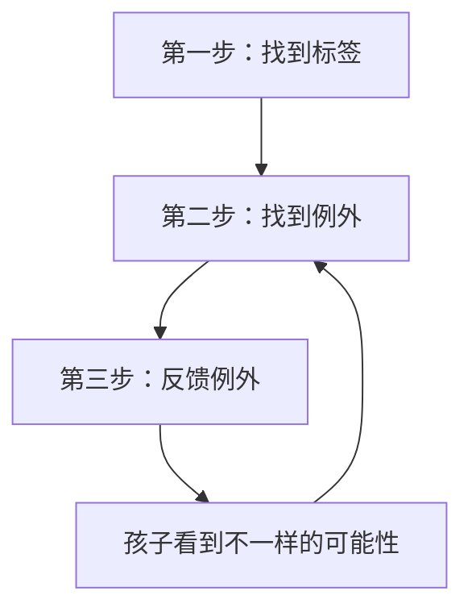

# 第13课：例外沟通——孩子内向、拖拉、不专注，根源在这1点

## Learning Objectives

- 理解"贴标签"如何通过自证预言锁死孩子的成长
- 掌握例外沟通三步法：找标签 → 找例外 → 反馈例外
- 能够用例外思维打破"越说越糟"的恶性循环

---

## 为什么学了那么多方法，孩子还是老样子？

课程学到尾声，很多家长会有一个共同的困惑："我学了这么多方法，可孩子还是内向、拖拉、不专注，那些问题一个都没少。"

这种困惑的背后，隐藏着一个更深的真相：**你看到的"问题"，可能正是你一直在强化的"标签"。**

"你又跟小朋友打架了？你怎么就那么喜欢惹祸呢？"
"我跟你说多少次了，不要打架，要好好跟小朋友相处，你怎么就不听呢？"

这段对话听起来很熟悉。妈妈的第一句话就给孩子贴上一个标签——"爱惹祸"。这个标签一旦贴上去，就会成为孩子身上一个似乎不可分割的特征。每一次重复这个标签，都在加深这个印象。

> [!WARNING] 贴标签的危害
> 贴标签的本质是**把行为固化为特质**。"你就是不专心""你就是内向""你就是拖拉"——这些说法把你孩子从"**有时候**会这样做"变成了"**就是这样的人**"，锁死了改变的可能性。

---

## 自证预言：标签如何塑造现实

心理学中有一个经典现象叫**自证预言**：一旦一个标签被贴上去，所有的互动都会朝着"证明这个标签是对的"方向进行。

### 一个经典的例子

一个人到别人家做客，主人热情地请他吃苹果。客人说："谢谢，我真的不想吃。"但主人给他贴了一个标签——"你在客气。"

无论客人怎么推辞，主人都有一套逻辑在消解这些信息："我知道你是在客气。"最后主人把苹果削好，递到客人手里。客人只好吃了。

主人看到客人吃了，更加确信："你看，我就知道他在客气。"

> [!NOTE] 自证预言的循环
> ```mermaid
> flowchart LR
>     A[贴上标签] --> B[按标签解读行为]
>     B --> C[按标签回应]
>     C --> D[对方被迫顺应]
>     D --> A
> ```

### 学习不好的孩子

一个孩子考了80分，父母说："你学习不好。"
下次考了85分，父母说："你扣了15分，还不够好。"
再下次考了90分，父母说："这次题目太简单，你们班多少90分以上？"

每一次，无论孩子怎么做，父母都从"学习不好"这个前提出发去解读。孩子接收到的信息是："我已经尽力了，但爸爸妈妈永远觉得我不行。"

最终他得出结论："既然我无论如何都达不到标准，那我就放弃吧。"
——他"坐实"了"学习不好"这个标签。

**这个结果，是父母和孩子联合塑造出来的。**

---

## 为什么我们停不下来贴标签？

这其实不是你的错，而是**大脑的简化机制**在起作用。

心理学家Chris曾经用一个例子解释过：假设一个叫Kevin的小朋友，今天有以下7种表现：

1. Kevin捉弄了他的妹妹
2. Kevin不想写作业
3. Kevin在哥哥打他之后还了手
4. Kevin很享受被重视的感觉
5. Kevin的行为很放肆
6. Kevin安慰了他的妹妹
7. Kevin帮哥哥修理东西

大多数人只会记得前五种，因为大脑会自动给这些行为一个简化标签——"Kevin是不是有行为问题？"

后两种——安慰妹妹、帮哥哥修理东西——与这个标签完全相反，但大脑选择性地忽视了它们。

> [!TIP] 关键认知
> **贴标签是大脑为了应对复杂世界的简化策略。** 我们不可能记住一个人的所有行为，所以大脑把它打包成一个标签。但这个简化，让我们失去了看到一个人完整面貌的可能。

---

## 例外沟通三步法

例外沟通的核心是**打破简化，看到那些被忽视的"反例"**。当你能看到不一样，你才能做得不一样。



### 第一步：找到标签

先问自己：**我给孩子贴了一个什么样的负面标签？**

写下这个标签。例如：
- "他就是拖拉"
- "她太内向了"
- "他一点都不专注"

把这个标签具象化、写下来。觉察它，是改变的第一步。

### 第二步：找到例外

然后问自己：**有没有哪怕一次，孩子和这个标签不一样？**

当你回想时，大脑可能会一片空白，因为你的注意力长期被"标签一致"的信息占据。

如果一时想不到，不妨在接下来几天有意识地去观察：
- 你觉得他拖拉，那他看动画片准时吗？出门旅游收拾东西利索吗？
- 你觉得她内向，那她和熟悉的人说话也小声吗？在某个她擅长的领域呢？
- 你觉得他不专注，那他打游戏专注吗？拼乐高的时候呢？

**你一定会发现例外。** 没有一个人在所有时间、所有场合都"符合"一个负面标签。

### 第三步：反馈例外

找到例外之后，用**客观、具体**的反馈告诉孩子。

不要说"你今天表现不错"这种笼统的话。要说具体的：
- "我发现你看动画片的时候，比学习的时候更专注。"
- "你对熟悉的人说话很大声，对不熟悉的人说话很小声。"
- "昨天你写了三分钟作业就开始玩笔，今天你到第五分钟才开始玩。你只用了一天，坚持的时间就延长了两分钟。你是怎么做到的？"

最后一句"你是怎么做到的？"是关键——它把孩子的注意力从"我是一个有问题的人"转向"我有能力做到不一样"。

---

## 案例：浩浩的"拖拉"

浩浩在妈妈眼里什么都好，就是拖拉：起床拖拉、吃饭拖拉、写作业拖拉，经常搞到十点以后才上床。

妈妈整天说："拖拖拖，我要是不催你，你什么事情都不可能做。"

这是一个典型的标签——

**第一步**：标签是"拖拉"。

**第二步**：妈妈满脑子都是浩浩拖拉的画面，想不到例外。但妈妈说浩浩"所有事"都拖拉的时候，是真的吗？

观察发现：看动画片时，浩浩每天六点钟准时打开电视，一次都没拖过。全家去海边旅游那天，浩浩半小时就把泳衣、游泳圈收拾好了。

**第三步**：妈妈说：
- "你每天六点钟打开电视，做得特别准时。"
- "出门旅游你半小时就把东西收拾好了，比谁都快。"

当妈妈把这些反馈给浩浩时，浩浩从"为什么我总是被批评"的抵触情绪中走出来，看到了自己也是有闪光点的。

> [!NOTE] 例外沟通的滚雪球效应
> 一开始只是一小点例外，当你反馈给孩子，孩子有了信心，就会创造更多的例外——就像滚雪球，越滚越大，最终启动一个良性的、加速的正向循环。

---

## 例外沟通的本质

例外沟通不仅是一种方法，更是一种**思维方式**——在任何时候都提醒自己：从标签中跳出来，用不一样的视角去看待孩子。

即使遇到问题和麻烦，也可以带着好奇去欣赏：在那些所谓的问题背后，孩子拥有哪些被忽视的"例外"？

**看到不一样，才能做得不一样。**

这不仅能帮你看到孩子的更多资源，更重要的是，你能激发出孩子做出改变的动机。当孩子发现在某些时间、某些场合、某些特定的事情上，他能做到与你的标签不一样——他就不再被"有问题的孩子"这个身份框住。

他会努力向你证明：**他比你想象的还要更好。**

这就是我们一直在追求的"自我负责"的改变过程。

---

## Practice

> [!QUESTION] 自检练习
> 回想一个你给孩子贴得最频繁的负面标签，尝试完成以下三步：
>
> 1. 这个标签是什么？
> 2. 你能找到至少一个例外吗？（如果找不到，接下来三天有意识地去观察）
> 3. 用客观、具体的语言把这个例外反馈给孩子，注意加上："你是怎么做到的？"

<details>
<summary>参考示例</summary>

**标签**：他就是不爱学习。

**例外**：昨天他主动查资料，花了一个小时研究如何搭建一个 Minecraft 里的红石电路。虽然那不是"课本上的学习"，但那也是学习——而且他是主动的、专注的、自发的。

**反馈**："我注意到你昨天为了研究红石电路，自己在网上查了一个小时的资料，中间没有让我催你。你是怎么做到那么专注的？"
</details>

---

## 延伸阅读

- 类似的思维方式也可以用来"打破对自己的负面标签"——这正是我们下一课[[0014-zi-wo-ken-ding|第14课：自我肯定式沟通]]要讲的内容。
- 例外沟通也是[[0012-fu-neng-xia|赋能式沟通]]中"重构叙事"的重要工具：当孩子说"我做不到"时，帮他找到过去曾经做到的时刻。

---

> [!TIP] 核心口诀
> **看到不一样，才能做得不一样。**
> 例外不是偶然，而是通往改变的入口。