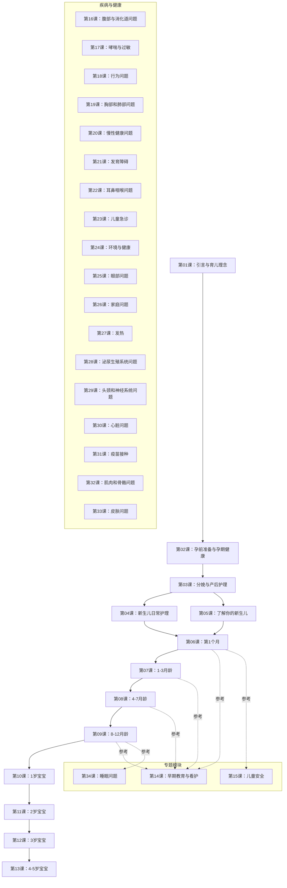

# 课程地图：美国儿科学会育儿百科

## 学习路径建议

### 路径一：顺序学习（推荐新手父母）
按年龄阶段从第01课到第13课顺序学习，在关键年龄节点穿插参考专题模块。

### 路径二：按需查阅（遇到具体问题时）
| 问题场景 | 推荐课程 |
|----------|---------|
| 宝宝哭闹不止 | [[lessons/0004-xin-sheng-er-ri-chang-hu-li\|第04课]]、[[lessons/0006-di-1-ge-yue\|第06课]] |
| 喂养困难 | [[lessons/0004-xin-sheng-er-ri-chang-hu-li\|第04课]]、[[lessons/0008-4-7-yue-ling\|第08课]] |
| 发烧/生病 | [[lessons/0027-fa-re\|第27课]] + 对应症状课程 |
| 行为问题 | [[lessons/0018-xing-wei-wen-ti\|第18课]] |
| 安全问题 | [[lessons/0015-er-tong-an-quan\|第15课]]、[[lessons/0023-er-tong-ji-zhen\|第23课]] |

### 路径三：主题深挖（关注特定领域）
选定专题模块（如疾病、安全、行为）集中学习，在各模块之间交叉参考。