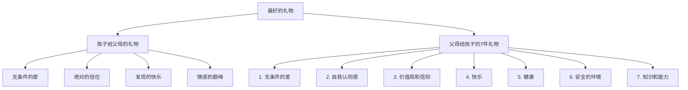
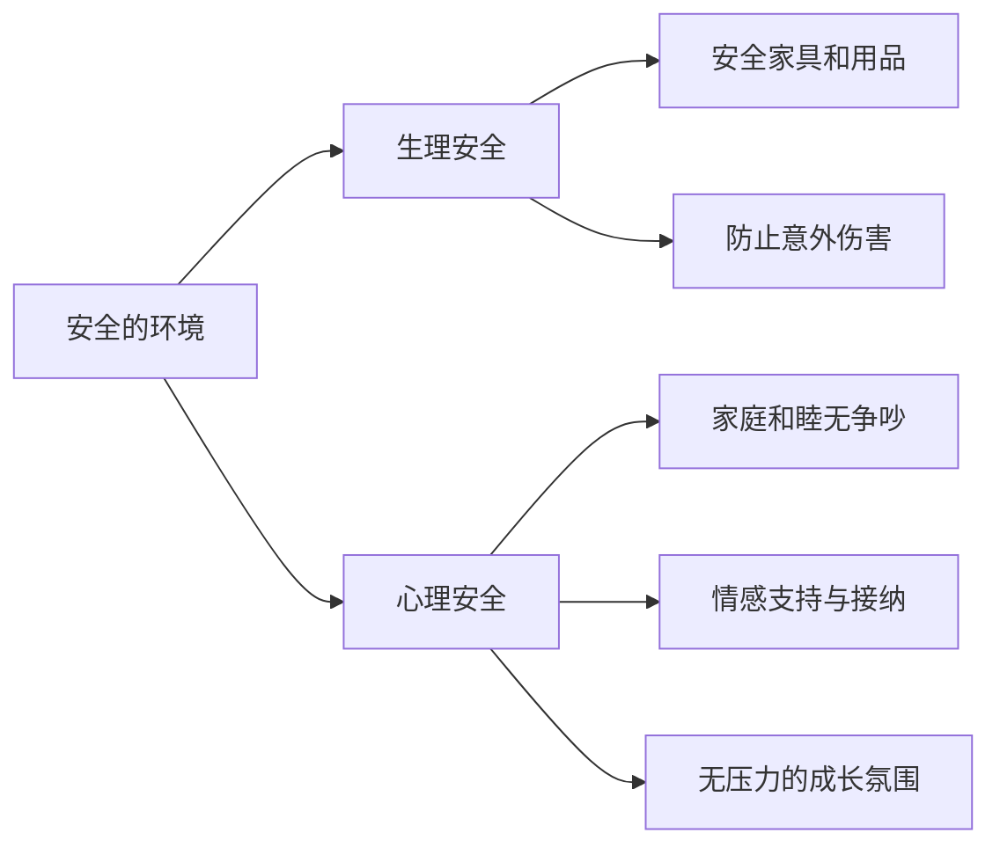

# 第01课：引言与育儿理念

## Learning Objectives

- 理解"最好的礼物"的双向含义：孩子给父母的礼物与父母给孩子的礼物
- 掌握美国儿科学会提出的"父母送给孩子的7件礼物"及其核心内涵
- 学会如何给予孩子无条件的爱，区分有条件的爱与无条件的爱
- 理解自我认同感的建立方式：减少挫折、放大成功
- 掌握培养孩子韧性的七个要素
- 学会为孩子创造情感安全的家庭环境

## Core Idea

> 养儿育女不是父母单方面的付出，父母与孩子是一种**相互给予**的关系。

美国儿科学会育儿百科的引言部分标题为"最好的礼物"，包含两层含义：

1. **孩子是上天赐给父母最好的礼物**——孩子给予父母无条件的爱、绝对的信任、发现的快乐和情感的巅峰
2. **父母应该送给孩子七件礼物**——帮助孩子成为健康、快乐、有能力的人

> [!TIP] Key Insight
> 中国父母最关注的是第7件礼物"知识和能力"，但前面的6件礼物往往被忽视。知识和能力排在最后一位，前面的基础打好了，知识和能力自然会水到渠成。

## 孩子给父母的礼物

孩子从出生开始，就给予父母四样珍贵的礼物：

| 礼物 | 含义 | 表现 |
|------|------|------|
| 无条件的爱 | 你是他整个宇宙的中心 | 从第一次微笑到亲手制作的节日礼物，充满崇敬和热情 |
| 绝对的信任 | 在他眼中你是最强大、聪明、有能力的人 | 遇到难题向你求助，在人群中骄傲地指出你 |
| 发现的快乐 | 重新发现童年中让人快乐和兴奋的事物 | 分享他的探索过程，发现自己从未想到的技能和天赋 |
| 情感的巅峰 | 体验欣喜、关爱、骄傲，也有紧张、生气和受挫 | 从紧紧拥抱到被气得说不出话的极端情感体验 |

## 父母给孩子的7件礼物

### 礼物一：无条件的爱

> 你对孩子的爱，不应取决于孩子的相貌和行为，也不应该将爱当作给孩子的奖励，将不爱作为对孩子的惩罚。

**有条件的爱 vs 无条件的爱**

| 有条件的爱 | 无条件的爱 |
|-----------|-----------|
| 孩子达到期望才喜笑颜开 | 无论是否达到期望都给予爱 |
| 以爱作为奖惩手段 | 爱与行为分开，就事论事 |
| "你再这样，妈妈就不喜欢你了" | "这件事这样做不对，正确的做法是……" |
| 要求孩子按自己的想法去做 | 尊重孩子是一个独立的生命体 |

**如何做到无条件的爱：**
- 明白孩子虽然有你基因，但他是一个新的生命体，有自己的先天气质特点和成长规律
- 无条件的爱不等于不管教，孩子做错事时必须管教
- 管教时**就事论事**，不说评价孩子人格的话
- 不说"你再这样妈妈就不喜欢你了"这类威胁性语言

### 礼物二：自我认同感

自我认同感就是对自己有信心，认为自己是有价值的。建立自我认同感需要花费几年的时间，孩子需要父母持续的支持和鼓励。

**父母需要做两件事：**

1. **让孩子知道父母是爱他的**——从出生就要及时回应孩子的需求
   - 听到孩子哭声及时用声音回应："宝宝怎么了？妈妈回来了"
   - 先尝试声音回应或轻拍安抚，不行再抱起
   - 及时回应不会惯坏孩子，反而能建立安全感

2. **让孩子知道自己是有能力的**
   - 美国儿科学会推荐的方法：**减少挫折，放大成功**
   - 孩子面对的挑战应在能力范围内，努力一下就能成功
   - 选择适龄玩具、适龄玩伴、适龄家务
   - 超出能力范围的要求会造成自暴自弃，失去自信心

> [!CAUTION] 重要提示
> 长期承受学习压力的孩子并不一定比其他孩子学习更出色。相反，心理和情感上的压力会产生负面影响，阻碍先天潜能的发挥。孩子需要的是理解、安全以及适应其天赋和需求的机会。

### 礼物三：价值观和信仰

孩子会通过和父母生活在一起而吸收价值观。父母应通过行动而非说教来传递价值观：
- 注意孩子如何观察你在工作中自律
- 坚定你的信仰，言出必行
- 鼓励孩子提出问题并讨论，而非强加给他
- 言行不一致时，孩子会敏感地察觉到

### 礼物四：快乐

- 孩子不需要被教如何快乐，但需要鼓励和支持
- 你越有趣，生活对孩子来说就越愉快
- 每个孩子有不同的秉性，应发现并培养他们的快乐天性

### 礼物五：健康

- 从怀孕开始就要照顾好自己
- 定期带孩子做检查
- 保护孩子免受伤害
- 准备富有营养的饮食
- 鼓励童年时期多运动
- 父母自身保持良好生活习惯，做孩子的榜样

### 礼物六：安全的环境

家不仅是物理上的安全场所，更必须是**情感上的安全家园**：

> 家应该是一个没有压力和烦恼，充满和谐与关爱的地方。

**重要提醒：**
- 家庭和睦是头等大事，比孩子多吃点少吃点重要得多
- 家人处理矛盾的方法对孩子有深远影响
- 有效处理冲突能给孩子积极的示范

### 礼物七：知识和能力

- 当孩子感到安全、自信且被疼爱时，他学得最好
- 孩子通过玩耍学到很多东西
- 给予孩子机会用自己的方式、以自己的速度学习
- 不要将期望与孩子自己的选择混为一谈

## 使给予成为日常生活

父母与孩子之间反复分享这些礼物，需要掌握的技能包括：

1. **把孩子作为独立的个体来对待**——欣赏他的特殊品质
2. **自我教育**——阅读、交流、筛选适合自己家庭的信息
3. **给孩子做榜样**——孩子通过模仿你来学习
4. **献出你的爱**——通过拥抱、亲吻、轻摇和玩耍来表达
5. **开诚布公的沟通**——留意孩子的行为变化，认真倾听
6. **共度时光**——每天专门腾出时间开展他喜欢的活动
7. **减少挫折，放大成功**——让他面对适度的挑战
8. **提供解决问题的方法**——帮助孩子找到健康的方式发泄负面情绪

## 培养孩子的任性

任性是遭遇挫折后复原的能力。孩子在两三岁时，任性或脆弱性就已经在生活中形成了。

**任性的七个要素（Kenneth Ginsburg 医学博士）：**

| 要素 | 具体做法 |
|------|---------|
| 能力 | 鼓励孩子留意自己的长处 |
| 信心 | 表扬孩子的长处，注重个人努力 |
| 关系 | 加强孩子与家人及社区的联系 |
| 品德 | 从小传递价值观和道德观，明辨是非 |
| 奉献 | 让孩子意识到自己可以在别人生活中起重要作用 |
| 应对 | 提供应对压力的工具，帮孩子发现健康爱好 |
| 控制 | 让孩子懂得决定和行动会影响未来 |

> 每一个挑战都是一次教育的机会。乐观是可以学会的。

## 张思莱医生精讲要点

### 做父母也需要上岗证

退休儿科主任张思莱医生强调：从出生到一岁是孩子人生的重要开端，孩子的营养、健康、大脑发育、性格养成的基础都是在出生的第一年打下的。

- 出生第一年做对了，后面十几年的养育就会变得很轻松
- 营养方法不正确会为孩子的健康埋下隐患
- 早教方法不正确可能影响孩子智力的发展
- 情商基础（自我控制能力、情绪管理能力、社会交往能力）也是在这一年打下的

### 三件最重要的礼物

张医生认为，在七件礼物中，有三件孩子最需要：

1. **无条件的爱**——很多父母爱的其实是有条件的爱
2. **自我认同感**——让孩子感受到被爱、自己有能力
3. **安全的环境**——家庭和睦是头等大事

如果这三件事做好了，孩子一定会非常优秀。

## Worked Example

**场景：** 宝宝早上没有按时起床，上学要迟到了。

**有条件的爱的回应（不推荐）：**
"你怎么这么懒！再这样妈妈就不喜欢你了！"

**无条件的爱的回应（推荐）：**
"宝宝，我们应该七点起床，现在已经八点了，今天你起晚了。来，我们快一点准备，明天记得按时起床好吗？"

**分析：**
- 第一句话评价的是孩子的人格（"懒"），并用收回爱来威胁
- 第二句话说的是一件具体的事（起床晚了），告诉孩子正确的做法，就事论事

## Practice

> [!QUESTION] Self-check
> 1. 美国儿科学会认为父母应该送给孩子的七件礼物中，哪一件排在最后一位？
> 2. 你对孩子的爱，不应取决于什么？（答案见原文）
> 3. 什么是"减少挫折，放大成功"？请举一个例子。
> 4. 任性（韧性）的七个要素包括哪些？
> 5. 什么是情感上的安全家园？为什么它比物质上的安全更重要？

Reveal answer

1. 知识和能力排在最后一位。前面的六件礼物（无条件的爱、自我认同感、价值观和信仰、快乐、健康、安全的环境）是基础。
2 不应取决于孩子的相貌和行为，也不应该将爱当作给孩子的奖励、将不爱作为对孩子的惩罚。
3. 让孩子面对挑战时，挑战应在能力范围内、努力一下就能成功。例如选择适龄玩具，既不太简单也不太复杂。
4. 能力、信心、关系、品德、奉献、应对、控制。
5. 情感上的安全家园是指家中没有压力和烦恼，充满和谐与关爱的心理环境。它比物质安全更重要，因为心理不安全感会导致孩子恐惧、不愿探索学习，影响一生的心理健康。

## Next Step

你已经了解了育儿的核心理念。接下来请学习 [[lessons/0002-yun-qi-zhun-bei-jian-kang|第02课：孕前准备与孕期健康]]，了解如何从孕期开始为孩子打下健康的基础。

---

**本课小结清单：**
- [x] 理解了"最好的礼物"的双向含义
- [x] 记住了父母给孩子的7件礼物及其优先级
- [x] 掌握了无条件的爱的核心原则
- [x] 学会了"减少挫折、放大成功"的方法
- [x] 了解了任性七要素- [x] 理解了情感安全家园的重要性