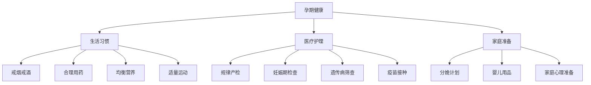

# 第02课：孕前准备与孕期健康

## Learning Objectives

- 掌握孕期保证胎儿健康发育的关键措施：戒烟戒酒、合理用药、营养均衡
- 了解妊娠期疾病对胎儿的潜在影响及预防措施
- 熟悉产前护理内容、妊娠期各项检查及其意义
- 理解遗传病筛查的方法和适用情况
- 掌握分娩准备的各项事项，包括分娩计划书、安全座椅等
- 学会为新生儿准备衣物、家具和婴儿用品
- 了解脐带血储存的利弊和儿科学会的立场
- 理解如何帮助其他孩子和准爸爸做好迎接新成员的准备

## Core Idea

> 促进胎儿发育的最佳方法就是**照顾好你自己**。你在妊娠期吃下的、喝下的以及吸入的一切，几乎都会传给胎儿。

妊娠期是充满期待与兴奋的时期，也是需要做许多准备工作的时期。长达九个月的妊娠期可以给你足够的时间寻找问题的答案、缓解焦虑、做好成为合格父母的准备。

> [!TIP] Key Insight
> 孕期的前两个月胚胎非常脆弱——胳膊、腿、手、脚、肝脏、心脏、生殖器、眼睛以及大脑都刚刚开始形成。这个阶段的保护尤为关键。

## 给孩子一个健康的开始

### 拒绝香烟和酒精

美国儿科学会的观点非常明确：

- **吸烟**：孕妇吸烟或被动吸烟容易导致早产、低出生体重、胎儿窘迫、婴儿猝死综合征，孩子长大后容易出现学习障碍、呼吸功能紊乱和心脏病
- **二手烟和三手烟**：三手烟指残留在衣服、墙壁、地毯、家具、甚至头发和皮肤表面的烟草残留物。即使开窗通风也不能将三手烟排出去。对孩子的危害同样严重
- **酒精**：妊娠期饮酒是引起婴儿先天缺陷、智力障碍以及其他发育问题的重要因素。最安全的做法是一点也不要喝
- **大麻**：可能干扰胎儿大脑发育，导致智力障碍或日后行为问题

> [!CAUTION] 重要提示
> 美国儿科学会建议：所有孕妇以及所有计划怀孕的女性都应完全戒酒。目前对于孕期饮酒的安全量是多少，不得而知。

### 孕期用药安全

孕期用药，尤其是在孕八周内，要远离致畸药物：

- 无论是处方药还是非处方药，使用前都要征求医生建议
- 包括：部分抗生素、镇静安眠药、镇痛药、抗癫痫药、阿司匹林、感冒药、抗过敏药
- **营养补充剂**也要咨询医生——即使声称是纯天然的，服用过量也非常危险，如维生素A过量会引起新生儿先天性异常

### 鱼类与营养

鱼类富含Omega-3脂肪酸，是均衡饮食中必不可少的部分：

- 避免食用鲨鱼、鲸鱼、国王青和马头鱼等含汞量高的鱼类
- 推荐：虾、罐装淡金枪鱼、鲭鱼、鲶鱼和鲶鱼
- 每周可食用227-340克烹熟的鱼
- 避免生鱼肉，需烹熟至内部温度60度以上

## 妊娠期疾病与先天性异常

以下妊娠期疾病可能导致胎儿先天性异常：

| 疾病 | 风险 | 预防措施 |
|------|------|---------|
| 风疹 | 智力障碍、心脏发育异常、白内障、耳聋 | 孕前接种疫苗，孕期不可接种 |
| 水痘 | 分娩前感染非常危险 | 孕前接种疫苗 |
| 疱疹 | 胎儿通过产道时感染，可能引起脑炎 | 临产时发病建议剖宫产 |
| 弓形虫病 | 猫携带，未烹熟的肉类中 | 彻底烹熟肉类，让家人清理猫粪便 |
| 寨卡病毒病 | 胎儿脑部和眼部严重发育缺陷 | 避免前往疫区，防蚊虫叮咬 |
| 李斯特菌病 | 可能导致流产 | 避免未经高温消毒的乳制品、热狗、午餐肉 |
| 流感 | 六个月以下婴儿感染后危险 | 孕期接种流感疫苗 |

## 百白破疫苗

Tdap 疫苗可预防百日咳、白喉和破伤风三种疾病：

- **最佳接种时间**：怀孕第27到36周
- 孕妇接种后，抗体通过胎盘传给胎儿，保护出生后至可接种疫苗前的婴儿
- **所有可能密切接触孩子的人**（爸爸、祖父母、保姆等）也应接种
- 百日咳对婴儿可引起严重咳嗽、呼吸困难、大脑损伤甚至死亡

> 张思莱医生建议：形成一个"流感防护圈"，家里所有可能接触孩子的人都应接种流感疫苗和百白破疫苗。

## 获得最好的产前护理

### 营养

- 每天摄入约400微克叶酸，降低胎儿某些出生缺陷风险
- 产前复合维生素片：包含足量叶酸、铁、钙、DHA和ARA
- 每天多摄入300-450千卡热量
- 营养均衡：蛋白质、碳水化合物、脂肪、维生素和矿物质

### 运动

- 散步、游泳、产前瑜伽、普拉提
- 每天即使只运动5-10分钟也是有益的
- 避免有跳动或震动的运动

### 口腔健康

- 牙周病会导致早产和新生儿低出生体重
- 妊娠期保持口腔清洁，定期检查

## 妊娠期检查

| 检查项目 | 时间 | 目的 |
|---------|------|------|
| 常规超声检查 | 孕期多次 | 监测胎儿生长、内脏发育、胎位 |
| 颈后透明带扫描 | 11-12周 | 筛查染色体疾病（唐氏综合征等） |
| 三连筛查 / 四连筛查 | 孕早期 + 孕中期 | 染色体疾病风险评估 |
| 血糖筛查 | 24-28周 | 筛查妊娠糖尿病 |
| B族链球菌筛查 | 35-37周 | 预防新生儿感染 |
| HIV检测 | 孕早期 | 预防母婴传播 |
| 无应激实验 | 需要时 | 监测胎儿心率和胎动 |
| 宫缩应激实验 | 需要时 | 评估胎儿对宫缩的反应 |
| 生物物理评分 | 需要时 | 评估胎儿运动和呼吸状态 |

## 遗传病筛查

**羊膜穿刺（15-20周）：**
- 细针从腹壁插入子宫抽取羊水
- 可诊断唐氏综合征、脊柱裂等
- 大多2周出结果

**绒毛活检术（10-12周）：**
- 从胎盘取组织
- 可检查唐氏综合征、泰萨克斯病、血红蛋白异常等
- 1-2周出结果

> 这两种检查准确而安全，但存在极低流产风险，应与医生讨论。

## 分娩准备

### 分娩计划书

分娩计划书是一份文字档案，记录你对分娩的各种倾向性选择：

- 你想在什么地方生产？
- 出现阵痛和宫缩时，是先打电话还是直接去医院？
- 你希望谁来陪伴？
- 分娩时更愿意采取哪种体位？
- 如果出现紧急情况，你接受哪种处理措施？

### 必备准备工作清单

- [ ] 医院名称、地址、电话、最佳路线
- [ ] 产科医生及替补医生联系方式
- [ ] 重要物品包（卫生纸、衣服、电话本、宝宝毯子、出院衣服）
- [ ] 汽车安全座椅（安装在后座中间，朝向后方）
- [ ] 电动吸奶器（计划母乳喂养的话）
- [ ] 其他孩子的照看安排

### 关于汽车安全座椅

- 安装在汽车后座，朝向汽车后方
- 最好安装在后座中间位置
- 每次使用安全座椅时都需要正确安置孩子

## 新生儿物品准备

### 婴儿衣物清单

- [ ] 3-4套婴儿睡衣
- [ ] 6-8件婴儿上衣
- [ ] 3件新生儿睡袋
- [ ] 2顶婴儿帽
- [ ] 4双婴儿袜
- [ ] 4-6条婴儿抱毯
- [ ] 婴儿毛巾和浴巾
- [ ] 3-4包新生儿规格纸尿裤
- [ ] 3|-4件连体衣

### 选购指南

- **买大一点**：新生儿可能几天后就穿不下新生儿尺码了
- **阻燃材料**：所有睡衣应使用阻燃材料
- **安全**：不要买颈部、胳膊及腿部太紧的衣服，不要有领带、领结及袋子
- **不要给新生儿穿鞋**：在孩子能走路前鞋子不必要，穿鞋过早可能影响脚部发育

### 必备家具和用品

| 物品 | 注意事项 |
|-----|---------|
| 婴儿床 | 必须符合安全标准，2011年6月后生产 |
| 床垫 | 结实偏硬，大小完全符合婴儿床内部尺寸 |
| 床上用品 | 不需要枕头、被子、毛绒玩具、防撞护垫 |
| 尿布更换台 | 紧靠墙壁，不靠窗户 |
| 洗澡盆 | 大号塑料盆，水温不超过49度 |
| 旋转床铃 | 五个月大或会坐后取走 |

### 婴儿床安全原则

> [!WARNING] 婴儿睡眠安全
> 新生儿应睡在父母房间里，但睡在**完全独立的空间**（如符合安全标准的摇篮或婴儿床）。这段时间应至少持续六个月，最好是一年。

**十项安全原则：**
1. 床垫上的塑料膜全部撕掉，选择结实偏硬床垫
2. 一旦孩子会坐起就降底床板高度
3. 护栏高于床板至少10厘米
4.  床垫必须完全符合婴儿床内部尺寸
5. 定期检查五金件是否牢固
6. 不推荐安装防撞护垫
7. 婴儿床内不放松软物品
8. 悬挂玩具要挂得足够高
9. 婴儿监视器放在孩子够不到的地方
10. 婴儿床不要放在靠窗处

## 脐带血

> 美国儿科学会不鼓励私人储存脐带血，而是鼓励将新生儿的脐带血存入**公共脐带血库**，以便帮助所有有需要的人。

- 脐带血可以治愈大量遗传病、血液病以及儿童癌症
- 但如果孩子以后患了白血病，出生时储存的脐带血可能无法作为干细胞的来源
- 脐带血的采集在孩子出生后、脐带被夹住切断后进行，不会对新生儿和分娩过程产生不利影响

## 让其他孩子和准爸爸做好准备

### 帮助老大接受新成员

| 年龄 | 策略 |
|------|------|----|
| 4岁以上 | 可在告诉其他亲友时同时告诉他，用图画书帮助理解 |
| 2-3岁 | 最困难阶段，多让他参与准备，给他看自己婴儿时的照片 |
| 较小的孩子 | 开始添置婴儿家具时告诉他 |

**减轻嫉妒心理的方法：**
- 带他一起挑选婴儿衣物
- 给他看看他仍是婴儿时的照片
- 让小宝宝出生前改变老大的生活状态（如学自己大小便、换儿童床）
- 每天留出专门时间给老大

### 准爸爸的角色

- 在伴侣面临难关时扮演情绪舵手
- 一起去做产前检查，与医生讨论产房里可以做什么
- 提前做好工作安排，请假陪伴
- 做好准备在孩子一生中扮演重要而积极的角色

## Worked Example

**场景：** 一位准妈妈正处于孕早期，她每天喝一杯红酒的习惯已经多年，家人劝她戒掉，她说"少喝一点没事"。

**正确做法：** 立即完全戒酒。美国儿科学会的立场是：孕妇饮酒的安全量未知，最安全的做法是一点也不要喝。孕期饮酒会增加流产、早产风险，并可能导致胎儿酒精综合征（出生缺陷、低出生体重、智力低下）。越多饮酒对胎儿的不良影响越大，没有"安全量"。

**另一个常见误区：** 营养补充剂不是药，可以随便吃。事实上，即使是维生素，过量也非常危险。孕妇摄入过量维生素A会引起新生儿先天性异常。所有营养补充剂都应在医生指导下服用。

## Practice

> [!QUESTION] Self-check
> 1. 美国儿科学会建议孕妇在什么时间接种百白破疫苗？
> 2. 孕妇应避免食用哪四种鱼类？为什么？
> 3. 三手烟是什么？为什么开窗通风不能消除？
> 4. 羊膜穿刺和绒毛活检术分别在什么时间进行？
> 5. 美国儿科学会对脐带血储存的立场是什么？
> 6. 婴儿床内不应放置哪些物品？为什么？

Reveal answer

1. 怀孕第27到36周。产后未接种的应立即接种。所有可能密切接触孩子的人也應接种。
2. 鲨鱼、鲸鱼、国王青和马头鱼，因为这些鱼类体内的汞含量非常高，汞已被证实有损胎兒的神经系统发育。
3. 三手烟是吸烟后残留在衣服、墙壁、地毯、家具、甚至头发和皮肤表面的烟草残留物。其有害物质直径小于PM2.5，能穿透肺泡进入血液循环，开窗通风无法将其排出。
4. 羊膜穿刺在孕15-20周进行；绒毛活检术在孕10-12周进行。
5. 美国儿科学会不鼓励私人储存脐带血，但鼓励将脐带血存入公共脐带血库，以便帮助所有有需要的人。
6. 不应放置枕头、被子、软垫、毛绒玩具、睡姿固定垫或防撞护垫。这些物品可能导致婴儿窒息、被缠住或被勒死，增加婴儿猝死综合征的风险。

## Next Step

你已经了解了孕前准备和孕期健康。接下来请学习 [[lessons/0003-fen-mian-yu-chan-hou|第03课：分娩与产后护理]]，了解分娩过程和分娩后的重要护理措施。

---

**本课小结清单：**
- [x] 掌握孕期的禁忌：烟、酒、非法药物
- [x] 了解妊娠期疾病可能导致的先天性异常
- [x] 熟悉妊娠期各项检查的时间和目的
- [x] 理解遗传病筛查的方法
- [x] 学会制定分娩计划和准备用品
- [x] 掌握婴儿床安全原则
- [x] 理解脐带血储存的利弊
- [x] 学会帮助其他孩子和准爸爸做好准备