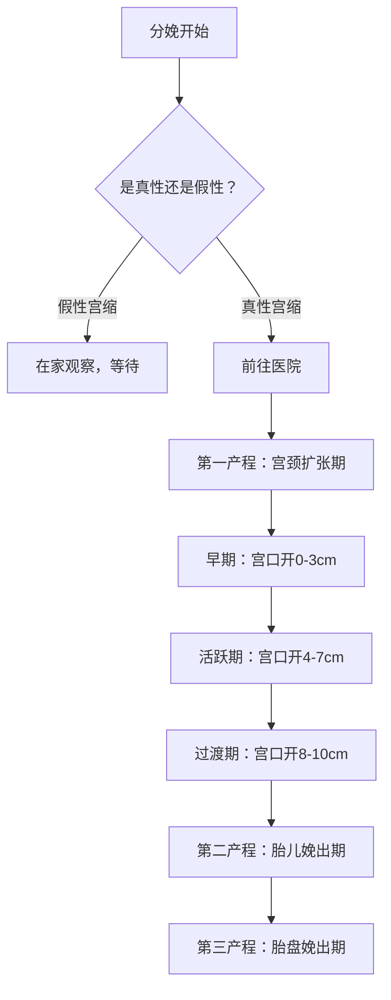
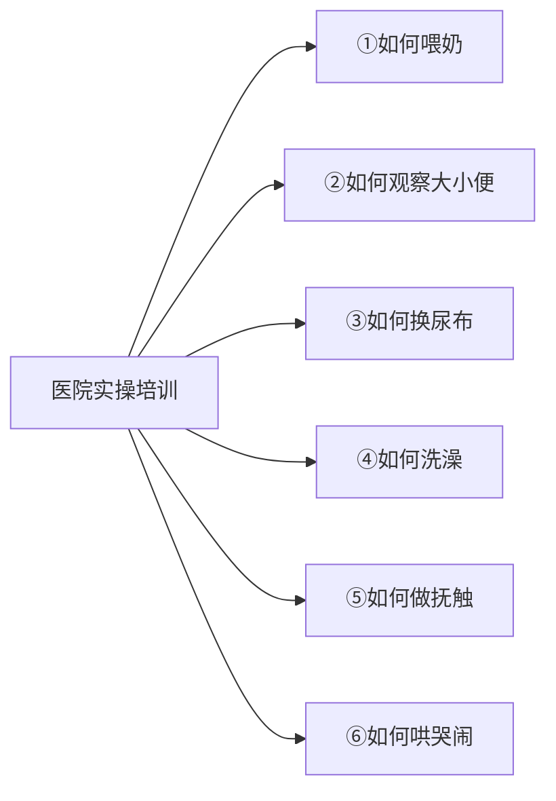

# 第03课：分娩与产后护理

## 学习目标

- 掌握分娩的三个产程及其主要特征，能够区分真性宫缩和假性宫缩
- 了解分娩止痛的各类方法（药物与非药物）及其优缺点
- 理解顺产与剖宫产的区别，以及剖宫产的常见适应症
- 掌握"早接触、早吸吮、早开奶"的黄金一小时原则
- 理解延迟脐带结扎的益处和推荐时间
- 学会解读新生儿阿氏评分系统
- 了解早产儿的分类、常见健康问题与护理要点
- 掌握在医院那几天需要完成的重点事项和护理技能

## 一、分娩的征兆与产程

### 何时去医院

大多数孕妇的妊娠期会在第37到42周结束。分娩是身体准备好迎接胎儿的最清晰指征。当你出现以下征兆时，分娩可能已经开始：

| 分娩信号 | 说明 |
|---------|------|
| 规律宫缩 | 有规律的子宫收缩，下腹部疼痛，随宫颈扩张而加剧 |
| 见红 | 略带血红色、粉色或透明的阴道分泌物（宫颈粘液栓） |
| 破水 | 羊膜破裂，羊水涌出 |
| 腰背部疼痛 | 从腰背部开始，逐渐向前方转移至下腹部 |

> [!WARNING] 立即去医院的情况
> 如果出现以下症状应立即前往医院：
> - **已经破水**
> - **阴道出血**
> - **非常严重且持续的疼痛**，在两次宫缩之间没有减轻

### 真性宫缩 vs 假性宫缩

| 特征 | 真性宫缩 | 假性宫缩 |
|------|---------|---------|
| 频率 | 有规律，逐渐密集 | 偶发，不规律 |
| 强度 | 逐渐增强 | 相对较弱 |
| 持续时间 | 30-70秒 | 不固定 |
| 间歇期 | 子宫变软，可以放松 | 无规律 |
| 活动影响 | 行走后宫缩不停止 | 行走后可能缓解 |

### 第一产程：宫颈扩张期

这是最长的产程阶段，从规律宫缩开始到宫颈完全扩张（直径约10厘米）。宫缩逐渐变得更强烈、更频繁，持续时间达到每次30到70秒。

### 第二产程：胎儿娩出期

宫颈完全扩张后，胎儿沿产道下降娩出。在自然阴道分娩过程中，你可以借助镜子看到胎儿的头顶。胎儿头部娩出后会停顿一次，然后将身体娩出。

### 第三产程：胎盘娩出期

胎儿娩出后，胎盘从子宫壁剥离并娩出。

> [!NOTE] 催产
> 医生在认为孕妇或胎儿有危险时可能会选择催产。通过药物引发宫缩，宫颈逐渐扩张变薄。医生也可以人为破膜，启动分娩进程。

## 二、分娩止痛方法

分娩疼痛程度因人而异，但通过多种方法可以有效缓解不适。

### 非药物止痛

| 方法 | 说明 |
|------|------|
| 放松和呼吸技巧 | 通过放松技巧和呼吸技巧缓解不适 |
| 按摩 | 伴侣为产妇按摩腰部 |
| 热敷/冷敷 | 洗热水澡或用冰袋冰敷腰背部 |
| 导乐陪伴 | 提供情感支持、按摩和分娩姿势建议，通常可以缩短分娩时间 |

> [!IMPORTANT] 导乐的作用
> 训练有素的导乐能够通过提供情感支持、按摩和分娩姿势建议帮助产妇缓解疼痛，通常能够缩短分娩时间并降低剖宫产的概率。孕妇需要在分娩前找好导乐，并确认医院允许其陪同。

### 药物止痛

| 方式 | 适用情况 | 优点 | 注意事项 |
|------|---------|------|---------|
| 肌内/静脉注射麻醉药 | 阴道分娩 | 使宫缩疼痛变得可以忍受 | 如果给药时间接近胎儿娩出，可能引起胎儿呼吸缓慢 |
| 硬膜外麻醉 | 阴道分娩或剖宫产 | 减轻下腹部疼痛，产妇保持清醒，副作用小 | 通过导管持续给药，偶尔有头痛或血压低 |
| 腰麻 | 择期剖宫产 | 起效快，效果比硬膜外麻醉好，一次性给药 | 偶尔有头痛或血压低 |
| 全麻 | 紧急剖宫产 | 产妇失去知觉，进入深度睡眠 | 新生儿出生时可能昏昏欲睡，影响呼吸 |

> [!TIP] 硬膜外麻醉和腰麻是剖宫产的首选
> 可能的话，最好采用硬膜外麻醉或腰麻，这样新生儿出生时不会昏昏欲睡，产妇也能保持清醒。

## 三、顺产与剖宫产

### 剖宫产的常见原因

在美国，剖宫产率约为三分之一。以下情况医生可能推荐剖宫产：

- 孕妇有剖宫产史
- 胎位是臀位
- 宫口未充分扩张到10厘米
- 自然阴道分娩可能威胁胎儿健康
- 胎心率过慢或不规律

### 顺产与剖宫产对比

| 对比项 | 自然阴道分娩 | 剖宫产手术 |
|-------|------------|-----------|
| 过程 | 胎儿经产道自然娩出 | 切开腹壁和子宫取出胎儿 |
| 手术时间 | 不定（数小时至十数小时） | 一般不超过1小时 |
| 麻醉 | 可选用非药物或药物止痛 | 通常需要局部麻醉或全麻 |
| 恢复 | 恢复较快 | 术后伤口疼痛，恢复较慢 |
| 肌肤接触 | 产后可立即进行 | 情况稳定后尽快进行 |
| 住院时间 | 约3天 | 约5天 |

> [!NOTE] 剖宫产后阴道试产
> 很多产科医生认为，曾接受过剖宫产的女性以后生育也应选择剖宫产。但大多数女性仍可尝试剖宫产术后阴道试产。能否这样做取决于很多因素，应与医生共同商量决定。

## 四、宝宝出生后最重要的两个1小时

> [!IMPORTANT] 核心原则
> 儿科医生常说的"三早"——**早接触、早吸吮、早开奶**，是宝宝出生后最关键的事情。

### 第一个一小时：早接触（肌肤接触）

宝宝出生后一小时内，让宝宝趴在妈妈的胸口进行肌肤接触。医生会擦干宝宝、给他戴上帽子并用暖和的毯子盖住。

**肌肤接触的益处：**

对新生儿：
- 稳定血糖水平和体温，防止体温过低
- 稳定血液流量和呼吸
- 减少哭闹（研究表明，没有经历过早接触的新生儿哭闹次数高出10倍）
- 帮助建立免疫屏障
- 降低未来患慢性非传染性疾病的风险

对产妇：
- 减轻压力
- 促进激素分泌和子宫收缩
- 减少产后出血（产后30分钟哺乳可减少出血）

> [!CAUTION] 剖宫产的肌肤接触
> 剖宫产多数情况下也鼓励孩子情况稳定后立即与妈妈进行肌肤接触。如果妈妈需要治疗，爸爸可以代替妈妈进行肌肤接触——研究显示，被爸爸抱在胸前的新生儿比睡在婴儿床里的哭得更少、入睡更快。

### 第二个一小时：早吸吮、早开奶

分娩后一小时内是开始母乳喂养的黄金时间，因为这时新生儿反应机敏，非常想吃奶。

- 将宝宝放在胸前，含住乳晕和乳头用力吸吮
- 初乳是一种淡黄色的液体，量很少但富含蛋白质和抗体
- 如果等到一个多小时以后才开始哺乳，宝宝可能已经困了，很难正确吸吮

**早吸吮的益处：**
- 宝宝反复吸吮刺激大脑分泌催乳素，促使产后及时下奶
- 提高母乳喂养的成功率
- 有菌喂养：宝宝通过吸吮获得妈妈乳房中的菌群，建立肠道菌群共生系统

> [!NOTE] 初乳的重要性
> 新生儿出生后的2到5天，母亲分泌初乳。初乳量很少但富含蛋白质和抗体，可以保护新生儿免受感染，满足出生后前几日的所有养分和水分需求。

### 张思莱医生精讲要点

> 张思莱医生强调：分娩后一定要做到"三早"——早接触、早吸吮、早开奶。这是第二章反复强调的问题。

**两个一小时的关键：**
1. **第一个一小时**（早接触）：宝宝刚从温暖的子宫出来，极为脆弱。肌肤接触让宝宝感受到妈妈温暖的体温和熟悉的心跳声，更容易获得安全感，自我调节能力更强。
2. **第二个一小时**（早吸吮、早开奶）：分娩后一小时内孩子的吸吮力最强。早吸吮可以刺激催乳素大量分泌，促使产后及时下奶。如果母乳喂养遇到困难，可以寻求医院的哺乳顾问帮助。

**爸爸的替代作用：** 如果妈妈需要治疗不能马上进行肌肤接触，爸爸可以代替妈妈把宝宝抱在胸前。出生后前两个小时被爸爸抱在胸前的婴儿，比睡在婴儿床里的哭得更少、入睡更快。

## 五、延迟脐带结扎的益处

美国儿科学会建议，无论是自然分娩还是剖宫产，都应等待**30到60秒**再结扎脐带。世界卫生组织推荐生后1到3分钟再结扎。

### 为什么延迟结扎

胎儿体循环所需的血液有35%在胎盘中，胎盘中的血液红细胞高达60%，富含大量造血干细胞。

| 益处 | 说明 |
|------|------|
| 增加血容量 | 使胎盘中的血液更多流向新生儿，增加血清铁和铁蛋白含量 |
| 改善铁储备 | 出生后6个月是大脑发育高峰期，铁在神经发育中起重要作用 |
| 持续供氧 | 脐带不剪断，胎盘可继续给新生儿提供氧气 |
| 稳定脑循环 | 增加大脑组织平均含氧量，内环境和脑循环更稳定 |
| 早产儿额外益处 | 减少脑室内出血风险、减少输血概率、减少坏死性小肠结肠炎风险 |

> [!TIP] 长期研究证据
> 一项随机对照研究发现，延迟2分钟结扎脐带可改善婴儿6个月内铁储存水平。另一项研究证实，延迟脐带结扎的儿童在4岁时精细动作和社会领域的评分较高。

> [!WARNING] 脐带夹的处理
> 脐带停止波动后被夹住并剪断。脐带夹一般保留24到48小时，待脐带干燥不再出血后取下。剩下的脐带残端会在新生儿出生后1到3周自然脱落。

## 六、新生儿阿氏评分

孩子降生后，医护人员会立刻开始计时，在出生后的**第1分钟和第5分钟**对新生儿进行评估。

### 评分系统

阿氏（Apgar）评分对新生儿的**五项体征**进行评估，每项最高2分，满分10分。

| 体征 | 0分 | 1分 | 2分 |
|------|-----|-----|-----|
| 心率 | 无心跳 | 每分钟低于100次 | 每分钟超过100次 |
| 呼吸 | 无呼吸 | 哭声微弱，呼吸浅 | 哭声响亮，呼吸有力 |
| 肌张力 | 松弛无力 | 四肢略屈曲 | 动作有力 |
| 对刺激的反应 | 无反应 | 有皱眉动作 | 哭闹或打喷嚏 |
| 肤色 | 全身发青 | 身体红润、手脚发青 | 全身红润 |

### 评分意义

| 得分 | 含义 | 处理 |
|------|------|------|
| 7-10分 | 正常 | 大多数新生儿在此范围 |
| 4-7分 | 轻度窒息 | 医生根据临床表现为新生儿提供帮助 |
| 0-3分 | 重度窒息 | 需要立即抢救，5分钟后再次评分 |

> [!IMPORTANT] 阿氏评分不是智力预测
> 阿氏评分是评价新生儿窒息程度和复苏效果的方法，**不能预测**孩子长大后的健康状况、智力水平或性格。如果孩子的评分不高，不必过度焦虑。

### 张思莱医生精讲要点

> 张思莱医生解释：出生后第1分钟和第5分钟分别评分，如果第5分钟评分仍低于7分，应每隔5分钟评分一次，直到出生后20分钟。出生20分钟后评分仍在3分以下的新生儿，必须送入NICU继续抢救。评分4到7分的，由医生根据临床表现决定下一步处理。

## 七、早产儿的护理

早产指胎儿在母亲怀孕满37周之前降生。美国早产儿比例约为10%，多胞胎的早产率约60%。

### 早产儿分类

| 分类 | 孕周 |
|------|------|
| 晚期早产 | 34-36周 |
| 中期早产 | 32-33周 |
| 早期早产 | 未满32周 |

### 早产儿的外观特征

- 体型更小，足月新生儿平均体重约3.17kg，早产儿可能仅2.26kg或更轻
- 脂肪少，皮肤薄到近乎透明，可见皮下血管
- 背部和肩膀上有细小的胎毛
- 面部轮廓棱角分明，不如足月儿圆润
- 哭声微弱，甚至不哭

### 常见健康问题

| 问题 | 说明 | 处理 |
|------|------|------|
| 呼吸窘迫综合征 | 肺部缺乏肺表面活性物质 | 人工合成肺表面活性物质 + 呼吸机或CPAP |
| 支气管肺发育不良 | 慢性肺病，需长期吸氧 | 随肺部发育逐渐好转 |
| 呼吸暂停 | 呼吸突然暂时中断 | 用心肺功能测试仪监测 |
| 早产儿视网膜病变 | 视网膜发育不完全 | 大部分自愈，严重者需激光或药物注射 |
| 脑室内出血 | 大脑内血管脆弱破裂，常见于出生体重<1.5kg | 一级二级通常无并发症；三级四级很严重 |
| 坏死性小肠结肠炎 | 肠组织受损或发炎，多发于妊娠不满32周 | 禁食+抗生素，严重者需手术 |
| 黄疸 | 胆红素在血液中蓄积 | 光疗照射 |

### 早产儿出院标准

- 可以自主呼吸
- 体温稳定
- 可以通过乳房或奶瓶吃奶
- 体重稳定增长
- 汽车安全座椅通过检测（美国儿科学会建议）

> [!CAUTION] 早产儿用品
> 早产儿坐汽车安全座椅前必须经过检测，确保不会出现血氧饱和度过低、窒息或心跳减慢的情况。网络购买的捐赠母乳存在细菌污染风险，不应使用。

### 母乳喂养的特别建议

母乳对早产儿有额外的益处，有助于预防坏死性小肠结肠炎。如果难以直接哺乳：
- 将母乳挤出后通过胃管或奶瓶进食
- 分娩后尽快开始挤奶，每2到3小时挤一次
- 可向医院咨询经巴氏杀菌的捐献母乳

> [!WARNING] 捐赠母乳安全
> 未经巴氏杀菌的其他母亲的母乳或从网络购买的母乳存在潜在的感染风险，包括细菌污染、掺有其他奶源、运输中未冷冻等问题。

## 八、在医院那几天的重点事项

自然分娩一般住3天，剖宫产一般住5天。这段时间是爸爸妈妈学习照顾宝宝的好机会。

### 出院前应学会的6种核心技能

### 重要医疗程序

| 项目 | 说明 |
|------|------|
| 维生素K注射 | 预防新生儿出血症，出生后立即注射0.5-1毫克 |
| 抗生素眼膏 | 预防产道细菌感染眼睛 |
| 腕带识别 | 产妇、伴侣和新生儿各自佩戴信息一致的腕带 |
| 足印采集 | 部分医院会采集新生儿足印以增加安全系数 |
| 乙肝疫苗 | 体重≥2000克的健康新生儿需在出生后24小时内接种第一针 |
| 新生儿疾病筛查 | 各州筛查内容不同，提前向医生了解 |

> [!IMPORTANT] 维生素K的重要性
> 因为缺少合成维生素K的肠道细菌，新生儿体内往往没有足够的维生素K。所有新生儿出生后都应立即注射维生素K。未接受注射的婴儿在出生后2到6个月有很高的风险出现脑损伤，严重者甚至死亡。

### 爸爸的积极参与

> 美国儿科学会第七版特别强调：**爸爸的参与对于孩子的生长发育和妈妈产后的恢复有非常积极的作用。**

爸爸在医院期间可以承担的角色：
- 把新生儿抱到妈妈身边，帮助调整哺乳姿势
- 妈妈喂奶时倒杯水
- 为新生儿换尿布、洗澡、抚触、哄睡
- 母婴同室，让妈妈的作息与孩子同步

### 张思莱医生精讲要点

> 张思莱医生指出：宝宝出生后第一个月短短28天，美国儿科学会育儿百科用了四章的篇幅来讲解。原因在于这个阶段宝宝从子宫来到陌生环境，各项功能还不稳定；而爸爸妈妈没有经验，容易陷入混乱焦虑。

**在医院期间爸爸应该先学会的技能：**
- 喂奶必须是妈妈做
- 换尿布、洗澡、抚触、哄睡都可以由爸爸承担
- 妈妈的作息最好与孩子同步，其他事情由爸爸来做

## 九、产后护理与情绪变化

### 产妇身体恢复

- 产后观察出血情况，通常会在恢复室观察一段时间
- 剖宫产产妇醒来时可能头昏脑胀、伤口疼痛
- 尽早让新生儿吸吮乳房可促进子宫收缩，减少产后出血

### 产后情绪

分娩后你可能感受到复杂的情感波动：

> [!NOTE] 正常情绪变化
> 即使你没有立刻对孩子产生特别温馨的感觉，也是正常的。分娩是一个艰难的过程，你的第一反应可能是解脱和疲惫。不要强求，给自己时间恢复。

- 激动、不敢相信自己完成了分娩
- 解脱、庆幸一切终于结束
- 疲惫、只想好好休息
- 如果孩子需要特殊护理，可能感到焦虑和分离的痛苦

### 建立亲子关系

- 新生儿刚出生的这段时间非常机敏、反应度高，被称为"敏感期"
- 第一次眼神交流、声音交流和肌肤接触是建立亲密关系的一部分
- 如果你曾昏迷或孩子需要送监护室，不用担心——建立亲密关系是没有时间限制的

> [!TIP] 亲子关系没有时间限制
> 即使你无法亲眼看着孩子出生、无法马上把他抱在怀里，你对孩子的爱也丝毫不会减少，孩子依然会爱你、亲近你。

## Worked Example

**场景一：** 一位新手妈妈刚刚顺产，宝宝出生后护士准备把宝宝抱去洗澡、测量身高体重。妈妈想知道能不能先抱一抱宝宝再让护士带走。

**推荐做法：** 坚持先进行肌肤接触。出生后第一个小时是"黄金小时"，应该让宝宝趴在妈妈胸口进行肌肤接触、早吸吮。让护士在妈妈抱着宝宝的同时进行评估和Apgar评分，洗澡和测量身高体重可以延后。研究表明，早接触可以稳定宝宝的血糖、体温和呼吸，减少哭闹。

**错误做法：** 直接让护士把宝宝抱走，等所有检查完成再说。这样可能错过出生后一小时内宝宝最机敏、吸吮力最强的黄金窗口，也错过了建立亲密关系和启动泌乳的最佳时机。

**场景二：** 一位剖宫产妈妈因手术后身体虚弱，暂时无法抱宝宝。爸爸手足无措，不知道该做什么。

**正确做法：** 爸爸可以解开上衣，让宝宝光着上身趴在胸前，用毯子盖住——这就是"袋鼠式护理"。研究表明，出生后两小时被爸爸抱在胸前的新生儿比睡在婴儿床里的哭得更少、入睡更快。同时爸爸可以帮助宝宝调整姿势靠近妈妈乳房，协助早期哺乳。

**错误做法：** 把宝宝放在一旁的婴儿床里，等待妈妈恢复。这样错失了肌肤接触的黄金时间，也增加了宝宝的焦虑和哭闹。

## Practice

> [!QUESTION] 自测题
> 1. 真性宫缩和假性宫缩如何区分？
> 2. 什么是"三早"？为什么三早对新生儿和产妇都非常重要？
> 3. 延迟脐带结扎（30-60秒）的益处有哪些？
> 4. 阿氏评分评估哪五项体征？满分是多少？评分在什么范围内算正常？
> 5. 早产儿的分类有哪些？常见的健康问题有哪几项？
> 6. 在医院的那几天，爸爸妈妈至少需要学会哪六种照顾宝宝的核心技能？
> 7. 为什么新生儿出生后需要立即注射维生素K？
> 8. 剖宫产后妈妈不能立即抱宝宝时，爸爸可以做什么？

查看答案

1. 真性宫缩有规律、频率逐渐密集、强度逐渐增强、持续时间30-70秒、行走后不缓解。假性宫缩偶发、强度弱、行走后可能缓解。

2. "三早"是指早接触（出生后一小时内肌肤接触）、早吸吮（让宝宝吸吮乳房）、早开奶。对新生儿：稳定血糖体温、稳定呼吸和血流、减少哭闹、建立免疫屏障。对产妇：减轻压力、促进子宫收缩、减少产后出血。

3. 增加血容量和铁储备（预防缺铁性贫血）、持续供氧、稳定脑循环、改善心脏功能。对早产儿还可减少脑室内出血和输血概率。

4. 心率、呼吸、肌张力、对刺激的反应、肤色。每项最高2分，满分10分。7分以上为正常。

5. 晚期早产（34-36周）、中期早产（32-33周）、早期早产（未满32周）。常见问题：呼吸窘迫综合征、支气管肺发育不良、呼吸暂停、早产儿视网膜病变、脑室内出血、坏死性小肠结肠炎、黄疸。

6. ①如何喂奶 ②如何观察大小便 ③如何换尿布 ④如何洗澡 ⑤如何做抚触 ⑥如何哄哭闹。

7. 因为缺少合成维生素K的肠道细菌，新生儿体内没有足够的维生素K。未注射的婴儿在出生后2-6个月有很高的脑损伤甚至死亡风险。

8. 爸爸可以代替妈妈与宝宝进行肌肤接触（袋鼠式护理），把宝宝抱在胸前。还可以帮助调整哺乳姿势、给宝宝换尿布、洗澡、抚触、哄睡等。

---

**本课小结清单：**

- [x] 区分真性宫缩与假性宫缩，知道何时去医院
- [x] 了解三个产程的划分和特点
- [x] 熟悉各类分娩止痛方法及其利弊
- [x] 理解顺产与剖宫产的区别和剖宫产适应症
- [x] 掌握"三早"原则：早接触、早吸吮、早开奶
- [x] 理解延迟脐带结扎（30-60秒）的益处
- [x] 学会解读新生儿阿氏评分系统
- [x] 了解早产儿的分类、常见问题和护理要点
- [x] 掌握在医院期间需要完成的6种核心技能
- [x] 理解产后情绪变化的正常性，学会应对
- [x] 知道爸爸参与育儿的重要性和具体方式

## 下一步

你已经了解了分娩过程和产后护理。接下来请学习 [[lessons/0004-xin-sheng-er-ri-chang-hu-li|第04课：新生儿日常护理]]，学习如何安抚哭闹的宝宝、保证睡眠安全、正确换尿布和洗澡、掌握母乳喂养和奶瓶喂养的技巧。

需要复习本课程相关术语？请查阅 [[reference/glossary|术语表]] 或 [[reference/quick-reference|快速参考]]。