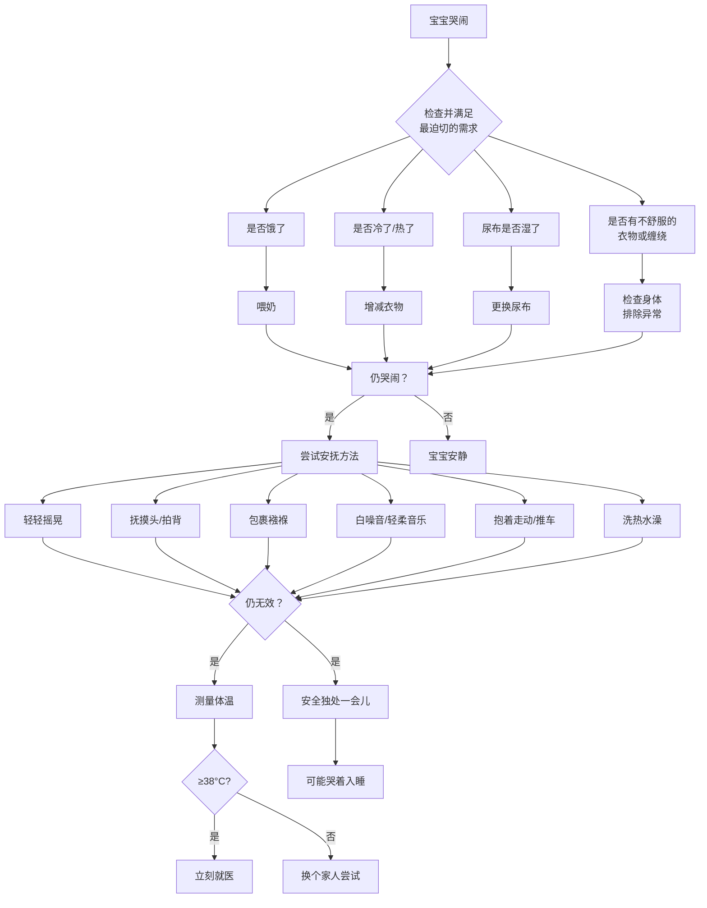
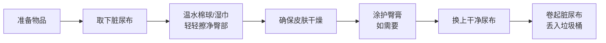
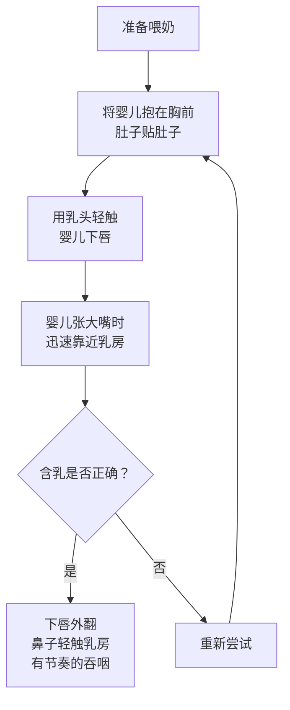
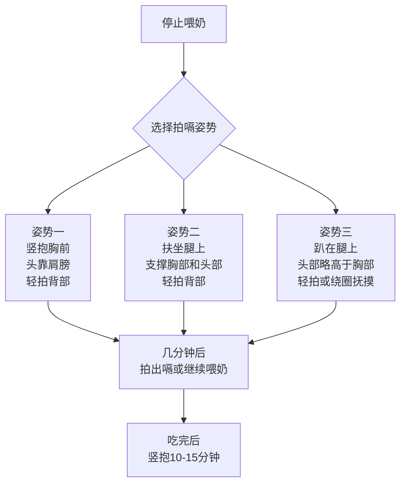

# 第04课：新生儿日常护理

## 学习目标

- 掌握新生儿哭闹的常见原因和安抚技巧，正确识别肠痉挛
- 理解婴儿睡眠模式和SIDS预防要点，学会正确使用安抚奶嘴和襁褓
- 熟悉新生儿排尿排便的正常规律，掌握换尿布的正确步骤和尿布疹护理
- 学习新生儿洗澡方法、脐带护理和穿衣技巧
- 掌握母乳喂养和奶瓶喂养的核心技巧，了解配方奶的选择原则
- 理解营养补充（维生素D、铁）的必要性和拍嗝打嗝吐奶的正确处理

## 一、婴儿哭闹

新生儿每天平均哭闹1-4小时，这是他们适应子宫外世界的正常方式。哭对婴儿有多重实用意义——寻求帮助、舒缓过于强烈的感官刺激、减压。

### 为什么会哭

| 哭声类型 | 典型特征 | 可能原因 |
|---------|---------|---------|
| 饥饿 | 有节奏的哭声，逐渐增强 | 需要喂奶 |
| 生气 | 哭声更用力、更响亮 | 需求未被及时满足 |
| 难过/疼痛 | 尖利或惊恐的哭声 | 身体不适、受伤 |
| 困倦 | 烦躁的哼唧 | 过度疲劳 |
| 过度刺激 | 无法安静、扭动身体 | 环境过于嘈杂或明亮 |

> [!TIP] 迅速回应，不会被宠坏
> 在婴儿出生后的几个月里，解决哭闹问题的最好办法是**迅速回应**。这么小的孩子是不会被宠坏的。如果你对他的求助信号及时回应，他就不会哭那么久。

### 安抚哭闹的步骤

### 肠痉挛

肠痉挛通常在婴儿4周大时开始出现，表现为每天至少有一段时间婴儿表现得很痛苦——两腿向上举、面部涨红、大声哭闹。他们可能表现得很饿，但喂奶时却扭开头拒绝吃奶。

> [!DANGER] 绝对禁止
> 不论多么不耐烦、多么恼火，都**绝对不能大力摇晃婴儿**。大力摇晃可导致婴儿失明、大脑受损甚至死亡。请务必将这个信息转告给所有看护孩子的人。

### 张思莱医生精讲：哭闹应对

> [!NOTE] 张思莱医生精讲要点
> 1. 听到宝宝哭时别太紧张，如果你紧张，孩子能感觉到，会哭得更厉害
> 2. 立即回应——用声音或行动回应都可以，宝宝能从你的声音和语调中感觉到你的情绪
> 3. 先满足最迫切的需求：又冷又饿尿湿了→先保暖→换尿布→最后喂奶
> 4. 如果已喂过奶、拍过嗝、尿布干爽，最好的办法是抱着他、跟他说话、唱歌
> 5. 孩子这么小的时候，你对他关心再多也不会宠坏他
> 6. 如果孩子发出**尖利的哭声**，或哭闹时间超出正常范围，可能是生病了，需请医生检查

---

## 二、睡眠与安抚奶嘴

### 婴儿睡眠模式

新生儿的睡眠由两种阶段组成：

| 睡眠阶段 | 特征 |
|---------|------|
| 快速眼动睡眠（REM） | 眼球在闭合的眼皮下转动、身体惊跳、面露微笑、手脚突然动作 |
| 非快速眼动睡眠（NREM） | 动作越来越少，呼吸放缓，身体完全不动，很少做梦 |

刚出生的新生儿每天睡眠时长将近**16小时**，分成3-4段均衡分布在哺乳之间。两到三个月后这种规律将改变。

### SIDS预防：仰卧睡眠

> [!IMPORTANT] 核心安全原则
> - **所有健康的婴儿都应仰卧入睡**——这是降低婴儿猝死综合征（SIDS）风险最有效的方法
> - SIDS是美国1岁以下婴儿死亡的首要原因
> - 自1992年美国儿科学会推荐仰卧睡姿以来，美国SIDS发生率已降低**50%以上**
> - 侧卧和俯卧一样危险，侧卧很容易变成俯卧

### 安全的睡眠环境

| 安全要点 | 具体要求 |
|---------|---------|
| 床垫 | 铺着床单的**硬质**婴儿床垫，不放枕头或床褥 |
| 寝具 | 穿睡衣或婴儿睡袋，**不要盖毯子** |
| 床上物品 | 不放毛绒玩具、棉被、防撞护垫、豆袋靠垫 |
| 同房不同床 | 出生后第一年睡在父母房间的独立婴儿床/摇篮里 |
| 温度 | 保持舒适，避开通风口、空调和暖气风口 |
| 睡姿 | 包括胃食管反流的婴儿在内，都应**仰卧** |

> [!WARNING] 同床风险
> 和婴儿睡同一张床会增加死亡风险。母乳喂养时安抚好后，一定把孩子放回有安全保障的婴儿床/摇篮里。

### 安抚奶嘴

安抚奶嘴有助于降低SIDS风险。

**使用指南：**
- 母乳喂养的婴儿：等能熟练吃奶后再用，约出生后3-4周
- 配方奶/瓶喂的婴儿：任何时候都适用
- 如果孩子不喜欢或奶嘴掉了出来，**不要强迫**
- **安全注意**：奶嘴上不要系线、绳子或挂毛绒玩具

### 襁褓

大多数新生儿被紧紧包住会很有安全感。打襁褓时：

1. 毯子平铺，折起一角
2. 婴儿仰面放在毯子上，头朝折起的那一角
3. 左边一角包住身体，塞在身体左侧下方
4. 脚下方的毯子向上折起包住脚
5. 右边的一角向左包住他，只露出头和脖子

> [!WARNING] 襁褓安全
> - 确保髋部和双腿可以在毯子里**自由活动**，包太紧会造成髋关节发育异常甚至脱臼
> - 襁褓中的婴儿必须保持**仰卧**姿势
> - 婴儿表现出试图翻身的迹象时（约2-3个月大），**不要**再打襁褓

---

## 三、排尿排便与换尿布

### 正常排便规律

| 喂养方式 | 大便特征 | 频率 |
|---------|---------|------|
| 胎便（出生后） | 粘稠的黑色或深绿色 | 前几次 |
| 过渡期 | 黄绿色 | 第3-4天 |
| 母乳喂养 | 黄色松软便，含小颗粒 | 出生后第一个月每次吃奶后排便 |
| 配方奶喂养 | 褐色到黄色，质地更粘稠 | 每天至少1次 |

> [!NOTE] 注意事项
> - 出生后3-6周，有些母乳喂养的婴儿可能一周才大便一次——只要大便仍是软的、体重正常增长，就属于正常情况
> - 绿色大便通常是正常的（消化速度影响）
> - 大便中出现大量血迹、黏液或水样便，应立刻就医
> - 排便次数突然增多且水分异常多，可能是腹泻，需警惕脱水

### 观察排尿

- 频繁的婴儿每1-3小时排尿一次，不太频繁的每天4-6次
- 健康婴儿尿液颜色从淡黄色到深黄色
- 第一周可能尿布上出现粉色痕迹——尿液浓度高所致，每天湿4块以上尿布就不用担心
- **新生女婴**：出生后第一周尿布上可能有一小块血迹，是母亲激素影响，属正常现象

### 换尿布步骤

**准备工作：** 干净尿布、温水、无香精婴儿湿巾/棉球、护臀膏或凡士林

> [!DANGER] 安全第一
> - **绝对不可以**将婴儿独自留在尿布更换台上，哪怕一秒也不可以
> - 不要使用婴儿爽身粉，擦粉时扬起的粉尘容易被婴儿吸入，刺激肺部

### 尿布疹

| 预防措施 | 说明 |
|---------|------|
| 大便后尽快更换 | 每次大便后用温水清洁 |
| 经常更换湿尿布 | 减少皮肤与尿液接触 |
| 让臀部暴露在空气中 | 有机会就晾一晾 |
| 使用护臀膏 | 防止尿液和大便刺激皮肤 |
| 保持干爽 | 穿尿布后确保里面空气流通 |

母乳喂养的婴儿患尿布疹的概率**小于**配方奶喂养的婴儿。

---

## 四、洗澡、皮肤护理与穿衣

### 洗澡频率与方法

- 一岁以下婴儿：每周用低刺激性沐浴液洗**3次**或每天1次——更频繁会导致皮肤干燥
- **脐带残端未脱落前**：只能擦浴，不能盆浴

**擦浴步骤：**
1. 在温暖房间内，将婴儿放在铺好浴巾的平台上
2. 用大浴巾包好，只露出要擦洗的部位
3. 先用无沐浴液的湿毛巾擦脸
4. 沾取沐浴液清洗身体其他部位
5. **尿布包裹的部位最后清洗**
6. 特别注意清洗腋下、耳后、脖子等有褶皱的地方

**盆浴要点：**
- 水温以手腕或手肘内侧放入感觉温热为宜
- 水深约5厘米
- 先放冷水后放热水，热水最高温度**不超过49°C**
- 绝对不可将婴儿独自留在浴盆内

### 脐带护理

- 脐带残端未脱落前保持干燥
- 擦浴后用毛巾轻轻擦干脐带残端
- 自然脱落即可，无需特殊处理

### 皮肤护理

- 新生儿脱皮是正常现象（清除多余皮肤细胞）
- 通常不需要润肤乳；皮肤特别干燥时可使用不含香精和着色剂的婴儿润肤乳
- 持续出现凸起、干燥的皮疹——可能是湿疹，需咨询医生

### 指甲修剪

| 事项 | 建议 |
|------|------|
| 工具 | 指甲锉或婴儿指甲钳 |
| 频率 | 手指甲每周剪2次，脚指甲每月1-2次 |
| 时机 | 洗澡后或婴儿睡着后 |
| 注意 | 不要用牙齿咬——可能造成皮肤感染 |

### 穿衣技巧

> [!TIP] 穿衣法则
> 身处同一环境时，婴儿应该**比你多穿一层衣服**。

**穿衣原则：**
- 先穿贴身的上衣+尿布→套睡衣→包婴儿抱毯
- 天热时减至一层
- 早产儿需要多穿一层
- 新生儿衣物应**单独洗涤**，至少漂洗两次
- 选择从头到脚有按扣或拉链的衣服，便于穿脱
- 袖子要宽，便于将手伸进去引导婴儿胳膊

---

## 五、婴儿喂养

### 喂养总论

全球大型健康组织一致认为：**母乳是婴儿最理想的食物**。美国儿科学会建议纯母乳喂养至少到6个月，继续母乳喂养至少到婴儿满1岁。

| 对比项 | 母乳喂养 | 配方奶喂养 |
|--------|---------|-----------|
| 营养 | 完美均衡，含酶、抗体、生长因子 | 近似但无法复制母乳全部成分 |
| 健康保护 | 降低中耳炎、湿疹、哮喘、肺炎、SIDS、儿童白血病风险 | 无 |
| 母亲健康 | 助子宫恢复、恢复体态、降低癌症风险 | 无 |
| 便利性 | 随时供应，无需准备 | 需购买、冲调、清洗器具 |
| 成本 | 母亲多摄入少量热量 | 购买配方奶+器具的成本 |

### 母乳喂养技巧

**正确含乳**是成功母乳喂养的关键：

**哺乳频率：** 每24小时8-12次，按需喂养。

**吃饱的信号：**
- 出生后头几天体重减轻不超过出生体重的10%
- 第5-7天每天排便至少3-4次（黄色松散状）
- 第5-7天每天尿湿6块以上尿布
- 每天增重14-28克（前三个月）

### 婴儿的五种吃奶模式

| 类型 | 特点 | 建议 |
|------|------|------|
| 梭鱼型 | 立刻含乳，努力吃10-20分钟 | 无需特殊处理 |
| 兴奋但低效型 | 含住-松开-尖叫反复 | 一醒就喂，别等饿过头 |
| 拖拉型 | 吃奶费劲，需产奶量增加后才改善 | 坚持母乳，不要用奶瓶喂水/奶 |
| 美食家型 | 先玩再吃，被催促会生气 | 耐心等待，确保含住乳晕而非乳头 |
| 吃吃停停型 | 吃几分钟休息几分钟 | 留出更多喂奶时间，灵活应对 |

### 奶瓶喂养方法

**选择配方奶的原则：**
- 一岁以下婴儿**不能**喂普通牛奶——无法消化、肾脏负担大、缺乏铁和维生素C
- 首选高铁牛奶配方奶（占配方奶销量80%）
- 水解蛋白配方奶：适用于过敏婴儿
- 大豆配方奶：极少数情况下使用
- **美国儿科学会不推荐**在家自制配方奶

**冲调要点：**
- 严格按照产品说明操作——加水过多营养不足，加水过少加重肾脏负担
- 冲调前将水加热到**70°C**以降低克罗诺杆菌风险
- 冲调好的配方奶冷藏保存，**24小时内用完**
- 不要用微波炉加热——加热不均会烫伤婴儿

**喂奶姿势：**
- 半竖起的姿势，环抱婴儿并撑起头部
- **不要让婴儿完全平躺时喂奶**——会增高呛奶和耳部感染风险
- 倾斜奶瓶让奶充满瓶颈和奶嘴，防止吸入空气

**喂养量表：**

| 月龄 | 每顿奶量 | 频率 |
|------|---------|------|
| 第1周 | 30-60毫升 | 按需 |
| 第1个月 | 90-120毫升 | 每3-4小时 |
| 接近6个月 | 180-240毫升 | 每24小时4-5次 |

> [!WARNING] 过量与不足
> - 喂食过量迹象：每顿超180毫升、吐奶、大便非常稀、一天排便8次以上
> - 喂食不足迹象：吃完不满足、每天尿湿尿布不到4块、排便次数少
> - 24小时内配方奶总量不应超过960毫升

---

## 六、营养补充

### 维生素D

| 人群 | 推荐剂量 |
|------|---------|
| 所有婴儿（出生后不久开始） | 每天400国际单位 |
| 1岁以上 | 每天600国际单位 |

- 母乳喂养的婴儿**必须补充**维生素D
- 配方奶已添加维生素D，每天喝足量配方奶的婴儿无需额外补充

### 铁

| 情况 | 补铁建议 |
|------|---------|
| 足月母乳喂养（出生体重>2.5千克） | 4个月大时开始补铁 |
| 早产儿/低出生体重 | 出生后2周内开始补铁 |
| 配方奶喂养 | 选择高铁配方奶 |
| 6个月后 | 添加富含铁的辅食（肉类、蛋黄、高铁米粉） |

### 其他

> [!NOTE] 营养补充要点
> - **6个月以内**：母乳或配方奶已提供充足水分，**无需额外喝水**
> - **一岁以下**：**不推荐喝果汁**，增加龋齿风险和偏爱甜味
> - 哺乳的母亲应继续每天补充多种维生素
> - 关于氟化物补充，需咨询儿科医生

---

## 七、拍嗝、打嗝与吐奶

### 正确拍嗝

吃奶时吞入的空气会让婴儿感到不适。配方奶喂养的婴儿比母乳喂养的更容易吞入空气。

**拍嗝时机：**
- 配方奶喂养：每吃完60-90毫升就拍嗝
- 母乳喂养：趁换另一侧乳房时拍嗝

**三种拍嗝姿势：**

### 打嗝

多数婴儿时不时就会打嗝，通常婴儿自己并不在意。如果吃奶时开始打嗝，可以换个姿势、拍嗝或帮他放松。5-10分钟后仍未停止，再喂几分钟通常可以止嗝。

### 吐奶 vs 呕吐

| 特征 | 正常吐奶 | 呕吐 |
|------|---------|------|
| 反应 | 轻松，婴儿甚至没注意到 | 剧烈，婴儿痛苦不适 |
| 时间 | 不定，有时在拍嗝或流口水时 | 通常在进食后不久 |
| 奶量 | 少 | 比吐奶多 |
| 是否需要担心 | 一般不必 | 需联系医生 |

> [!WARNING] 需要就医的呕吐
> - 经常呕吐或呕吐物中有血样物质或黄绿色物质
> - 吐奶伴随体重减轻、烦躁不安
> - 婴儿不满3个月，呕吐同时发热

**减少吐奶的方法：**
1. 喂奶时保持安静、平和、愉快
2. 避免突然的噪声、强光等干扰
3. 每3-5分钟拍嗝（配方奶喂养）
4. **不要让婴儿平躺着吃奶**
5. 吃完后竖抱20-30分钟
6. 吃完奶后不要挤压腹部或做剧烈活动
7. 在极度饥饿之前喂奶
8. 奶瓶奶嘴孔大小合适

### 张思莱医生精讲：拍嗝要点

> [!NOTE] 张思莱医生精讲要点
> 1. 给宝宝拍嗝时动作要轻柔，不要用力过猛
> 2. 拍嗝的手呈空心掌，从下往上轻拍背部
> 3. 如果几分钟后没拍出嗝，不用担心，继续喂奶即可——不是每次都会打嗝
> 4. 宝宝吃完奶后竖抱10-15分钟，有助于防止吐奶
> 5. 母乳喂养的宝宝吞咽空气较少，拍嗝需求不如配方奶喂养的宝宝频繁

---

## 八、基本医疗护理

### 体温测量

判断婴儿是否发热的最佳办法是**测量直肠温度**：

- 两个月以下的婴儿发热（直肠温度≥38°C）需要立刻就医，通常需要住院
- 三个月及以下的婴儿发热都应及时告诉医生
- 耳温计对六个月以下婴儿不够准确
- 颞动脉温度计可信

### 早期体检内容

| 检查项目 | 主要内容 |
|---------|---------|
| 生长情况 | 称重、量身高、测头围，绘制生长曲线 |
| 头颅 | 前囟和后囟的闭合情况 |
| 耳朵 | 耳镜观察耳道和鼓膜、听力筛查 |
| 眼睛 | 眼球运动、检眼镜检查（白内障筛查） |
| 口腔 | 感染症状、腭裂检查 |
| 心脏和肺 | 听诊心率、心音异常、呼吸困难 |
| 腹部 | 触诊器官肿大、异常肿块 |
| 生殖器 | 男婴睾丸下降、包皮环切愈合情况 |
| 髋部和腿 | 脱位或发育异常检查 |
| 发育情况 | 反射行为、肌张力、运动发育里程碑 |

### 疫苗接种

两岁前婴儿需接种的疫苗保护以下13种疾病：乙型病毒性肝炎、百日咳、白喉、破伤风、脊髓灰质炎、B型流感嗜血杆菌感染、肺炎球菌感染、轮状病毒感染、麻疹、腮腺炎、风疹、水痘、甲型病毒性肝炎。6个月后可每年接种流感疫苗。

---

## 九、张思莱医生精讲：新生儿日常护理核心要点

> [!NOTE] 张思莱医生精讲要点
> **关于哭闹：**
> - 新生儿平均每天哭1-4小时，这是他们表达需求的方式
> - 立即回应很重要——宝宝能从你的声音和语调中感觉到你的情绪
> - 如果怎么哄都无法安静，请护士帮忙——她们非常有经验
> - 尖利的哭声或哭闹时间超出正常范围，可能是生病了
>
> **关于洗澡：**
> - 可在医院期间向护士多请教，争取在孩子出院前学会
> - 将洗澡拆分为六步：准备用品→脱衣服→抱起宝宝→按顺序清洁→擦干做抚触→穿好衣服
> - 脐带残端未脱落前只能擦浴
> - 女宝宝要清洗生殖器附近；男宝宝不要强行翻回包皮
>
> **关于喂养：**
> - 分娩后应尽早开始喂奶，一般建议一小时内
> - 只要新生儿表现出饥饿就应喂奶，每24小时8-12次
> - 母乳是婴儿最好的食物，含有配方奶无法复制的酶、抗体和生长因子
> - 如果母乳喂养不顺利，不要觉得自己失败——积极寻求帮助
>
> **关于拍嗝：**
> - 配方奶喂养的宝宝每吃60-90毫升要拍嗝
> - 母乳喂养的宝宝换边时拍嗝
> - 拍嗝动作要轻柔，用空心掌从下往上轻拍

---

## 综合案例：新生儿日常护理一天

### 情景

小明刚出生第5天，今天妈妈发现他一直在哭闹。换过尿布、喂过奶后，他依然哭个不停。妈妈很着急，不知道怎么办。

### 处理过程

1. **检查需求**：先确认尿布干爽、已喂奶、没有发烧（测量体温正常）
2. **评估情况**：包裹太紧？环境太吵？头发缠住了手指？
3. **尝试安抚**：轻轻抱起小明，用襁褓包好，放在怀里轻轻摇晃，播放白噪音
4. **观察反应**：小明逐渐安静下来，但仍然不时哼哼
5. **拍嗝**：竖抱起来轻拍背部，拍出一个大嗝后，他明显放松了
6. **哄睡**：趁他昏昏欲睡但还没完全睡着时，将他仰卧放在婴儿床上
7. **保持安全**：床上没有毛绒玩具和毯子，穿着婴儿睡袋保暖

### 要点总结

- 哭闹不一定是饥饿——先全面检查
- 拍嗝可能解决"隐形的"不适
- 在婴儿昏昏欲睡时放入婴儿床，帮他学习自主入睡
- 始终保持仰卧的睡眠姿势

---

## 实践检验

> [!QUESTION] 自测题
> 1. 新生儿每天平均哭闹多长时间？安抚哭闹的第一步是什么？
> 2. 为什么健康的婴儿必须仰卧入睡？SIDS预防的五个关键措施是什么？
> 3. 母乳喂养的婴儿和配方奶喂养的婴儿，大便特征有什么不同？
> 4. 母乳喂养的婴儿需要补充维生素D吗？从什么时候开始？每天补充多少？
> 5. 正常吐奶和呕吐有什么区别？什么情况下需要就医？
> 6. 婴儿吃完奶后应该如何正确拍嗝？至少说出两种拍嗝姿势。

查看答案

1. 新生儿每天平均哭闹1-4小时。安抚哭闹的第一步是检查并满足最迫切的需求：是否饿了、冷了热了、尿布湿了、身体不舒服等。

2. 仰卧睡姿可以降低SIDS发生风险50%以上。五个关键措施：①仰卧睡在硬质床垫上 ②同房不同床 ③床上不放毛绒玩具和松软寝具 ④穿睡衣或睡袋不盖毯子 ⑤使用安抚奶嘴。

3. 母乳喂养婴儿的大便是黄色松软便，含小颗粒，质地较稀；配方奶喂养婴儿的大便从褐色到黄色，质地更粘稠。母乳喂养婴儿第一个月每次吃奶后都可能排便，而配方奶喂养婴儿每天至少排便1次。

4. 是的，**必须补充**。从出生后不久开始，每天400国际单位维生素D。配方奶喂养的婴儿如果每天喝足量配方奶，则无需额外补充。

5. 正常吐奶：轻松，婴儿甚至没注意到，奶量少。呕吐：反应剧烈，婴儿痛苦，奶量多。需要就医的情况：经常呕吐、呕吐物中有血样或黄绿色物质、伴随体重减轻或发热。

6. 三种拍嗝姿势：①竖抱胸前，头靠肩膀，轻拍背部 ②扶坐腿上，支撑胸部和头部，轻拍背部 ③让婴儿趴在腿上，头部略高于胸部，轻拍背部。

## 下一步

继续学习 [[0005-liao-jie-ni-de-xin-sheng-er|第05课：了解你的新生儿]]，深入了解新生儿的体格发育、反射行为和感知觉发育！

需要复习相关术语？请查阅 [[../reference/glossary|术语表]]。