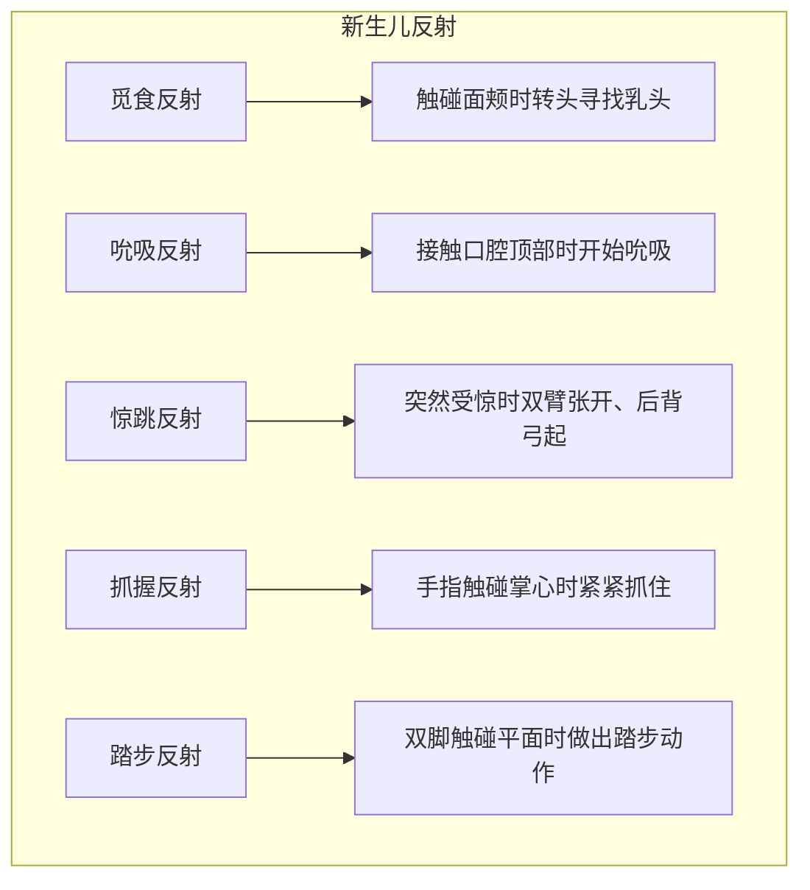
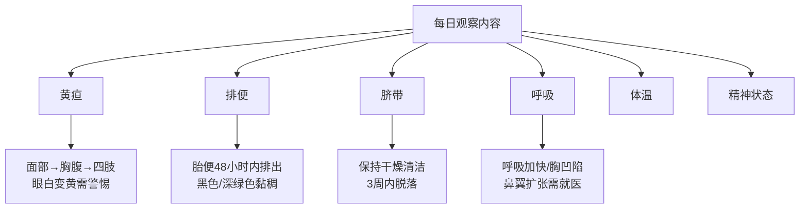

# 第05课：了解你的新生儿

## 学习目标

- 掌握新生儿的外观特征，理解头型变形、囟门、胎记类型等正常生理现象
- 了解新生儿的体重变化规律和体格发育指标（体重、身高、头围）
- 认识新生儿的感官能力和行为反射（觅食反射、惊跳反射、踏步反射等）
- 学习男婴阴茎护理的正确方法（割包皮与未割包皮的护理差异）
- 做好迎接宝宝回家的准备，了解汽车安全座椅和家庭安全
- 掌握新生儿健康观察要点（黄疸、排便、脐带护理、呼吸等）

## 一、新生儿的外观特点

### 头型与囟门

分娩过程中，新生儿的头部可能被产道挤压而拉长变形，先露出的部位可能出现头皮肿胀。轻轻按压肿胀部位会留下轻微压痕——这是**产瘤**（头皮水肿），通常在几日内消失。有时头部一侧或两侧出现较硬的皮下肿胀，按压后立即回弹，这可能是**头颅血肿**（头盖骨外的出血），通常需要6到10周才能消失。

所有新生儿头上都有两个柔软的区域——**囟门**：

| 位置 | 特点 |
|------|------|
| 前囟（头顶靠前） | 较大，约在12-18个月闭合 |
| 后囟（头后部） | 较小，约在2-4个月闭合 |

> [!IMPORTANT] 囟门护理
> 囟门下方有厚实的脑膜保护大脑，可以轻轻触摸，无需过分紧张。千万不要用力按压或撞击。

### 皮肤与胎记

新生儿皮肤可能出现脱皮（正常现象，无需治疗），肩膀和后背上可能有细小的**胎毛**（早产儿更明显，几周内消失）。

常见的胎记和皮疹类型：

| 类型 | 外观 | 位置 | 预后 |
|------|------|------|------|
| 鲑鱼斑/鹤咬痕 | 粉色块状，深浅不一 | 鼻梁、额头、上眼皮、脑后、颈部 | 数月到几年内消失 |
| 蒙古斑 | 棕色/灰色/蓝色，大小不一 | 腰部或臀部 | 学龄前消失，无需治疗 |
| 新生儿中毒性红斑 | 红色斑块，中间有乳黄色凸起 | 全身 | 一周左右完全消失 |
| 粟丘疹 | 微小白色凸起或黄点 | 面颊、下巴、鼻头 | 2-3周内自行消失 |
| 痱子 | 细小汗泡或小红点 | 皮肤褶皱处 | 几天内消失 |
| 血管瘤 | 隆起的红斑 | 不定 | 入学年龄前自行萎缩消失 |
| 葡萄酒色斑 | 大块平滑深红/紫色斑块 | 面部或颈部 | 不治疗不会自行消失 |

> [!TIP] 需要警惕的皮疹
> 虽然新生儿暂时性脓疱性黑变病、粟丘疹等属于无害皮疹，但父母仍需请医生对所有疱疹状皮疹进行检查，以排除感染因素。

### 其他外观特征

- **眼睛**：白种人新生儿出生时眼睛多为蓝色，6个月内可能变化；深肤色新生儿出生时即为棕色。眼白有血点（产道挤压所致，几天内消失）。
- **胎发**：数量和发质各不相同，大部分或全部在6个月内脱落，被成熟头发取代。
- **乳房肿大**：受母体激素影响，男婴和女婴都可能出现乳房暂时性增大甚至分泌微量乳汁，持续不超过一周。**不要挤压**，否则可能造成感染。
- **女婴假月经**：少量白色黏液或带血丝的阴道分泌物，无不良影响。
- **外生殖器**：看起来发红且相对较大。男婴阴囊可能小而光滑或大而垂，睾丸可在阴囊内移动。
- **疝气**：脐部或下腹部中央在哭闹时突起的轻微疝气，常见但多数可自愈。

---

## 二、新生儿的体重、身体与行为

### 体重变化规律

### 体格发育指标（张思莱医生精讲）

> [!NOTE] 张思莱医生精讲要点
> 体格发育主要包括**体重、身高和头围**三大指标。对于营养充足的健康婴儿来说，这三大指标应按一定速度增长。速度异常说明可能存在喂养、发育或健康方面的问题。

#### 出生第一个月的发育指标

| 指标 | 变化范围 |
|------|---------|
| 体重 | 先降后升，第2周恢复出生体重；满月增重约0.5-1.5kg |
| 身高 | 一个月可增加4.5-5厘米 |
| 头围 | 出生约35厘米，满月约38厘米（男婴略大，差异不超过1厘米） |

### 原因分析：偏大与偏小

**偏大的新生儿**可能的原因包括：父母身材高大、母亲妊娠期糖尿病、妊娠期超过42周等。可能出现代谢异常、分娩性外伤、黄疸等问题。

**偏小的新生儿**可能的原因包括：提前出生、父母身材矮小、母亲患有慢性疾病、胎盘问题、母亲妊娠期吸烟/酗酒等。需严密监控体温、血糖和血红蛋白水平。

### 新生儿的身体姿势

新生儿会像在子宫里那样向自己缩成一团——四肢紧贴躯干、手指紧握成拳、两脚自然向身体内侧偏转。需要几周时间身体才会从胎儿姿势逐渐舒展开。

---

## 三、新生儿的感官与反射

### 感官发育

| 感官 | 特点 |
|------|------|
| 视觉 | 视力范围20-30厘米（喂奶时能看清妈妈的脸）；可分辨明暗和鲜艳颜色 |
| 听觉 | 能辨认出母亲的声音；轻柔乐曲可使其安静 |
| 嗅觉/味觉 | 能将母乳和其他液体区分开；天生喜欢甜味 |
| 触觉 | 最重要的感觉；喜欢肌肤相亲，亲密的拥抱可刺激生长发育 |

### 新生儿反射

| 反射名称 | 刺激方式 | 表现 | 消失时间 |
|---------|---------|------|---------|
| 觅食反射 | 触碰面颊 | 转头寻找乳头 | 约4个月 |
| 吮吸反射 | 接触口腔顶部 | 开始吮吸 | 约4个月 |
| 惊跳反射 | 突然声响或移动 | 双臂张开、后背弓起 | 约2-4个月 |
| 抓握反射 | 触碰掌心 | 手指紧紧抓住 | 约5-6个月 |
| 踏步反射 | 双脚触碰平面 | 做出踏步动作 | 约2个月 |

### 新生儿的声音

新生儿除了哭以外，还会发出呼噜声、尖叫声、叹气声、喷嚏声和打嗝声。大部分声音是对周围干扰的反射。尖锐的声音或强烈的气味都足以令其惊跳或大哭。

---

## 四、男婴的阴茎护理

### 割包皮术后的护理

包皮环切术通常在新生儿出院前进行。术后阴茎顶端会包着涂有凡士林的消毒纱布。

**护理要点：**
- 保持伤口周围清洁，大便沾到阴茎时用肥皂和温水轻轻洗干净
- 术后头几天阴茎顶端发红、有黄色分泌物，是正常愈合迹象
- 红肿和分泌物应在一周内逐渐消失
- 如果一周后继续发红、更肿胀或出现黄色结痂，可能是感染，需就医

### 未割包皮的阴茎护理

- 只需用肥皂和温水清洗，与清洗尿布区域的其他部位一样
- 最初包皮与阴茎顶端组织相连，**不要强行翻开**
- 强行翻开会造成疼痛、流血甚至撕裂
- 待包皮自然分离后，洗澡时轻轻推后包皮，柔和清洗阴茎顶端

> [!WARNING] 重要提醒
> 不需要用棉签或消毒液来清洗阴茎。不强行翻包皮是最重要的原则。包皮通常在几年内与龟头自然分离。

---

## 五、迎接宝宝回家

### 出院标准

自然阴道分娩通常在48小时内出院，剖宫产需住院3天以上。美国儿科学会建议以母亲和新生儿的健康为重，根据个体实际情况决定。

**出院前必须完成的项目：**
- 听力筛查
- 遗传病采血筛查
- 补充维生素K
- 涂抗生素眼膏
- 心脏筛查
- 接种乙肝疫苗

### 家庭安全准备

**汽车安全座椅：**
- 必须配备符合婴儿身材的、经过认证的汽车安全座椅
- 安装在后排，**朝后**（面部朝向车尾）
- 严格遵照安装说明，最好请专业人员检查

**家庭准备：**
- 安全睡觉的地方
- 大量尿布
- 足够保暖的衣服和毯子

### 新手父母的感受

> [!NOTE] 产后情绪变化
> 接近3/4的新手妈妈在分娩后头几天会有**产后沮丧**——快乐、痛苦和疲惫交织，通常只持续几天。约10%的新手妈妈会发展为**产后抑郁症**，症状可能持续数月，需要寻求专业帮助。**爸爸同样可能患产后抑郁症**，也要保持警惕。

#### 产后情绪对照

| 产后沮丧 | 产后抑郁症 |
|---------|-----------|
| 持续时间短（几天） | 持续数周至数月 |
| 情绪波动、易哭 | 严重的悲伤、空虚、绝望 |
| 通常自行缓解 | 需要专业干预（心理辅导/药物） |
| 不影响日常功能 | 影响照顾婴儿的能力 |

### 帮助家里的其他孩子适应

| 年龄 | 反应特点 | 应对方法 |
|------|---------|---------|
| 不到3岁 | 难以理解变化，可能嫉妒、捣乱或表现幼稚 | 多给关爱和抚慰，表扬好行为 |
| 幼儿园阶段 | 更易理解，感到好奇 | 孕期开始做心理准备 |
| 小学阶段 | 感到骄傲和想保护新生儿 | 偶尔让他帮忙，但也要留出关注他的时间 |

---

## 六、健康观察与常见问题

### 新生儿健康观察清单

### 黄疸

很多新生儿的皮肤呈淡黄色，称为黄疸，由血液中胆红素蓄积引起。

| 项目 | 说明 |
|------|------|
| 轻度黄疸 | 无害，可自行消退 |
| 重度黄疸 | 胆红素持续升高不治疗，可能导致大脑受损 |
| 高发人群 | 母乳喂养且吃奶不好的新生儿 |
| 预防方法 | 每天喂8-12次奶，促进胆红素排出 |
| 出现顺序 | 面部 → 胸腹部 → 四肢（眼白同时变黄） |
| 持续时间 | 母乳喂养2-3周，配方奶喂养约2周 |

> [!WARNING] 黄疸警示
> 出院回家后如果发现孩子身上的黄疸突然增多，应立即联系医生。出生后72小时内出院的新生儿，应在出院后2天内回医院复查黄疸。

### 排便观察

- **首次排便**：出生后24小时或更晚，排出黑色/深绿色的**胎便**（非常黏稠）
- **警示**：出生后48小时内未排出胎便，需检查肠道问题
- **便血**：少量血丝可能是肛门小裂口，需告知儿科医生确认原因

### 脐带护理

- 保持脐带残端干净清爽，**不需要擦酒精**
- 洗澡后将脐带残端擦干
- 尿布边缘折到肚脐以下，防止浸湿脐带残端
- 残端脱落时可能有几滴血迹（正常）
- 通常3周内脱落

> [!WARNING] 脐带感染征象
> - 脐带处出现黄色、有异味的分泌物
> - 脐带根部周围皮肤发红
> - 碰到脐带或周围皮肤时孩子哭闹

### 其他健康观察项目

| 观察项目 | 正常情况 | 需要就医 |
|---------|---------|---------|
| 腹胀 | 喂奶后肚子圆鼓，两次喂奶间柔软 | 肚子又胀又硬，1-2天未排便，伴呕吐 |
| 皮肤颜色 | 手脚微青（较冷时），哭闹时面部/舌头微青 | 长期皮肤发青（心肺功能异常） |
| 呼吸 | 出生几小时后形成正常节律 | 呼吸加快、胸凹陷、鼻翼扩张、发出呼噜声、皮肤持续发青 |
| 嗜睡 | 大部分时间睡觉但每几小时醒来吃奶 | 很少保持清醒、不会因饿而醒、对进食无兴趣 |
| 过度哭闹 | 无明显原因的哭闹 | 奇怪的尖叫声或哭闹时长超出正常范围 |

---

## 七、新生儿反射详解 —— Worked Example

**情景：** 一位新手妈妈抱着刚出生3天的宝宝，发现以下现象，不确定是否正常：
1. 用手指轻轻触碰宝宝的面颊，宝宝立刻转头朝向触碰的一侧
2. 抱起宝宝时突然发出声响，宝宝双臂猛地张开然后收回
3. 扶着宝宝站立时，他的双脚做出类似走路的动作

**分析：**
- 现象1是**觅食反射**，帮助宝宝寻找乳头，是正常现象
- 现象2是**惊跳反射**（莫罗反射），表明宝宝的神经系统功能正常
- 现象3是**踏步反射**，说明宝宝的腿部肌肉和神经协调良好

**结论：** 以上三个反射均为正常的新生儿反射，无需担心。

> [!TIP] 核心要点
> 新生儿并非一张白纸——他带着一系列与生俱来的能力来到这个世界。各种反射是神经系统功能正常的重要标志，感官发育（尤其是触觉）是建立亲子关系的基础。学会观察黄疸、排便和脐带情况，是新生儿第一周最重要的健康功课。

---

## 实践检验

> [!QUESTION] 自测题
> 1. 什么是生理性体重下降？一般持续几天？
> 2. 新生儿的视力范围是多少厘米？在这个范围内他能看清什么？
> 3. 母乳喂养的新生儿出现黄疸，应如何预防胆红素升高？
> 4. 未割包皮的男婴，日常护理最重要的原则是什么？
> 5. 脐带残端需要每天用酒精消毒吗？出现哪些情况需要就医？
> 6. 产后沮丧和产后抑郁症的主要区别是什么？

查看答案

1. 出生后新生儿因排出体内过多体液而体重下降，不超过出生体重的10%，约在第5天开始回升，2周左右恢复出生体重。
2. 20-30厘米。在这个距离内，她能清楚地看到抱她喂奶的妈妈的脸。
3. 每天喂8-12次奶，充足的喂养可以促进胆红素排出，将其控制在较低水平。
4. 不要强行翻开包皮清洗。强行翻开会引起疼痛、流血甚至撕裂。
5. 不需要擦酒精，保持清洁干燥即可。出现黄色异味分泌物、脐周皮肤发红、触碰时哭闹需就医。
6. 产后沮丧持续时间短（几天），通常自行缓解；产后抑郁症持续时间长（数周至数月），症状更严重（绝望、疏远家人、无法照顾婴儿），需要专业干预。

## 下一步

继续学习 [[0006-di-1-ge-yue|第06课：第1个月]]，了解满月前宝宝的喂养、睡眠和日常护理要点！

需要复习本课程相关术语？请查阅 [[../reference/glossary|术语表]]。