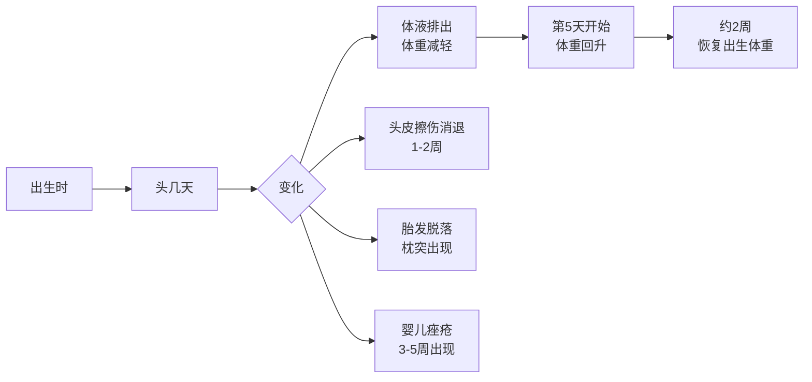
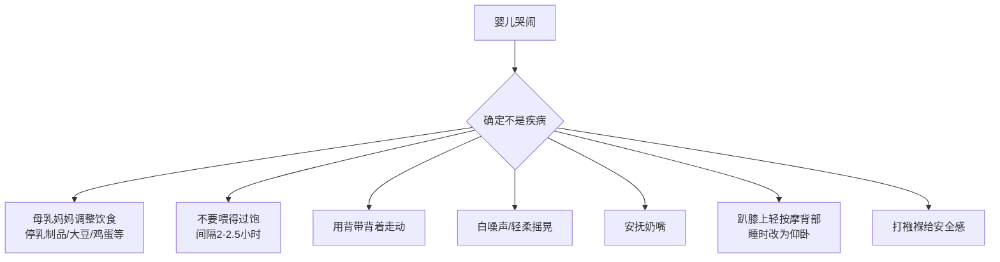
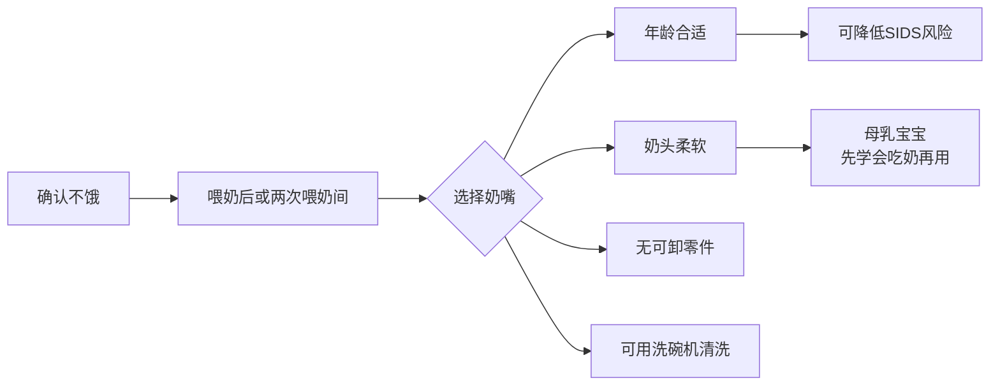

# 第06课：第1个月

## 学习目标

- 掌握新生儿第一个月的外观生长变化规律和正常发育指标
- 识别常见新生儿反射及其意义
- 理解新生儿大脑早期发育的关键因素和摇晃婴儿综合征的危害
- 掌握哭闹与肠痉挛的区别和应对方法
- 学习新生儿看护的四大要点：排便、抱姿、安抚奶嘴、外出安全
- 了解新生儿健康观察的警示信号和安全注意事项

## 一、外观和生长情况

### 正常生长指标

| 指标 | 正常范围 |
|------|---------|
| 出生后体重减轻 | 约10%（7天内恢复） |
| 日均增重 | 20-30克 |
| 满月体重 | 约4.5千克 |
| 身高增长 | 4.5-5厘米 |
| 平均头围出生 | 约35厘米 |
| 满月头围 | 约38厘米 |

### 外观变化

> [!NOTE] 正常现象
> - O型腿：一岁内自行改善
> - 头颅变形：很快恢复正常
> - 肤色不均：手脚发青是正常现象，活动后变红润
> - 脐带残端：10天至3周脱落，保持清洁干燥

### 新生儿反射

| 反射名称 | 表现 | 消失时间 |
|---------|------|---------|
| 觅食反射 | 触碰面颊转头寻找乳头 | 约3-4个月 |
| 吸吮反射 | 含住乳头自动吸吮 | 持续存在 |
| 惊跳反射 | 头后仰时伸展手臂再收回 | 约2个月 |
| 强直性颈部反射 | 头转向一侧，同侧手臂伸直 | 5-7个月 |
| 抓握反射 | 手掌被触碰时握紧 | 5-6个月 |
| 踏步反射 | 脚掌着地时做出迈步动作 | 约2个月 |

> [!WARNING] 注意事项
> 虽然新生儿抓握有力，但**不要**尝试让婴儿抓着手指吊起自己，因为他们会突然松手。

---

## 二、大脑早期发育

### "三岁看老"的科学依据

研究显示，孩子三岁以前大脑有显著发育，每秒形成**700多次**神经连接。基因和成长环境同样重要。

### 大脑发育的五大要素

1. **安全感**：孩子需要感觉自己是特殊的、被爱的和有价值的
2. **信任感**：对周围的环境有信心
3. **引导**：需要均衡的自由和约束
4. **丰富环境**：语言交流、游戏、探索、书籍、音乐
5. **积极互动**：面对面的交流、肌肤接触

> [!IMPORTANT] 关键发现
> 婴儿大脑的活跃度是成年人的两倍！从出生到三岁，人类大脑的学习潜能处于巅峰。

### 不要大力摇晃婴儿

大力摇晃婴儿（摇晃婴儿综合征）是严重虐待行为，会导致：

- 失明或眼部损伤
- 脑损伤
- 脊柱损伤
- 甚至死亡

> [!DANGER] 当你感到失控时
> 1. 深呼吸，从1数到10
> 2. 把婴儿放在安全的地方，离开房间几分钟
> 3. 给朋友或家人打电话寻求支持
> 4. 咨询儿科医生
>
> **绝对不要摇晃或击打婴儿的头部！**

---

## 三、哭闹和肠痉挛

### 正常哭闹模式

- 约2周大开始喜欢哭闹
- 6周左右达到高峰（每天持续约3小时）
- 3-4个月时减少到每天1-2小时

### 肠痉挛的特点

约**1/5**的婴儿会发生肠痉挛，表现为：

- 不停哭闹，哄不好
- 尖叫、双脚乱蹬、放屁
- 傍晚加剧
- 通常在3-4个月消失

### 缓解方法

> [!TIP] 最重要的事
> **绝不可以大力摇晃孩子**。如果感到紧张焦虑，请家人帮忙，或把婴儿放在安全的地方自己离开几分钟冷静。

---

## 四、运动和感觉发育

### 运动发育里程碑

- 手臂活动不平稳、易颤动
- 能将手举到视线范围或送到嘴边
- 俯卧时可将头从一侧转到另一侧
- 双手紧紧握拳
- 强烈的反射行为

### 视觉发育

- 聚焦范围：20-30厘米
- 满月时最远可见约90厘米
- 最喜欢看**人脸图案**和**黑白图案**
- 红色最能吸引注意力

### 听觉发育

- 听觉完全成熟
- 能识别某些声音
- 喜欢音调较高的声音（如耳语）
- 听到熟悉声音时会扭头寻找

### 嗅觉和触觉

- 喜欢甜味、柔软的东西
- 能辨别母乳的味道
- 不喜欢被粗暴对待

---

## 五、基本看护

### 排便观察

> [!TIP] 关注要点
> - **正常**：黄色软便，颜色从浅棕到深绿皆正常
> - **危险信号**：白色大便（肝胆问题）、红色或黑褐色（出血）
> - 母乳喂养每天排便不足4次可能摄入不足

### 抱新生儿的姿势

- **平躺时**：用手轻轻托住头部
- **竖直时**：用手托住头部和颈部
- 避免头部前后或左右晃动

### 安抚奶嘴使用指南

### 外出注意事项

- 6个月前避免阳光直射
- 按"比大人多穿一层"原则穿衣
- 冬天裹好头部和耳朵
- 摸摸手脚和胸部检查温度

---

## 六、家庭成员须知

### 母亲须知

- 产后激素波动导致情绪低落是正常的
- 尽量在孩子睡觉时也打个盹
- 控制拜访者数量，避免劳累和感染

### 父亲须知

- 父亲陪伴可降低早产率和新生儿死亡率
- 父亲也会患产后抑郁症
- 多花时间与孩子肌肤相亲（袋鼠式护理）
- 父亲对孩子语言发展和心理健康有重要影响

### 让大孩子适应

- 给新生儿拍照时也拍大孩子
- 亲朋好友来访时也给大孩子准备小礼物
- 让大孩子参与照顾宝宝

---

## 七、健康观察

### 需要立即就医的信号

| 症状 | 处理 |
|------|------|
| 呼吸频率>60次/分钟 | 立即就医 |
| 发热（直肠温度≥38°C） | 立即就医（对1个月婴儿很严重） |
| 腹泻导致脱水（口唇干燥、尿量减少） | 就医 |
| 喷射性呕吐 | 立即就医 |
| 持续8小时以上的反复呕吐 | 就医 |
| 过度肢体无力或瘫软 | 立即就医 |
| 皮肤发黄加重或持续3周以上 | 就医 |

### 常见皮疹和轻微问题

- **头皮乳痂**：每天洗头并刷掉，几个月内消失
- **脐带感染**：残端附近发红、脓性分泌物，需就医
- **鹅口疮**：口腔白色片状物，抗真菌药物治疗
- **泪道阻塞**：眼角分泌物，9个月内大多自行打开

---

## 八、安全注意事项

### 婴儿猝死综合征（SIDS）预防

> [!WARNING] MUST KNOW
> - **让婴儿仰卧睡觉**
> - 使用坚实平整的床垫
> - 床上不放枕头、毯子、防撞护垫、毛绒玩具
> - 母婴同室不同床
> - 母乳喂养和安抚奶嘴可降低风险
> - 创造无烟环境

### 安全检查清单

- [x] 汽车安全座椅：后向式，后排座位
- [x] 洗澡：水温适中，全程看护，一分钟也不能离开
- [x] 防坠落：绝不单独留在高于地面的台面上
- [x] 防窒息：婴儿床无松软物品，不用宽松毯子
- [x] 防烫伤：热水器最高温度调至49°C
- [x] 烟雾探测器：安装并定期检查

---

> [!TIP] 核心要点
> 新生儿的第一个月是适应和观察的关键期。关注生长曲线、识别反射发育、预防SIDS、避免摇晃婴儿、做好健康观察，是每位父母必须掌握的基本功。

## 实践检验

> [!QUESTION] 自测题
> 1. 新生儿出生后体重会减轻多少？大约几天恢复？
> 2. 列举至少4种新生儿反射及其消失时间。
> 3. 什么是摇晃婴儿综合征？应该如何预防？
> 4. 肠痉挛通常在婴儿多大时达到高峰？一般持续多长时间？
> 5. 预防婴儿猝死综合征最重要的措施是什么？

查看答案

1. 减轻约10%，大约在第5天开始回升，2周左右恢复出生体重。
2. 觅食反射（3-4个月）、惊跳反射（2个月）、强直性颈部反射（5-7个月）、抓握反射（5-6个月）、踏步反射（2个月）。
3. 大力摇晃婴儿造成的严重身心伤害，包括失明、脑损伤甚至死亡。预防：情绪失控时深呼吸离开、寻求家人支持、咨询医生。
4. 约6周大时达到高峰，每天持续约3小时，3-4个月时减少。
5. 让婴儿**仰卧睡觉**，使用坚实平整的床垫，床上不放松软物品。

## 下一步

继续学习 [[0007-1-3-yue-ling|第07课：1-3月龄]]，了解宝宝进入第二个月后的飞速成长。

需要复习本课程相关术语？请查阅 [[../reference/glossary|术语表]]。