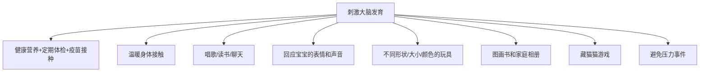

# 第07课：1-3月龄

## 学习目标

- 了解1-3月龄宝宝的外观生长速度和正常发育指标
- 掌握运动、视觉、听觉和语言发育的里程碑
- 理解情感和社交能力发育的关键变化（第一个真正的笑容）
- 学习饮食喂养要领和睡眠规律调整
- 了解刺激大脑发育的方法和疫苗接种计划
- 识别此阶段常见的健康问题

## 一、外观和生长情况

### 生长速度

| 指标 | 每月增长量 |
|------|-----------|
| 体重 | 0.7-0.9千克 |
| 身高 | 2.5-4厘米 |
| 头围 | 约1.25厘米 |

> [!NOTE] 外观特点
> - 后囟门在快三个月大时闭合
> - 头部相对身体仍然很大（正常现象）
> - 圆滚滚胖乎乎的外观开始变化，四肢活动增多后肌肉增长

```mermaid
gantt
    title 1-3月龄发育里程碑时间线
    dateFormat  X
    axisFormat %d
    section 运动
    俯卧抬头和胸部           :a1, 0, 1M
    双手张开合拢             :a2, 0.5M, 1.5M
    脚落地时下蹲             :a3, 2M, 2M
    手放进嘴里               :a4, 1M, 2M
    抓住玩具摇晃             :a5, 2M, 2M
    section 视觉听觉
    跟踪移动物体             :b1, 0.5M, 1.5M
    分辨色彩                 :b2, 2M, 2M
    咿呀学语                 :b3, 1M, 2M
    模仿声音                 :b4, 2M, 2M
```

---

## 二、运动发育

### 关键变化

- **颈部力量增强**：俯卧时可挣扎抬头1-2秒，快4个月时可用肘部撑起头部和胸部
- **双腿更有力**：从蜷曲姿势渐渐伸直，能踢腿，快4个月时可从俯卧翻身成仰卧
- **手部进步**：双手从紧握拳到半开合，能把物品塞进嘴里，会抓住并摇晃玩具
- **踏步反射消失**：约6周大时消失，接近3-4个月时脚落地会先蹲下再挺直

> [!WARNING] 安全提示
> 婴儿随时可能学会翻身！**绝不要**将婴儿单独留在尿布更换台或其他高于地面的平面上。

### 运动发育里程碑

| 月龄 | 大运动 | 精细动作 |
|------|--------|---------|
| 1个月 | 俯卧抬头1-2秒 | 双手握拳 |
| 2个月 | 俯卧抬头和胸部 | 双手张开、合拢 |
| 3个月 | 可用手臂撑起上半身 | 能抓住小玩具并摇晃 |
| 快4个月 | 从俯卧翻身成仰卧 | 拇指塞进嘴里吸吮 |

---

## 三、视觉发育


### 视觉发育里程碑

- 认真观察人脸
- 视线跟踪移动的物体
- 辨别一定距离内熟悉的物体和人
- 手眼动作开始协调

> [!TIP] 视觉刺激建议
> 婴儿喜欢看**人脸**和**圆形曲线图案**。挂床铃是很好的视觉刺激，但要确保安全。挂的玩具应色彩对比强烈。

---

## 四、听觉与语言发育

### 语言发育阶段
- **1个月**：能分辨你的声音，即使你在隔壁房间- **2个月**：开始发出咿咿呀呀声，重复元音- **3-5个月**：模仿你的声音，加入简单词句- **快4个月**：长时间牙牙学语，对语调敏感

### 听觉与语言发育里程碑

- 听到你的声音时会笑
- 开始呀呀学语
- 开始模仿一些声音
- 听到声音时将头转向声源

> [!TIP] 交流技巧
> - 使用"妈妈语"（提高音调、放慢速度）
> - 从婴儿期就开始给孩子读书
> - 模仿孩子的咿呀声，并加入新词
> - 有意识地在交流中加入更多成人用语

---

## 五、情感和社交能力发育

### 第一个真正的笑容

> [!IMPORTANT] 重要转折点
> 满月后婴儿开始出现**发自内心的笑容**，标志着你们关系的重要转折。笑为婴儿提供了除哭以外的另一种表达方式。

### 情感发育的三个层次

1. **需求急切时**（饥饿/疼痛）：尖叫或大哭，信号独特
2. **满足安静时**：可自娱自乐，学习新技能（自我安抚）
3. **无理由哭闹时**：所有需求满足但仍烦躁，需要特定安抚方式

### 社交能力发育里程碑

- 开始出现社交性微笑
- 喜欢和其他人玩
- 游戏停止时可能哭
- 沟通能力更强、表情和身体语言更丰富
- 可以模仿一些动作和表情

### 发育警示信号

> [!WARNING] 需要咨询医生的情况
> - 4个月后仍有惊跳反射
> - 对剧烈声响没有反应
> - 2个月时不会注意自己的手
> - 2个月时听到声音不会笑
> - 3个月时不会抓握东西
> - 3个月时不会对人笑
> - 3个月时不能抬起头

---

## 六、基本看护：饮食

### 喂养要点

- **原则**：4-6个月前只喝母乳或配方奶
- **配方奶喂养**：快4个月时每次从60-120ml增加到120-180ml
- **母乳喂养**：24小时喂养8-12次
- 注意**饥饿和饱足信号**胜过计量

### 排便变化

2-3个月时排便频率显著下降：
- 母乳喂养：可能3-4天甚至每周才排便一次
- 只要吃奶好、体重增长正常、大便不干硬，无需担心

### 重返工作的母乳喂养

> [!TIP] 提前准备
> - 孩子1个月大时就开始偶尔吸出乳汁用奶瓶喂
> - 重返工作前1个月开始每天吸1-2次并冷冻
> - 与单位讨论在工作时间吸奶的安排

---

## 七、基本看护：睡眠

- 满月后夜醒减少，醒着时间增多
- 快4个月时可能在夜里连续睡5小时以上
- **不要叫醒夜间熟睡的婴儿喂奶**
- 始终以**仰卧姿势**入睡

---

## 八、刺激大脑发育



---

## 九、疫苗接种（2个月）

- 百白破疫苗（第一针）
- 脊髓灰质炎灭活疫苗（第一针）
- B型流感嗜血杆菌疫苗（第一针）
- 肺炎球菌疫苗（第一针）
- 轮状病毒疫苗（第一针）
- 乙肝疫苗（第二针）

> [!NOTE] 4个月时
> 以上所有疫苗需要接种第二针。

---

## 十、常见健康问题

| 问题 | 表现 | 处理 |
|------|------|------|
| 中耳炎 | 烦躁不安、发热 | 对乙酰氨基酚口服液；必要时抗生素 |
| 胃食管反流 | 吐奶、周期性咳嗽 | 拍嗝、喂奶后保持直立30分钟 |
| 湿疹 | 皮肤干燥粗糙、红斑 | 温和沐浴液、柔软衣物、避免过敏原 |
| RSV感染 | 鼻塞、流鼻涕、喘息 | 吸鼻器、盐水滴鼻液，严重时住院 |
| 普通感冒 | 咳嗽、流鼻涕、轻度发热 | 吸鼻器缓解鼻塞，慎用退热药 |

> [!DANGER] 发热警示
> **不满3个月的婴儿直肠温度达到38摄氏度及以上，应立即就医！**

---

> [!TIP] 核心要点
> 1-3月龄是宝宝从反射性行为向自主性行为过渡的关键期。第一个笑容、第一次咿呀学语、第一次用手抓握——这些里程碑标志着宝宝正在从一个被动的新生儿成长为主动探索世界的小人儿。

## 实践检验

> [!QUESTION] 自测题
> 1. 1-3月龄宝宝每月体重和身高大约增长多少？
> 2. 宝宝的第一个真正的笑容大约出现在什么时候？有什么意义？
> 3. 列举本阶段至少3个需要就医的发育警示信号。
> 4. 处理婴儿胃食管反流/吐奶的正确方法是什么？
> 5. 2个月大的婴儿需要接种哪些疫苗？

<details>
<summary>查看答案</summary>

1. 体重每月增长0.7-0.9千克，身高增长2.5-4厘米。
2. 满月后出现，标志着婴儿开始用笑容进行社交交流，提供了除哭之外的表达方式。
3. 例如：4个月后仍有惊跳反射、对巨响无反应、2个月不看自己手、不会笑、3个月不会抓握、不能抬头等。
4. 喂奶时及喂奶后拍嗝；喂奶后保持直立30分钟；不要为减轻吐奶让婴儿俯卧（始终仰卧）。
5. 百白破、脊灰、Hib、肺炎球菌、轮状病毒（第一针），乙肝疫苗（第二针）。

</details>

## 下一步

继续学习 [[0008-4-7-yue-ling|第08课：4-7月龄]]，宝宝的成长进入新阶段——开始添加辅食啦！

需要复习本课程相关术语？请查阅 [[../reference/glossary|术语表]]。