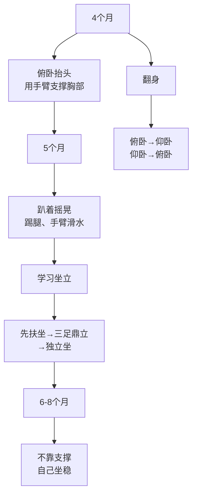
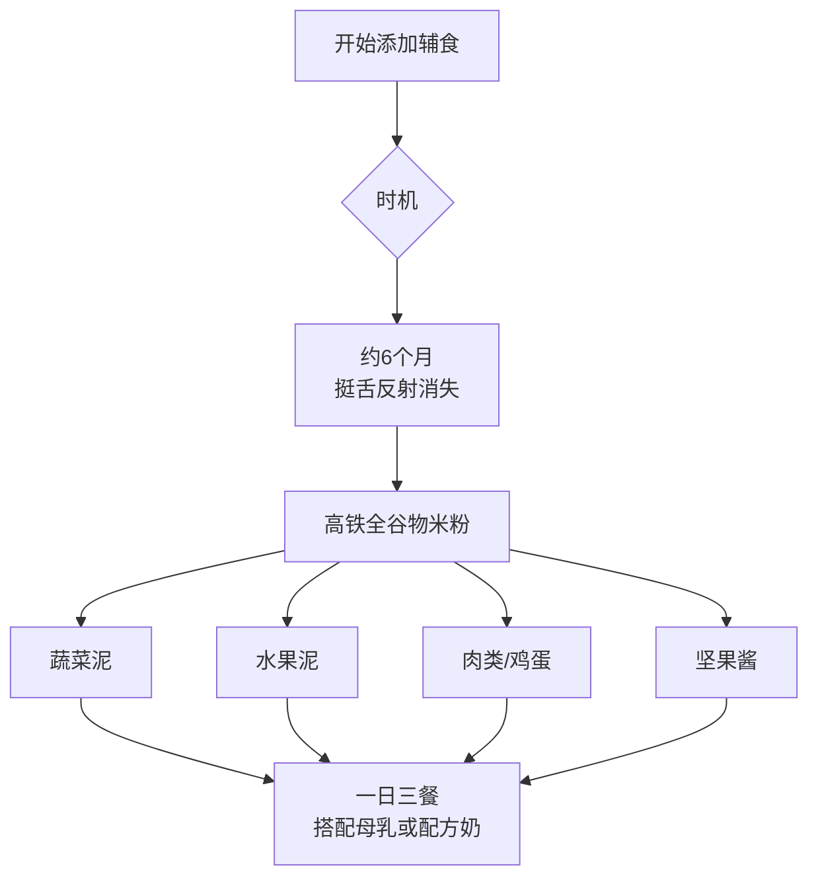

# 第08课：4-7月龄

## 学习目标

- 掌握4-7月龄宝宝的生长速度和运动发育里程碑（翻身、坐起、抓握）
- 理解视觉发育成熟过程和语言认知能力的飞跃
- 学习添加辅食的时机、顺序和喂养技巧
- 认识陌生人焦虑现象及其应对方法
- 掌握口腔护理、睡眠调整和行为规矩的建立
- 了解抗生素使用原则和本阶段安全注意事项

## 一、外观和生长情况

### 生长指标

| 指标 | 变化 |
|------|------|
| 月增重 | 0.45-0.56千克/月 |
| 快8个月体重 | 约出生体重的2.5倍 |
| 身高增长 | 约5厘米（4-8个月） |
| 头围增长 | 约2.5厘米（4-8个月） |

> [!IMPORTANT] 关注生长速度
> 具体身高体重不重要，**重要的是生长速度**。继续在生长曲线上标记，如果测量值跳到另一条曲线或增长异常缓慢，应咨询医生。

---

## 二、运动发育

### 运动发育的关键进程

### 运动发育里程碑

- 从俯卧翻身到仰卧，再从仰卧翻身到俯卧
- 先用双手支撑坐稳，接着不用双手也可坐稳
- 用双腿支撑整个身体重量
- 用一只手抓东西
- 将东西从一只手转到另一只手
- 可以抓握东西

> [!WARNING] 爬行准备
> 快5个月时，婴儿会出现趴着摇晃身体、踢腿、用手臂"滑水"的动作，这是为翻身和爬行做准备。当他还不会爬时，**不要**在婴儿床上挂床铃，他可能扯下来缠住自己。

---

## 三、视觉发育

### 视觉成熟过程

- **色觉完全发育成熟**：能分清红色、蓝色、黄色等差异（最喜欢红色或蓝色）
- **远距离视觉成熟**：视力范围增大到几米以上
- **跟踪能力增强**：可以跟踪越来越快的动作
- **镜子中的乐趣**：对镜子中的影像非常感兴趣

> [!TIP] 视觉刺激
> - 快5个月时婴儿会看腻眼前的东西，需要新视觉刺激
> - 带孩子四处活动，大声说出新东西的名称
> - 镜子是极好的玩具——影像变化对应他自己的动作

---

## 四、语言发育

### 语言发育里程碑

- 对自己的名字有反应
- 开始对"不"这个词有反应
- 可以通过音调分辨情绪
- 听到声音时会发出声音来回应
- 会用声音表达快乐和不开心
- 会发出一连串辅音

### 促进语言发育

> [!TIP] 沟通技巧
> 孩子发出某个音节（如"ba"），你要重复并教他相关的词（爸爸、抱抱、斑马）。6-7个月后他会开始积极模仿你说话的声音。

> [!WARNING] 警示信号
> 快7个月大的婴儿仍然没有开始牙牙学语或模仿任何声音，可能存在听力或语言发育问题，应咨询医生。

---

## 五、认知发育：理解因果关系

### "小小科学家"

4-5个月时，婴儿开始理解**因果关系**：

- 踢床板 → 婴儿床晃动
- 敲打东西 → 发出声音
- 扔东西 → 你捡起来

### 物体恒存概念

> [!IMPORTANT] 重大发现
> 4个月后婴儿开始意识到：物体即使离开视线也仍然存在。这是**物体恒存**概念的萌芽，通过藏猫猫游戏可以强化这一认知。

### 认知发育里程碑

- 可以找到大人故意藏起来的东西
- 通过手和嘴探索世界
- 会努力去够远处的东西

---

## 六、情感与社交能力发育

### 陌生人焦虑

> [!NOTE] 正常发育标志
> 5-6个月时婴儿会因你离开房间或见到陌生人而哭，7-8个月时可能明显拒绝陌生人靠近。这是**陌生人焦虑**——发育正常的标志！

### 利用社交期

在陌生人焦虑出现之前（约4-6个月），婴儿可能非常讨人喜欢。利用这个时期帮他熟悉保姆、亲戚等今后负责照顾他的人。

### 情感发育里程碑

- 喜欢跟其他人一起玩
- 对镜子前的影像感兴趣
- 对其他人的情感表现有反应
- 经常显得很快乐

### 发育警示信号

> [!WARNING] 需要咨询医生
> - 看起来非常僵硬、肌肉紧张
> - 看起来四肢无力
> - 拉他坐起时头依然向后倒
> - 只会用一只手去够东西
> - 拒绝拥抱，对照顾者无兴趣
> - 对周围声音无反应
> - 快6个月时在大帮助下仍坐不稳

---

## 七、添加辅食

### 开始时机

- **最佳时机**：6个月左右（纯母乳喂养最好到6个月）
- **挺舌反射消失**：4-5个月时消失，不再用舌头把食物推出来
- 孩子表现出想尝一尝的兴趣时

### 辅食添加原则

### 喂养技巧

- **坐直**喂食，避免食物进入呼吸道
- 用小勺子（硅胶婴儿勺最佳）
- 一次只喂少量，与他说话
- 孩子拒绝时不要强迫，等1-2周再试
- **不要**将辅食放入奶瓶，这会增加窒息风险和过度喂养

### 食物安全

> [!DANGER] 禁止给婴儿的食物
> - 整颗坚果、未切开的葡萄、圣女果
> - 生胡萝卜和西芹
> - 果汁（一岁内不推荐）
> - 牛奶（一岁内不推荐）
> - 添加糖和盐的食物

### 营养补充

- **维生素D**：每天400国际单位（一岁以下）
- **铁**：部分母乳喂养的4个月大婴儿需每天补铁（每千克体重1毫克）

---

## 八、睡眠与口腔护理

### 睡眠特点

- 每天小睡至少2次（上午和中午）
- 建立始终如一的睡前程序
- 当他醒着时放在床上，学着自己入睡
- 长牙可能导致烦躁、流口水、喜欢咀嚼硬物

### 长牙护理

| 事项 | 建议 |
|------|------|
| 第一颗牙长出时间 | 通常在4-7个月（存在个体差异） |
| 缓解疼痛 | 手指按摩牙床、磨牙胶（结实橡胶） |
| 不建议使用 | 出牙舒缓凝胶、顺势出芽药片、琥珀出芽项链 |
| 何时看牙医 | 第一颗牙长出后6个月内，不晚于12个月 |
| 刷牙 | 软毛婴儿牙刷 + 米粒大小含氟牙膏 |

> [!WARNING] 重要
> 不要让孩子一边吸吮乳房或奶瓶一边入睡，这会导致奶瓶龋齿。

---

## 九、行为规矩

### 建立规矩的原则

- 前6个月最好的方法是转移注意力
- 快7个月时记忆力增强，可以用规矩管教
- 规矩的目的是**教育和引导**，不是惩罚
- 孩子表现好时奖励，表现不好时收回奖励

### 立规矩的方法

1. 用平静的语气说"不要这样做"
2. 温和地拉开他的手
3. 用其他活动转移注意力
4. 不要说"不要碰"，要说"不要吃花、不要吃树叶"

> [!NOTE] 正面管教
> 打孩子、大吼大叫或责怪孩子都**不应使用**。这个阶段的孩子还不会故意犯错，惩罚或高声批评他都不会明白。

---

## 十、健康观察与疫苗接种

### 疫苗接种（6个月）

- 第三针百白破疫苗
- 第三针脊髓灰质炎灭活疫苗
- 第三针肺炎球菌疫苗
- 第三针B型流感嗜血杆菌疫苗
- 第三针乙肝疫苗
- 第三针轮状病毒疫苗
- 第一针流感疫苗（流感季节）

### 抗生素使用原则

| 疾病类型 | 是否需抗生素 |
|---------|-------------|
| 病毒性感冒 | 不需要 |
| 细支气管炎 | 一般不需要（大多由病毒引起）| 中耳炎（细菌性） | 需要 |
| 鼻窦炎 | 可能需要（此阶段不常见）|

> [!IMPOTANT] 抗生素要点
> 严格遵守医嘱使用抗生素。不要将多余的抗生素留着下次用或给家人用。

---

> [!TIP] 核心要点
> 4-7月龄是宝宝人生中的"大转折"——从躺到坐、从奶到饭、从不认识到认识。添加辅食、长牙、陌生人焦虑，每一项都是重要的里程碑。理解因果关系和物体恒存的概念也在本阶段萌芽。

## 实践检验

> [!QUETION] 自测题
> 1. 开始添加辅食的最佳时机是什么？有哪些信号表明宝宝准备好了？
> 2. 什么是"物体恒存"概念？通过什么游戏可以强化？
> 3. 陌生人焦虑出现在什么月龄？是正常还是异常表现？
> 4. 宝宝长牙时应如何护理？什么情况下需要看牙医？
> 5. 抗生素在什么情况下才需要使用？

查看答案

1. 约6个月左右，信号：挺舌反射消失、对大人食物感兴趣、能坐直。
2. 物体即使离开视线也仍然存在。通过藏猫猫游戏强化。
3. 约7-8个月出现，是**正常**的发育标志，表示婴儿能区分熟悉和陌生的人和物。
4. 手指按摩牙床、用磨牙胶。不使用舒缓凝胶。第一颗牙长出后6个月内或12个月前看牙医。
5. 只有确诊细菌感染时才需使用抗生素。病毒性感冒不需要抗生素。

## 下一步

继续学习 [[0009-8-12-yue-ling|第09课：8-12月龄]]，宝宝即将进入爬行和学步的阶段！

需要复习本课程相关术语？请查阅 [[../reference/glossary|术语表]]。