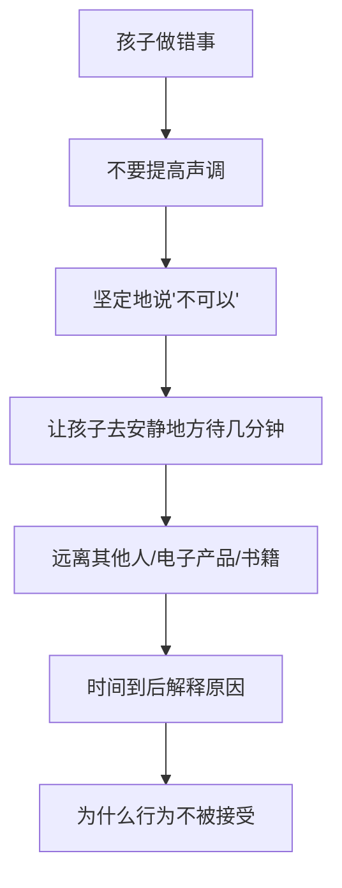

# 第09课：8-12月龄

## 学习目标

- 掌握8-12月龄宝宝的生长速度和运动发育里程碑（爬行、站立、学步）
- 了解手部精细动作发育（拇指-食指捏物）和语言发育的飞跃
- 理解分离焦虑和陌生人焦虑的成因和应对策略
- 学习饮食转换（用手抓食、使用杯子）和口腔护理
- 掌握行为规矩的建立方法和"平静中断法"
- 了解本阶段疫苗接种和安全注意事项

## 一、外观和生长情况

### 生长指标

| 指标 | 数值 |
|------|------|
| 8个月男婴平均体重 | 8-10千克 |
| 1岁时平均体重 | 出生时的3倍 |
| 1岁时身高 | 71-81厘米 |
| 8个月标准头围 | 约44.5厘米 |
| 1岁标准头围 | 约46厘米 |

> [!NOTE] 外观特点
> - 第一次站起来时舔着肚子、翘着屁股、后背向前倾——**完全正常**
> - 脚趾朝内（内八字）通常在24个月左右消失
> - 学步初期脚尖向外偏，因为髋关节韧带还比较松

---

## 二、运动发育

### 爬行

| 月龄 | 爬行能力 |
|------|---------|
| 7-10个月 | 用手和膝盖爬行 |
| 个体差异 | 少数婴儿不会爬，用其他方式移动（坐地蹭、肚皮挪动）|

> [!TIP] 鼓励爬行
> - 在差一点点够到的地方放有趣的物品
> - 用枕头、箱子设置障碍物
> - 藏到障碍物后面玩藏猫猫
> - **但不要将孩子单独留在这些物品旁**

### 站立和走路

1. 抓住一切机会站起来
2. 扶着家具走（确保家具牢固、无尖锐边角）
3. 偶尔放开手→连续走几步
4. 大多数孩子在一岁生日前后迈出第一步

### 学步车禁令

> [!DANGER] 强烈反对
> **美国儿科学会强烈建议不要让孩子使用学步车！** 学步车：
> - 不能帮助学走路，反而打消走路积极性
> - 容易翻倒、摔下楼梯
> - 让孩子跑进危险地带
>
> 替代方案：固定的弹跳椅或游戏架

### 第一双鞋

- 选择包头、柔软舒适、有柔韧防滑鞋底的鞋子
- 不需要特殊鞋垫、高背或足弓保护
- 两三个月就要更换

---

## 三、手部发育

### 精细动作里程碑

| 月龄 | 手部技能 |
|------|---------|
| 8-9个月 | 用拇指和食指捏起小东西 |
| 9-10个月 | 准确用手指戳物体 |
| 10-11个月 | 将物体放入容器、拿出 |
| 11-12个月 | 尝试模仿涂鸦 |
| 12个月 | 用食指和拇指捏起非常小的东西 |

### 喜欢的活动

- 扔东西（注意转移到柔软物品上）
- 将球滚向他人
- 有活动部件的玩具
- 积木搭建和推倒

> [!WARNING] 安全提醒
> 婴儿床上的悬挂玩具应在孩子能撑起身体或坐直时尽快取下。

---

## 四、语言发育

### 语言发育里程碑

- 对说话更关注
- 对简单的语言命令有反应
- 对"不"有反应
- 可以用动作表示"不"（摇头）
- 咿呀有音调变化
- 可以说"爸爸""妈妈"
- 尝试模仿说出词语

### 双语环境

> [!NOTE] 双语优势
> 如果家庭成员讲两种语言，不用担心孩子会被扰乱。从很小接触两种语言的儿童可以同时学会，并受益一生。

### 促进语言发育

- 尽可能多地和他说话
- 使用简单明确的词语
- 重复物体名称（保持一致）
- 通过图画书强化理解
- **关掉电视**，电视会阻碍语言发育

> [!WARNING] 警示信号
> 快12个月时没有说过任何词、不会使用身体语言（点头/摇头）、叫名字不回应，应咨询医生。

---

## 五、认知发育

### "小小科学家"探究精神

婴儿像科学家一样通过以下方式探索世界：

- 把东西摔到地上
- 滚来滚去
- 扔到一边
- 盖住或晃来晃去
- 研究物体形状、质地和大小

### 物体恒存概念

8个月大时：
- 把玩具藏在围巾下 → 会掀开找
- 趁他注意拿走玩具 → 他会迷惑
- 快10个月时 → 肯定玩具依然存在，会四处寻找

> [!TIP] 藏猫猫游戏
> 藏猫猫有无数种形式：用布盖住头、躲在门后、在毛巾下交换藏身……不断变化形式，孩子可以永不厌倦地玩下去。

### 认知发育里程碑

- 用很多不同方式认识物体
- 轻易找到藏起来的物品
- 你说出图片中物体的名称时，他会看向正确图片
- 模仿姿势
- 开始正确使用物品（如把电话放在耳边）

---

## 六、情感与社交能力发育

### 分离焦虑

> [!IMPORTANT] 正常发育阶段
> 分离焦虑通常在**10-18个月**达到顶峰，**18-24个月**逐渐消失。这不是被宠坏的表现，而是与你关系健康的证明。

### 应对分离焦虑

- 离开时间安排在他吃饱睡足后
- 生病时尽量不要离开他
- 让看护者转移他的注意力
- 道别后迅速离开（几分钟后他就不哭了）
- 做短时间分离练习
- 你只要说会回来，就总是会回来的

### 移情物

孩子可能在8-12个月选择自己的"宝贝"（毯子、毛绒玩具等）：
- 帮助孩子从依赖变得独立
- 在孩子疲惫、难过或身处陌生环境时给予安慰
- 不是懦弱的表现，**不要制止**
- 建议准备两个一模一样的

### 情感发育里程碑

- 面对陌生人时害羞或不安
- 父母离开时哭
- 在游戏中模仿他人
- 对特定的人和玩具表现出偏爱

---

## 七、饮食与使用杯子

### 饮食要点

- 每天需要**750-900千卡**热量（其中400-500来自母乳/配方奶）
- 每天约720毫升奶
- 添加酸奶、燕麦、蛋、捣碎的香蕉土豆等
- 提供可以用手抓着吃的食物

### 用手抓食的安全

> [!DANGER] 禁止食物
> - 整颗坚果
> - 整颗葡萄和圣女果
> - 生胡萝卜
> - 爆米花
> - 大勺花生酱
> - 硬糖、口香糖

### 安全抓食推荐

| 类别 | 示例 |
|------|------|
| 蔬菜 | 蒸熟的蔬菜块 |
| 水果 | 切成小块的软水果 |
| 主食 | 煮熟面条、小片全麦面包 |
| 蛋白质 | 鸡肉块、炒鸡蛋、豆腐小块 |

### 学习使用杯子

- 6个月后可以开始使用吸管杯或压嘴杯
- 刚开始只装少量水
- 完全学会大约需要6个月
- 从中午开始替换母乳/配方奶
- 晚间喂奶最后改变

> [!WARNING] 避免奶瓶龋齿
> 不要让孩子一边喝奶一边入睡。奶浸没乳牙会造成严重的**儿童早期龋齿**。

---

## 八、睡眠与口腔护理

### 睡眠特点

- 每天小睡2次（上午和下午）
- 夜间可睡10-12小时，不需要半夜喂奶
- 分离焦虑可能导致抗拒上床和夜间醒来

### 应对夜间醒来

1. 确认他安好、未生病
2. 不抱起来、不开灯
3. 检查尿布（微光下快速更换）
4. 放回婴儿床，安慰后离开
5. 坚持一致的方法

### 牙齿护理

- 长出第一颗牙后用软毛牙刷+少量含氟牙膏
- 每天刷一次（最好睡前）
- 第一颗牙长出后6个月内看牙医（不晚于1岁）

---

## 九、行为规矩

### 规矩原则

- **转移注意力**是制止不良行为最有效的方法
- 孩子的记忆很短暂，容易转移注意力
- 过多说"不可以"会削弱效果
- **绝不**大声斥责、摇晃或打孩子

### 保持一致性

- 最少定严格规矩（仅针对潜在危险）
- 犯错后**5分钟内**做出反应
- 批评后等1-2分钟再去安慰
- 所有看护者了解并遵守相同规矩

### 平静中断法

> [!NOTE] 体罚无效
> 打孩子只会让他学会生气时使用暴力，破坏亲子沟通，削弱安全感。

---

## 十、疫苗接种

| 疫苗 | 接种时间 |
|------|---------|
| 麻腮风三联疫苗 | 12-15个月（第一针）|
| 水痘疫苗 | 12-15个月（第一针）|
| 乙肝疫苗 | 6-18个月（第三针）|
| 甲肝疫苗 | 12个月及以上（第一针）|
| 肺炎球菌疫苗 | 12-18个月（第四针）|

---

> [!TIP] 核心要点
> 8-12月龄是宝宝从"依赖的婴儿"到"独立探索的学步儿"的过渡期。爬行和走路带来前所未有的自由，分离焦虑证明亲子关系的健康，而语言和手部技能的快速发展打开了全新的世界。

## 实践检验

> [!QUESTION] 自测题
> 1. 为什么美国儿科学会强烈反对使用学步车？有哪些更好的替代方案？
> 2. 什么是分离焦虑？大约在什么时候达到顶峰？如何应对？
> 3. 什么是移情物？孩子在多大开始选择移情物？
> 4. "平静中断法"的具体步骤是什么？
> 5. 1岁时需要接种哪些疫苗？

查看答案

1. 学步车容易翻倒、摔下楼梯、让孩子进入危险地带，不能帮助学走路。替代：固定弹跳椅或游戏架。
2. 10-18个月达到顶峰。应对：离开时间安排在他状态好时、让看护者转移注意力、道别后迅速离开、在家做短时间分离练习。
3. 孩子在8-12个月选择移情物（毯子、毛绒玩具等），帮助他从依赖变得独立。不要制止，建议准备两个一样的。
4. 坚定说"不可以"→让孩子去安静地方待几分钟→远离其他人/电子设备→时间到后解释原因。
5. 麻腮风三联疫苗（12-15个月）、水痘疫苗（12-15个月）、乙肝第三针、甲肝第一针、肺炎球菌第四针。

## 下一步

继续学习 [[0010-1-sui-bao-bao|第10课：1岁宝宝]]，宝宝正式进入幼儿期啦！

需要复习本课程相关术语？请查阅 [[../reference/glossary|术语表]]。