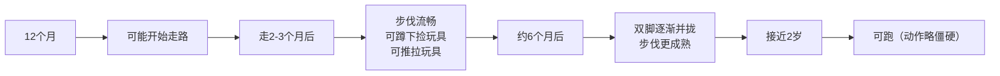
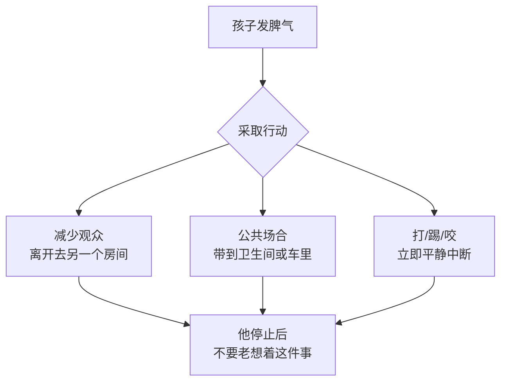

# 第10课：1岁宝宝

## 学习目标

- 掌握1岁宝宝（12-24月龄）的生长速度和运动发育里程碑（独立行走、跑步）
- 了解手部精细动作和语言发育的重大飞跃
- 理解情感发育特点：独立与依赖之间的摇摆
- 掌握饮食营养要点：每日所需热量、健康的饮食习惯养成
- 学习限制吃糖、预防肥胖、如厕训练和睡眠管理
- 掌握行为规矩的设立和应对发脾气的策略
- 了解本阶段疫苗接种和安全注意事项

## 一、外观和生长情况

### 生长速度变化

> [!NOTE] 生长速度放缓
> 从婴儿期到幼儿期，生长速度开始减缓。在第二年中只能增重1.4-2.3千克，远低于婴儿期每4个月增重1.8千克的速度。

| 月龄/性别 | 平均体重 | 平均身高 |
|-----------|---------|---------|
| 15个月女孩 | 约10.5千克 | 约77厘米 |
| 15个月男孩 | 约11千克 | 约78厘米 |
| 2岁女孩 | 约12.2千克 | 约86厘米 |
| 2岁男孩 | 约12.6千克 | 约87.5厘米 |

### 体型变化

- 头围增长减缓（全年约2.5厘米），2岁时达到成人头围的90%
- 婴儿期脂肪被消耗，肌肉增多
- 手臂和腿变长，面部轮廓更加分明

---

## 二、运动发育

### 走路进程

### 运动发育里程碑

- 可以独立行走
- 双手扶着可上楼梯（双脚踩同一级后才上另一级）
- 一边走一边拉着地上的玩具
- 开始学跑
- 可以踮脚站立
- 会蹲下来捡东西
- 可以坐在小椅子上

> [!WARNING] 如果18个月还不会走路，应看医生

---

## 三、手部发育

### 精细动作进展

| 月龄 | 技能 |
|------|------|
| 12个月 | 用拇指和食指捏小东西仍有困难 |
| 18个月 | 能轻松捏起小东西 |
| 快到2岁 | 能折纸、把方钉插进合适孔里、搭5-6块积木 |

### 喜欢的活动

- 摞起积木（最多4块）然后推倒
- 反复打开和盖上盒子
- 捡起滚动的球
- 转动门把手和翻书
- 把圆钉插进洞里
- 乱涂乱画

> [!TIP] 左右手偏好
> 快到2岁时可判断左右手偏好，但很多孩子要几年后才明显。不要强迫使用某只手。

---

## 四、语言发育

### 语言发育的飞跃

| 月龄 | 语言能力 |
|------|---------|
| 12个月 | 能理解大部分日常话语 |
| 18个月 | 掌握至少6-10个词 |
| 近2岁 | 掌握至少50个口语词，能将两个词组成短句 |

### 促进语言发育

- **最好的方法**：交谈和阅读
- 关掉电视机，收起手机和平板电脑
- 放慢语速，吐字清楚，使用简单字词和短句
- 教物体和身体部位的正确名称
- 每天读书，鼓励孩子自己拿书和翻书

### 语言发育里程碑

- 你说出物体名字后，他可以用手指出
- 可以说熟悉的人、物体和身体部位的名称
- 说含2-4个词的句子
- 无需手势就能回应语言指令
- 辨认至少2个身体部位

> [!WARNING] 警示信号
> 快18个月时会说的词少于15个，或快2岁时不会说两个词组成的句子，应咨询医生。

---

## 五、认知与社交发育

### 认知发育里程碑

- 可以找到藏在两三层覆盖物下面的东西
- 开始按形状和颜色排列东西
- 开始玩角色扮演游戏
- 会指认书中的插图

### 社交能力发育里程碑

- 模仿其他人的行为（尤其是成人和大孩子）
- 自我意识提高
- 更喜欢跟其他孩子在一起
- 会指东西索要或寻求帮助

### 游戏中的学习

1 岁宝宝会：

- 对力学装置（开关、按钮、把手）特别感兴趣
- 模仿你的行为（梳头、打电话、转方向盘）
- 理解"藏起来的东西依然存在"
- 期待你表扬他的成就

> [!IMPORTANT] 模仿的重要性
> 孩子在模仿中学习。注意自己的言行——他的话可能是你曾说过的，他做的事可能是他看你做过的。

---

## 六、情感发育

### 独立与依赖的摇摆

> [!NOTE] "第一青春期"
> 1岁幼儿不断在独立与依赖之间摇摆。独立行走让他想离开你去探索，但困倦、生病或害怕时又需要回来寻求安慰。这是完全正常的矛盾心理。

### 常见情感特点

| 特点 | 表现 |
|------|------|
| 独立性增强 | 不断试探你的底线 |
| 反抗行为 | 对熟悉的人说"不" |
| 分离焦虑 | 到1岁半有所增强，然后逐渐消失 |
| 占有欲 | 对自己的东西和亲近的人表现出占有欲 |
| 攻击性 | 得不到想要的可能出现攻击性行为 |

### 害羞的孩子

- 允许按自己的节奏行动
- 给他所需的时间适应新环境
- 表现出勇敢时要鼓励
- 不要强迫或批评

> [!TIP] 应对攻击性
> - 看紧他，定下严格规矩
> - 用游戏和体育锻炼做正面发泄
> - 他友好相处时好好表扬
> - **不要打他**——他会模仿你的暴力行为

---

## 七、饮食与营养

### 饮食原则

- 每天约需要**1000千卡**热量
- 分三顿正餐+两顿点心
- 挑食是这个阶段的正常现象
- 给孩子提供选择，不要强迫进食

### 四大类食物

1. **肉类、鱼类、禽类、蛋类**
2. **富含钙质的食物**
3. **水果和蔬菜**
4. **米粉、面包、面条、土豆和米饭**

> [!IMPORTANT] 脂肪的重要性
> 1岁幼儿需要从脂肪中获得约50%的每日热量。健康脂肪来源：牛油果、橄榄油、鱼、坚果酱和乳制品。避免油炸食品和加工食品。

### 食物安全

- 食物要捣碎或切成小块
- 避免：整颗坚果、整颗葡萄、圣女果、生胡萝卜、爆米花、整根火腿肠、硬糖、大勺花生酱
- 孩子到4岁才学会用臼齿磨碎食物

### 铁的来源

| 最佳来源 | 充足来源 |
|---------|---------|
| 红肉 | 汉堡包、瘦牛肉、鸡肉 |
| 赤糖糊 | 金枪鱼、虾、蛋 |
| 高铁全谷物米粉 | 菠菜、芥兰、豆类、杏干、葡萄干 |

---

## 八、限制吃糖与预防肥胖

### 控制糖分摄入

- 孩子天生喜欢甜食
- 不要将糖买回家（眼不见为净）
- 不在食物中额外加糖
- 零食选择水果、全麦面包、奶酪，而非甜点

### 预防儿童肥胖

> [!WARNING] 肥胖风险
> 肥胖影响身体所有系统，可能导致糖尿病、高血压、睡眠呼吸暂停综合征，还会造成心理压力。

### 公园行动

1. **定期测量**：儿科医生每年测量体重，计算体重增长率
2. **健康饮食**：提供各种健康食物，允许孩子自己决定何时不吃了
3. **关掉电视**：研究显示看电视太多的孩子更容易超重
4. **全家用餐**：尽可能保证全家人一起吃饭

---

## 九、如厕训练

### 准备信号

- 能理解"尿尿""拉粑粑"等词语的含义
- 大小便后能告诉你
- 对马桶冲水过程感兴趣

> [!TIP] 不要着急
> 大多数孩子要到**2岁后**才做好接受如厕训练的准备。提前训练可能造成不必要的压力。

### 提前准备

- 准备儿童专用坐便器
- 用简单的语言教他如何使用
- 允许他冲马桶以熟悉过程
- 孩子对过程越熟悉，接受训练时越不会害怕

---

## 十、睡眠

### 睡眠挑战

幼儿期常见的睡眠问题：

- 拒绝按时睡觉
- 夜间醒来（即使之前已能睡整夜）
- 生活习惯改变导致睡眠紊乱（换房间、旅行、生病等）

### 睡眠建议

- 建立并坚持睡前程序（洗澡→讲故事→唱歌→上床）
- 用可爱物品代替你陪伴入睡
- 夜间醒来时不要在远处用声音安抚他
- 不要将他抱到你的床上
- 坚持一致的方法

> [!NOTE] 睡前奶
> 逐渐将睡前奶换成水。奶瓶很快会变成精神依赖，妨碍他学习自己入睡。

---

## 十一、规矩与管教

### 管教的核心

> [!IMPORTANT] 管教的真正含义
> 管教是**教育和指导**，不是惩罚。核心是**爱**——你与孩子关系的基石。

### 规矩原则

1. **表扬好行为**：远远多于惩罚和批评
2. **先定最重要的规矩**：安全第一（不能打人、咬人、踢人）
3. **接收他的个性**：规矩要反映孩子的脾气和性格
4. **设置行为界限**：不断重复直到他记住

### 平静中断法（适用于做错事时）

1. 保持冷静，坚定地说"不可以"
2. 将孩子抱到安静地方，让他背对你
3. 一直抱着直到他安静下来
4. 每次违反规矩后立刻做出反应

> [!DANGER] 绝对禁止
> 打屁股、扇耳光、摇晃、吼叫——这些方法**有百害而无一利**。孩子会模仿你的暴力行为。

---

## 十二、应对发脾气

### 为什么会发脾气

- 1-2岁幼儿认为整个世界都围绕他运行
- 他正在尝试独立，但能力有限
- 无法用语言表达沮丧
- 打、踢、咬、屏住呼吸——都是正常行为

### 应对策略

### 预防发脾气

- 用友好的语气和措辞（像邀请而非命令）
- 孩子说"不"时不要反应过度
- 只在绝对必要时才与孩子争论
- 给予有限的选择权（穿什么睡衣、读什么故事）
- 预测引发冲突的情况并设法避免

---

## 十三、家庭关系

### 兄弟姐妹

- 1岁幼儿以自我为中心，会让哥哥姐姐觉得很麻烦
- 保护大孩子的私人领域
- 多花时间陪伴大孩子
- 所有孩子都需要你的爱和关注

### 祖父母

- 孩子可能有陌生人焦虑，对祖父母不热情——**正常现象**
- 保持耐心，孩子的冷淡终将随时间消失
- 在地板上和孩子一起活动
- 维持与孩子家中一致的饮食和睡觉规律

---

## 十四、疫苗接种

| 疫苗 | 接种时间 |
|------|---------|
| B型流感嗜血杆菌疫苗 | 12-15个月（第四针）|
| 肺炎球菌疫苗 | 12-15个月（第四针）|
| 麻腮风三联疫苗 | 12-15个月（第一针）|
| 水痘疫苗 | 12-15个月（第一针）|
| 甲肝疫苗 | 12个月及以上（第一针）|
| 百白破疫苗 | 15-18个月（第四针）|
| 脊髓灰质炎疫苗 | 15-18个月（第三针）|

### 血液检测

- 1岁体检：检测血红蛋白和铅含量
- 评估是否存在贫血和铅中毒

---

## 十五、安全注意事项

### 室内安全

- 婴儿床板放到最低
- 工具间将危险品锁好
- 插座装上安全盖
- 窗户安装护栏（纱窗不能防坠落）
- 家中最好无枪，如有必须上锁分存

### 室外安全

- 安装门锁防止孩子接近游泳池、车道或马路
- 溺水是**1-4岁儿童死亡的首要原因**
- 过马路时紧紧抱着或拉着孩子
- 倒车时确保知道孩子的位置

### 车辆安全

- 始终使用后向式汽车安全座椅
- 不要将孩子单独留在车中
- 后车门安装儿童锁

---

> [!TIP] 核心要点
> 1岁宝宝正式进入"幼儿期"——从依赖走向独立的关键阶段。独立行走、语言飞跃、饮食转变，情感上在独立与依赖间摇摆。规矩设立以安全为第一要务，用平静中断法替代体罚，预防肥胖从小做起。

## 实践检验

> [!QUESTION] 自测题
> 1. 1岁宝宝每天大约需要多少热量？主要来自哪些食物？
> 2. 为什么说"管教"不等同于惩罚？管教的核心是什么？
> 3. 孩子发脾气时，在公共场合应如何应对？
> 4. 预防儿童肥胖的措施有哪些？
> 5. 1岁时需要做哪些血液检测？为什么？

查看答案

1. 约1000千卡。来自四大类食物：肉/鱼/禽/蛋类、富含钙质食物、水果和蔬菜、谷物和淀粉类。
2. 管教是教育和指导，核心是爱。打孩子只会让他学会暴力，破坏亲子信任和沟通。
3. 平静地带到没有外人的地方（卫生间或车里），用拥抱或平静语气安抚。不要责打，也不要让他为所欲为。
4. 定期测量体重、健康饮食、关掉电视减少屏幕时间、全家一起用餐、允许孩子自己决定何时不吃了。
5. 检测血红蛋白（评估是否贫血）和铅含量（评估是否铅中毒）。

## 下一步

恭喜完成第10课！你已经了解了从新生儿到1岁宝宝的完整成长历程。接下来可以进行**自我测试**，或回到课程地图选择其他模块学习。

需要复习本课程相关术语？请查阅 [[../reference/glossary|术语表]]。