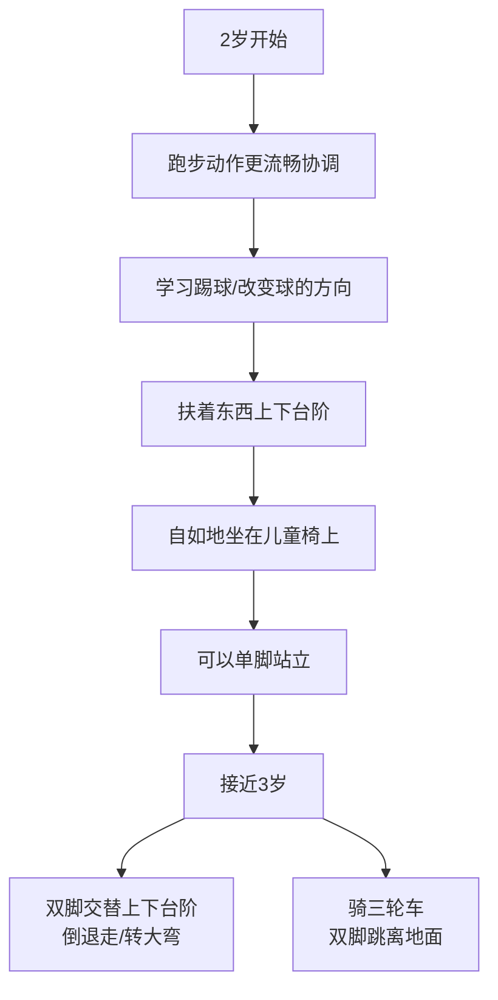
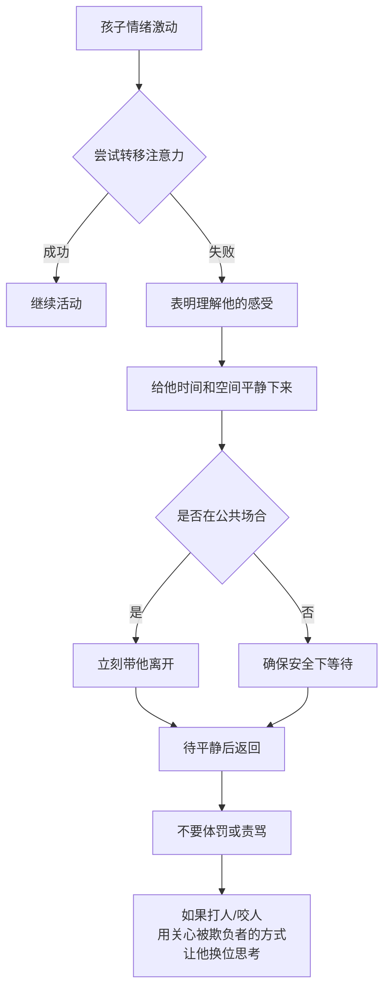
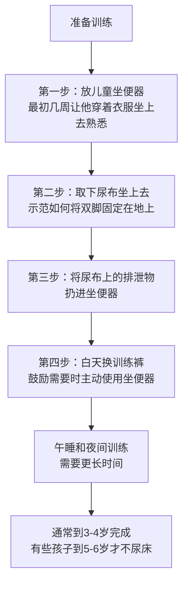
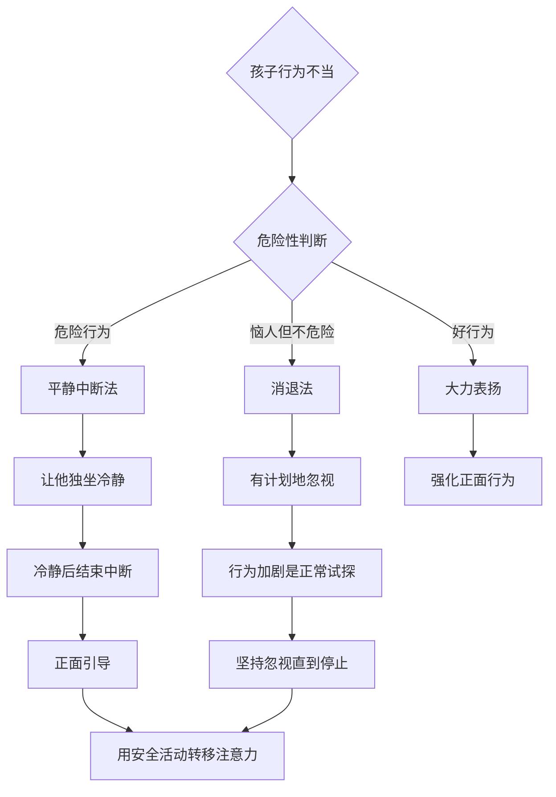
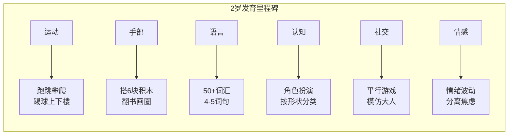

# 第11课：2岁宝宝

## 学习目标

- 掌握2岁宝宝的生长指标和身体比例变化规律
- 了解运动发育（跑跳攀爬上下楼）和手部发育（搭积木翻书画画）的里程碑
- 认识语言爆发期（50-200+词汇量）和认知发展的特点
- 理解社交能力发展的关键变化（平行游戏、模仿、攻击性行为处理）
- 掌握情感发育特点和Terrible Two的应对策略（平静中断法、消退法）
- 学习饮食营养、口腔卫生、睡眠和如厕训练的实操方法
- 了解家庭关系调节和健康安全检查要点

## 一、外观与生长情况

### 生长指标

孩子从婴儿向学龄前儿童转变，身体比例发生显著变化：

| 指标 | 变化特点 |
|------|---------|
| 身高增长 | 平均每年增长约6厘米（主要是腿变长） |
| 体重增加 | 平均每年增加约2千克 |
| 头围增长 | 第二年仅增加2厘米，之后十年共增2-3厘米 |
| 体脂变化 | 1岁时体脂比例最大，之后平缓减小，5岁时降到1岁时的一半 |
| 体态变化 | 婴儿肥逐渐消失，挺腹弓腰的姿势随肌肉增强而改善 |

> [!IMPORTANT] 关注生长曲线
> 继续定期测量身高体重并标注在生长曲线上。如果发育明显落后，请咨询医生。很多健康的孩子在这个阶段发育速度会比其他孩子慢一些，但发育突然停滞可能是疾病的信号。

### 食量变化

发育速度变慢，孩子不再需要那么多热量。食量波动大是正常现象，与其发育速度一致。

> [!TIP] 饮食心态
> - 不强迫孩子吃不喜欢吃的食物
> - 坚持提供各种营养丰富的食物
> - 家人一起安静专心地进餐
> - 孩子更易顺应自身生理需求

---

## 二、运动发育与手部发育

### 运动发育里程碑

两岁的孩子似乎一刻也安静不下来——不停地跑跑跳跳、踢东西或攀爬。

| 里程碑 | 达成时间 |
|--------|---------|
| 熟练爬上爬下 | 2-2.5岁 |
| 轻松协调地跑步 | 2-2.5岁 |
| 踢球 | 2-2.5岁 |
| 双脚跳离地面 | 2.5岁 |
| 双脚交替上下台阶 | 2.5-3岁 |
| 骑三轮车 | 2.5-3岁 |
| 单脚站立（稍加帮助） | 2.5-3岁 |

### 手部发育里程碑

| 里程碑 | 达成时间 |
|--------|---------|
| 用6块积木搭高塔 | 2岁 |
| 翻书（一页一页） | 2岁 |
| 脱鞋、拉开拉链 | 2岁 |
| 画竖线、横线和圆圈 | 2-2.5岁 |
| 用拇指和其他手指握笔 | 2-2.5岁 |
| 拧上/拧开瓶盖 | 2.5岁 |
| 接住大一点的球 | 2.5-3岁 |

> [!TIP] 运动安全提醒
> 每天安排固定的户外活动时间（院子、操场或公园）。孩子的自我控制力和判断力落后于运动能力，家长必须时刻保持警惕。

---

## 三、语言发育与认知发育

### 语言爆发期

2岁是语言发育的关键期：

| 阶段 | 能力 |
|------|------|
| 词汇量 | 可以说出50个以上词汇，部分孩子可达200+ |
| 句子长度 | 从2-3个词组成句 → 4-5个甚至6个词 |
| 代词 | 开始使用并理解"我（的）" |
| 理解指令 | 可理解包含2-3个要求的指令 |
| 外人理解度 | 不熟悉的人至少能听懂一半 |

### 语言发育里程碑

- 可以说出自己的名字、年龄和性别
- 正确使用代词
- 理解方位概念
- 可以理解包含两到三个要求的指令（如"回房间去把泰迪熊和小狗拿来"）

> [!WARNING] 语言发育警示
> 每10-15个孩子中就有1个有语言理解障碍或表达障碍。如果怀疑孩子有语言障碍，医生会进行身体和听力检查。**及早发现并确诊**至关重要，可以在问题影响其他领域的学习前进行治疗。

### 认知发育

孩子开始通过思维活动解决问题，而不仅通过动手操作：

| 认知能力 | 表现 |
|---------|------|
| 记忆力 | 理解时间概念（"吃完饭才可以玩"） |
| 分类能力 | 根据形状或颜色给物体分类 |
| 数字理解 | 明白数字2的意义 |
| 因果关系 | 对上发条的玩具、电灯开关更感兴趣 |
| 角色扮演 | 按逻辑关系串联活动（如把娃娃放床上→盖好） |
| 拼图 | 可拼出3-4块的拼图 |

> [!CAUTION] 认知局限
> 孩子认为世界上发生的每件事都源于他做的某件事——这是"自我中心思维"。父母离婚或家庭成员生病时，孩子常觉得自己有责任。**注意措辞**，避免开可能让孩子惶恐的玩笑。

---

## 四、社交能力发育

### 社交特点

两岁的孩子更关注自己的需求，表现得很"自私"——拒绝分享、很少与其他孩子互动。**这是完全正常的年龄特征。**

### 社交发育里程碑

- 模仿成年人和玩伴（这是核心学习方式）
- 喜欢玩角色扮演或模仿游戏
- 可以在其他孩子旁边玩（**平行游戏**）
- 自然流露出对熟悉小伙伴的喜爱
- 可以和其他孩子轮流玩游戏

> [!TIP] 培养同理心
> 通过谈论他人的感受帮助孩子发展同理心："艾玛哭了，因为你拿走了她的玩具车，所以她很伤心。你能把玩具车还给她吗？"

### 攻击性行为处理

| 策略 | 做法 | 不要做 |
|------|------|--------|
| 转移注意力 | 发现激动时引导到更合适的活动 | 与他理论 |
| 冷静处理 | 表示理解感受，给他时间和空间 | 大喊大叫/责备/惩罚 |
| 公共场合 | 立刻带离，不大惊小怪 | 当场发火 |
| 伤人的行为 | 明确告诉他是错的，让他独坐片刻 | 事后再惩罚（他不理解） |

### 多动症与孤独症普系障碍

> [!NOTE] 多动症判断
> 以成人标准看，很多两岁孩子都像有多动症——喜欢跑跳攀爬、注意力容易转移。这通常是正常的，这种精力过剩的情况一般在入学前消失。

**孤独症普息障碍警示信号**（需与医生讨论）：
- 很难进行并保持眼神交流
- 语言表达缺乏、迟缓或丧失
- 对父母的笑脸或其他表情缺乏回应
- 重复某些动作
- 很少玩角色扮演游戏或用不正常的重复方式使用玩具
- 很难理解他人的感受或谈论自己的感受

---

## 五、情感发育

### Terrible Two 的情感波动

两岁孩子的情绪变化让父母非常难以掌握——前一秒还兴高采烈，下一秒就闷闷不乐。这不是孩子有意捣乱，而是他在努力**控制自己的冲动、情绪和行为**。

> [!IMPORTANT] 理解"可怕的两岁"
> 孩子在你面前表现得更"坏"——因为他信任你，所以敢于试探底线。在保姆或亲戚面前反而表现很好，是因为对其他人信任不足，不敢试探底线。**这是一种信任的表现。**

### 分离焦虑

当你想把他留给保姆时，他可能大哭大闹、往你怀里钻或无精打采。应对方法：
1. 离开前对他说"你很快就会回来"
2. 回家后表扬他离开期间的忍耐
3. 孩子三岁以后分离会变得容易得多

### 情感发育里程碑

| 里程碑 | 说明 |
|--------|------|
| 公开表达喜爱之情 | 开始主动表达爱 |
| 表达丰富的情感 | 从快乐到愤怒，情绪丰富多样 |
| 抗拒打破日常生活规律 | 对重大变化反应强烈 |

### 发育警示信号

> [!WARNING] 需要咨询医生的情况
> - 经常跌倒
> - 不会上下楼梯
> - 不停地流口水或吐字不清
> - 不会用4块以上积木搭高塔
> - 摆弄小物品有困难
> - 无法用短句交流
> - 不会参与角色扮演游戏
> - 不理解简单指令
> - 对其他孩子不感兴趣
> - 极难与父母分离
> - 回避眼神交流
> - 对玩具无兴趣

---

## 六、饮食与营养

### 饮食原则

两岁的孩子可以适应**一日三餐加一两顿点心**，与家人吃相同的食物。

> [!WARNING] 窒息风险食物
> 热狗、大勺花生酱、整根生胡萝卜、整颗坚果、带核的樱桃、圆形的硬糖或橡皮糖、整颗葡萄、爆米花、生西芹、棉花糖等——这些食物应避免给孩子吃。

### 每日营养推荐

| 食物类别 | 摄入建议 |
|---------|---------|
| 牛奶 | 每天480毫升低脂或脱脂牛奶 |
| 维生素D | 每天600国际单位补充剂（预防佝偻病） |
| 铁 | 若较少吃肉，需补铁（牛奶影响铁吸收） |
| 水果 | 每日2-3份 |
| 蔬菜 | 每日2-3份 |
| 谷物 | 高铁米粉或全麦面包 |
| 蛋白质 | 鸡蛋、肉、豆类 |

> [!TIP] 处理挑食
> 孩子拒绝吃某些食物或在某段时间只吃一两种食物是正常的。你越强迫，他越拒绝。最好的方法是提供多样选择，让他自己决定吃什么。

### 2岁每日食谱示例（体重约12.5千克）

| 餐次 | 内容 |
|------|------|
| 早餐 | 120毫升低脂牛奶 + 半杯高铁米粉/全麦面包 + 1/3杯水果 + 一个熟鸡蛋 |
| 点心 | 饼干抹奶酪/鹰嘴豆泥，或半杯切碎水果 + 120毫升水 |
| 午餐 | 120毫升低脂牛奶 + 半个三明治（全麦面包+30克肉+奶酪+蔬菜） |
| 晚餐 | 120毫升低脂牛奶 + 60克肉 + 半杯面条/米饭 + 半杯蔬菜 |

---

## 七、口腔卫生与睡眠

### 口腔卫生

到2岁半时，20颗乳牙应长齐。

| 口腔项目 | 说明 |
|---------|------|
| 龋齿现状 | 约10%的2岁孩子有龋齿，到5岁时接近50% |
| 牙刷 | 软毛儿童牙刷 |
| 牙膏 | 大米粒大小的含氟牙膏 |
| 刷牙频率 | 每天2次 |
| 监督 | 6-8岁前孩子无法独立刷干净，需监督和帮助 |
| 看牙医 | 1岁前应已建立牙齿档案 |

> [!CAUTION] 含苯佐卡因的凝胶
> 用于麻醉牙龈的凝胶含苯佐卡因，对孩子有害，不应使用。

### 睡眠

每天睡眠总量**11-14小时**，大多数孩子仍需要2小时午睡。

**睡前程序的重要性：** 换睡衣→刷牙→听故事→抱最喜欢的毯子/玩具上床。孩子对程序非常熟悉，不按模式走他会抱怨甚至难以入睡。

**换床时机：** 孩子身高达到**90厘米**时，应停止使用婴儿床。注意：换床后孩子可能从床上滚下来，可先将床垫放地板上过渡。

> [!TIP] 应对入睡困难
> - 让他选择穿哪件睡衣、听哪个故事——获得控制感
> - 使用夜灯和安抚物
> - 如果他哭，给他几分钟自行停止，再进去安抚，重复此过程
> - 不要斥责，也不要喂奶或一直陪伴

---

## 八、如厕训练

### 最佳时机

大多数儿童专家认为，等到孩子具备自我控制力再进行训练会事半功倍。

| 开始时间 | 完全掌握时间 |
|---------|-------------|
| 18个月前开始训练 | 通常要到4岁后才完全掌握 |
| 2岁左右开始训练 | 约1年时间可独立大小便 |
| 平均独立大小便年龄 | **约2岁半** |

### 准备信号

- 孩子会说"新尿布"或"尿尿"（即使已经在尿布上解决了）
- 能分辨想大小便的感觉
- 能用语言表达需求
- 愿意模仿家人
- 渴望独立

### 训练步骤

> [!IMPORTANT] 如厕训练核心原则
> - **不要批评**尝试中的错误
> - **积极回应**，每次进步都表扬
> - 用餐后是训练的最佳时机
> - 夜间尿床在孩子6岁之前都是正常的
> - 如果孩子害怕坐便器，不要强迫，通过玩耍时介绍来消除恐惧

---

## 九、规矩：应对 Terrible Two

### 管教的核心原则

> [!NOTE] 黄金定律
> 两岁的孩子正在学习规则，他**不想当坏孩子**。绝对不要借助于打孩子或其他体罚方式。体罚教会他用暴力解决问题。

| 原则 | 做法 |
|------|------|
| 鼓励好行为 | 赞许正确决定，让他为自己感到骄傲 |
| 制止坏行为 | 使用平静中断法或消退法 |
| 设定合理界限 | 不压抑独立愿望，但也不期望他做能力之外的事 |
| 前后一致 | 不随意改变规矩和惩罚方式 |
| 统一战线 | 确保家中看护者同意并理解管教方式 |
| 以身作则 | 你的行为越公平可控，孩子越会效仿 |

### 平静中断法

适用于危险行为或攻击性行为：

1. 让孩子坐在椅子上或放在不会分神的无聊地方
2. 简单解释原因："我爱你，但你的行为不可接受"
3. 待他冷静下来即可结束（不要超过5分钟）
4. 随年龄增长，中断时间每年增加1分钟

### 消退法

适用于哭闹等恼人但不危险的行为：

1. 明确界定错误行为
2. 记录频率和你的反应（安抚就是鼓励）
3. **有计划的忽视**——即使公共场合所有人都在看
4. 当他在通常表现不好的情形下表现好时，大力表扬
5. 如果行为复发，重复使用

### Terrible Two 应对流程

---

## 十、家庭关系

### 迎接二胎

两岁的孩子无法理解分享的含义——分享时间、分享物品、分享你的爱。

**准备工作：**
- 在小宝宝出生前几个月开始让孩子准备
- 带他一起买婴儿用品、收拾房间
- 和他说成为哥哥姐姐的重要性

**新生儿回家后：**
- 鼓励帮忙（拿尿布、取衣服）但不强迫
- 安排单独时间与大孩子相处
- 示范如何安全抱小宝宝（强调需大人在场）

### 刺激大脑发育的建议

> [!TIP] 大脑发育刺激
> 2岁是大脑和智力全速发育的时期：
> - 鼓励创造力的游戏（搭积木、画画）
> - 持续温暖的身体接触（拥抱、亲吻）
> - 每天读书，选择有韵律的故事和儿歌
> - 留意并回应孩子的情绪
> - 限制看电视时间，避免暴力内容
> - 安排社交活动（游乐场、早教中心）
> - 使用语言描述情绪（高兴、兴奋、愤怒、害怕）
> - 让孩子做简单选择
> - 不要将电视作为哄孩子的工具

---

## 十一、健康观察与安全

### 疫苗接种（2岁）

| 已完成疫苗 | 加强针（4-6岁） |
|-----------|----------------|
| 乙肝疫苗 | - |
| 百白破疫苗（前4针） | 百白破加强针 |
| 脊髓灰质炎灭活疫苗（前3针） | 脊髓灰质炎灭活疫苗加强针 |
| 肺炎球菌疫苗 | - |
| B型流感嗜血杆菌疫苗 | - |
| 麻腮风三连疫苗（第1针） | 麻腮风三连疫苗加强针 |
| 甲肝疫苗（2针） | - |
| 水痘疫苗 | 水痘疫苗加强针 |
| 流感疫苗（每年） | 流感疫苗（每年） |
| 轮状病毒疫苗 | - |

### 安全注意事项

| 安全类别 | 要点 |
|---------|------|
| 预防坠落 | 楼梯顶部和底部安装防护门，窗户安装护栏，锁好通向危险处的门 |
| 预防烧伤/烫伤 | 让孩子远离火炉、熨斗、取暖器；安装烟雾和一氧化碳探测器 |
| 预防中毒 | 药品锁在高处，使用原包装，洗衣凝珠等孩子6岁后再用 |
| 汽车安全 | 座椅朝向后方，身高体重达标后再转为前向；永远不坐前排 |
| 户外安全 | 不允许在车库旁边或车道上玩耍；汽车不用时上锁 |

> [!DANGER] 永远不要把孩子单独留在车里
> 车内温度会迅速上升，导致孩子中暑，严重时甚至会导致死亡。

---

## 十二、发育里程碑总表

---

## 十三、Worked Example —— 应对公共场合发脾气

**情景：** 2岁的乐乐在超市里看到喜欢的糖果，妈妈拒绝购买，乐乐立刻躺在地上大哭大闹，引来周围人关注。

**错误做法：**
- 大声斥责或打乐乐 → 教会他用暴力解决冲突
- 立刻妥协买糖 → 强化哭闹的回报
- 长篇大论讲道理 → 孩子无法理解复杂解释

**正确做法（消退法）：**
1. 不斥责、不妥协，保持冷静
2. 立即将乐乐带离当前区域（离开糖果架）
3. 如果仍然无法平静，带他离开超市到外面
4. 在安全环境下给他空间冷静
5. 等他安静后，表扬他："乐乐平静下来了，做得好"
6. 回到家后，趁平静时简单告诉他："哭闹不能得到想要的东西"

**结果：** 几次之后，乐乐明白哭闹无效，开始尝试用语言表达需求。

---

> [!TIP] 核心要点
> 2岁是孩子人生中"矛盾"的一年——既依赖你又急着独立。语言能力大爆发让他开始表达自己，但情绪控制能力尚未成熟。Terrible Two不是灾难，而是孩子成长的必经阶段。你提供的温暖、一致和尊重，将帮助他顺利度过这一阶段，建立起自信和安全感。

---

## 实践检验

> [!QUESTION] 自测题
> 1. 2岁孩子的词汇量大约是多少？外人能听懂他说话的比例是多少？
> 2. 什么是"平行游戏"？两岁孩子的社交主要特点是什么？
> 3. 平静中断法的核心步骤是什么？适用于什么类型的错误行为？
> 4. 如厕训练的最佳开始时机是什么？完全掌握的平均年龄是多大？
> 5. 如何应对2岁孩子在公共场合哭闹要东西？
> 6. 换床的时机是什么？如何帮助孩子过渡？

查看答案

1. 至少50个词（有些可达200+）。不熟悉的人至少能听懂一半。
2. 两岁孩子可以在其他孩子**旁边**玩，但很少互动。这被称为平行游戏。自私、拒绝分享是这个年龄段的正常特征。
3. 让孩子独坐冷静，简单解释原因（不超过5分钟），冷静后结束。适用于危险行为或攻击性行为。
4. 2岁左右开始训练效果最好，约1年可完全掌握。平均独立大小便年龄为2岁半。
5. 使用消退法：不斥责不妥协，安静地带离该环境。关键是有计划地忽视哭闹行为，等平静后表扬。
6. 身高达到90厘米时换床。可先将床垫放地板上过渡，在床沿安装护栏，确保房间安全、房门可锁好。

## 下一步

继续学习 [[0012-3-sui-bao-bao|第12课：3岁宝宝]]，了解更多学龄前儿童的成长特点！

需要复习本课程相关术语？请查阅 [[../reference/glossary|术语表]]。