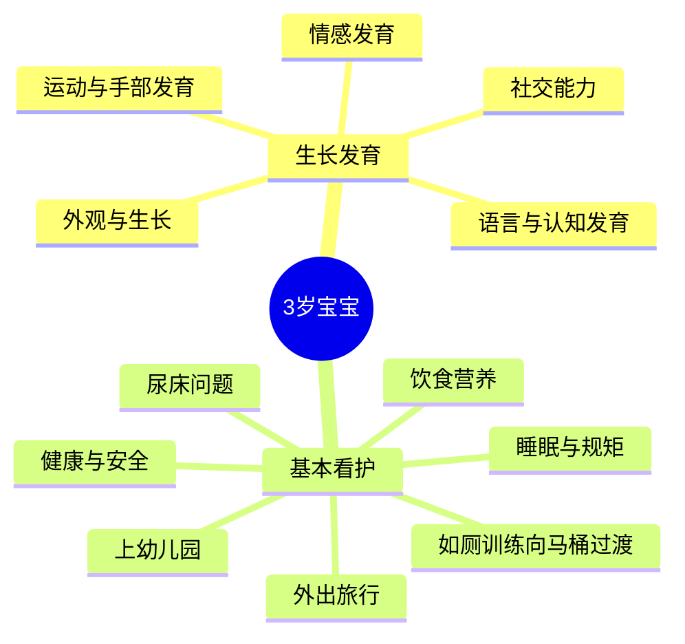

# 第12课：3岁宝宝

> 可怕的两岁结束了，神奇岁月即将开始。三年的孩子世界充满活灵活现的想象，从蹒跚学步的幼儿变成更加独立、更懂互动的学龄前儿童。

## Learning Objectives

- 掌握3岁宝宝运动、手部、语言、认知、社交和情感的发育里程碑
- 学会处理尿床、睡眠问题和制定适合3岁孩子的规矩
- 了解如何为孩子选择幼儿园及顺利过渡
- 掌握带3岁孩子外出旅行的安全要点
- 识别发育迟缓的警示信号

## 生长发育总览

3岁的孩子已经可以自己大小便，掌握了语言的基本规则，学会了分享和合作。你与孩子的关系将发生巨大转变——他把你当成独立个体，明白你也有自己的情感和需要。

### 外观与生长情况

3岁的孩子继续甩掉婴儿期积蓄的脂肪，增长肌肉，看起来更强壮、更成熟。

- **体型变化**：手臂和腿变细，上半身呈上宽下窄的状态
- **生长速度**：3岁后发育逐渐变慢，一年身高约增长8.9厘米，体重约增长2.3千克
- **面容变化**：头骨拉长，下颌线条更明显，上颌变宽为恒牙生长创造空间
- 两岁以后同龄儿童的身高体重会逐渐拉开差距，不要和别人比较

> [!TIP] 监测建议
> 每年测量记录身高体重两次。如果体重增幅超过身高增幅，可能有超重风险；半年身高无变化，可能存在发育问题，应与儿科医生讨论。

### 运动发育

3岁的孩子可以毫不费力地站立、跑跳、大步前行，动作灵活协调。

**运动里程碑：**
- 单脚跳或单脚站立5秒
- 上下楼梯无需扶扶手
- 向前踢球，将球从手里抛出
- 基本能接住弹跳的球
- 灵活地向前或向后移动
- 向前跳，在沙发或椅子上爬上爬下

> [!WARNING] 安全监护
> 孩子的自我控制力和判断力尚未成熟。当他和别的孩子一起玩、靠近危险设备或在路边时，必须由你保护安全。他可能追球跑到马路上或把手伸进三轮车轮辐里。

### 手部发育

肌肉控制能力和注意力发展，孩子开始掌握很多精细动作。

**手部里程碑：**
- 会画小人（头部和其他身体部位）
- 会用儿童专用剪刀
- 会画圆形和方形
- 开始模仿写一些大写字母
- 可以自己穿衣服、脱衣服
- 会自己吃饭，会进卫生间自己小便

### 语言发育

到3岁时，词汇量应达到300个以上，能说出3-4个词语组成的句子。

**语言里程碑：**
- 理解"一样"和"不一样"的概念
- 掌握一些基本语法规则
- 语言表达比较清楚，陌生人也能听懂75%
- 会讲故事

> [!NOTE] 关于口吃
> Œ2-3岁孩子偶尔重复音节、词语或在说话前停顿犹豫，非常常见。大多数孩子不需要任何帮助就会度过这一阶段。只有当现象持续很久并影响正常交流才算真口吃。
>
> **应对口吃的正确做法**：忽略口吃本身，认真听但不打断，不急着帮他说完。放慢你说话的语速，每天安排放松时间专心陪他聊天。

### 认知发育

3岁的孩子每天不停地问问题，对身边发生的每一件事都很好奇。

**认知里程碑：**
- 正确认出一些颜色
- 理解计数概念，可能知道几个数字
- 从单一角度解决问题
- 形成更清晰的时间观念
- 理解并执行包含三部分内容的指令
- 能记住故事的部分内容
- 会玩想象游戏

### 社交能力发育

3岁的孩子不再像之前那么自私，对成年人的依赖减少，开始真正和其他孩子一起做游戏。

**社交里程碑：**
- 喜欢尝试各种新体验
- 可以与其他孩子合作和分享
- 在游戏中扮演妈妈或爸爸
- 想象力越来越丰富
- 会跟别人商量如何解决冲突

> [!TIP] 性别意识发展
> 孩子在角色扮演游戏中开始意识到自己的性别。男孩会扮演父亲，女孩会扮演母亲。这是正常发育的一部分。父母最好允许孩子自然地探索不同性别的角色和行为。

### 情感发育

3岁孩子的日常生活中充满各种生动想象，想象有助于探索和认知不同情感。

**情感里程碑：**
- 将很多不熟悉的形象想象为怪兽
- 将自己视为完全独立的人（有思想、身体和感情）
- 时常无法分清想象和现实

> [!WARNING] 发育迟缓警示
> ̈孩子如有以下迹象应咨询医生：
> - 不会把球扔出去，不会原地跳，不会骑三轮车
> - 不会涂鸦，无法垒起4块积木
> - 每当父母离开都大哭大闹
> - 不理睬其他孩子
> - 不玩想象游戏
> - 不会用3个以上词语组成句子

## 饮食与营养

### 饮食原则
- 不要将吃饭或不吃饭作为孩子反抗的手段
- 让孩子从餐桌上提供的健康食物中自己选择
- 孩子拒绝某种食物时仍要坚持提供，可能需要提供15次他才真正接受
- 避免频繁吃零食，孩子要在餐桌上吃零食
- 限制看电视时间——每周看电视超14小时的孩子可能过度肥胖

## 如厕训练：向马桶过渡

3岁后多数孩子已能自己大小便，现在是向马桶过渡的好时机。

**过渡步骤：**
1. 将坐便器移到卫生间靠近马桶的位置
2. 在马桶上放置儿童马桶圈，前面放凳子方便孩子爬上爬下
3. 孩子完全乐意用马桶后，移走坐便器
4. 男孩会开始模仿站着小便，确保他掀马桶圈

> [!TIP] 幼儿园准备
> 如果孩子要上幼儿园，教会他自己上厕所非常重要。给孩子穿松紧带的裤子，方便穿脱。不要因为玩得兴奋忘记上厕所而惩罚孩子。

## 尿床

即使完成夜间小便训练，所有孩子还是会不时尿床。

**尿床的真相：**
- 不是孩子的错，他并非故意
- 可能反映膀胱较小或膀胱发育不健全
- 尿床常在孩子对抗压力时重现
- 不要惩罚或嘲笑，告诉他长大了就会消失
- 如果5岁后仍尿床，向儿科医生咨询

## 睡眠

3岁孩子每晚需要睡10-13小时，约90%的孩子白天仍小睡1-2小时。

**助眠策略：**
- 制定一致且规律的睡前程序
- 睡前一小时关闭所有电子产品
- 孩子做噩梦时抱紧他，陪他到完全平静
- 夜惊发生在深度睡眠阶段，孩子坐起来叫喊但不会清醒——不要试图叫醒他，只要确保安全

> [!NOTE] 噩梦 vs 夜惊
> 噩梦发生在下半夜REM睡眠阶段，孩子会惊醒、害怕，记得梦境内容。夜惊发生在上半夜深度睡眠阶段，孩子尖叫但未清醒，次日不记得。两者处理方法不同。

## 规矩

3岁的孩子可能故意违反规矩——他清楚自己在做什么。面对给他的压力，他可能故意做出被禁止的行为。

**管教要点：**
- 帮助孩子用语言表达感受而非用暴力
- 使用平静中断法处理不当行为
- 规矩要前后一致
- 不要打孩子，会让情况更糟
- 如果你感到生气，先使用平静中断法让自己冷静

## 上幼儿园

### 幼儿园的好处
- 为小学做准备，增强社交能力
- 让孩子接受更正规的规矩
- 帮助孩子适应离开家的生活

### 如何选择幼儿园
- 办学目标应该是你赞同的（警惕声称教算术加速智力发育的幼儿园）
- 班级规模小（1-3岁8-10人，4岁后可达15-16人）
- 老师接受过早期教育专业培训，员工流动率低
- 管理方式严格但长期执行
- 允许随时探访，有网络摄像头更佳
- 教室和活动场地安全，有懂基本急救的人员
- 卫生条件好

## 外出旅行

### 乘汽车
- 始终使用汽车安全座椅，即使短途
- 孩子拒绝使用就拒绝开车
- 行驶中爬出安全座椅就靠边停车

### 乘飞机
- 选择直飞航班和下午/夜间航班
- 带健康食物，孩子可能不喜欢飞机餐
- 最好让孩子坐在自己的安全座椅上
- 给孩子穿鲜艳衣服，口袋放联系方式卡片
- 随身带近照

## 健康与安全

- 从3岁开始每年一次儿科体检和牙科检查
- 确保疫苗接种适时更新（包括每年流感疫苗）
- 预防衰落：游戏设施下方铺设防护层，楼梯安装防护门，窗户装护栏
- 预防烫伤：火柴打火机收好，安装烟雾和一氧化碳探测器
- 汽车安全：使用前向式安全座椅（5点式安全带），安装在汽车后排
- 预防溺水：不要让孩子单独在水边，进行接触式看护（一臂之内）

> [!DANGER] 溺水预防
> 参加游泳课程并不能预防孩子溺水。任何时候，只要孩子待在水边，成年人就要进行接触式看护。

---

## 下一课

[[lessons/0013-4-5-sui|第13课：4-5岁宝宝]]——面对四岁的"小叛逆期"，学习运动手部发育、语言认知发展、健康生活方式，为上小学做好准备。

## Checklist

- [ ] 了解3岁孩子的发育里程碑
- [ ] 为孩子选择适合的幼儿园
- [ ] 过渡到马桶如厕
- [ ] 制定规律的睡前程序以应对睡眠问题
- [ ] 准备带3岁孩子出行的安全方案
- [ ] 购买并正确安装适用的汽车安全座椅
- [ ] 每年带孩子做一次体检和牙科检查

## 自测题

> [!QUESTION] 关于3岁孩子的语言发育，以下哪项是正确的？
> A. 到3岁时词汇量应达到至少100个词
> B. 孩子偶尔口吃说明有语言障碍，需要立即治疗
> C. 3岁孩子可以说出3-4个词的句子，陌生人能听懂约75%
> D. 男孩的语言发育通常比女孩快

参考答案

**正确答案：C**
3岁孩子词汇量应达到300个以上，能说出3-4个词语组成的句子，语言表达清楚，陌生人可听懂75%左右。2-3岁孩子偶尔口吃非常常见，大多数无需干预就会自然消失。男孩开始说话一般比女孩晚，但差异在入学年龄时消失。

