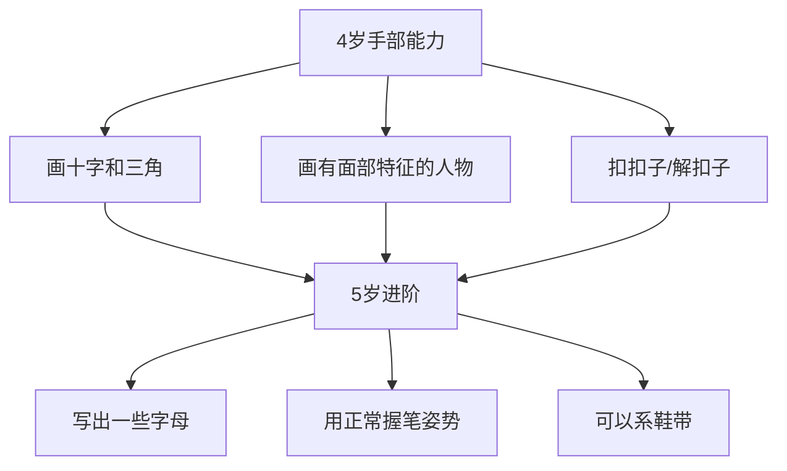
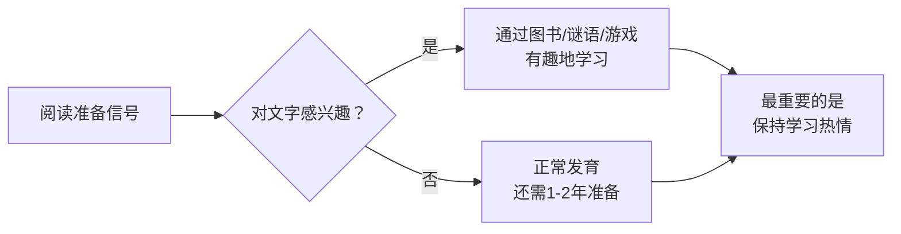
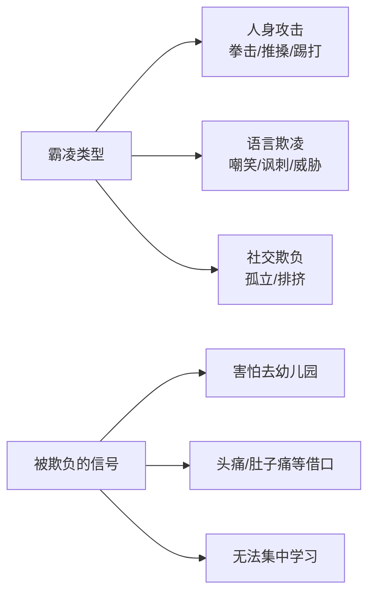

# 第13课：4-5岁宝宝

## 学习目标

- 掌握4-5岁儿童运动发育里程碑（单脚跳、翻跟头、扣扣子、写字）
- 理解语言能力的飞跃（1500-2500词汇量）和认知发育（颜色、数字、时间概念）
- 学会引导孩子的社交能力发展和情感发育（同理心、性别意识）
- 了解健康饮食原则和预防过度肥胖的生活方式
- 学会制定睡前程序和应对夜惊症
- 掌握为上小学做准备的要点（自理能力、霸凌防范）
- 了解本阶段健康检查和安全防护要点

## 一、运动与手部发育

### 整体特征

4-5岁是孩子从"小涌动机"逐渐变得稳重自信的过渡期。孩子情绪变化快，对一些日常规律非常执着，喜欢说一些不适宜的话来观察父母反应。所有这些行为都在为融入学前班的学习和生活打下基础。

### 运动发育里程碑

| 里程碑 | 描述 |
|-------|------|
| 单脚站立 | 可单脚站立10秒以上 |
| 上下楼梯 | 双脚交替上下楼梯，不用扶扶手 |
| 跳跃与翻滚 | 会跳着前进、翻跟头、立定跳远 |
| 荡秋千 | 会自己发力荡秋千 |
| 攀爬 | 可以进行攀爬活动 |
| 协调能力 | 接近成年人水平，可自信大步走或奔跑 |

> [!WARNING] 安全监护不可松懈
> 孩子的运动能力快速发展，但判断力仍然落后。过马路时必须牵着大人的手，在水边需要**接触式看护**（成人在一臂之内），绝不可以让孩子一个人在水域附近玩耍。

### 手部发育里程碑

| 里程碑 | 描述 |
|-------|------|
| 绘画 | 画出三角形和其他几何图形，画出至少有三个身体部位的人 |
| 握笔姿势 | 用拇指和其他手指握笔，而非用手掌握笔 |
| 书写 | 可以写出一些字母 |
| 穿衣 | 自己穿脱衣服，扣上和解开中等大小的纽扣 |
| 用餐 | 会用叉子和勺子正常进餐 |
| 自理 | 一般情况下可以自己大小便 |



> [!TIP] 鼓励创作
> 孩子最喜欢画画、剪纸、捏粘土、搭积木等活动。这些活动不仅锻炼新技能，还带来创作成就感。不要强迫孩子放弃其他爱好只发展某一方向，而应提供大量机会让他探索各方面能力。

---

## 二、语言与认知发育

### 语言发育飞跃

- **词汇量**：4岁时约1500个词，4-5岁增加约1000个词
- **表达能力**：可以用复杂句子绘声绘色地讲故事，描述身边事、梦境和想象事物
- **发音**：大部分音可以准确发出，少数音可能要到5岁半以后掌握

### 学习阅读



> [!IMPORTANT] 阅读的核心原则
> 决定孩子上学后成绩好坏的最重要因素不是提前学了多少，而是**对学习的兴趣**。让孩子按自己的节奏发展，感受到学习的快乐，而非强迫。经常读他喜欢的书，但不要强迫认字。

### 粗话与伤人话语

孩子说粗话是因为发现这类话语力量最大，能引起成年人强烈反应。

| 应对策略 | 具体做法 |
|---------|---------|
| 树立榜样 | 自己先不说粗话，再生气也克制 |
| 冷静对待 | 不要给太多关注，减少孩子用粗话吸引注意的动机 |
| 用幽默化解 | 孩子说"你是老巫婆"时，可以笑着说"老巫婆在用蝙蝠翅膀煮汤哦" |
| 帮孩子表达情绪 | 教他用合适的词语说出内心感受 |

### 认知发育里程碑

- **数数**：可以数出至少10个物体
- **颜色**：正确认出4种以上颜色
- **时间概念**：知道上午、下午和晚上，一年分不同季节，5岁时可能知道一周有几天
- **日常知识**：了解家里每天常用的物品
- **好奇心**：喜欢问"天空为什么是蓝色的"等经典问题

> [!TIP] 回答孩子的问题
> 切勿胡编乱造，要带孩子一起去图书馆或书店找答案，或参考可信的科普网站，一起看相关图片和视频。这个年龄是带他去动物园、博物馆的理想时期。

---

## 三、社交能力与情感发育

### 社交能力发育

- 有朋友甚至最好的朋友
- 想让朋友高兴，想和朋友一样
- 更有可能遵守规矩
- 更加独立，甚至可以自己去邻居家玩
- 朋友开始对孩子的想法和行为产生影响

> [!NOTE] 帮助孩子交朋友
> 如果孩子没有上幼儿园或附近没有同龄孩子，应主动帮他安排游戏机会——公园、游乐场和各种儿童活动都是好去处。让孩子邀请朋友来家里玩，可以帮他建立自豪感。

### 将"人"与"行为"分开

当孩子犯错时：
- ❌ 不要说他是个"坏孩子"
- ✅ 具体解释他做错了什么："你打弟弟是不对的"
- 如果是意外犯错，要安慰他，告诉他你知道他不是故意的

### 情感发育里程碑

```mermaid
flowchart TD
    A[4-5岁情感发育] --> B[有性别意识]
    A --> C[能够分清想象和现实]
    A --> D[对别人感受非常敏感]
    A --> E[表现出同理心和同情]
    B --> F[对性别差异好奇\n问"孩子从哪里来"等问题]
    D --> G[别人受伤时会安慰\n想拥抱对方]
```

### 性别意识

> [!TIP] 面对性好奇
> 用简单准确的术语回答孩子关于生育和身体的问题。孩子摆弄生殖器是正常的好奇心，父母不要责骂或惩罚。可以告诉孩子：这是健康的本能，但**不可以在公共场合**这样做，**任何人都不可以随意触摸**他的私密部位。

### 发育警示信号

> [!WARNING] 需要咨询儿科医生
> - 有极端恐惧、羞怯或好斗的行为
> - 每次跟父母分开都强烈抗拒
> - 注意力极易分散（任何活动不超过5分钟）
> - 没有兴趣跟其他孩子一起玩
> - 很少玩想象或角色扮演游戏
> - 大多数时候看起来不开心或伤心
> - 不会自己吃饭、睡觉或上厕所
> - 不会正确说出自己的姓名
> - 讲话时不会用复数形式或过去时态

---

## 四、饮食营养与健康生活方式

### 健康生活习惯

4-5岁是为整个家庭培养健康生活方式的好时机。孩子在此时养成的习惯将影响一生。

### 预防过度肥胖

| 措施 | 说明 |
|------|------|
| 增加体育锻炼 | 学龄前活动量仅为祖辈的四分之一 |
| 减少屏幕时间 | 限制看电视、上网时间 |
| 提供健康食物 | 多吃新鲜蔬果、低脂乳制品、瘦肉、全谷物 |
| 限制垃圾食品 | 禁止含糖饮料、高脂肪高糖零食 |
| 控制甜点分量 | 偶尔吃，每次分量比成年人少 |

### 每日食谱示例（约16.5千克的4岁孩子）

| 餐次 | 食物 |
|------|------|
| 早餐 | 120ml低脂牛奶 + 1/2杯全谷物米粉 + 1/2杯水果 |
| 点心 | 120ml低脂牛奶 + 1/2杯水果 + 1/2杯酸奶 |
| 午餐 | 120ml低脂牛奶 + 三明治（全麦面包+肉/奶酪/蔬菜） + 1/4杯蔬菜 |
| 点心 | 全麦面包配花生酱，或奶酪条，或切碎水果 |
| 晚餐 | 120ml低脂牛奶 + 60g瘦肉/鸡肉 + 1/2杯全麦面条/米饭 + 1/4杯蔬菜 |

> [!IMPORTANT] 牛奶与钙
> 孩子每天约需480ml低脂或脱脂牛奶满足钙需求。无论何种口味的调味牛奶都不会对身体质量指数产生不良影响。不爱喝奶的孩子应通过其他高钙食物（奶酪、豆类、杏仁、绿叶蔬菜）补充，且需每天补充维生素D。

### 食量控制技巧

- 给孩子小份食物（成年人的一半）
- 不主动给第二份，除非孩子自己要
- 使用儿童专用餐具帮助控制分量
- 每天最多提供两次零食
- 不要将食物作为奖励或安抚工具
- 孩子玩耍、听故事或看电视时不要让他吃东西

> [!WARNING] 何时应看医生
> 孩子厌食超过一周，或出现发热、恶心、腹泻、体重减轻等情况时，应带他去看医生。

---

## 五、睡觉与规矩

### 睡前程序

4-5岁孩子会积极响应固定的睡前活动：洗澡 → 刷牙 → 躺在床上听故事 → 关灯。让孩子尽早上床，不累的时候更容易入睡。这个年龄段孩子逐渐不再需要小睡。

### 夜惊症

```mermaid
flowchart TD
    A[孩子入睡几小时后] --> B[眼睛瞪圆\n像受了惊吓]
    B --> C[可能尖叫/踢打/哭闹]
    C --> D{是否对呼唤有反应？}
    D -->|无反应| E[夜惊症]
    D -->|有反应| F[做噩梦]
    E --> G[抱住孩子避免伤到自己]
    G --> H[轻声说"没事的"\n调暗灯光]
    H --> I[10-30分钟后平静\n再次入睡]
    I --> J[第二天不记得\n发生的事情]
```

> [!NOTE] 夜惊症要点
> - 常见于学龄前及入学初期儿童
> - 父母与孩子互动时间过长反而延长发作
> - 过度疲惫容易诱发，可尝试让孩子提前半小时上床
> - 随着孩子长大，夜惊症最终会自行消失

### 规矩与管教

| 方法 | 说明 |
|------|------|
| 平静中断法 | 仍有效，结束后要告诉孩子原因 |
| 剥夺特权 | 进行实质性惩罚，不做口头威胁 |
| 奖励好行为 | 比惩罚更有效，忽略一些不重要的不良行为 |
| 及时响应 | 不要等太久再惩罚，孩子会忘记做了什么 |
| 榜样作用 | 控制自己的情绪，用语言解决争端 |
| 保持一致 | 与其他看护者分享教育方法，让孩子面对一致的规矩 |

> [!DANGER] 绝不可以体罚
> 打孩子、大吼大叫或责怪孩子都**不应使用**。体罚会让孩子学会用暴力解决问题。

### 关于撒谎

学龄前儿童撒谎的原因：
- 害怕受到惩罚
- 被想象力驱使（编故事）
- 模仿看到的大人行为（善意的谎言）

> [!TIP] 应对撒谎
> 先弄清撒谎动机再惩罚。如果孩子承认错误，保持冷静，给予合理有教育意义的惩罚。编故事是想象力的表现，但若孩子无法区分现实与想象则需引导。可以通过讲"狼来了"的故事说明说实话的好处。

---

## 六、为上小学做准备

### 心理准备

- 与孩子多交流，让他对上小学有心理准备
- 说明上小学后作息时间的变化
- 经常带孩子路过小学，让他看看里面的样子

### 入学前检查

> [!IMPORTANT] 入学前体检
> 上小学前应做一次全身检查，包括视力、听力和其他发育情况，确保接种了全部应接种的疫苗或加强针。还需进行肺结核及其他疾病筛查。

### 自理能力与规则意识

| 方面 | 具体要求 |
|------|---------|
| 自理能力 | 自己穿脱衣服、系鞋带、独立大小便、整理物品 |
| 餐桌礼仪 | 用正确姿势握餐具、嘴里有食物时不说话、使用餐巾纸 |
| 规则意识 | 遵守家规和社交规则，为自己的行为负责 |
| 独立能力 | 能自如处理与父母的分离，独立做好自己的事情 |

### 霸凌防范



> [!TIP] 教孩子应对霸凌
> - 直视欺负者的眼睛，笔直站立，保持镇静
> - 用坚定的语气说："我不喜欢你的行为"
> - 直接走开，向其他成年人求助
> - 让孩子明白：**被欺负不是他的错**
> - 如果孩子是欺负人的人，严肃对待，用平静中断法而非体罚来矫正，必要时求助老师或儿科医生

### 家庭看护补充

祖父母看护时：
- 让孩子乘坐合适的汽车安全座椅
- 所有药物锁好，放在孩子够不到的地方
- 了解最新的育儿医学知识（如仰卧睡觉、安全非处方药）
- 充分利用孩子爱说话的特点，通过电话、视频通话保持联系

---

## 七、健康与安全

### 身体检查

4-6岁需接种加强针：脊髓灰质炎、百白破、麻疹、腮腺炎、风疹、水痘疫苗。

### 视力与听力

| 检查项目 | 说明 |
|---------|------|
| 听力检查 | 用不同频率声音进行全面检查，每一到两年重复一次 |
| 视力检查 | 视力应达0.7或更高，**双眼视力差距**是更重要的指标 |
| 何时看专家 | 怀疑视力问题或筛查异常时，应找儿童验光师或儿童眼科专家 |

### 安全总则

> [!DANGER] 安全第一
> - 骑自行车**必须戴头盔**，绝不可在马路上骑车
> - **溺水**是儿童死亡第二大因素——绝不可让孩子独自在水域附近玩耍
> - 车祸是最大威胁——孩子仍应坐在后排的五点式安全带汽车安全座椅上
> - 教孩子不玩火柴、打火机和烟花爆竹
> - 家中如有武器必须锁好，弹药分开存放

### 长途乘车旅行

| 技巧 | 说明 |
|------|------|
| 聊天看风景 | 聊路边风景，让孩子辨认颜色、字母和数字 |
| 准备玩具 | 触手可及处放图画书、小玩具 |
| 播放音乐 | 播放儿歌或儿童故事 |
| 携带活动箱 | 涂色书、彩色铅笔、画纸、胶水、贴纸 |
| 使用电子设备 | 提前下载适合的故事、节目或电影 |
| 每两小时休息 | 停车让孩子活动、吃零食、上厕所 |
| **绝对禁止** | **永远不将孩子单独留在车里** |

### 祖父母的过渡期建议

> [!TIP] 给祖父母的提醒
> 孩子在4-5岁可能挑战权威、说粗话——这只是过渡阶段，保持镇静。带孩子去有同龄孩子的场所拓展社交网络。如果住得远，可以固定时间打电话、视频通话、寄明信片或交换照片和视频，但**亲自看望永远是优先选项**。

---

> [!TIP] 核心要点
> 4-5岁是孩子为正式学校生活做准备的黄金时期。运动能力接近成人水平，语言和认知飞速发展，社交圈从家庭扩展到朋友。家长既要鼓励独立和探索，也要保持耐心——孩子说粗话、挑战权威都是正常成长过程。建立健康的生活习惯（饮食、运动、睡眠）将影响孩子一生。

## 实践检验

> [!QUESTION] 自测题
> 1. 4-5岁儿童的运动发育里程碑有哪些？请列出至少5项。
> 2. 孩子说粗话时应如何应对？请列出3种方法。
> 3. 什么是夜惊症？与做噩梦有什么不同？如何应对？
> 4. 应该给孩子准备多大的食物分量？列出3个控制食量的技巧。
> 5. 孩子霸凌别人或被霸凌时应分别如何处理？

<details>
<summary>查看答案</summary>

1. 单脚站立10秒以上、双脚交替上下楼梯不用扶扶手、跳着前进和翻跟头、自己荡秋千、攀爬、单脚跳。
2. (1) 自己先做好榜样不说粗话；(2) 冷静对待，不给过多关注；(3) 用幽默化解或用合适的词帮孩子表达情绪。
3. 夜惊症：入睡几小时后突然瞪圆眼睛、尖叫扭动，但对呼唤无反应，第二天不记得。与噩梦不同（噩梦中的孩子有反应、能记得）。应对：抱住避免伤到自己，轻声安抚，调暗灯光，10-30分钟自行平静。让孩子提前半小时上床可减少发作。
4. 食物分量是成年人的一半。技巧：(1) 给孩子小份食物，不主动给第二份；(2) 使用儿童专用餐具；(3) 每天最多两次零食；(4) 不让孩子边玩边吃。
5. 被霸凌：告诉孩子不是他的错，教他直视对方、坚定说"不喜欢你的行为"、直接走开求助。霸凌别人：严肃对待，用平静中断法而非体罚，确保孩子明白欺负人不可接受。

</details>

## 下一步

继续学习 [[0014-zao-qi-jiao-yu-kan-hu|第14课：早期教育与看护]]，了解如何为孩子选择合适的看护者和看护机构。

需要复习本课程相关术语？请查阅 [[../reference/glossary|术语表]]。也可查看 [[../reference/quick-reference|快速参考]] 中的生长发育里程碑速查表。